# SIH 2026 — System Architecture & Detailed Software Design

## Version 1.2 — Final Architecture Freeze

> **Date:** 2026-09-03
> **Authoritative Sources:** [PS.md](file:///e:/Newfolder/Project2O/Projects/SIH%20'26/external/PS.md) > [PRD.md](file:///e:/Newfolder/Project2O/Projects/SIH%20'26/external/PRD.md) > [Engineering Context](file:///e:/Newfolder/Project2O/Projects/SIH%20'26/external/SIH_26_Engineering_Context_Technical_Model.md)
> **Preceding Phase:** Architecture v1.1
> **Status:** Architecture — READY TO FREEZE

### Version 1.2 Change Log

| Change | Reason | Impact |
| --- | --- | --- |
| Clarify Algorithm Evaluation Harness boundary | Separate development infrastructure from production runtime | Positive |
| Dropped frame language audit | Align engineering benchmarking policy with PS ≥20 FPS requirement | None |
| Ground-truth position naming | Remove ambiguity between true target, ideal projected, and rendered positions | Positive |
| ProjectionModel consumption | Ensure PTZController consumes CameraGeometry | Positive |
| Traceability update | Mark Harness as engineering infrastructure | Positive |

---

# PART 1 — ARCHITECTURAL PRINCIPLES

## AP-01: Simulation–Tracker Separation

**Principle:** The tracker domain (detection, identification, centroiding, tracking) must be architecturally independent from the simulation domain (scene, beacon, camera, disturbances).

**Why it matters for SIH:** PS L113 explicitly requires the tracker to process MP4 video **bypassing** the PTZ camera. If the tracker depends on simulator internals, Benchmark-2 (30% of score) is impossible. This is the single most important architectural boundary.

## AP-02: Ground-Truth Isolation

**Principle:** Ground truth (true beacon position, true camera state) must never enter the tracker or PTZ controller. It flows only to the metrics engine.

**Why it matters for SIH:** If ground truth leaks into the tracker, benchmark results are invalid. The evaluators will test with their own MP4 files where they control the ground truth — our tracker must solve the actual vision problem.

## AP-03: Benchmark-First Design

**Principle:** Benchmark-1 and Benchmark-2 are first-class operating modes, not afterthoughts.

**Why it matters for SIH:** 60% of the evaluation score comes from quantitative benchmarks. The architecture must make benchmark execution, logging, and export as straightforward as normal simulation.

## AP-04: Modular, Replaceable Components

**Principle:** Every major subsystem communicates through defined interfaces. Internal implementations can be swapped without affecting other modules.

**Why it matters for SIH:** PS L91 explicitly requires modular code. The evaluation scores "selection of algorithms" and "innovation" — the team must be able to test, compare, and replace detection/tracking algorithms without rewriting the system. Additionally, the modular structure directly supports the technical report and evaluation presentation.

## AP-05: Algorithm Interchangeability

**Principle:** Detection, centroiding, tracking, and PTZ control algorithms are behind abstract interfaces. Multiple implementations can coexist and be compared.

**Why it matters for SIH:** With 60% benchmark score, the team needs evidence-based algorithm selection. Running Algorithm A and Algorithm B against the same scenario and comparing RMSE, FPS, acquisition time, etc. is critical. Premature algorithm lock-in is a project risk.

## AP-06: Real-Time Performance Guarantee

**Principle:** The architecture must sustain ≥20 FPS end-to-end processing, ≥30 Hz camera frame generation, and ≥20 Hz PTZ updates under all mandatory disturbance combinations.

**Why it matters for SIH:** Processing speed is a directly measured benchmark metric (PS Row 20). Heavy algorithms that cannot meet 20 FPS will fail the benchmark regardless of accuracy.

## AP-07: Deterministic Reproducibility

**Principle:** Given the same configuration and random seed, the simulation must produce identical results. *(RECOMMENDATION — not PS-required.)*

**Why it matters for SIH:** Enables fair algorithm comparison, debugging, and consistent benchmark rehearsal.

## AP-08: Fault Isolation

**Principle:** Failures in one subsystem (e.g., MP4 decode error, GUI freeze, logging failure) must not crash the entire application.

**Why it matters for SIH:** The 10–15 minute live demo (20% FV score) requires stability. A crash during demonstration is catastrophic.

## AP-09: Resolution-Agnostic Tracker

**Principle:** The tracker must derive all spatial parameters (image center, ROI, scaling) from the actual input frame dimensions, never from hard-coded constants.

**Why it matters for SIH:** Benchmark-2 MP4 files may have arbitrary resolution. PS says "covering a complete screen" — the resolution is unknown. Hard-coding `center=(320,240)` would break on non-640×480 input.

## AP-10: AI/CV Extensibility

**Principle:** The architecture must genuinely support AI/ML integration without forcing a heavyweight model. Classical CV, ML classifiers, and hybrid approaches must all be architecturally viable.

**Why it matters for SIH:** The PS title says "AI-Based"; the evaluation scores "AI and computer vision." But 5–20 px targets on a 640×480 frame are poorly suited to large pretrained detectors. The architecture must accommodate appropriate AI where it genuinely adds value.

---

# PART 2 — TOP-LEVEL SYSTEM ARCHITECTURE

## 2.1 Subsystem Inventory

After evaluating the 22 candidate subsystems from the prompt, I arrive at the following architecture with **19 production runtime modules organized into 6 logical domains, plus one development-time Algorithm Evaluation Harness. FrameProvider forms the tracker-input firewall.** (some candidates merged where responsibilities overlap tightly, some split where distinct):

### Merged Decisions

| Candidates | Merged Into | Reason |
|---|---|---|
| Virtual Environment + Scene Generator | **SceneManager** | Single responsibility: the scene canvas and background. Splitting is unnecessary complexity. |
| Beacon/Target Generator + Motion Engine | **TargetManager** | Target creation and target motion are tightly coupled — the target's trajectory is a property of the target itself. |
| Detection Engine + Beacon Identification | **DetectionEngine** | Identification is the second stage of detection. They share input (frame) and output (confirmed candidate). Keeping them in one module with internal stages preserves replaceability while avoiding unnecessary IPC. |
| Frame Acquisition + Video Input Layer | **FrameProvider** | Both simulation-generated frames and MP4-decoded frames produce the same output: a frame + timestamp. This is the central abstraction enabling Benchmark-2. |
| Benchmark Engine + Scenario Manager | **BenchmarkManager** | Scenario execution and benchmark orchestration are the same workflow. |
| Performance Logger + Export Manager | **LoggingEngine** | All output generation (performance report, centroid log, centroid export, telemetry) is logging. |

### Split Decisions

| Original | Split Into | Reason |
|---|---|---|
| Configuration Manager | **ConfigManager** (runtime config) + **ScenarioManager** (scenario save/load/validate) | Configuration is always needed; scenario management is an optional feature. Separating them prevents optional features from complicating the core config path. |

### Rationale for NOT Merging

| Items | Why Separate |
|---|---|
| CentroidEstimator separate from DetectionEngine | Sub-pixel centroiding is a distinct algorithm with distinct optimisation targets (accuracy, not speed). Keeping it separate allows independent benchmarking — a detector might find the blob quickly, but the centroid estimator refines the position. This directly impacts benchmark scores. |
| TrackingStateManager separate from TrackingEngine | Temporal tracking (association, prediction, ROI) is algorithmically different from state management (acquisition/loss/reacquisition timing). The state machine must be stable regardless of which tracker is plugged in. |
| PTZController separate from CameraModel | The PTZ controller converts tracker output into angular commands. The camera model converts angular state into viewport extraction. These are different responsibilities operating at different rates. |

## 2.2 Final Module List

| # | Module | Mode |
|---|---|---|
| 1 | **AppController** | Shared |
| 2 | **ConfigManager** | Shared |
| 3 | **ScenarioManager** | Shared |
| 4 | **SceneManager** | Sim only |
| 5 | **TargetManager** | Sim only |
| 6 | **CameraModel** | Sim only |
| 7 | **DisturbanceEngine** | Sim only |
| 8 | **FrameProvider** | Shared (dual implementation) |
| 9 | **DetectionEngine** | Tracker domain |
| 10 | **CentroidEstimator** | Tracker domain |
| 11 | **TrackingEngine** | Tracker domain |
| 12 | **TrackingStateManager** | Tracker domain |
| 13 | **PTZController** | Sim only (inactive in MP4 mode) |
| 14 | **GroundTruthProvider** | Sim only → Metrics only |
| 15 | **MetricsEngine** | Shared |
| 16 | **LoggingEngine** | Shared |
| 17 | **BenchmarkManager** | Shared |
| 18 | **VisualizationEngine** | Shared |
| 19 | **GUIController** | Shared |

## 2.3 Module Summaries

### 1. AppController
- **Responsibility:** Application lifecycle, mode switching (Simulation / MP4 Benchmark), main loop orchestration, error handling, shutdown.
- **Inputs:** User commands (start, stop, pause, load MP4, select mode).
- **Outputs:** Orchestration signals to all subsystems.
- **Dependencies:** All modules.
- **State:** Current application mode, run state (idle/running/paused/stopped).
- **Execution Frequency:** Event-driven.
- **Mode:** Shared.

### 2. ConfigManager
- **Responsibility:** Centralised storage and validation of all runtime configuration parameters (scene, camera, target, disturbance, PTZ, etc.). Single source of truth for current config.
- **Inputs:** User input via GUI; scenario file; defaults.
- **Outputs:** Validated configuration struct accessible by all modules.
- **Dependencies:** None (leaf module).
- **State:** Current parameter set, random seed.
- **Execution Frequency:** On config change (pre-run).
- **Mode:** Shared.

### 3. ScenarioManager
- **Responsibility:** Save/load scenario configurations to/from files. Validate scenario parameters. *(RECOMMENDATION — not PS-required but supports BM1 efficiency.)*
- **Inputs:** ConfigManager state; file path.
- **Outputs:** Loaded configuration to ConfigManager; saved file.
- **Dependencies:** ConfigManager.
- **State:** File I/O state.
- **Execution Frequency:** On demand.
- **Mode:** Shared.

### 4. SceneManager
- **Responsibility:** Create and manage the 2D scene canvas (≥2000×2000). Render background. Composite beacon(s) onto scene. The scene is the world-space data structure.
- **Inputs:** Config (screen size, background intensity). Target positions from TargetManager.
- **Outputs:** Scene canvas (pixel array) with beacon(s) rendered.
- **Dependencies:** ConfigManager, TargetManager.
- **State:** Scene canvas pixels, dimensions.
- **Execution Frequency:** Every simulation frame (≥30 Hz).
- **Mode:** Simulation only.

### 5. TargetManager
- **Responsibility:** Generate beacon spot(s) with configurable size/shape/intensity. Compute per-frame beacon position based on selected motion pattern. Own the true beacon trajectory. Provide ground truth position to GroundTruthProvider.
- **Inputs:** Config (count, size, shape, initial position, motion pattern, speed). Simulation clock.
- **Outputs:** Per-frame beacon world position P_t(t); beacon pixel patch for rendering.
- **Dependencies:** ConfigManager.
- **State:** Current beacon position(s), motion state, trajectory history.
- **Execution Frequency:** Every simulation frame (≥30 Hz).
- **Mode:** Simulation only.

### 6. CameraModel
- **Responsibility:** Model the virtual PTZ camera. Maintain camera pointing state (pan/tilt → world position). Extract viewport from scene canvas. Apply camera type (mono/colour). Manages the `ProjectionModel` / `CameraGeometry` abstraction.
- **ProjectionModel / CameraGeometry Abstraction:** A lightweight internal service or subcomponent within CameraModel that encapsulates all projection mathematics (image pixels ↔ angular coordinates, camera pointing ↔ image coordinates, FOV/resolution relationships). This prevents duplicating projection math across modules. PTZController should consume this abstraction rather than independently reimplementing projection equations.
- **Inputs:** Scene canvas from SceneManager. PTZ commands from PTZController. Config (resolution, FOV, initial position). Platform motion / jitter offsets from DisturbanceEngine.
- **Outputs:** Clean camera frame (before noise). Camera state for GroundTruthProvider.
- **Dependencies:** SceneManager, PTZController, DisturbanceEngine, ConfigManager.
- **State:** Camera world position, pan/tilt angles, effective viewport bounds.
- **Execution Frequency:** Every simulation frame (≥30 Hz).
- **Mode:** Simulation only.

### 7. DisturbanceEngine
- **Responsibility:** Apply all configurable disturbances. Manages an ordered pipeline of disturbance stages. Each stage is independently toggleable.
- **Inputs:** Clean camera frame. Config (noise params, jitter params, atmospheric params, platform params). Simulation clock.
- **Outputs:** Disturbed camera frame. Geometric offsets (jitter, platform) to CameraModel.
- **Dependencies:** ConfigManager.
- **State:** Per-disturbance enable/disable state, per-disturbance parameters, random generator state.
- **Execution Frequency:** Every simulation frame (≥30 Hz).
- **Mode:** Simulation only.

### 8. FrameProvider
- **Responsibility:** Abstract frame source. In simulation mode, wraps the CameraModel + DisturbanceEngine output. In MP4 mode, wraps the video decoder. Provides a uniform `(frame, timestamp, frame_number, metadata)` interface to the tracker.
- **Inputs:** (Sim) Disturbed frame from DisturbanceEngine. (MP4) File path.
- **Outputs:** `FramePacket { image, timestamp, frame_number, resolution }`.
- **Dependencies:** (Sim) CameraModel, DisturbanceEngine. (MP4) Video codec library.
- **State:** Frame counter, timestamp.
- **Execution Frequency:** ≥30 Hz (sim) or video FPS (MP4, expected 30).
- **Mode:** Shared (dual implementation behind single interface).

> [!IMPORTANT]
> **FrameProvider is the simulator-to-tracker input firewall. Tracker and control algorithms receive only frame-derived data and metadata; they must never receive simulator state, target truth, camera truth, scene state, or disturbance state.**
> 
> Clearly distinguish:
> **Simulator → FrameProvider → Tracker Input**
> from:
> **Simulator → GroundTruthProvider → Metrics**
> 
> Note: Not every module downstream of FrameProvider is necessarily part of the Tracker Domain (e.g., Metrics and Visualization may also consume frame data), but the tracker MUST ONLY receive inputs through this firewall. This boundary enables Benchmark-2.

### 9. DetectionEngine
- **Responsibility:** Detect beacon candidate(s) in the camera frame. Includes two internal stages: (a) candidate generation — find bright regions; (b) beacon identification — confirm a candidate is the actual beacon, not noise.
- **Inputs:** `FramePacket` from FrameProvider.
- **Outputs:** List of `DetectionResult { position, bounding_box, confidence, is_beacon }`.
- **Dependencies:** FrameProvider (input only — no simulator access).
- **State:** Internal algorithm state (e.g., background model, temporal history for identification).
- **Execution Frequency:** Every processed frame (≥20 FPS).
- **Mode:** Tracker domain.

### 10. CentroidEstimator
- **Responsibility:** Refine the detected beacon position to a precise (sub-pixel) centroid estimate.
- **Inputs:** Frame image + detection result (bounding box / region).
- **Outputs:** `CentroidResult { x, y, method, quality }`.
- **Dependencies:** DetectionEngine.
- **State:** None (stateless per-frame, or minimal if using temporal smoothing).
- **Execution Frequency:** Every processed frame (≥20 FPS).
- **Mode:** Tracker domain.

### 11. TrackingEngine
- **Responsibility:** Temporal tracking — associate detections across frames, maintain track continuity, predict next position, manage ROI for efficient detection.
- **Inputs:** `CentroidResult` sequence, frame metadata.
- **Outputs:** `TrackResult { estimated_position, velocity_estimate, confidence, track_age }`.
- **Dependencies:** CentroidEstimator.
- **State:** Track history, velocity estimate, prediction state, ROI.
- **Execution Frequency:** Every processed frame (≥20 FPS).
- **Mode:** Tracker domain.

### 12. TrackingStateManager
- **Responsibility:** Manage the logical tracking state machine (SEARCHING → ACQUIRING → TRACKING → LOST → REACQUIRING). Record state transition timestamps for metrics.
- **Inputs:** `TrackResult` from TrackingEngine.
- **Outputs:** `TrackingState { state, confidence, time_in_state, acquisition_timestamp, loss_timestamp, reacquisition_timestamp }`.
- **Dependencies:** TrackingEngine.
- **State:** Current state, transition history, timing records.
- **Execution Frequency:** Every processed frame (≥20 FPS).
- **Mode:** Tracker domain.

### 13. PTZController
- **Responsibility:** Convert tracker output into camera pointing commands, respecting speed limits and update rate. Consumes `ProjectionModel` / `CameraGeometry` abstraction to perform geometric transformations.
- **Inputs:** `TrackResult`, `TrackingState`, `ProjectionModel`.
- **Outputs:** `PTZCommand { delta_pan, delta_tilt }` (angular).
- **Dependencies:** TrackingEngine, TrackingStateManager, CameraModel (for ProjectionModel), ConfigManager (speed limits).
- **State:** Last command, accumulated error (if PID), rate limiter state.
- **Execution Frequency:** ≥20 Hz.
- **Mode:** Simulation only (inactive in MP4 mode — PRD BM2-007).

### 14. GroundTruthProvider
- **Responsibility:** Collect true beacon position and true camera state from the simulator per frame. Provide them exclusively to MetricsEngine. Never expose to tracker.
- **Inputs:** Beacon position from TargetManager. Camera state from CameraModel.
- **Outputs:** `GroundTruth { target_world_position, ideal_projected_image_position, rendered_image_centroid, camera_position, camera_fov }`.
- **Synchronization Rule:** Each GroundTruth record corresponds to the exact simulation instant, frame number, camera state, target state, and geometric disturbance state used to generate the associated frame. This temporal relationship is mandatory for valid centroiding-error calculations.
- **Dependencies:** TargetManager, CameraModel.
- **State:** Per-frame ground truth buffer.
- **Execution Frequency:** Every simulation frame.
- **Mode:** Simulation only. Does NOT exist in MP4 mode.

### 15. MetricsEngine
- **Responsibility:** Compute all performance metrics from tracker output and (when available) ground truth. Definitions are provisional and replaceable.
- **Inputs:** `TrackResult`, `TrackingState`, `GroundTruth` (sim only), frame timestamps.
- **Outputs:** `MetricsSnapshot { centroiding_error, tracking_error, rmse, acquisition_time, reacquisition_time, target_loss_rate, lock_retention, fps, processing_time, ... }`.
- **Dependencies:** TrackingEngine, TrackingStateManager, GroundTruthProvider (sim only).
- **State:** Accumulated metrics data, running statistics.
- **Execution Frequency:** Every processed frame (real-time) + end-of-run aggregation.
- **Mode:** Shared.

### 16. LoggingEngine
- **Responsibility:** Auto-generate all output files: performance report, centroiding error log, per-frame centroid export, per-frame telemetry log, benchmark summary.
- **Inputs:** `MetricsSnapshot` stream, `TrackResult` stream, config snapshot.
- **Outputs:** Files (performance report, centroid log, centroid export CSV, telemetry log).
- **Dependencies:** MetricsEngine, ConfigManager.
- **State:** In-memory telemetry buffer, file handles.
- **Execution Frequency:** Per-frame append (buffered); end-of-run flush and report generation.
- **Mode:** Shared.

### 17. BenchmarkManager
- **Responsibility:** Orchestrate Benchmark-1 (scenario → simulation → metrics → logs) and Benchmark-2 (MP4 → tracker → metrics → export) workflows. Coordinate mode switching.
- **Inputs:** User command (run benchmark), scenario config, MP4 path.
- **Outputs:** Benchmark results, trigger logging/export.
- **Dependencies:** AppController, ConfigManager, FrameProvider, MetricsEngine, LoggingEngine.
- **State:** Benchmark run state, benchmark results.
- **Execution Frequency:** On demand.
- **Mode:** Shared.

### 18. VisualizationEngine
- **Responsibility:** Render the camera viewport with tracking overlays (detection marker, tracking state, centroid). Display real-time metrics. Optionally display bird's-eye scene view and error plots.
- **Inputs:** Current frame, `TrackResult`, `TrackingState`, `MetricsSnapshot`.
- **Outputs:** Rendered display frames for the GUI.
- **Dependencies:** FrameProvider, TrackingEngine, TrackingStateManager, MetricsEngine.
- **State:** Display buffers.
- **Execution Frequency:** GUI refresh rate (≥20 Hz, decoupled from tracker).
- **Mode:** Shared.

### 19. GUIController
- **Responsibility:** Application GUI shell. Houses configuration panels, mode selection, simulation controls, MP4 loading, live view, status dashboard, results view.
- **Inputs:** User actions.
- **Outputs:** Commands to AppController, config updates to ConfigManager.
- **Dependencies:** AppController, ConfigManager, VisualizationEngine.
- **State:** UI state.
- **Execution Frequency:** Event-driven + display refresh.
- **Mode:** Shared.

---

# PART 3 — CRITICAL DATA-FLOW ARCHITECTURE

## A. Simulation Mode Data Flow

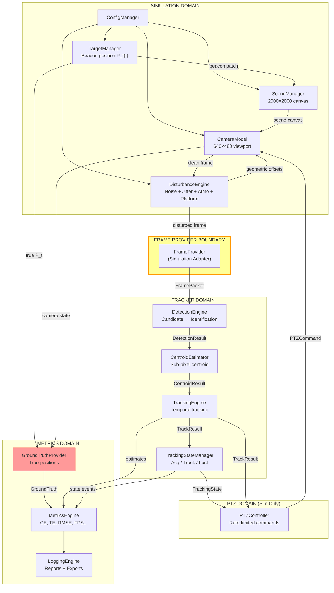

**Key data-flow invariants:**
1. The **FrameProvider boundary** is the hard wall. Nothing to the right of it receives simulator state.
2. **GroundTruth flows only downward** — from TargetManager/CameraModel → GroundTruthProvider → MetricsEngine. Never to DetectionEngine, TrackingEngine, or PTZController.
3. The **PTZ feedback loop** (PTZCommand → CameraModel → new frame → tracker → new command) is the closed-loop control that makes the virtual camera track the beacon.

## B. Benchmark-2 MP4 Mode Data Flow

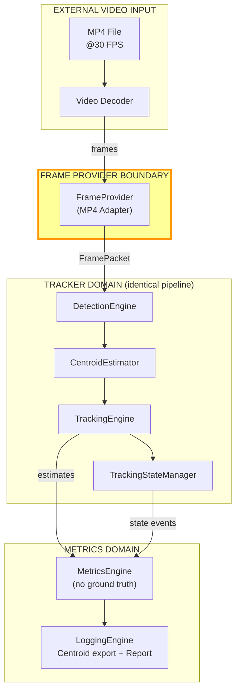

**What is explicitly absent in MP4 mode:**
- ❌ SceneManager, TargetManager — no virtual scene
- ❌ CameraModel — no virtual camera
- ❌ DisturbanceEngine — disturbances are baked into the MP4
- ❌ PTZController — PS L113: "bypass its PTZ camera"
- ❌ GroundTruthProvider — no internal ground truth available

**What is shared (identical code path):**
- ✅ FrameProvider (different adapter, same output interface)
- ✅ DetectionEngine, CentroidEstimator, TrackingEngine, TrackingStateManager
- ✅ MetricsEngine (operates in no-ground-truth mode — computes FPS, acquisition, lock retention, but not centroiding error unless external ground truth is loaded)
- ✅ LoggingEngine (exports per-frame centroids for evaluator comparison)

---

# PART 4 — SOURCE-OF-TRUTH DATA OWNERSHIP

| Data Item | Owner Module | Consumers | Notes |
|---|---|---|---|
| **Beacon true position** (world coords) | TargetManager | GroundTruthProvider → MetricsEngine | Never exposed to tracker |
| **Camera true position** (world coords) | CameraModel | GroundTruthProvider → MetricsEngine | Never exposed to tracker |
| **Camera FOV** | ConfigManager | CameraModel, MetricsEngine, PTZController | Read-only after config |
| **Camera resolution** | ConfigManager | CameraModel, FrameProvider, MetricsEngine | Read-only after config |
| **Target trajectory parameters** | ConfigManager → TargetManager | TargetManager internal | TargetManager interprets the motion pattern |
| **Disturbance parameters** | ConfigManager | DisturbanceEngine | Per-disturbance enable/params |
| **Current frame** (pixel data) | FrameProvider | DetectionEngine (downstream only) | Transient — not stored persistently except by logger |
| **Estimated centroid** | CentroidEstimator | TrackingEngine, MetricsEngine, LoggingEngine | Tracker output — this is what we export |
| **Tracking state** | TrackingStateManager | PTZController, MetricsEngine, LoggingEngine | Derived from TrackingEngine output |
| **Detection confidence** | DetectionEngine | TrackingEngine, TrackingStateManager | Used for state decisions |
| **PTZ command** | PTZController | CameraModel | Only in simulation mode |
| **Acquisition timestamp** | TrackingStateManager | MetricsEngine | Recorded on SEARCHING→TRACKING transition |
| **Loss timestamp** | TrackingStateManager | MetricsEngine | Recorded on TRACKING→LOST transition |
| **Re-acquisition timestamp** | TrackingStateManager | MetricsEngine | Recorded on LOST→TRACKING transition |
| **Benchmark metrics** | MetricsEngine | LoggingEngine, VisualizationEngine | Aggregated from per-frame data |
| **Random seed** | ConfigManager | TargetManager, DisturbanceEngine | For reproducibility (RECOMMENDATION) |

---

# PART 5 — EXECUTION MODEL & TIMING

## 5.1 PS Timing Constraints

| Constraint | PS Value | Nature |
|---|---|---|
| Camera frame generation | ≥ 30 Hz | Simulator must produce frames at this rate |
| Processing speed | ≥ 20 FPS | Tracker pipeline throughput |
| PTZ update rate | ≥ 20 Hz | Controller update frequency |

## 5.2 Recommended Model: Synchronized Single-Threaded Core + Async GUI

### Justification

| Option | Pros | Cons | Benchmark Impact |
|---|---|---|---|
| **Single-threaded simulation + tracker loop** | Simple, deterministic, no sync issues, easy to profile, reproducible | GUI updates compete for CPU time | ✅ Deterministic; timing easy to validate |
| Multi-threaded pipeline (producer-consumer) | Higher throughput potential, GUI doesn't block sim | Complex synchronization, non-deterministic timing, harder to reproduce, race conditions | ⚠️ Harder to benchmark fairly |
| Fully async | Maximum parallelism | Maximum complexity; debugging nightmare for a hackathon | ❌ Over-engineered for this problem |

**Recommended choice: Initial implementation strategy is a synchronous deterministic core with async GUI rendering. Module contracts and data interfaces should remain compatible with future concurrency or pipeline parallelism if profiling demonstrates that it is necessary.**

**Rationale:**
1. At default parameters (640×480, 10×10 beacon), the entire pipeline (scene render → camera extract → disturb → detect → centroid → track → PTZ) should complete in <10ms on modern hardware, leaving ample headroom for 30+ Hz.
2. The simulation is not I/O-bound or network-bound — it's pure computation on small images.
3. Determinism matters for algorithm comparison and debugging.
4. GUI rendering (which may involve widget updates, chart drawing) is the only potentially slow part and should run on a separate thread or be frame-rate-limited.

### Execution Loop (Simulation Mode)

```
while running:
    t_start = high_resolution_clock()

    # === SIMULATION DOMAIN (runs at sim_dt) ===
    sim_time += sim_dt
    target_position = TargetManager.update(sim_time)
    scene = SceneManager.render(target_position)
    
    # Geometric disturbances affect camera pose
    jitter_offset = DisturbanceEngine.compute_jitter()
    platform_offset = DisturbanceEngine.compute_platform_motion(sim_time)
    
    # Camera extraction (with geometric offsets applied)
    clean_frame = CameraModel.extract_viewport(scene, jitter_offset, platform_offset)
    
    # Pixel disturbances
    disturbed_frame = DisturbanceEngine.apply_pixel_disturbances(clean_frame)
    
    frame_packet = FrameProvider.wrap(disturbed_frame, sim_time, frame_number)
    
    # === GROUND TRUTH (separate channel) ===
    ground_truth = GroundTruthProvider.capture(target_position, camera_state)
    
    # === TRACKER DOMAIN ===
    detections = DetectionEngine.detect(frame_packet)
    centroid = CentroidEstimator.estimate(frame_packet, detections)
    track_result = TrackingEngine.update(centroid, frame_packet)
    tracking_state = TrackingStateManager.update(track_result)
    
    # === PTZ (sim only) ===
    ptz_command = PTZController.compute(track_result, tracking_state)
    CameraModel.apply_ptz(ptz_command, max_pan_speed, max_tilt_speed, dt)
    
    # === METRICS & LOGGING ===
    metrics = MetricsEngine.update(track_result, tracking_state, ground_truth)
    LoggingEngine.record(frame_number, track_result, metrics)
    
    # === VISUALIZATION (throttled) ===
    if should_render_gui():
        VisualizationEngine.update(frame_packet, track_result, tracking_state, metrics)
    
    frame_number += 1
    
    # Pace to target frame rate
    t_elapsed = high_resolution_clock() - t_start
    sleep_remaining(target_dt - t_elapsed)
```

### Execution Loop (MP4 Mode)

```
while video_has_frames:
    t_start = high_resolution_clock()
    
    frame_data = VideoDecoder.next_frame()
    if frame_data is None:
        break
    
    frame_packet = FrameProvider.wrap(frame_data, timestamp, frame_number)
    
    # === TRACKER DOMAIN (identical to sim mode) ===
    detections = DetectionEngine.detect(frame_packet)
    centroid = CentroidEstimator.estimate(frame_packet, detections)
    track_result = TrackingEngine.update(centroid, frame_packet)
    tracking_state = TrackingStateManager.update(track_result)
    
    # === NO PTZ ===
    
    # === METRICS (no ground truth) ===
    metrics = MetricsEngine.update(track_result, tracking_state, ground_truth=None)
    LoggingEngine.record(frame_number, track_result, metrics)
    
    if should_render_gui():
        VisualizationEngine.update(frame_packet, track_result, tracking_state, metrics)
    
    frame_number += 1
    t_elapsed = high_resolution_clock() - t_start
    # Process at native speed or real-time depending on mode
```

## 5.3 Timing Synchronisation

| Rate | Source | Target | Strategy |
|---|---|---|---|
| Camera ≥30 Hz | Simulation loop `sim_dt = 1/30` | FrameProvider output rate | Loop pacing to `sim_dt` |
| Tracker ≥20 FPS | Processing must complete within `1/20 = 50ms` | Measured wall-clock time | If tracker takes >50ms, log a dropped-frame warning; do not skip frames |
| PTZ ≥20 Hz | PTZ update happens every loop iteration | At 30 Hz loop rate, PTZ naturally exceeds 20 Hz | Inherently satisfied if loop runs at ≥30 Hz |
| GUI refresh | Decoupled, ≥15–20 Hz sufficient for visual smoothness | VisualizationEngine | Throttle GUI updates to every Nth frame or time-based |

## 5.4 Frame Processing and Dropped Frames Policy

The authoritative PS requirement is: **Processing speed ≥20 FPS**. The PS does not explicitly mandate zero dropped frames if throughput falls below real-time, but engineering policy dictates how to handle slower processing during benchmarking.

If tracker processing exceeds `sim_dt`:
1. **Engineering Policy: Sequential Processing** — For controlled simulation benchmarking, frames should be processed sequentially without intentional frame skipping by default. This ensures accurate metrics (e.g., centroiding error across all conditions).
2. **Timing Slower than Real-Time** — If processing is slower than the source rate, the system may fall behind real time while preserving sequential frames for controlled benchmark analysis.
3. **Log a timing warning** in telemetry.
4. **Report actual throughput (measured FPS)** — If the measured throughput is < 20 FPS, the system fails the PS requirement.
5. **Frame Skipping** — Any actual frame skipping policy (e.g., in a live evaluator demo to maintain real-time liveness), if ever introduced, must be explicit, logged, and isolated from standard benchmark data generation.

---

# PART 6 — CAMERA & COORDINATE SYSTEM ARCHITECTURE

## 6.1 Four Coordinate Systems

### CS-1: World / Scene Coordinates (WCS)

- **Origin:** Top-left corner of the scene canvas `(0, 0)`.
- **Range:** `(0, 0)` to `(W_scene - 1, H_scene - 1)` where W_scene, H_scene ≥ 2000.
- **Units:** Pixels.
- **Used by:** TargetManager (beacon position), SceneManager (rendering), CameraModel (viewport extraction), GroundTruthProvider.

### CS-2: Camera Pointing Coordinates (CPC)

- **Origin:** Camera optical axis center.
- **Range:** Pan ∈ [0, W_scene], Tilt ∈ [0, H_scene] — the camera points at a location in WCS.
- **Units:** Pixels in world space (with angular interpretation via FOV mapping).
- **Used by:** CameraModel (current pointing), PTZController (commands).

### CS-3: Image / Pixel Coordinates (IPC)

- **Origin:** Top-left corner of the camera viewport `(0, 0)`.
- **Range:** `(0, 0)` to `(W_cam - 1, H_cam - 1)` where default W_cam=640, H_cam=480.
- **Units:** Pixels.
- **Used by:** DetectionEngine, CentroidEstimator, TrackingEngine (all tracker-domain operations are in IPC).

### CS-4: Angular Coordinates (ANG)

- **Range:** Pan ∈ [-FOV_H/2, +FOV_H/2], Tilt ∈ [-FOV_V/2, +FOV_V/2] relative to camera center.
- **Units:** Degrees.
- **Used by:** PTZController (speed limits are in °/s).

## 6.2 Coordinate Transforms

### WCS → IPC (World to Image)

Given camera center in WCS `(cx, cy)` and FOV mapping:

```
# Scale factor: how many world-pixels map to one camera-pixel
scale_x = FOV_world_width / W_cam
scale_y = FOV_world_height / H_cam

# Where FOV_world_width = the span of world pixels visible through the FOV
# This depends on the projection model (architectural decision)

# Simple linear mapping (ENGINEERING DECISION — not PS-prescribed):
FOV_world_width = W_scene * (FOV_H / 360)  # if interpreting FOV as angular proportion
# OR more practically:
FOV_world_width = (W_cam * scale)  # where scale is derived from FOV

# Image position of a world point (wx, wy):
ix = (wx - viewport_left) / scale_x
iy = (wy - viewport_top) / scale_y
```

> [!NOTE]
> **PRESERVED AMBIGUITY:** The PS provides FOV (4°×3°) and resolution (640×480) and scene size (2000×2000), but does not prescribe a projection equation. The relationship between these depends on whether the scene canvas is interpreted as a physical surface at some distance, or as a direct pixel mapping. The architecture isolates this behind the CameraModel so the projection can be changed without affecting the tracker. Engineering Context §6 provides one interpretation (0.00625°/px) which is mathematically consistent but is an engineering choice, not a PS requirement.

### IPC → ANG (Image to Angular)

For PTZ commands:

```
# Pixel offset from image center:
dx_px = x_est - W_cam/2
dy_px = y_est - H_cam/2

# Angular offset (using linear FOV mapping):
d_pan  = dx_px * (FOV_H / W_cam)   # degrees
d_tilt = dy_px * (FOV_V / H_cam)   # degrees
```

### ANG → WCS (Angular to World, for PTZ update)

```
# Convert angular PTZ command to world-pixel displacement:
d_world_x = d_pan * (W_cam / FOV_H) * scale_x   # world pixels
d_world_y = d_tilt * (H_cam / FOV_V) * scale_y   # world pixels
```

## 6.3 Disturbance Coordinate Separation

| Disturbance | Affects | Coordinate Space |
|---|---|---|
| Platform motion | Camera pose / world position | WCS (applied to camera center before viewport extraction) |
| Camera jitter | Camera pose / world position | WCS (random offset to camera center before viewport extraction) |
| Atmospheric degradation | Pixel intensities | IPC (applied to extracted frame) |
| Gaussian noise | Pixel intensities | IPC |
| Poisson noise | Pixel intensities | IPC |
| Salt & Pepper noise | Pixel intensities | IPC |

---

# PART 7 — DISTURBANCE PIPELINE ARCHITECTURE

## 7.1 Ordered Pipeline

The disturbance engine applies effects in a specific order. The ordering is an **engineering decision** justified by physical reasoning:

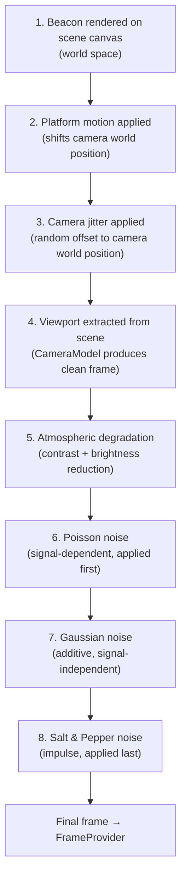

## 7.2 Ordering Justification

| Stage | Why This Order | Physical Rationale |
|---|---|---|
| **Platform motion first** | Affects where the camera is looking | Platform vibration moves the whole sensor before the image is formed |
| **Jitter second** | Stacks on platform motion | Camera-level vibration is additional to platform motion |
| **Viewport extraction third** | Must use the final camera position | The camera "sees" whatever its final pointing direction covers |
| **Atmospheric degradation fourth** | Reduces contrast/brightness of the optical signal before sensor noise | Atmosphere attenuates the signal before it reaches the detector |
| **Poisson noise fifth** | Shot noise depends on signal level | Poisson noise variance = signal intensity; must be applied to the signal-level image, not after additive noise |
| **Gaussian noise sixth** | Read noise / electronic noise is additive and signal-independent | Applied after the signal (including shot noise) is formed |
| **S&P noise last** | Impulse noise models pixel defects / corruption | Applied as a final corruption layer — dead pixels or transmission errors |

## 7.3 Modularity

Each stage is independently:
- **Toggleable** (enable/disable via config)
- **Parameterizable** (density, σ, amplitude, mode)
- **Replaceable** (implementation can change)
- **Combinable** (PS requires one or more simultaneously — FR-018)

The DisturbanceEngine internally manages a list of stages:

```
interface DisturbanceStage:
    is_geometric() → bool       # Does it affect camera pose?
    is_pixel() → bool           # Does it affect pixel values?
    apply_geometric(camera_state) → modified_camera_state
    apply_pixel(frame) → modified_frame
    configure(params)
    enable() / disable()
```

---

# PART 8 — TRACKING PIPELINE ARCHITECTURE

## 8.1 Pipeline Stages


## 8.2 Stage Contracts

### Stage 1: Preprocessing
- **Responsibility:** Prepare the raw frame for detection. May include: grayscale conversion (if colour), contrast enhancement, noise filtering (optional), ROI cropping.
- **Input:** Raw `FramePacket`.
- **Output:** Preprocessed image (same or smaller resolution).
- **Failure:** If frame is empty or corrupt → return error frame, set detection_valid=false.
- **Latency:** <1ms target.
- **Replaceability:** Can swap between no-op, histogram equalization, median filter, etc.

### Stage 2: Candidate Generation
- **Responsibility:** Identify bright regions in the frame that could potentially be the beacon. Fast, high-recall, low-precision filtering.
- **Input:** Preprocessed image.
- **Output:** List of candidate regions `{ bounding_box, peak_intensity, area }`.
- **Failure:** Zero candidates → pass empty list downstream (triggers LOST state).
- **Latency:** <3ms target.
- **Replaceability:** Thresholding, connected components, blob detection, local maxima, CFAR, matched filter.

### Stage 3: Detection / Classification
- **Responsibility:** Score each candidate. This is where AI/ML can contribute — classifying candidates as beacon vs. noise.
- **Input:** Candidate list + frame.
- **Output:** Scored candidates `{ position, confidence, class_label }`.
- **Failure:** All candidates score below threshold → no detection.
- **Latency:** <5ms target (must be lightweight for 20+ FPS).
- **Replaceability:** Size/intensity heuristics, SVM, lightweight CNN, random forest, or no-op (pass-through from candidate generation).

### Stage 4: Beacon Identification
- **Responsibility:** Select the best candidate as the beacon. Reject false positives using spatial, temporal, and appearance consistency.
- **Input:** Scored candidates + tracking history.
- **Output:** Single identified beacon or no-beacon flag.
- **Failure:** No valid beacon → TrackingStateManager receives no-detection event.
- **Latency:** <1ms target.
- **Replaceability:** Nearest-neighbor to predicted position, highest confidence, temporal consistency check.

### Stage 5: Centroid Estimation
- **Responsibility:** Refine the identified beacon position to sub-pixel accuracy.
- **Input:** Frame + beacon bounding box.
- **Output:** `CentroidResult { x, y, quality }`.
- **Failure:** Beacon too faint or too noisy → return bounding-box center as fallback.
- **Latency:** <1ms target.
- **Replaceability:** Intensity-weighted centroid, Gaussian fit, parabolic interpolation, moment-based.

### Stage 6: Temporal Tracking
- **Responsibility:** Associate current detection with previous track. Predict next position. Maintain track continuity. Update ROI for next frame.
- **Input:** Current centroid + track history.
- **Output:** `TrackResult { estimated_position, velocity, confidence, track_age, predicted_next }`.
- **Failure:** Track breaks → confidence drops → state manager handles.
- **Latency:** <1ms target.
- **Replaceability:** Simple smoothing, Kalman filter, α-β filter, particle filter, optical flow.

### Stage 7: Confidence / State Decision
- **Responsibility:** Determine if the track is valid, uncertain, or lost. This feeds into the TrackingStateManager.
- **Input:** `TrackResult`.
- **Output:** `{ is_valid, confidence_level, should_trigger_loss }`.
- **Failure:** N/A — always produces a decision.
- **Latency:** <0.1ms.
- **Replaceability:** Threshold-based, ML-based, hysteresis-based.

## 8.3 Total Pipeline Latency Budget (Engineering Target)

| Stage | Target Budget | Cumulative |
|---|---|---|
| Preprocessing | 1ms | 1ms |
| Candidate Generation | 3ms | 4ms |
| Detection/Classification | 5ms | 9ms |
| Identification | 1ms | 10ms |
| Centroid Estimation | 1ms | 11ms |
| Temporal Tracking | 1ms | 12ms |
| Confidence/State | 0.1ms | ~12ms |
| **Total pipeline** | **~12ms** | **~83 FPS theoretical** |

> [!NOTE]
> **Latency Targets vs. PS Requirements:** The ~12 ms pipeline latency and the derived ~83 FPS theoretical throughput are strictly **initial engineering latency budgets/targets**. They are not guaranteed system performance and must be established empirically during algorithm selection and profiling. The authoritative performance requirement from the PS remains: **Processing speed ≥20 FPS**.

This target leaves >38ms of headroom per frame at 20 FPS (50ms budget), accommodating simulation overhead, metrics, logging, and GUI.

---

# PART 9 — AI / ML ARCHITECTURE

## 9.1 Where AI/ML Can Genuinely Contribute

| Integration Point | Role | Why Appropriate |
|---|---|---|
| **Candidate classification** (Stage 3) | Distinguish beacon from noise artifacts | Small classifier operating on candidate patches — fast inference, genuine ML value |
| **Beacon identification** (Stage 4) | Multi-frame confidence that a candidate is the real beacon | Temporal features + appearance model → well-suited to a small trained model |
| **Centroid refinement** | Learned sub-pixel centroid estimation | A small regression network on beacon patches could outperform intensity-weighted centroid under noise |
| **Adaptive algorithm switching** | Select detection strategy based on current conditions | Reinforcement learning or rule-based meta-controller — innovation feature |
| **False positive rejection** | Post-detection filter using temporal + spatial features | Binary classifier with hand-crafted features or small neural net |

## 9.2 AI/ML Module Interface

```
interface AIDetector:
    # Initialize the model (load weights, configure)
    initialize(config) → void
    
    # Classify candidate patches
    classify(candidates: List[CandidatePatch]) → List[ScoredCandidate]
    
    # Get inference latency for profiling
    get_latency_ms() → float
    
    # Model metadata for technical report
    get_model_info() → ModelInfo { name, type, parameter_count, training_data_source }
```

## 9.3 Coexistence with Classical CV

The architecture uses a **strategy pattern** where the DetectionEngine selects between:
1. **Classical-only pipeline:** Thresholding → blob detection → size/intensity filter → centroid
2. **AI-only pipeline:** Full-frame or patch-based ML detector
3. **Hybrid pipeline (recommended):** Classical candidate generation → AI classification → classical centroid

The selection is controlled by configuration, not hard-coded.

## 9.4 Training Data Generation

The simulator itself is an unlimited source of labeled training data:
- Frame → known beacon position (from TargetManager)
- Can generate thousands of examples with controlled disturbance variations
- Labels are inherently accurate (no manual annotation needed)

The architecture supports this by exposing a **data export mode** where the simulator generates frames and ground truth without running the tracker — essentially a training data factory.

> [!NOTE]
> This is an ENGINEERING RECOMMENDATION, not a PS requirement. The PS does not require training data generation. However, if the team decides to use ML, this capability becomes strategically valuable.

## 9.5 Inference Latency Control

**Hard constraint:** The AI component must not push total pipeline time above 50ms (20 FPS).

**Mitigation strategies:**
1. Use tiny models (few parameters, small input patches)
2. Classify only candidate patches (not the full frame)
3. Run inference only when needed (not every frame — e.g., skip during confident tracking)
4. Have a fallback classical-only path if inference is too slow

---

# PART 10 — ACQUISITION / TRACKING STATE ARCHITECTURE

## 10.1 State Machine

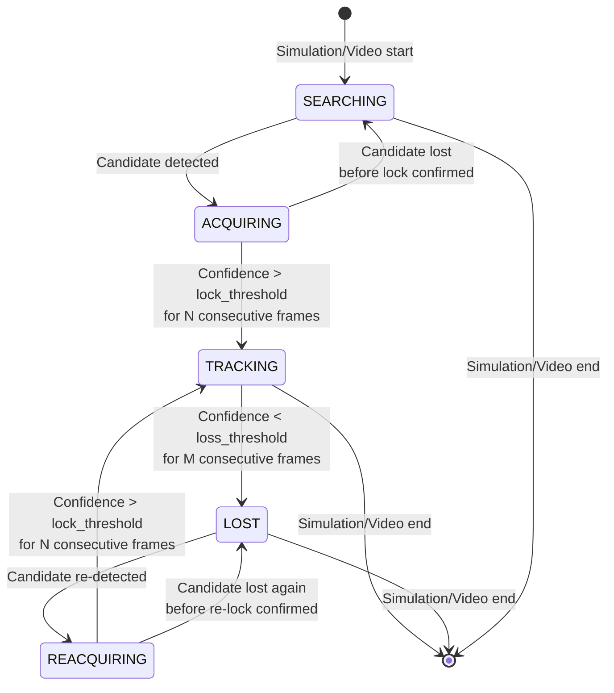

## 10.2 State Definitions

| State | Description | Entry Condition | Exit Condition | PTZ Behavior | Metrics Impact |
|---|---|---|---|---|---|
| **SEARCHING** | No track exists. Full-frame detection active. | Simulation start / video start | Candidate detected (→ ACQUIRING) | Hold position or execute search pattern | Counts toward acquisition time |
| **ACQUIRING** | Candidate found but not yet confirmed as stable lock. | Detection found candidate | Confidence stable for N frames (→ TRACKING) OR candidate lost (→ SEARCHING) | Begin moving toward candidate cautiously | Counts toward acquisition time |
| **TRACKING** | Beacon locked. Centroiding and tracking active. | Confidence confirmed above threshold | Confidence drops below loss threshold for M frames (→ LOST) | Active tracking — move to center beacon | Normal tracked frame. Counts toward lock retention. |
| **LOST** | Track broken. Full-frame re-detection active. | Tracking confidence collapse | Candidate re-detected (→ REACQUIRING) | Hold last position OR execute search | Loss timestamp recorded. Lost frames counted. Counts toward re-acquisition time. |
| **REACQUIRING** | Candidate re-found after loss. Confirming re-lock. | Detection finds candidate during LOST | Confidence stable (→ TRACKING) OR lost again (→ LOST) | Move toward new candidate | Counts toward re-acquisition time |

## 10.3 Timing Measurement

| Metric | Timer Start | Timer Stop | PS Threshold |
|---|---|---|---|
| **Acquisition time** | First frame of simulation/video | First frame entering TRACKING from ACQUIRING (initial) | ≤ 2 seconds |
| **Re-acquisition time** | Frame entering LOST | Frame entering TRACKING from REACQUIRING | ≤ 1 second (per event) |

## 10.4 Configurable Parameters *(ENGINEERING RECOMMENDATION)*

| Parameter | Purpose | Default (to be tuned) |
|---|---|---|
| `lock_threshold` | Confidence level required to declare lock | TBD during algorithm selection |
| `loss_threshold` | Confidence level below which lock is declared lost | TBD |
| `lock_confirm_frames` (N) | Consecutive frames above threshold before confirming lock | TBD (e.g., 3–5) |
| `loss_confirm_frames` (M) | Consecutive frames below threshold before declaring loss | TBD (e.g., 3–5) |

These are not PS-defined — they are algorithm tuning parameters.

---

# PART 11 — PTZ CONTROLLER ARCHITECTURE

## 11.1 Controller Interface

```
interface PTZController:
    # Compute PTZ command from tracker output
    compute(
        track_result: TrackResult,
        tracking_state: TrackingState,
        projection_model: ProjectionModel, # authoritative geometric transformations
        ptz_config: PTZConfig,             # max speeds
        dt: float                          # time step
    ) → PTZCommand { delta_pan_deg, delta_tilt_deg }
    
    # Reset controller state
    reset() → void
```

## 11.2 Controller Logic (Conceptual)

```
compute(track_result, tracking_state, camera_config, ptz_config, dt):
    
    if tracking_state.state in [SEARCHING, LOST]:
        # No valid target — hold position or execute search
        return PTZCommand(0, 0)  # or search pattern command
    
    # Convert image-space error to angular error using authoritative projection math
    e_pan, e_tilt = projection_model.pixels_to_angles(
        track_result.estimated_position.x, 
        track_result.estimated_position.y
    )
    
    # Compute desired angular velocity (control law — replaceable)
    v_pan  = controller_gain * e_pan   # degrees/s
    v_tilt = controller_gain * e_tilt  # degrees/s
    
    # Rate limit (PS constraint: max 5–10 °/s)
    v_pan  = clamp(v_pan,  -ptz_config.max_pan_speed,  ptz_config.max_pan_speed)
    v_tilt = clamp(v_tilt, -ptz_config.max_tilt_speed, ptz_config.max_tilt_speed)
    
    # Convert to position increment
    delta_pan  = v_pan  * dt
    delta_tilt = v_tilt * dt
    
    return PTZCommand(delta_pan, delta_tilt)
```

## 11.3 Key Properties

| Property | Design Decision |
|---|---|
| **Speed enforcement** | Hard clamp at configured max (PS Rows 13–14). Never exceeded. |
| **Update rate** | Runs every loop iteration. At 30 Hz loop, this inherently exceeds the 20 Hz minimum (PS Row 15). |
| **Lost-target behavior** | Hold current position (simplest). OPTIONAL: execute search pattern. |
| **ACQUIRING behavior** | Move toward candidate at reduced speed / gain. |
| **Coordinate conversion** | Strictly consumes the `ProjectionModel` abstraction provided by `CameraModel`. |
| **Saturation** | Camera position bounded within scene canvas limits. |
| **Control law** | Abstract interface. Proportional control is the baseline. PID, predictive, or adaptive control can be plugged in later. |

---

# PART 12 — GROUND TRUTH & BENCHMARK INTEGRITY

## 12.1 Hard Architectural Boundary

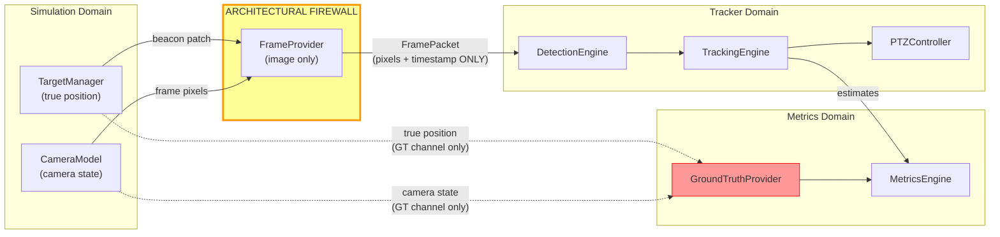

## 12.1b Centroid Definitions & Ground Truth Distinctions

> [!NOTE]
> **Engineering Design Consideration:** The ground-truth model distinguishes between several spatial concepts to ensure valid metric calculations. The final benchmark interpretation may evolve, but the architecture must retain this separation.
> 
> 1. **True target/world position:** The physical 3D/2D location of the beacon in the simulation world.
> 2. **Ideal projected image position:** The mathematically perfect projection of the true target position onto the 2D image plane, assuming no noise or discretization.
> 3. **Rendered beacon/intensity centroid:** The actual center of mass of the simulated beacon's intensity distribution on the pixel grid (affected by finite beacon size, pixel discretization, sub-pixel rendering, and interpolation).
> 4. **Estimated centroid produced by the tracker:** The position returned by the tracker pipeline after processing the noisy frame.
> 
> Separating these concepts is critical because finite beacon size and pixel discretization mean the 'rendered centroid' might slightly differ from the 'ideal projected position'.

## 12.2 How Leakage Is Prevented

1. **FrameProvider interface only exposes `(image, timestamp, frame_number, resolution)`** — no beacon position, no camera state, no scene data.
2. **DetectionEngine, CentroidEstimator, TrackingEngine, and PTZController have NO dependency on TargetManager, SceneManager, or GroundTruthProvider.** This is enforced at the module dependency level.
3. **GroundTruthProvider is instantiated only in simulation mode.** In MP4 mode, it does not exist — there is nothing to leak.
4. **MetricsEngine receives ground truth through a separate method (`set_ground_truth()`)** that is called by the simulation loop, not by the tracker.

## 12.3 MP4 Mode Ground Truth

In MP4 mode:
- **No internal ground truth is available.**
- MetricsEngine computes only ground-truth-independent metrics: FPS, acquisition time, re-acquisition time, lock retention rate.
- **Centroiding error is NOT computed** internally (no ground truth to compare against).
- **Per-frame centroid estimates are exported** to a file so evaluators can compute centroiding error externally using their own ground truth.

---

# PART 13 — METRICS ARCHITECTURE

## 13.1 Metrics Interface

```
interface MetricsEngine:
    # Per-frame update
    update(track_result, tracking_state, ground_truth_or_none) → MetricsSnapshot
    
    # End-of-run aggregation
    finalize() → FinalMetrics
    
    # Real-time access
    get_current() → MetricsSnapshot
    
    # Reset for new run
    reset() → void
```

## 13.2 Metric Definitions (Provisional)

> [!WARNING]
> These definitions are **proposed engineering interpretations**, not official PS definitions. The architecture makes them replaceable by isolating metric computation behind the MetricsEngine interface.

| # | Metric | Provisional Definition | GT Required? | PS Source |
|---|---|---|---|---|
| 1 | Centroiding Error | `CE = √((x_est - x_true)² + (y_est - y_true)²)` | Yes | L112, L113 |
| 2 | Tracking Error | `TE = √((x_est - W/2)² + (y_est - H/2)²)` | No | Row 17 |
| 3 | RMSE | `RMSE = √(Σ CE²/N)` over all tracked frames | Yes | L113 |
| 4 | Acquisition Time | `t_first_lock - t_start` (seconds) | No | Row 16 |
| 5 | Re-acquisition Time | `t_re_lock - t_loss` per event; report max and mean | No | Row 19 |
| 6 | Target Loss Rate | `lost_frames / total_frames × 100` (%) | No | Row 18 |
| 7 | Lock Retention Rate | `100 - Target_Loss_Rate` (%) | No | L103, L113 |
| 8 | Processing FPS | `total_frames / total_wall_clock_time` | No | Row 20, L103 |
| 9 | Processing Time | Total wall-clock duration of the run | No | L103 |
| 10 | Simulation Duration | Total simulated time | No | L103 |
| 11 | Avg Tracking Error | `mean(TE)` over tracked frames | No | L103 |
| 12 | Max Tracking Error | `max(TE)` over tracked frames | No | L103 |
| 13 | Camera FPS | Measured frame generation rate | No | Row 5 |
| 14 | PTZ Update Rate | Measured PTZ update frequency | No | Row 15 |

## 13.3 Per-Frame Telemetry Record

```
TelemetryRecord:
    frame_number: int
    timestamp: float
    estimated_x: float
    estimated_y: float
    true_x: float (sim only, NaN in MP4)
    true_y: float (sim only, NaN in MP4)
    centroiding_error: float (sim only)
    tracking_error: float
    tracking_state: enum
    confidence: float
    detection_valid: bool
    ptz_pan_cmd: float (sim only)
    ptz_tilt_cmd: float (sim only)
    camera_x: float (sim only)
    camera_y: float (sim only)
    processing_time_ms: float
```

---

# PART 14 — LOGGING & EXPORT ARCHITECTURE

## 14.1 Output Streams

| Output | Format | Trigger | Contents | PS Source |
|---|---|---|---|---|
| **Performance Report** | Text / JSON / HTML | Auto at end of run | All aggregated metrics | L103 |
| **Centroiding Error Log** | CSV | Auto during run | Per-frame centroiding error | L112 |
| **Centroid Export** | CSV | Auto at end of run | Per-frame `(frame, x, y)` | L113 (for external comparison) |
| **Full Telemetry Log** | CSV / binary | Auto during run (optional) | All telemetry fields | RECOMMENDATION |
| **Benchmark Summary** | Text / JSON | Auto at end of benchmark | Pass/fail against thresholds | RECOMMENDATION |

## 14.2 Performance-Safe Logging

**Architecture:** In-memory circular buffer + deferred flush.

```
LoggingEngine:
    telemetry_buffer: RingBuffer[TelemetryRecord]  # Pre-allocated, fixed size
    
    record(frame_number, track_result, metrics):
        # O(1) append to pre-allocated buffer — no allocation, no I/O
        telemetry_buffer.append(TelemetryRecord(...))
    
    flush():
        # Called periodically (every N frames) or at end of run
        # Writes buffer contents to file
        write_to_file(telemetry_buffer)
        telemetry_buffer.clear()
    
    generate_report():
        # Called at end of run
        # Aggregates metrics, writes performance report
        report = format_report(MetricsEngine.finalize())
        write_report_file(report)
```

**Why this matters:** Writing to disk on every frame (at 30 Hz) could cause I/O stalls that drop FPS below 20. Buffering eliminates this risk.

---

# PART 15 — GUI ARCHITECTURE

## 15.1 Functional Layout

```
┌──────────────────────────────────────────────────────────────────────────┐
│ TOOLBAR:  [Simulation Mode] [MP4 Benchmark Mode]  [Start] [Stop] [Pause]│
├──────────────────────────────────┬───────────────────────────────────────┤
│                                  │                                       │
│  CONFIGURATION PANEL             │  LIVE CAMERA VIEW                     │
│  ┌────────────────────────────┐  │  ┌─────────────────────────────────┐  │
│  │ Scene: 2000×2000           │  │  │                                 │  │
│  │ Camera: 640×480, Mono      │  │  │  Camera viewport with           │  │
│  │ FOV: 4° × 3°              │  │  │  detection overlay               │  │
│  │ Target: 10×10, Square      │  │  │  (crosshair, bounding box,      │  │
│  │ Motion: [Circular ▼]       │  │  │   tracking state indicator)     │  │
│  │ Speed: [slider]            │  │  │                                 │  │
│  │ PTZ Pan: 5°/s  Tilt: 5°/s │  │  └─────────────────────────────────┘  │
│  └────────────────────────────┘  │                                       │
│                                  │  PERFORMANCE DASHBOARD                │
│  DISTURBANCE PANEL               │  ┌─────────────────────────────────┐  │
│  ┌────────────────────────────┐  │  │ FPS: 32.1    State: TRACKING   │  │
│  │ ☑ Gaussian  σ: [10  ]     │  │  │ Acq Time: 0.8s                 │  │
│  │ ☑ S&P      %: [10  ]     │  │  │ Track Error: 3.2 px (avg)      │  │
│  │ ☐ Poisson                 │  │  │ CE: 1.1 px  RMSE: 1.4 px      │  │
│  │ ☑ Jitter   amp: [5   ]   │  │  │ Lock Ret: 98.7%                │  │
│  │ Atmosphere: [Haze ▼]      │  │  │ Processing: 12.3 ms/frame      │  │
│  │ ☑ Platform  amp: [3   ]   │  │  └─────────────────────────────────┘  │
│  └────────────────────────────┘  │                                       │
│                                  │  LOG / RESULTS PANEL                  │
│  MP4 PANEL                       │  ┌─────────────────────────────────┐  │
│  ┌────────────────────────────┐  │  │ [View Report] [Export Centroids]│  │
│  │ [Browse MP4...]            │  │  │ Performance log: auto-saved     │  │
│  │ File: benchmark_01.mp4     │  │  │ Last run: PASS (all thresholds)│  │
│  │ [Run Tracker]              │  │  └─────────────────────────────────┘  │
│  └────────────────────────────┘  │                                       │
├──────────────────────────────────┴───────────────────────────────────────┤
│ STATUS BAR:  Frame: 1234  |  Time: 41.1s  |  Mode: Simulation           │
└──────────────────────────────────────────────────────────────────────────┘
```

## 15.2 GUI Architecture Principles

1. **GUI runs on a separate thread** from the simulation/tracking core to prevent UI freezes.
2. **GUI reads from shared state** (VisualizationEngine output) — does not participate in the computation pipeline.
3. **GUI controls** are disabled during active runs where appropriate (e.g., cannot change resolution mid-simulation).
4. **MP4 mode** disables simulation-specific controls and enables MP4 file browser.
5. **Configuration is validated** before starting a run (ConfigManager validates ranges and constraints).

---

# PART 16 — BENCHMARK ARCHITECTURE

## 16.1 Benchmark-1 Workflow

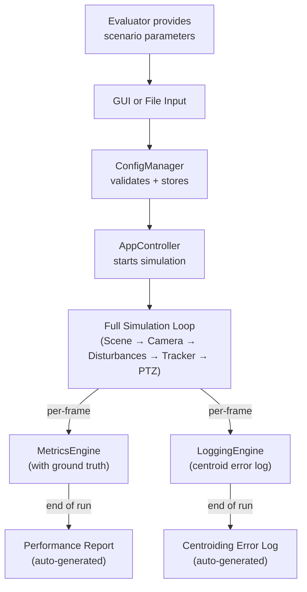

## 16.2 Benchmark-2 Workflow

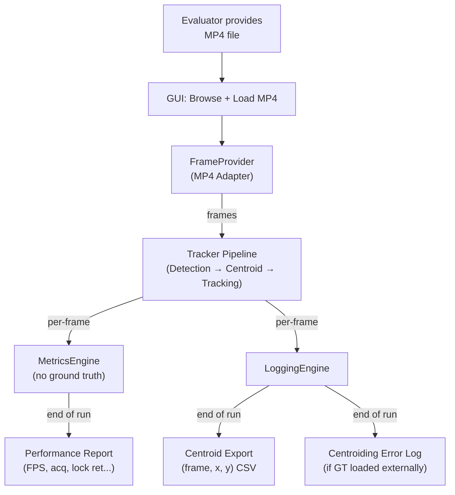

**Benchmark-2 key requirement:** The same tracker code runs. No simulator, no PTZ. The FrameProvider swaps from simulation adapter to MP4 adapter — everything downstream is identical.

---

# PART 17 — FAILURE & RECOVERY ARCHITECTURE

| Failure Mode | Detection | Response | Impact Containment |
|---|---|---|---|
| **No beacon detected** | DetectionEngine returns empty list | TrackingStateManager → SEARCHING or LOST depending on current state. PTZ holds position. | Normal operation — not a crash |
| **Multiple candidates** | DetectionEngine returns >1 candidate | Beacon Identification selects best candidate by confidence/proximity to predicted position | Handled within detection pipeline |
| **False positive** | Candidate is noise, not beacon | Identification rejects (temporal/spatial inconsistency). If accepted temporarily, TrackingEngine's confidence decays and triggers LOST. | Self-correcting via state machine |
| **Temporary target loss** (<1s) | Confidence drops → LOST state | REACQUIRING: wider search around last known position. Timer starts. | If re-acquired <1s, meets PS threshold |
| **Extended target loss** (>1s) | Re-acquisition timer exceeds 1s | Continue searching. Log the event. Counts against target loss rate. | Acceptable — just hurts the metrics |
| **Invalid MP4** | Video decoder fails to open | Error dialog in GUI. Log error. Do not crash. | Application remains running |
| **Unsupported codec** | Decoder returns error on first frame | Display error message with supported formats. | Application remains running |
| **Unexpected resolution** | Frame dimensions differ from expected | Tracker derives all parameters from actual frame dimensions (AP-09). | Automatic — no crash |
| **Malformed scenario config** | ConfigManager validation fails | Error message listing invalid parameters. Do not start simulation. | Prevented before execution |
| **Excessive disturbance** | Tracker performance degrades | Tracked in metrics. Not a crash — just poor scores. | Metrics accurately reflect degradation |
| **Processing overload** (FPS < 20) | MetricsEngine measures FPS | Log warning. Continue processing. FPS metric reflects the failure. | Not a crash — just a bad score |
| **Dropped frames** (sim runs slow) | Frame processing time > sim_dt | Log timing warning. Continue sequentially. | Simulation runs slower than real-time |
| **GUI freeze** | GUI thread blocks | GUI runs on separate thread. Core loop unaffected. | Tracker continues processing |
| **Logger overload** | Disk I/O slow | Buffered logging (§14.2) prevents stalls. Flush at end. | Tracker FPS unaffected |

---

# PART 18 — TESTABILITY ARCHITECTURE

## 18.1 Component-Level Testing

| Component | Test Strategy | Inputs | Expected Outputs |
|---|---|---|---|
| **TargetManager** | Unit test: verify each motion pattern produces correct trajectories | Pattern type, time steps | Sequence of positions matching mathematical definition |
| **CameraModel** | Unit test: verify viewport extraction at various positions/FOVs | Scene canvas, camera position, FOV | Correct sub-image extraction |
| **DisturbanceEngine** | Unit test per disturbance: verify noise statistics, jitter bounds, atmospheric effects | Clean frame, disturbance params | Statistical properties of output (mean, σ, pixel distribution) |
| **DetectionEngine** | Unit test: synthetic frames with known beacon position | Synthetic frame with beacon + noise | Detection result near true position |
| **CentroidEstimator** | Unit test: beacon patches with known sub-pixel centroid | Synthetic beacon patch | Centroid error < threshold |
| **TrackingEngine** | Sequence test: synthetic frame sequence with moving beacon | Frame sequence + ground truth trajectory | Track follows ground truth |
| **TrackingStateManager** | State machine test: verify transitions | Sequence of confidence values | Correct state transitions + timing |
| **PTZController** | Unit test: verify rate limiting, convergence | Tracking error sequence, speed limits | Commands within speed bounds; error decreases |
| **MetricsEngine** | Unit test: verify metric computation against known values | Synthetic telemetry data | Correct metric values |
| **LoggingEngine** | Integration test: verify output file format and contents | Telemetry stream | Valid CSV/report files |

## 18.2 Synthetic Ground Truth for Testing

During testing:
- The simulator's TargetManager provides ground truth to the test harness.
- This allows automated validation of tracker accuracy.
- During production benchmark execution, ground truth is used only by MetricsEngine, never by the tracker.

The same code path is used — the architectural boundary prevents contamination regardless of whether testing or benchmarking.

---

# PART 19 — ALGORITHM PLUG-IN ARCHITECTURE

## 19.1 Strategy Interfaces

```
# Detection strategy
interface IDetector:
    detect(frame: Image) → List[DetectionResult]
    get_name() → str

# Centroid estimation strategy
interface ICentroidEstimator:
    estimate(frame: Image, detection: DetectionResult) → CentroidResult
    get_name() → str

# Temporal tracking strategy
interface ITracker:
    update(centroid: CentroidResult, frame_meta: FrameMeta) → TrackResult
    reset() → void
    get_name() → str

# PTZ control strategy
interface IPTZController:
    compute(track: TrackResult, state: TrackingState, config: PTZConfig, dt: float) → PTZCommand
    reset() → void
    get_name() → str
```

## 19.2 Algorithm Evaluation Harness (Development Infrastructure)

The architecture introduces an explicit **Algorithm Evaluation Harness** as development/evaluation infrastructure. It is primarily for internal engineering and algorithm selection, and is **not required for normal evaluator-facing execution**.

Its purpose is to allow the development team to replay identical:
- simulation recordings
- MP4 sequences
- disturbance conditions
- timestamps
- ground truth

through different algorithm configurations.

It must support comparison of: detection accuracy, centroiding error, RMSE, tracking error, acquisition time, reacquisition time, target loss, lock retention, processing FPS, and latency.

**Boundary and Integrity:**
- The Harness can run multiple algorithm configurations independently.
- It can inject identical frames and timestamps.
- It can provide ground truth to the evaluation/metrics side.
- It does **not** provide ground truth to the tracker itself.
- It does **not** weaken the `FrameProvider` firewall.

```text
                    DEVELOPMENT / EVALUATION
                              │
                 Algorithm Evaluation Harness
                    /        |                           /         |                      Algorithm A  Algorithm B  Algorithm C
                   │         │         │
                   └─────────┼─────────┘
                             │
                       Metrics Engine
                             │
                    Comparison Report
```

**How this works:**
1. The Harness provides identical frames via `FrameProvider` and provides ground truth to `MetricsEngine`.
2. It replays the scenario deterministically.
3. Compare metrics using common definitions.
4. Select the best algorithm based on evidence.

---

# PART 20 — ARCHITECTURAL TRADE-OFFS

## Trade-Off 1: Single-Threaded vs. Multi-Threaded Pipeline

| Aspect | Single-Threaded | Multi-Threaded |
|---|---|---|
| **Complexity** | Low | High |
| **Determinism** | Fully deterministic | Non-deterministic timing |
| **Debugging** | Simple | Complex (race conditions) |
| **Throughput** | Limited by slowest stage | Can pipeline stages | 
| **FPS feasibility** | 640×480 processing in ~12ms → ~83 FPS | Higher potential but unnecessary |
| **Benchmark impact** | Reproducible results | Timing-dependent variations |

**Recommended:** Single-threaded core + async GUI. **Confidence: High.**
**Rationale:** The processing budget (50ms at 20 FPS) is far larger than expected pipeline latency (~12ms). Multi-threading adds complexity without benefit.

## Trade-Off 2: Simulator/Tracker Coupling

| Aspect | Tightly Coupled | Loosely Coupled (FrameProvider boundary) |
|---|---|---|
| **Benchmark-2** | Impossible without refactoring | Trivially supported |
| **Testability** | Hard to test tracker in isolation | Easy |
| **Development** | Faster initial development | Slightly more upfront design |
| **Algorithm comparison** | Difficult | Easy |

**Recommended:** Loosely coupled via FrameProvider. **Confidence: Very High.**
**Rationale:** PS L113 explicitly requires bypassing PTZ. This is non-negotiable.

## Trade-Off 3: Synchronous vs. Asynchronous Processing

| Aspect | Synchronous | Asynchronous |
|---|---|---|
| **Latency** | Deterministic | Variable |
| **Frame ordering** | Guaranteed | Must manage |
| **Complexity** | Low | High |
| **Dropped frames** | None (runs slow instead) | Possible |

**Recommended:** Synchronous. **Confidence: High.**
**Rationale:** Every frame must be processed for accurate metrics. Dropping frames would corrupt acquisition time and loss rate measurements.

## Trade-Off 4: Classical CV vs. AI vs. Hybrid

| Aspect | Classical Only | AI Only | Hybrid |
|---|---|---|---|
| **Speed** | Very fast | Depends on model | Fast (classical) + small overhead |
| **5px beacon handling** | Excellent (signal processing) | Needs careful training | Best of both |
| **Noise robustness** | Good with tuning | Potentially excellent | Potentially excellent |
| **Evaluation score** | Loses "AI" points | Full marks if good | Full marks + innovation |
| **Development risk** | Low | High (training data, model selection) | Medium |

**Recommended:** Hybrid. **Confidence: High.**
**Rationale:** Classical CV for speed and reliability on small targets; AI/ML for validation, false-positive rejection, and evaluation scoring. The architecture supports all three — final selection is deferred.

## Trade-Off 5: In-Memory vs. File-Based Telemetry

| Aspect | In-Memory Buffer | Direct File Write |
|---|---|---|
| **FPS impact** | None (O(1) append) | Potential I/O stalls |
| **Data loss risk** | Lost on crash | Persisted immediately |
| **Complexity** | Buffer management | Simple |

**Recommended:** In-memory buffer with periodic flush. **Confidence: High.**
**Rationale:** FPS is a benchmark metric. I/O stalls directly cause benchmark failure.

## Trade-Off 6: Real-Time Rendering vs. Decoupled Rendering

| Aspect | Every Frame | Throttled (every Nth frame) |
|---|---|---|
| **Visual smoothness** | Best | Good enough at 15–20 Hz |
| **CPU overhead** | GUI rendering competes with tracker | Tracker has full CPU budget |
| **FPS impact** | Significant if GUI is complex | Minimal |

**Recommended:** Decoupled/throttled rendering. **Confidence: High.**
**Rationale:** Evaluators need to see tracking working, not cinematic smoothness. 15–20 Hz GUI refresh is sufficient. Tracker FPS must be protected.

---

# PART 21 — COMPLETE ARCHITECTURE DIAGRAMS

## Diagram 1: Top-Level Architecture

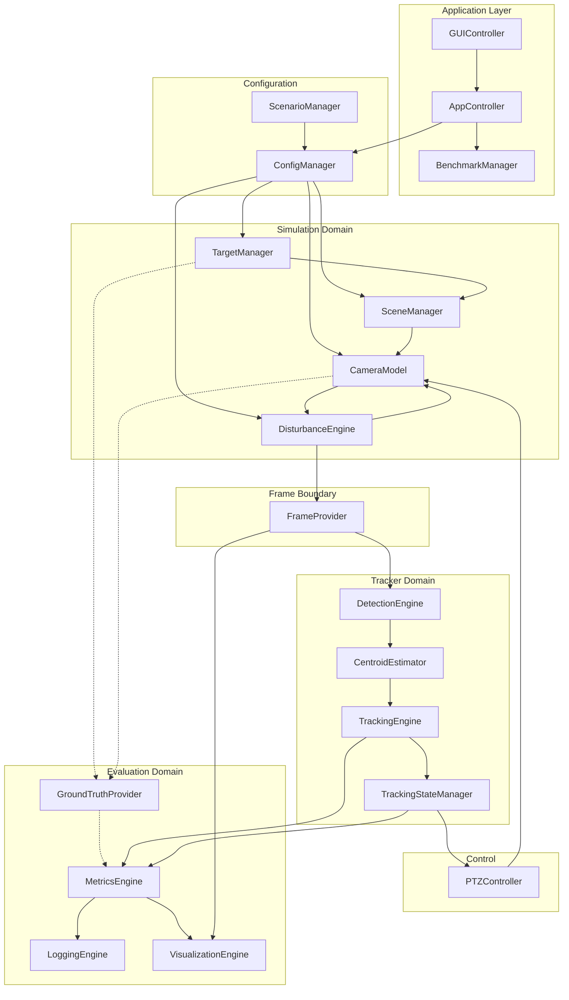

## Diagram 2: Disturbance Pipeline

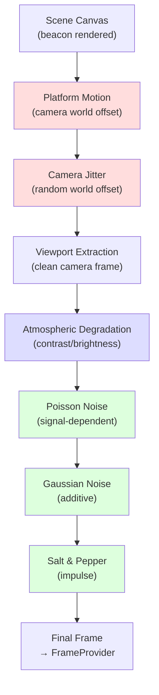

*Red = geometric disturbances, Blue = visibility disturbances, Green = sensor noise*

## Diagram 3: Tracking Pipeline

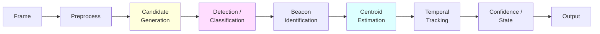

*Yellow = high-recall filter, Purple = AI/ML integration point, Cyan = precision stage*

## Diagram 4: State Machine

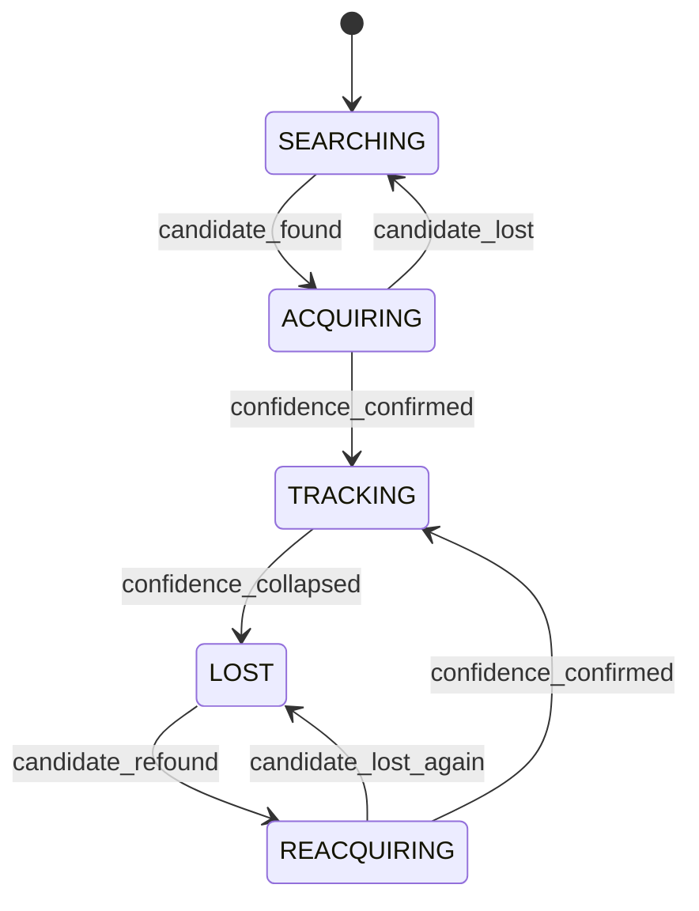

## Diagram 5: Component Dependency Graph

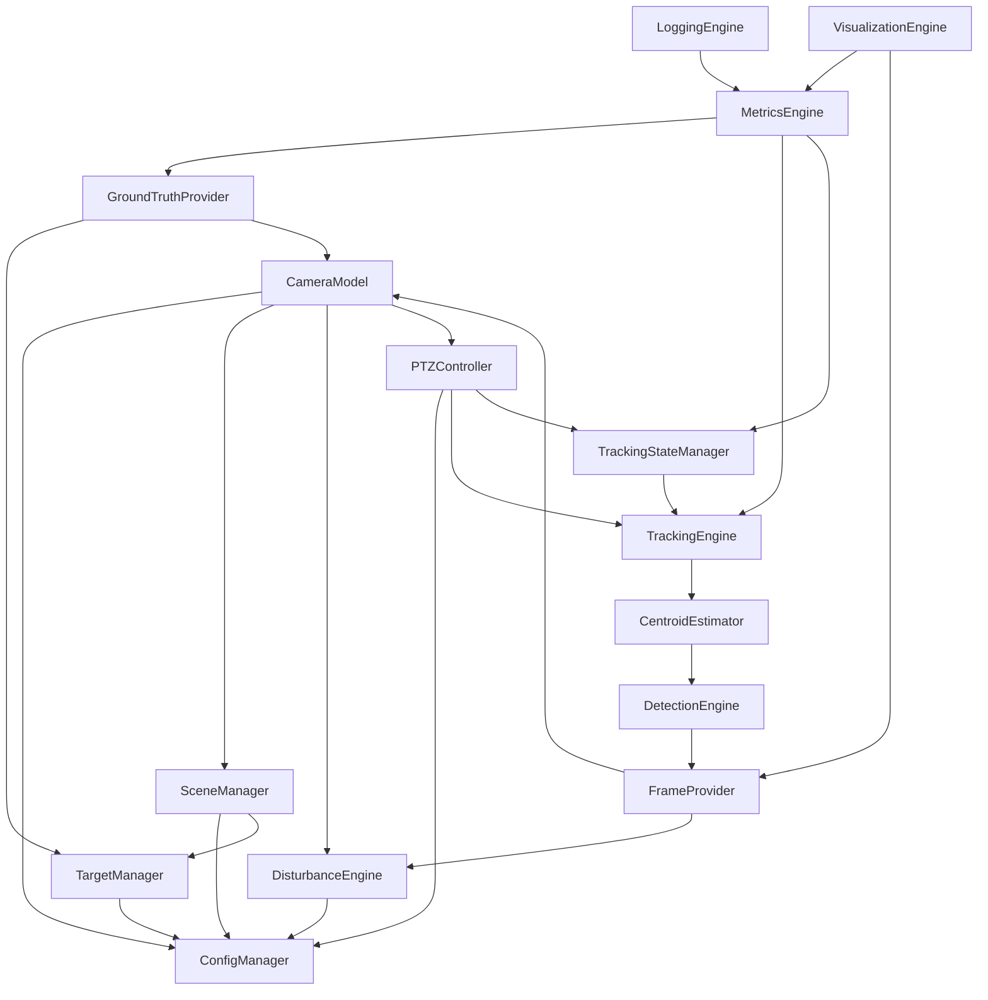

---

# PART 22 — MODULE CONTRACTS

## MC-01: FrameProvider

| Field | Value |
|---|---|
| **Module** | FrameProvider |
| **Responsibility** | Provide a uniform frame interface regardless of source (simulation or MP4) |
| **Public Inputs** | (Sim) disturbed frame from DisturbanceEngine. (MP4) file path. |
| **Public Outputs** | `FramePacket { image: ndarray, timestamp: float, frame_number: int, width: int, height: int }` |
| **Owned State** | Frame counter, current adapter reference |
| **Dependencies** | (Sim) CameraModel, DisturbanceEngine. (MP4) Video codec. |
| **Timing** | Produces frames at source rate (≥30 Hz sim, ~30 Hz MP4) |
| **Failure Behavior** | Returns error frame on decode failure; signals end-of-stream on video end |
| **Testability** | Can be instantiated with synthetic frame sequences for testing |

## MC-02: DetectionEngine

| Field | Value |
|---|---|
| **Module** | DetectionEngine |
| **Responsibility** | Find and identify beacon candidates in the frame |
| **Public Inputs** | `FramePacket` |
| **Public Outputs** | `List[DetectionResult { position, bbox, confidence, is_beacon }]` |
| **Owned State** | Algorithm-specific state (background model, temporal history) |
| **Dependencies** | FrameProvider (input only) |
| **Timing** | Must complete within ~9ms (stages 1–4 combined) |
| **Failure Behavior** | Returns empty list if no candidates found |
| **Testability** | Accepts any image — can be tested with synthetic frames |

## MC-03: CentroidEstimator

| Field | Value |
|---|---|
| **Module** | CentroidEstimator |
| **Responsibility** | Refine beacon position to sub-pixel centroid |
| **Public Inputs** | `FramePacket`, `DetectionResult` |
| **Public Outputs** | `CentroidResult { x: float, y: float, quality: float }` |
| **Owned State** | None (stateless) |
| **Dependencies** | DetectionEngine |
| **Timing** | <1ms |
| **Failure Behavior** | Returns bbox center as fallback if refinement fails |
| **Testability** | Can be unit-tested with synthetic beacon patches |

## MC-04: TrackingEngine

| Field | Value |
|---|---|
| **Module** | TrackingEngine |
| **Responsibility** | Temporal tracking — association, prediction, track continuity |
| **Public Inputs** | `CentroidResult`, `FrameMeta` |
| **Public Outputs** | `TrackResult { estimated_position, velocity, confidence, track_age, predicted_next }` |
| **Owned State** | Track history, velocity estimate, ROI |
| **Dependencies** | CentroidEstimator |
| **Timing** | <1ms |
| **Failure Behavior** | Confidence drops to 0 if no valid centroid received for several frames |
| **Testability** | Can replay recorded centroid sequences |

## MC-05: TrackingStateManager

| Field | Value |
|---|---|
| **Module** | TrackingStateManager |
| **Responsibility** | Manage acquisition/tracking/loss/reacquisition state machine and timing |
| **Public Inputs** | `TrackResult` |
| **Public Outputs** | `TrackingState { state, time_in_state, acquisition_ts, loss_ts, reacq_ts }` |
| **Owned State** | Current state, transition history, timers |
| **Dependencies** | TrackingEngine |
| **Timing** | <0.1ms |
| **Failure Behavior** | Always produces a valid state — never fails |
| **Testability** | Pure state machine — easily unit-tested with synthetic confidence sequences |

## MC-06: PTZController

| Field | Value |
|---|---|
| **Module** | PTZController |
| **Responsibility** | Convert tracker output to rate-limited camera commands |
| **Public Inputs** | `TrackResult`, `TrackingState`, `CameraConfig`, `PTZConfig`, `dt` |
| **Public Outputs** | `PTZCommand { delta_pan, delta_tilt }` (degrees) |
| **Owned State** | Controller state (integral term if PID) |
| **Dependencies** | TrackingEngine, TrackingStateManager, ConfigManager |
| **Timing** | <0.1ms |
| **Failure Behavior** | Returns zero command if state is SEARCHING/LOST |
| **Testability** | Can be unit-tested with synthetic tracking error sequences |

## MC-07: GroundTruthProvider

| Field | Value |
|---|---|
| **Module** | GroundTruthProvider |
| **Responsibility** | Collect and expose true beacon/camera state for metrics only |
| **Public Inputs** | True beacon position (from TargetManager), camera state (from CameraModel) |
| **Public Outputs** | `GroundTruth { target_world_position, ideal_projected_image_position, rendered_image_centroid, camera_position }` |
| **Owned State** | Per-frame ground truth buffer |
| **Dependencies** | TargetManager, CameraModel (READ-ONLY access) |
| **Timing** | <0.1ms |
| **Failure Behavior** | Returns None/unavailable in MP4 mode |
| **Testability** | N/A — data passthrough |

## MC-08: MetricsEngine

| Field | Value |
|---|---|
| **Module** | MetricsEngine |
| **Responsibility** | Compute all performance metrics with replaceable definitions |
| **Public Inputs** | `TrackResult`, `TrackingState`, `GroundTruth` (optional) |
| **Public Outputs** | `MetricsSnapshot` (per-frame), `FinalMetrics` (end-of-run) |
| **Owned State** | Running sums, frame counters, min/max trackers |
| **Dependencies** | TrackingEngine, TrackingStateManager, GroundTruthProvider |
| **Timing** | <1ms per frame |
| **Failure Behavior** | Computes available metrics; marks unavailable ones (e.g., CE in MP4 mode) |
| **Testability** | Can be fed synthetic telemetry and verified against known results |

## MC-09: LoggingEngine

| Field | Value |
|---|---|
| **Module** | LoggingEngine |
| **Responsibility** | Generate all output files — performance report, centroid logs, exports |
| **Public Inputs** | `MetricsSnapshot` stream, `TrackResult` stream, `ConfigManager` snapshot |
| **Public Outputs** | Files (CSV, text report) |
| **Owned State** | In-memory telemetry buffer, file handles |
| **Dependencies** | MetricsEngine, ConfigManager |
| **Timing** | O(1) per-frame record; flush at end of run |
| **Failure Behavior** | Logs write error; does not crash application |
| **Testability** | Can verify output file format and content |

## MC-10: DisturbanceEngine

| Field | Value |
|---|---|
| **Module** | DisturbanceEngine |
| **Responsibility** | Apply all configurable disturbances in correct order |
| **Public Inputs** | Clean frame, config, simulation clock |
| **Public Outputs** | Disturbed frame, geometric offsets (jitter, platform) |
| **Owned State** | Per-disturbance enable/disable, random generator state |
| **Dependencies** | ConfigManager |
| **Timing** | <2ms for all enabled disturbances |
| **Failure Behavior** | If a disturbance stage fails, bypass it and log warning |
| **Testability** | Apply each disturbance to a known image and verify statistical properties |

## MC-11: CameraModel

| Field | Value |
|---|---|
| **Module** | CameraModel |
| **Responsibility** | Virtual camera — maintain pointing state, extract viewport from scene |
| **Public Inputs** | Scene canvas, PTZ commands, geometric offsets, config |
| **Public Outputs** | Clean camera frame, camera state |
| **Owned State** | Camera world position, pan/tilt angles |
| **Dependencies** | SceneManager, PTZController, DisturbanceEngine, ConfigManager |
| **Timing** | <1ms (viewport extraction is a sub-image crop + optional rescale) |
| **Failure Behavior** | Clamp viewport to scene bounds if camera approaches edge |
| **Testability** | Verify correct sub-image extraction at various positions |

## MC-12: TargetManager

| Field | Value |
|---|---|
| **Module** | TargetManager |
| **Responsibility** | Beacon generation and motion trajectory computation |
| **Public Inputs** | Config, simulation clock |
| **Public Outputs** | Beacon world position(s), beacon pixel patch |
| **Owned State** | Current positions, motion state, trajectory history |
| **Dependencies** | ConfigManager |
| **Timing** | <0.5ms |
| **Failure Behavior** | Wrap/clamp beacon to scene bounds if trajectory exits |
| **Testability** | Verify each motion pattern against mathematical definition |

---

# PART 23 — TRACEABILITY

| Subsystem | FRs Satisfied | NFRs Satisfied | Benchmark Reqs | Acceptance Tests |
|---|---|---|---|---|
| **SceneManager** | FR-001 | — | BM1-001 | AC-FR-01 |
| **TargetManager** | FR-002, FR-003, FR-008, FR-009 | — | BM1-001 | AC-FR-02, AC-FR-03 |
| **CameraModel** | FR-004, FR-005, FR-006, FR-007 | — | BM1-001 | AC-FR-04, AC-FR-05, AC-PR-06 |
| **DisturbanceEngine** | FR-010–018 | NFR-ROB-001 | BM1-001 | AC-FR-06–10 |
| **FrameProvider** | FR-029 | — | BM2-001, BM2-002 | AC-BM2-01, AC-BM2-02 |
| **DetectionEngine** | FR-019, FR-020, FR-032 | — | — | AC-FR-11 |
| **CentroidEstimator** | FR-021 | NFR-ACC-001, NFR-ACC-002 | BM1-002, BM2-003, BM2-005 | AC-BM2-03 |
| **TrackingEngine** | FR-022 | NFR-PERF-001, NFR-PERF-003, NFR-PERF-004 | — | AC-FR-12, AC-PR-02, AC-PR-03, AC-PR-05 |
| **TrackingStateManager** | — | NFR-PERF-002, NFR-PERF-005 | — | AC-PR-01, AC-PR-04 |
| **PTZController** | FR-023, FR-024, FR-025 | — | — | AC-FR-13, AC-PR-07 |
| **GroundTruthProvider** | — | — | — | — (internal quality) |
| **MetricsEngine** | — | NFR-ACC-001, NFR-ACC-002 | BM1-003, BM2-004 | AC-BM2-04 |
| **LoggingEngine** | FR-027, FR-028 | NFR-LOG-001 | BM1-002, BM1-003, BM2-005 | AC-LOG-01–03 |
| **BenchmarkManager** | — | — | BM1-001–005, BM2-001–007 | AC-BM1-01–03, AC-BM2-01–04 |
| **VisualizationEngine** | FR-026 | NFR-RT-001 | — | AC-FR-14, AC-GUI-04 |
| **GUIController** | FR-031 | NFR-USE-001 | BM1-004 | AC-GUI-01–05 |
| **FEAT-AI-001** | FR-032 | — | — | Technical evaluation |
| **FEAT-PKG-001** | FR-030 | NFR-STAND-001 | — | AC-EXE-01–02 |
| **Algorithm Evaluation Harness** | — | — | — | Engineering Infrastructure (Not a PS requirement) |

### Unsatisfied Requirements

| Requirement | Status | Resolution |
|---|---|---|
| NFR-DOC-001 (Tech report) | Not an architecture component | Deliverable — produced during documentation phase |
| NFR-DOC-002 (User manual) | Not an architecture component | Deliverable — produced during documentation phase |
| NFR-CODE-001 (Modular code) | Addressed by architecture itself | Module boundaries enforce modularity |
| NFR-PORT-001 (Windows target) | Not architectural | Packaging/build system decision |
| NFR-REPRO-001 (Reproducibility) | Supported by ConfigManager (random seed) | Implementation detail |
| NFR-REL-001, NFR-REL-002 (Reliability) | Addressed by fault isolation (Part 17) | Implementation detail |

---

# PART 24 — ARCHITECTURAL RISKS

| # | Risk | Severity | Likelihood | Cause | Mitigation | Architecture Impact |
|---|---|---|---|---|---|---|
| **AR-01** | Tracker fails on 5×5 beacon under max noise | Critical | High | Tiny target, high noise ratio | Algorithm plug-in architecture allows testing multiple detectors. Adaptive ROI and noise-robust algorithms. | DetectionEngine must support multiple strategies |
| **AR-02** | Pipeline exceeds 50ms (FPS < 20) | Critical | Medium | Heavy detection algorithm | Latency budget (§8.3). AI inference only on candidate patches, not full frame. Classical fast path available. | DetectionEngine must profile and enforce latency |
| **AR-03** | MP4 resolution breaks tracker | Critical | High | Unknown evaluator MP4 format | Resolution-agnostic design (AP-09). No hard-coded dimensions. | FrameProvider + all tracker modules derive params from frame |
| **AR-04** | PTZ oscillation / hunting | High | Medium | Poor control tuning, measurement noise | PTZController is replaceable (strategy interface). Gain tuning. Dead-band. | PTZController interface supports multiple control laws |
| **AR-05** | Ground truth leaks into tracker | Critical | Low | Programming error | Architectural firewall via FrameProvider. Tracker has no dependency on GT modules. Code review enforcement. | Module dependency graph prevents it |
| **AR-06** | Re-acquisition exceeds 1 second | High | Medium | Search strategy too slow or beacon lost in noise | TrackingStateManager triggers wider search. Prediction-based ROI. Multiple detection strategies for LOST state. | State machine supports REACQUIRING state with different algorithm path |
| **AR-07** | Combined disturbances overwhelm detection | High | High | All disturbances at max simultaneously | Test combined scenarios early. Adaptive detection thresholds. Robust centroiding. | DisturbanceEngine modular — test combinations |
| **AR-08** | GUI blocks simulation loop | Medium | Low | Heavy GUI rendering on main thread | GUI on separate thread (§5.2). Decoupled rendering (§20, Trade-Off 6). | Execution model enforces separation |

---

# PART 25 — FINAL ARCHITECTURE

## Recommended Architecture

### Architecture Style
**Modular layered architecture** with a clear domain boundary (Simulation Domain / Tracker Domain / Evaluation Domain) and a single-threaded synchronous core loop with asynchronous GUI.

### Final Architecture Inventory

#### Production Runtime (19 Modules in 6 Domains)
1. **Application Domain:** AppController, ConfigManager, ScenarioManager, GUIController, BenchmarkManager
2. **Simulation Domain:** SceneManager, TargetManager, CameraModel, DisturbanceEngine
3. **Input Boundary Domain:** FrameProvider
4. **Tracker Domain:** DetectionEngine, CentroidEstimator, TrackingEngine, TrackingStateManager
5. **Control Domain:** PTZController
6. **Metrics & Evaluation Domain:** GroundTruthProvider, MetricsEngine, LoggingEngine, VisualizationEngine

#### Development / Evaluation Infrastructure
* **Algorithm Evaluation Harness** (Utilizes production modules for benchmarking and algorithm comparison, but is not a production runtime dependency)

### Data Flow
- **Simulation:** Scene → Beacon → Camera → Disturbances → FrameProvider → Tracker → PTZ → Camera (feedback loop)
- **MP4:** Video → FrameProvider → Tracker → Metrics → Export (no feedback loop)
- **Ground Truth:** TargetManager → GroundTruthProvider → MetricsEngine (never to tracker)

### Execution Model
Synchronized single-threaded core (engineering strategy) to meet ≥30 Hz target with async GUI refresh. Deterministic. Default benchmarking policy prefers sequential processing (falling behind real-time) over dropping frames.

### Tracker Boundary
FrameProvider exposes only `(image, timestamp, frame_number, resolution)`. No simulator state crosses this boundary.

### Ground-Truth Boundary
GroundTruthProvider feeds only MetricsEngine. Tracker modules have zero dependency on GT modules.

### Benchmark Modes
- **BM1:** Full simulation → tracker → PTZ → metrics → logs (30% score)
- **BM2:** MP4 → FrameProvider(MP4 adapter) → same tracker → metrics → centroid export (30% score)

### AI/CV Extensibility
Strategy pattern interfaces (IDetector, ICentroidEstimator, ITracker, IPTZController). Hybrid classical+AI pipeline architecturally supported. AI operates on candidate patches, not full frames.

### Metrics/Logging Strategy
In-memory buffered telemetry → periodic flush → auto-generated reports at end of run. Metric definitions are provisional and replaceable.

---

## Architecture Decision Summary

| Decision | Final Choice | Confidence | Status |
| -------- | ------------ | ---------- | ------ |
| FrameProvider firewall | Simulator-to-tracker firewall; no ground truth or simulator state leakage | Very High | Final |
| Simulator/tracker separation | Strict separation enforced via FrameProvider and module contracts | Very High | Final |
| Ground-truth isolation | Ground truth flows only to MetricsEngine; strict timestamp synchronization | Very High | Final |
| Execution model | Initial strategy: synchronous single-threaded core + async GUI (compatible with future concurrency) | High | Final |
| Timing architecture | Measured metrics (≥20 FPS) distinct from engineering targets (~12ms budget) | High | Final |
| Coordinate/projection architecture | 4 coordinate systems; ProjectionModel abstraction within CameraModel to prevent math duplication | High | Final |
| Disturbance architecture | Ordered pipeline (geometric → visibility → sensor) | High | Final |
| AI/CV extensibility | Strategy pattern interfaces supporting Classical, AI, and Hybrid pipelines | High | Final |
| Algorithm plug-in architecture | Abstract interfaces (IDetector, ICentroidEstimator, ITracker, IPTZController) | High | Final |
| State machine | 5-state machine for accurate acquisition and re-acquisition timing | High | Final |
| PTZ architecture | Controller decoupled from tracker, consumes ProjectionModel | High | Final |
| Metrics architecture | Replaceable definitions, clearly distinguishing true vs projected vs rendered vs estimated centroid | High | Final |
| Telemetry/logging | In-memory buffering with deferred flush | High | Final |
| Benchmark-1 | Full simulation workflow | High | Final |
| Benchmark-2 | MP4 workflow utilizing the exact same tracker pipeline via FrameProvider adapter | High | Final |
| Algorithm Evaluation Harness | Explicit engineering capability for replaying identical conditions across multiple algorithms | High | Final |

## What Remains Undecided

Explicitly list:

* exact detector
* exact beacon identification method
* exact centroid estimator
* exact temporal tracker
* exact AI/ML model
* exact PTZ controller
* final projection implementation
* confidence thresholds
* final implementation language/framework
* final GUI framework

---

## Final Architecture Decision

> **READY TO FREEZE**

The architecture provides stable boundaries, data flows, timing models, and coordinate architectures. The FrameProvider firewall and Benchmark-2 paths are fully defined. Algorithm choices are isolated behind stable plug-in interfaces and an Algorithm Evaluation Harness, ensuring that implementation and algorithm selection can proceed without requiring system-level redesign.

---

> [!IMPORTANT]
> **This architecture document is now complete.** It defines the system's structure, boundaries, data flows, timing model, and module contracts. It does NOT contain implementation code, algorithm selections, or framework choices. All PS ambiguities are preserved. All Engineering Context recommendations are treated as engineering hypotheses, not requirements. The architecture is traceable to the PRD, and the PRD is traceable to the PS.
>
> ## Next Phase
> **STAGE 4 — ALGORITHM SELECTION & EXPERIMENTAL DESIGN**
