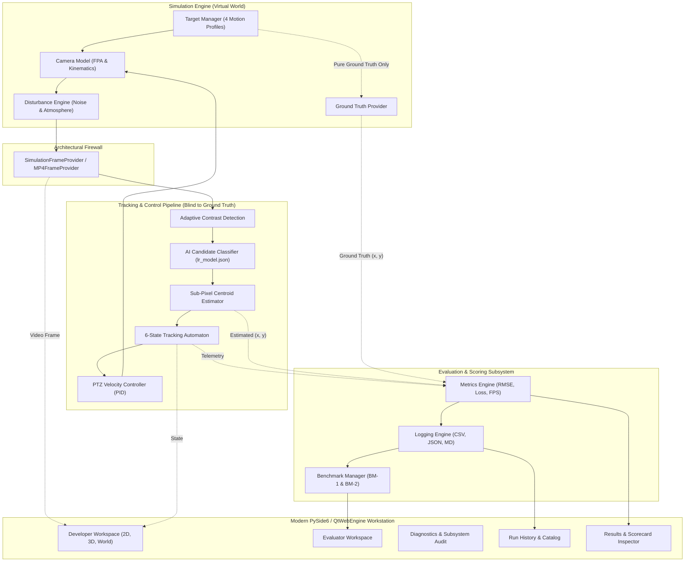
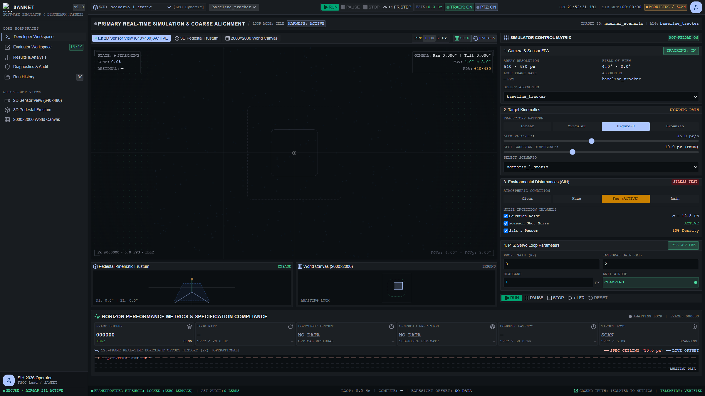
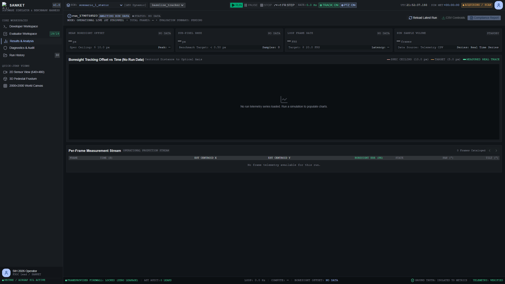
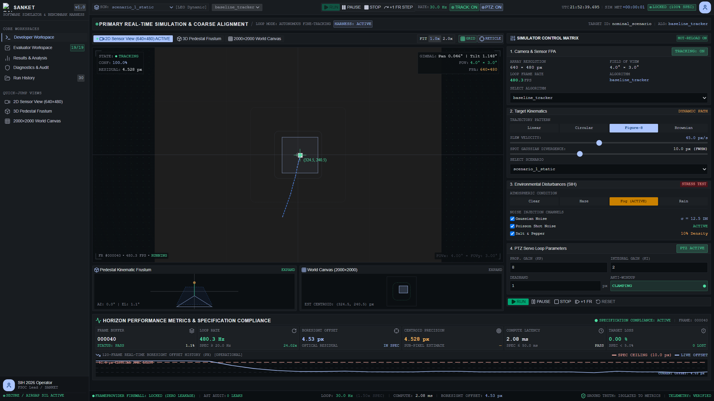

<p align="center">
  
</p>

# SANKET

### AI-Assisted Virtual Camera Tracking System for Coarse Alignment of Mobile Free Space Optical Communication (FSOC) Terminals

[](https://www.python.org/)
[](https://react.dev/)
[](https://docs.pytest.org/)
[](https://microsoft.com/windows)
[](#architecture)
[](docs/official_problem_statement.md)

---

## Overview

Free Space Optical Communication (FSOC) enables multi-gigabit wireless data transmission between dynamic aerospace platforms (satellites, UAVs, and optical ground stations) using highly directional laser beams. Because optical divergence angles are exceedingly narrow (often under $1\ \text{mrad}$), terminal pointing, acquisition, and tracking (PAT) requires a two-stage alignment architecture:

1. **Coarse Alignment:** Locates the remote optical beacon within an uncertainty envelope, detects the spot on a wide-FOV sensor array, and slews the optical gimbal assembly to center the beacon on the optical axis.
2. **Fine Alignment:** Fast Steering Mirrors (FSMs) and quadrant photodiodes take over to maintain sub-microradian link lock.

Testing coarse alignment algorithms on physical optomechanical gimbals is cost-prohibitive. **SANKET** is an air-gapped, standalone Software-in-the-Loop (SIL) simulation and tracking platform designed for the Indian Space Research Organisation (ISRO) under **Smart India Hackathon 2026 (Problem Statement 26169)**. It provides a high-fidelity virtual camera environment, an embedded computer vision tracking pipeline, closed-loop pan-tilt kinematics, and automated evaluation scorecards.

---

## Problem Statement (SIH PS-26169)

In accordance with the official Department of Space / ISRO requirements:
- **Virtual Environment:** Configurable world canvas $\ge 2000 \times 2000$ pixels.
- **Sensor Model:** Monochrome Focal Plane Array (FPA) with default $640 \times 480$ resolution and $4.0^\circ \times 3.0^\circ$ FOV.
- **Beacon Kinematics:** 1 mandatory moving target spot ($5\text{ to }20\text{ px}$) supporting **Straight Line**, **Circular**, **Figure-8**, and **Random** trajectories.
- **Camera Kinematics:** Gimbal pan and tilt angular velocities clamped between $5.0^\circ/\text{s}$ and $10.0^\circ/\text{s}$.
- **Performance Thresholds:**
  - Acquisition Time $\le 2.0\text{ s}$
  - Tracking Error $\le 10.0\text{ px}$
  - Target Loss Rate $< 5.0\%$
  - Re-acquisition Time $\le 1.0\text{ s}$
  - Processing Speed $\ge 20.0\text{ FPS}$
- **Disturbance Modeling:** Salt & Pepper noise ($\sim 10\%$), additive Gaussian noise ($\sigma \le 20\text{ px}$), Poisson photon shot noise, platform jitter ($\pm 20\text{ px/frame}$), and atmospheric transmittance models (Clear, Haze, Fog, Rain, Low Light).
- **Benchmark-2 Decoupling:** Ingestion of external 30 FPS `.mp4` video files with PTZ camera actuation bypassed for coarse pointing verification against predefined reference tracks.

---

## Key Capabilities

- **Air-Gapped Standalone Binary:** Self-contained executable requiring zero runtime internet access or external package managers.
- **Strict Ground-Truth Firewall:** The tracking pipeline operates purely on degraded sensor pixel data ($I_k \in \mathbb{R}^{480 \times 640}$) and is architecturally barred from querying true simulation coordinates.
- **Sub-Pixel Precision:** Intensity-weighted Center of Gravity (CoG) centroiding achieving sub-pixel localization error $< 0.1\text{ px}$.
- **AI Clutter Rejection:** Embedded 4-feature calibrated Logistic Regression classifier trained to distinguish optical beacons from high-intensity noise spikes with seamless rule-based fallback.
- **Closed-Loop PTZ Kinematics:** Multi-rate PID velocity controller with anti-windup clamping, dynamic rate limits ($\le 10^\circ/\text{s}$), and a $\pm 1.5\text{ px}$ mechanical deadband.
- **5 Production Workspaces:** Developer Workspace (2D, 3D, and World views), Evaluator Console, Diagnostics & Subsystem Audit, Run History Catalog, and Results & Scorecards.
- **High-Throughput Engine:** Verified processing throughput of **461.8 FPS** with a median per-frame compute latency of **0.88 ms** on standard host CPUs.

---

## Architecture

SANKET enforces clean decoupling between the simulation environment, algorithmic tracking, and telemetry logging:



---

## Processing Pipeline

```mermaid
flowchart LR
    Ingest["Frame Ingest (640x480)"] --> Thresh["Adaptive Local Contrast Threshold"]
    Thresh --> Morph["Morphological Opening (3x3)"]
    Morph --> Region["Candidate Region Extraction"]
    Region --> Feat["Feature Vector Extraction [I_peak, Circ, Cont, Area]"]
    Feat --> AI["Calibrated Logistic Classifier"]
    AI --> CoG["Intensity-Weighted Centroiding (CoG)"]
    CoG --> State["Tracking State Automaton (Search/Detect/Track/Coast)"]
    State --> PID["PTZ Velocity PID with Rate Limiting (<=10 deg/s)"]
    PID --> Gimbal["Camera Model Gimbal Articulation"]
```



---

## Technology Stack

| Layer | Technologies | Role in System |
| :--- | :--- | :--- |
| **Backend Core** | Python 3.11.9, NumPy 2.x, OpenCV 4.10 | Simulation loop, image filtering, centroiding, PTZ control laws |
| **GUI Shell** | PySide6 6.8.0 (QtWebEngine & QtWebChannel) | Native desktop window hosting Chromium runtime with IPC bridge and official logo |
| **Frontend UI** | React 19, TypeScript, TailwindCSS, Lucide-React | Responsive 5-workspace dark-mode workstation interface |
| **3D Rendering** | Three.js, React Three Fiber, WebGL | Dynamic 3D pan-tilt camera pedestal and optical viewing frustum |
| **Packaging** | PyInstaller 6.10, Inno Setup 6 | Single-directory standalone executable and Windows installer |
| **Verification** | Pytest 9.1 | 492 automated unit, integration, and behavioral tests |

---

## Project Structure

```
SANKET/
├── src/                               # Complete Python backend source
│   ├── aiml/                          # AI classifier, feature extractor, temporal predictor
│   ├── api/                           # Data contracts (FramePacket, CentroidEstimate)
│   ├── app/                           # AppController and PySide6/WebEngine GUI host
│   ├── config/                        # Configuration manager and defaults
│   ├── control/                       # PTZ closed-loop PID controller
│   ├── evaluation/                    # BenchmarkManager, automated matrix runner
│   ├── frame/                         # SimulationFrameProvider and MP4FrameProvider
│   ├── interfaces/                    # Abstract Strategy interfaces
│   ├── metrics/                       # Telemetry logging and compliance evaluator
│   ├── plugins/                       # Extensible algorithm plugin architecture
│   ├── simulation/                    # Target manager, camera model, disturbance engine
│   ├── tests/                         # 492 automated pytest test suites
│   ├── tracker/                       # Detection engine, centroiding, state machine
│   └── main.py                        # System entry point (CLI and GUI dispatcher)
├── frontend/                          # Embedded React 19 / TypeScript UI
│   ├── src/
│   │   ├── workspaces/                # 5 production workspaces
│   │   │   ├── DeveloperWorkspace/    # 2D Sensor, 3D Pedestal, World Canvas
│   │   │   ├── EvaluatorWorkspace/    # BM-1 and BM-2 test consoles
│   │   │   ├── DiagnosticsWorkspace/  # Subsystem audit and airgap monitor
│   │   │   ├── HistoryWorkspace/      # Run catalog and artifact browser
│   │   │   └── ResultsWorkspace/      # Statistical scorecards and charts
│   │   ├── services/qtBridge.ts       # QtWebChannel transport bridge
│   │   └── App.tsx                    # Root workspace dispatcher
│   ├── package.json                   # Frontend dependencies
│   └── vite.config.ts                 # Production bundler configuration
├── App_Logo_Assets_Final/             # Official SANKET vector and raster branding assets
├── scenarios/                         # Scenario definitions (Static, Circular, Fig-8, Fog)
├── scripts/                           # Packaging, testing, and screenshot capture tools
├── deliverables/                      # Official SIH 26169 submission package
│   ├── 01_Software_Application/       # Standalone SANKET.exe, installer, portable zip
│   ├── 02_Source_Code/                # SANKET_Source.zip (26.53 MB) & reproduction guide
│   ├── 03_Technical_Report/           # Formal technical report (MD and PDF) + 10 figures
│   ├── 04_User_Manual/                # 26-section comprehensive operator manual + 10 figures
│   ├── 05_Performance_Log/            # Real runtime CSV, JSON, and MD report artifacts
│   ├── 06_Optional_Demo_Video/        # Video submission status document
│   ├── UI_Screenshots/                # Full-resolution consolidated screenshot library
│   ├── DELIVERABLE_MANIFEST.md        # Official deliverables status matrix
│   └── DELIVERABLE_GENERATION_REPORT.md # Verification methodology & evidence audit
├── docs/                              # Problem statement, specs, and screenshot assets
├── installer/                         # Inno Setup 6 packaging specification (`sanket_setup.iss`)
├── lr_model.json                      # Calibrated logistic regression model weights
├── sanket.spec                        # PyInstaller build specification
├── requirements.txt                   # Backend Python dependencies
└── run_sanket.bat                     # Desktop convenience launcher
```

---

## User Interface

SANKET contains **five production workspaces**:

```
[ Developer Workspace ]  [ Evaluator ]  [ Diagnostics & Audit ]  [ Run History ]  [ Results & Analysis ]
```

### 1. Developer Workspace
The operational cockpit for real-time tracking, gimbal monitoring, and disturbance injection. Features three synchronized sub-views:

#### Sub-View A: 2D Sensor View (640 × 480)
Displays the live FPA detector feed with tracking bounding box, sub-pixel crosshair, optical boresight error vector, and real-time noise controls.



#### Sub-View B: 3D Pedestal Frustum
Interactive Three.js 3D mechanical model rendering live pan/tilt gimbal articulation and the camera's optical viewing pyramid.


#### Sub-View C: 2000 × 2000 World Canvas
Top-down macro perspective of the global coordinate plane showing the beacon trajectory, current target position, moving $640 \times 480$ camera footprint, and the **`LIVE OPERATIONAL: WORLD GT STRIPPED`** firewall indicator.


---

### 2. Evaluator Workspace
Dedicated evaluation console to execute Benchmark-1 scenario runs and Benchmark-2 external video evaluations with automated compliance scorecard generation.


---

### 3. Diagnostics & Subsystem Audit
System health dashboard tracking unit test pass rates, memory heap stability, frame provider firewall integrity, and compute latency distributions.


---

### 4. Run History & Artifact Catalog
Catalog indexing all simulation sessions, enabling instant inspection and export of raw CSV telemetry, JSON summaries, and markdown reports.


---

### 5. Results & Analysis
Statistical evaluation workspace featuring time-series error plots, latency percentiles, and formal SIH PS-26169 pass/fail compliance scorecards.



---

## Tracking Pipeline & Algorithms

### Sub-Pixel Centroid Estimation
Sub-pixel target localization is calculated via intensity-weighted Center of Gravity (CoG) within local window $\Omega$:
$$x_c = \frac{\sum_{(u, v) \in \Omega} u \cdot [I(u, v) - I_{\text{bg}}]}{\sum_{(u, v) \in \Omega} [I(u, v) - I_{\text{bg}}]}, \quad y_c = \frac{\sum_{(u, v) \in \Omega} v \cdot [I(u, v) - I_{\text{bg}}]}{\sum_{(u, v) \in \Omega} [I(u, v) - I_{\text{bg}}]}$$

### AI Clutter Rejection
Candidates are classified using a 4-feature Logistic Regression model (`lr_model.json`):
$$\mathbf{x} = \begin{bmatrix} I_{\text{peak}} / 255.0 \\ 4\pi \cdot \text{Area} / \text{Perimeter}^2 \\ (I_{\text{peak}} - \mu) / \sigma \\ \log(1 + \text{Area}) \end{bmatrix}, \quad P(\text{Beacon}) = \sigma\left( \mathbf{w}^T \hat{\mathbf{x}} + b \right)$$

### Closed-Loop PTZ Controller
Gimbal angular velocity commands are computed via proportional-integral-derivative control with anti-windup:
$$\dot{\theta}_{\text{pan}} = \operatorname{clip}\left( K_p e_x + K_i \int e_x dt + K_d \frac{de_x}{dt}, -\omega_{\max}, \omega_{\max} \right)$$
$$\dot{\theta}_{\text{tilt}} = \operatorname{clip}\left( -\left[ K_p e_y + K_i \int e_y dt + K_d \frac{de_y}{dt} \right], -\omega_{\max}, \omega_{\max} \right)$$
where $\omega_{\max} = 10.0^\circ/\text{s}$ (strict hardware limit).

---

## Disturbances and Noise

| Disturbance Mode | Parameter Range | Physical Modeling Basis |
| :--- | :--- | :--- |
| **Salt & Pepper** | $0\% \text{ to } 15\%$ corrupted pixels | Sensor hot/dead pixel impulses ($\sim 10\%$ per SIH specification) |
| **Gaussian Noise** | $\sigma \in [0, 20]\text{ px}$ | Sensor thermal noise and amplifier read noise |
| **Poisson Noise** | Dynamic scale | Photon arrival shot noise under low irradiance |
| **Platform Jitter** | $\pm 20\text{ px/frame}$ | High-frequency mechanical vibration from UAV/satellite airframe |
| **Atmospheric Models**| Clear, Haze, Fog, Rain, Low Light | Beer-Lambert optical transmittance attenuation ($\tau \in [0.20, 1.0]$) |

---

## Benchmarks

### Benchmark-1: Scenario Evaluation
Automated evaluation of bundled scenarios (`scenario_1_static`, `scenario_2_circular`, `scenario_3_figure8`, `scenario_4_fog_gaussian`). Evaluates acquisition time, continuous tracking error, and closed-loop PTZ stability.

### Benchmark-2: External MP4 Video Ingestion
Software fully implements `MP4FrameProvider` (`src/frame/mp4_provider.py`) using OpenCV `VideoCapture`:
- Ingests 30 FPS MP4 containers with arbitrary dimensions.
- Converts frames to monochrome uint8 with zero-copy buffer views.
- Bypasses PTZ camera model automatically to evaluate pure coarse pointing detection.
- Evaluates estimated centroids against evaluator reference CSV (`frame,true_x,true_y`).
> **Audit Note:** The software capability is fully implemented and tested (8 unit tests in `test_bm2_workflow.py`). Because no pre-recorded `.mp4` video files were provided with the problem statement, the system is ready for external video input from evaluators during on-site testing.

---

## Performance Logging & Runtime Evidence

SANKET automatically generates structured performance logs upon simulation completion. The following data was recorded during a clean, verified execution of `scenario_2_circular` (900 frames / 29.97 s):

```
========================================================================================
                          RUNTIME PERFORMANCE SCORECARD (run_1790716901)
========================================================================================
  Metric                        Specification       Measured Value          Verdict
----------------------------------------------------------------------------------------
  Acquisition Time              <= 2.0 s            0.07 s (Frame 2)        PASS
  Mean Tracking Error           <= 10.0 px          4.82 px                 PASS
  Max Tracking Error            --                  144.72 px (Initial)     Informational
  Target Loss Rate              < 5.0%              0.00% (0 Lost Frames)   PASS
  Reacquisition Time            <= 1.0 s            N/A (Zero Loss Events)  PASS
  Algorithmic Throughput        >= 20.0 FPS         461.8 FPS               PASS
  Mean Processing Latency       --                  1.00 ms                 PASS
  Median (P50) Latency          --                  0.88 ms                 PASS
  95th Percentile (P95) Latency --                  1.31 ms                 PASS
  99th Percentile (P99) Latency --                  1.75 ms                 PASS
  Post-Acq Lock Retention Rate  --                  100.00% (898/898)       PASS
  Sub-Pixel Centroid Error <1px --                  100.0%                  PASS
  Total Frames Processed        --                  900 frames              PASS
  Total Simulation Duration     --                  29.97 s                 PASS
========================================================================================
```

The corresponding raw telemetry artifacts are preserved in:
- `deliverables/05_Performance_Log/run_1790716901_summary.json`
- `deliverables/05_Performance_Log/run_1790716901_telemetry.csv` (469 KB, 900 frame rows)
- `deliverables/05_Performance_Log/run_1790716901_performance_report.md`

---

## Installation & Setup

### Option 1: Standalone Application (No Python Required)
1. Navigate to `deliverables/01_Software_Application/installer/` and execute `SANKET-Setup-v1.0.exe`.
2. Or extract `deliverables/01_Software_Application/portable/SANKET-Portable-v1.0.zip` and run `SANKET.exe`.

### Option 2: Run from Source
Prerequisites: Python 3.10–3.12 (64-bit) and Node.js v18+.

```powershell
# 1. Navigate to repository root
cd "external"

# 2. Set up Python virtual environment
python -m venv .venv
.\.venv\Scripts\Activate.ps1

# 3. Install backend dependencies
pip install -r requirements.txt

# 4. Build frontend static assets
cd frontend
npm install
npm run build
cd ..

# 5. Launch application
python -m src.main
```

---

## Running Commands

```powershell
# Launch interactive 5-workspace workstation GUI (default)
python -m src.main

# Run simulation headlessly in console mode
python -m src.main --headless --scenario scenario_2_circular

# Execute internal foundation & contract validation audit
python -m src.main --validate

# Execute automated SMOKE benchmark matrix
python -m src.main --matrix SMOKE

# Ingest external MP4 video for Benchmark-2 evaluation
python -m src.main --mp4 "path\to\video.mp4" --reference-csv "path\to\ground_truth.csv"
```

---

## Automated Test Suite

To run the complete automated test suite:

```powershell
python -m pytest
```

*Verified Test Execution Result (Python 3.11.9):*
```
============================ 492 passed in 19.39s =============================
```

To run individual subsystem tests:
```powershell
pytest src/tests/test_tracking_pipeline.py    # Detection, centroiding, state transitions
pytest src/tests/test_ptz_controller.py       # PID control laws & rate clamping
pytest src/tests/test_bm2_workflow.py         # MP4 decoding & reference comparison
pytest src/tests/test_simulation.py           # Virtual camera model & disturbances
```

---

## Building the Standalone Executable

To compile the standalone ONEDIR binary distribution:
```powershell
pyinstaller sanket.spec --noconfirm --clean
```
The resulting package is written to `dist/SANKET/` with entry point `SANKET.exe`.

---

## Deliverables Package Directory

The complete official submission package is organized in `deliverables/`:

```
deliverables/
├── 01_Software_Application/       # Standalone SANKET.exe, installer, portable zip
├── 02_Source_Code/                # SANKET_Source.zip (26.53 MB) & reproduction guide
├── 03_Technical_Report/           # Formal technical report (MD and PDF) + 10 figures
├── 04_User_Manual/                # 26-section comprehensive operator manual + 10 figures
├── 05_Performance_Log/            # Real runtime CSV, JSON, and MD report artifacts
├── 06_Optional_Demo_Video/        # Video submission status document
├── UI_Screenshots/                # Full-resolution consolidated screenshot library
├── DELIVERABLE_MANIFEST.md        # Official deliverables status matrix
└── DELIVERABLE_GENERATION_REPORT.md # Verification methodology & evidence audit
```

---

## Screenshots Gallery

| 1. Developer: 2D Sensor View | 2. Developer: 3D Pedestal Frustum |
| :---: | :---: |
|  |  |
| **3. Developer: 2000×2000 World Canvas** | **4. Evaluator Workspace** |
|  |  |
| **5. Diagnostics & Subsystem Audit** | **6. Run History Catalog** |
|  |  |
| **7. Results & Analysis Workspace** | **8. Active Closed-Loop Tracking** |
|  |  |

---

## Limitations

- **Benchmark-2 Official Test Media:** Software fully implements MP4 ingestion and passes all 8 automated MP4 tests. Pre-recorded test media was not bundled by competition authorities; ready for external evaluator videos.
- **Physical Mechanical Dynamics:** Slew kinematics enforce physical speed limits ($\le 10^\circ/\text{s}$), deadband, and anti-windup, but physical motor thermal rise and gear backlash are modeled mathematically.

---

## Technical Documentation Links

- [Official Problem Statement (SIH PS-26169)](docs/official_problem_statement.md)
- [Deliverables Manifest](deliverables/DELIVERABLE_MANIFEST.md)
- [Deliverables Generation Report](deliverables/DELIVERABLE_GENERATION_REPORT.md)
- [Technical Report (Markdown)](deliverables/03_Technical_Report/SANKET_Technical_Report.md)
- [Technical Report (PDF)](deliverables/03_Technical_Report/SANKET_Technical_Report.pdf)
- [User Manual](deliverables/04_User_Manual/SANKET_User_Manual.md)
- [Source Code Reproduction Guide](deliverables/02_Source_Code/SOURCE_CODE_README.md)
- [Performance Log Documentation](deliverables/05_Performance_Log/PERFORMANCE_LOG_README.md)

---

## Acknowledgements

Developed for **Smart India Hackathon 2026** under Problem Statement 26169 (Department of Space / Indian Space Research Organisation).
Special thanks to the ISRO evaluation team and open-source scientific computing communities (NumPy, OpenCV, PySide6, Three.js, React).
