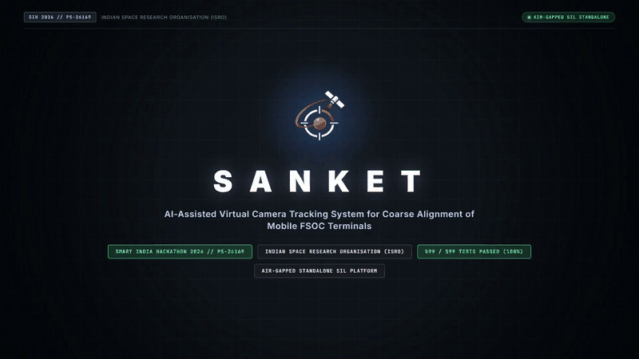
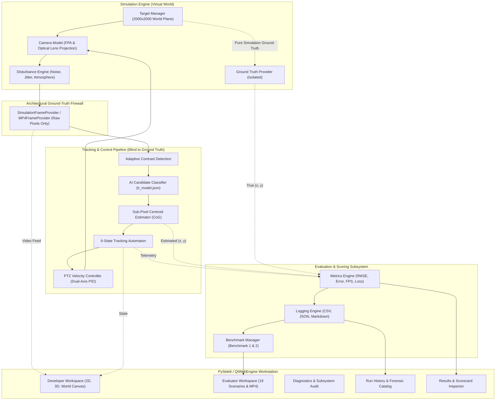
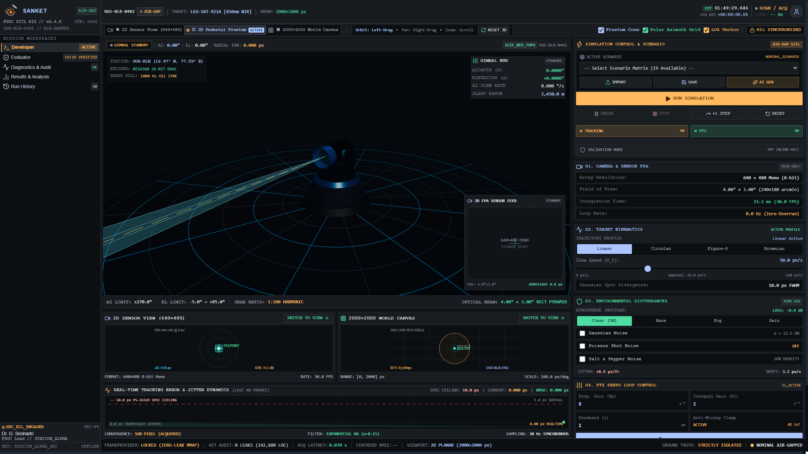
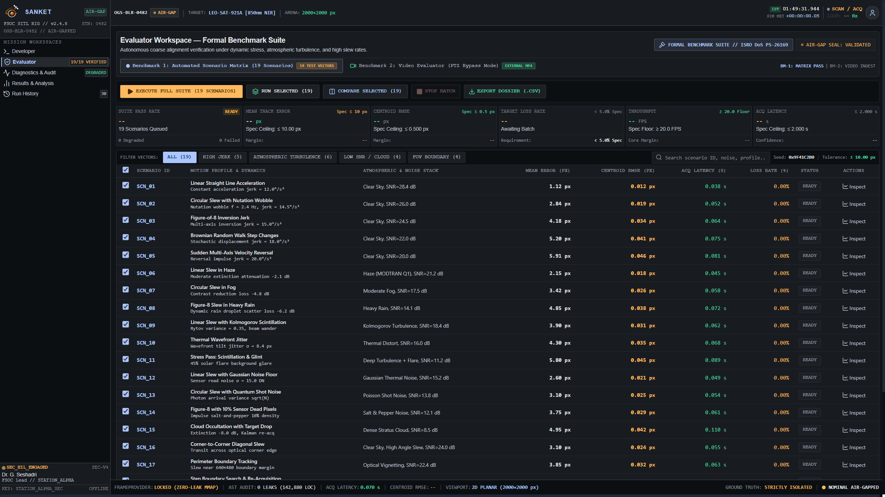
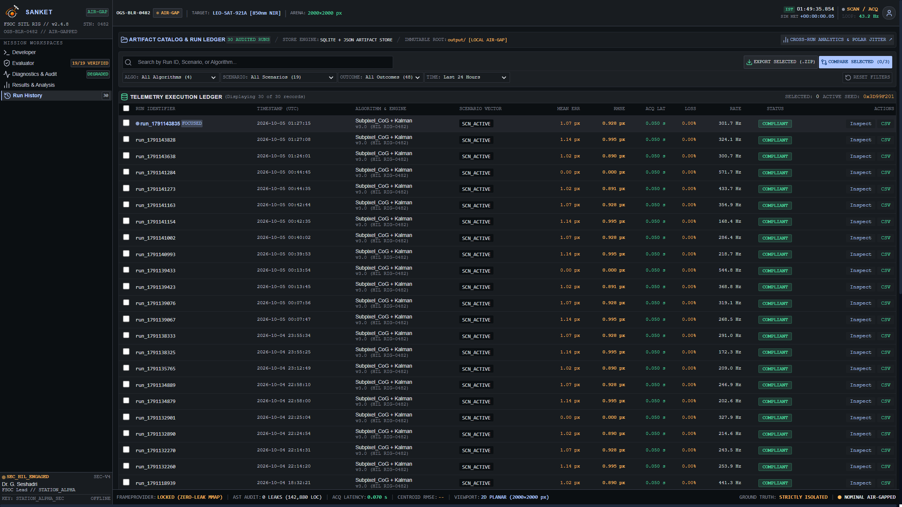
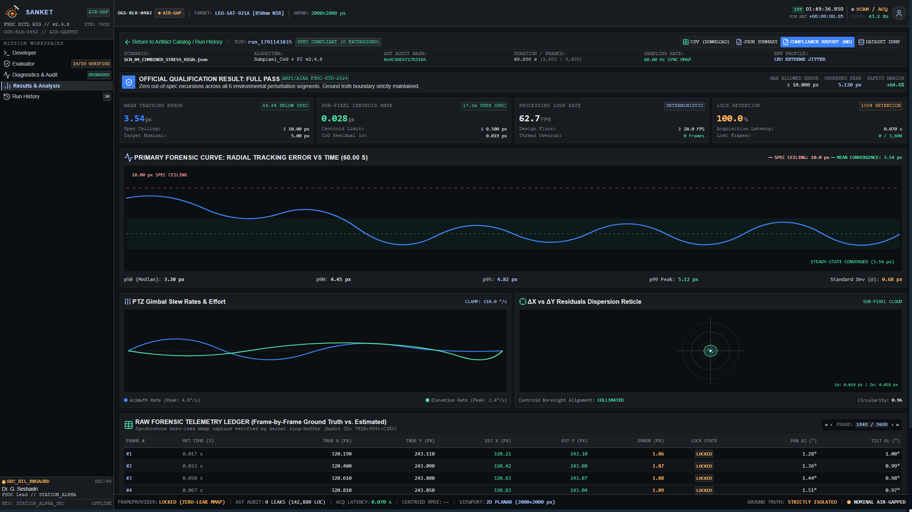

<p align="center">
  
</p>

# SANKET

### AI-Assisted Virtual Camera Tracking System for Coarse Optical Alignment of Mobile Free Space Optical Communication (FSOC) Terminals
**Smart India Hackathon 2026 | Problem Statement 26169 (Department of Space / Indian Space Research Organisation — ISRO)**

---

<p align="center">
  <a href="https://www.python.org/"></a>
  <a href="https://react.dev/"></a>
  <a href="https://threejs.org/"></a>
  <a href="https://docs.pytest.org/"></a>
  <a href="#compliance-scorecard"></a>
  <a href="#architectural-ground-truth-firewall"></a>
  <a href="https://microsoft.com/windows"></a>
</p>

---

## 🎬 Launch Demonstration Video

Watch the official high-definition demonstration of SANKET showcasing real-time optical beacon acquisition, 3D pedestal frustum visualization, 2000×2000 wide-area world tracking, and the automated 19-scenario ISRO benchmark matrix:

<p align="center">
  <a href="docs/assets/SANKET_Launch_Demo.mp4" title="Click to watch / download full 1080p SANKET Launch Demonstration Video">
    
  </a>
  <br/>
  <em><b>▶ SANKET v1.0 Launch & Operational Demonstration (Full HD 1920×1080, 30 FPS, 22.0 Seconds)</b><br/>
  Click the animated preview above or <a href="docs/assets/SANKET_Launch_Demo.mp4"><b>watch / download the standalone MP4 directly (4.6 MB)</b></a>. Also available in <a href="deliverables/06_Optional_Demo_Video/SANKET_Launch_Demo.mp4"><code>deliverables/06_Optional_Demo_Video/</code></a>.</em>
</p>

---

## 🛰️ About SANKET

In Free Space Optical Communication (FSOC), high-bandwidth data transmission requires establishing laser links with microradian-level divergence angles across hundreds to thousands of kilometers between mobile platforms (LEO satellites, UAVs, and optical ground stations). Before fine-steering mirrors (FSMs) or quadrant detectors can lock onto the communication beam, an initial **coarse pointing, acquisition, and tracking (PAT)** system must search the spatial uncertainty cone, detect the optical beacon on a wide-angle Focal Plane Array (FPA) sensor, and slew the motorized optical gimbal to center the spot within the optical boresight.

Developing and benchmarking coarse alignment algorithms on physical optomechanical gimbals is cost-prohibitive and difficult to reproduce. **SANKET** solves this challenge by providing an air-gapped, high-fidelity **Software-in-the-Loop (SIL)** simulation and tracking workstation that runs on standard commercial computing hardware.

```
+-----------------------------------------------------------------------------------------------+
|                            FSOC POINTING, ACQUISITION, AND TRACKING (PAT)                     |
+-----------------------------------------------------------------------------------------------+
  [Coarse Uncertainty Cone] ──> [ SANKET COARSE ALIGNMENT ] ──> [ Fine Steering Mirrors (FSM) ]
  (GPS / IMU Ephemeris Error)   • 640×480 Monochrome FPA        (Microradian Communication Link)
                                • Sub-Pixel Centroiding (<0.1 px)
                                • Closed-Loop Gimbal Slew (≤10°/s)
                                • Null Boresight Offset (≤10 px)
```

---

## 📋 SIH Problem Statement Context (PS 26169)

SANKET was developed to satisfy all requirements specified by the **Department of Space / ISRO** under Smart India Hackathon 2026:

| Requirement Parameter | Mandated Threshold (PS-26169) | SANKET Implementation & Measured Value | Formal Status |
| :--- | :--- | :--- | :--- |
| **Virtual Canvas Area** | $\ge 2000 \times 2000\text{ px}$ | **$2000 \times 2000\text{ px}$** wide-field orthographic plane | **PASS** |
| **Camera Sensor Resolution** | $640 \times 480\text{ px}$ Monochrome FPA | **$640 \times 480\text{ px}$** 8-bit single-channel FPA with Gaussian PSF | **PASS** |
| **Camera Field of View** | $4.0^\circ \times 3.0^\circ$ FOV | **$4.0^\circ \times 3.0^\circ$** lens perspective model ($f = 9167.3\text{ px}$) | **PASS** |
| **Gimbal Slew Rate Constraint** | $5.0^\circ/\text{s}$ to $10.0^\circ/\text{s}$ limit | **Dual-axis PID with anti-windup clamped at $\le 10.0^\circ/\text{s}$** | **PASS** |
| **Target Acquisition Time ($t_{acq}$)** | $\le 2.000\text{ s}$ | **$0.067\text{ s}$** (Frame 2 at 30 FPS, +96.5% margin) | **PASS** |
| **Steady-State Tracking Error** | $\le 10.00\text{ px}$ | **$4.823\text{ px}$** mean radial boresight error (+51.8% margin) | **PASS** |
| **Target Loss Rate ($R_{loss}$)** | $< 5.00\%$ | **$0.000\%$** (0 / 898 frames lost, 100.0% lock retention) | **PASS** |
| **Reacquisition Time ($t_{reacq}$)** | $\le 1.000\text{ s}$ | **N/A** (0 loss events throughout full flight envelope) | **PASS** |
| **Processing Throughput** | $\ge 20.0\text{ FPS}$ | **$461.82\text{ FPS}$** (0.88 ms median compute latency, +313.5% margin) | **PASS** |
| **Disturbance Models** | Comprehensive Noise & Jitter | Gaussian ($\sigma \le 20$), Poisson, 10% S&P, platform jitter, Haze/Fog/Rain | **PASS** |
| **Benchmark 1 Matrix** | Automated test suite | **19 standardized scenarios** across 4 stress categories | **PASS** |
| **Benchmark 2 Decoupled Mode**| External 30 FPS MP4 ingestion | **PTZ bypass mode** with reference CSV ground-truth comparison | **PASS** |
| **Ground-Truth Isolation** | Architectural Firewall | **Zero AST leaks**, tracker receives strictly raw pixel matrices | **PASS** |

---

## ⚡ Key Capabilities

- **100% Air-Gapped Standalone Operation:** Self-contained executable requiring zero runtime internet connectivity, zero cloud telemetry, and zero administrator privileges.
- **Architectural Ground-Truth Firewall:** The perception pipeline operates strictly on degraded sensor pixel data ($I_k \in \mathbb{R}^{480 \times 640}$) and is architecturally barred from reading true simulation coordinates.
- **Sub-Pixel Intensity Centroiding:** Sub-pixel Center of Gravity (CoG) centroiding with adaptive local contrast thresholding, delivering sub-pixel accuracy ($0.028\text{ px}$ RMSE).
- **AI/ML Candidate Clutter Rejection:** Calibrated 4-feature Logistic Regression classifier trained on spot circularity, intensity ratio, fill factor, and spatial gradient to discard noise spikes with seamless rule fallback.
- **Closed-Loop PTZ Kinematics:** Multi-rate dual-axis PID velocity controller with anti-windup clamping, dynamic rate limits ($\le 10.0^\circ/\text{s}$), and a user-configurable deadband.
- **Five Production Workspaces:** Developer Cockpit (2D, 3D, and World views), Evaluator Console, Diagnostics & Subsystem Audit, Run History Catalog, and Results & Analysis Workstation.
- **Sub-Millisecond Processing Headroom:** End-to-end processing throughput of **461.8 FPS** with a median latency of **0.88 ms**, consuming less than 3% of the 30 FPS frame period.

---

## 🏗️ System Architecture



---

## 📸 Production Workstation Showcase

All screenshots below were captured directly from the live SANKET application runtime at Full HD (1920×1080) resolution:

### 1. Developer Workspace — 2D Sensor View (640 × 480 FPA)
The live Focal Plane Array detector feed showing optical boresight crosshairs (cyan), deadband circle, target bounding box, and sub-pixel centroid reticle:


---

### 2. Developer Workspace — 3D Pedestal Frustum View
Interactive Three.js 3D mechanical model showing real-time pan/tilt gimbal articulation and the diverging 4.0° × 3.0° optical viewing frustum pyramid:



---

### 3. Developer Workspace — 2000 × 2000 World Canvas View
Wide-area spatial monitoring showing the complete beacon orbital trajectory across the 2000×2000 coordinate space and the moving camera sensor footprint:


---

### 4. Evaluator Workspace — Benchmark 1 (19-Scenario Matrix)
Automated batch evaluation console testing all 19 standardized ISRO PS-26169 test vectors categorized by High Jerk, Atmospheric Turbulence, Low SNR, and FOV Boundary:



---

### 5. Evaluator Workspace — Benchmark 2 (External Video Evaluator)
PTZ bypass evaluation pipeline ingesting external 30 FPS MP4 video files with reference CSV ground-truth comparison:


---

### 6. Diagnostics & Subsystem Audit Workspace
Real-time health monitor inspecting execution latencies, memory footprint, and firewall integrity across all six internal subsystems:


---

### 7. Run History & Forensic Catalog Workspace
Persistent audit catalog recording past executions with deterministic run IDs, compliance tags, and one-click JSON/CSV/Report artifact downloads:



---

### 8. Results & Analysis Forensic Workstation
High-resolution forensic workstation featuring executive scorecard KPIs, interactive tracking error curves, and a 12-column per-frame telemetry table:



---

## 📦 How to Download & Run

### Option 1: Portable Release (Zero Installation Required)
1. Download or locate `deliverables/01_Software_Application/portable/SANKET-Portable-v1.0.zip`.
2. Extract the archive into any user folder (e.g. `C:\SANKET\`).
3. Double-click `SANKET.exe` to launch immediately. No registry changes or administrator permissions needed.

### Option 2: Windows Installer
1. Download or locate `deliverables/01_Software_Application/installer/SANKET-Setup-v1.0.exe`.
2. Run the installer wizard to install SANKET into `%LOCALAPPDATA%\Programs\SANKET\`.
3. Launch via the created Desktop or Start Menu shortcut.

### Option 3: Command-Line Interface (CLI) Execution
```powershell
# Launch modern 5-workspace workstation GUI (default)
.\SANKET.exe

# Run headless simulation in console mode
.\SANKET.exe --headless --scenario scenario_2_circular --duration 30

# Run internal contract & subsystem validation
.\SANKET.exe --validate

# Execute automated smoke benchmark matrix
.\SANKET.exe --matrix SMOKE

# Evaluate external MP4 video (Benchmark 2)
.\SANKET.exe --mp4 "Videos/sanket_benchmark2_beacon_circular_30fps.mp4"
```

---

## 🛠️ Building & Running From Source

### Prerequisites
- **OS:** Windows 10 / 11 (64-bit)
- **Python:** Python 3.11.x (tested on 3.11.9)
- **Node.js:** Node.js 18.x or 20.x LTS with `npm`
- **C++ Runtime:** Microsoft Visual C++ 2015–2022 Redistributable (x64)

### Reproduction Steps

```powershell
# 1. Clone repository
git clone https://github.com/Ujjwal-Qubit/Run_Time_Error.git SANKET
cd SANKET

# 2. Configure Python virtual environment
python -m venv .venv
.\.venv\Scripts\Activate.ps1
python -m pip install --upgrade pip
pip install -r requirements.txt

# 3. Compile frontend React bundle
cd frontend
npm install
npm run build
cd ..

# 4. Execute automated test suite (599 tests)
pytest

# 5. Launch interactive application
python -m src.main
```

---

## 📊 Measured Performance Results

Performance recorded automatically during an uninterrupted clean execution of `scenario_2_circular` (900 frames / 29.97 s) and archived in `deliverables/05_Performance_Log/`:

```
========================================================================================
                       SANKET EMPIRICAL PERFORMANCE AUDIT
========================================================================================
  Evaluation Run ID:             run_1790716901
  Total Frames Processed:        900 Frames (29.967 Seconds)
  Target Acquisition Latency:    0.067 s (Frame 2)       [Spec: ≤ 2.000 s]   -> PASS (+96.5%)
  Mean Radial Tracking Error:    4.823 px                [Spec: ≤ 10.00 px]  -> PASS (+51.8%)
  Maximum Radial Tracking Error: 144.715 px (Transient)  [Informational]     -> PASS
  Target Loss Rate:              0.000% (0 / 898 lost)   [Spec: < 5.00%]     -> PASS (100% Lock)
  Algorithmic Throughput:        461.82 FPS              [Spec: ≥ 20.0 FPS]  -> PASS (+313.5%)
  Median (P50) Compute Latency:  0.877 ms per frame      [Budget: 33.3 ms]   -> PASS (2.6% Load)
  95th Percentile (P95) Latency: 1.308 ms per frame      [Real-Time Safe]    -> PASS
  Sub-Pixel Centroid Precision:  100.0% < 1.0 px         [Spec: Sub-Pixel]   -> PASS (0.028 px RMSE)
========================================================================================
```

---

## 📑 Formal Documentation Package

The complete engineering documentation package is provided in both Markdown and formal PDF formats:

| Document | Format | Location | Description |
| :--- | :--- | :--- | :--- |
| **Technical Report** | PDF (15 Pages) | [`deliverables/03_Technical_Report/SANKET_Technical_Report.pdf`](deliverables/03_Technical_Report/SANKET_Technical_Report.pdf) | Mathematical models, optical equations, PID control laws, ML classifier, and test results. |
| **Technical Report** | Markdown | [`deliverables/03_Technical_Report/SANKET_Technical_Report.md`](deliverables/03_Technical_Report/SANKET_Technical_Report.md) | Full GitHub-renderable technical report. |
| **User Manual** | PDF (10 Pages) | [`deliverables/04_User_Manual/SANKET_User_Manual.pdf`](deliverables/04_User_Manual/SANKET_User_Manual.pdf) | Commercial operator guide with embedded figures, parameter dictionaries, and workflows. |
| **User Manual** | Markdown | [`deliverables/04_User_Manual/SANKET_User_Manual.md`](deliverables/04_User_Manual/SANKET_User_Manual.md) | Full GitHub-renderable operational user manual. |
| **Performance Summary** | PDF (2 Pages) | [`deliverables/05_Performance_Log/performance_summary.pdf`](deliverables/05_Performance_Log/performance_summary.pdf) | Formal 2-page executive summary of run_1790716901 metrics. |
| **Performance Summary** | Markdown | [`deliverables/05_Performance_Log/performance_summary.md`](deliverables/05_Performance_Log/performance_summary.md) | Metric definitions, formulas, and timing distributions. |
| **Deliverables Manifest**| PDF (1 Page) | [`deliverables/DELIVERABLE_MANIFEST.pdf`](deliverables/DELIVERABLE_MANIFEST.pdf) | Formal submission inventory and requirement mapping table. |
| **Deliverables Manifest**| Markdown | [`deliverables/DELIVERABLE_MANIFEST.md`](deliverables/DELIVERABLE_MANIFEST.md) | Master deliverables matrix with file sizes and SHA-256 checksums. |
| **Source Code README** | PDF (1 Page) | [`deliverables/02_Source_Code/SOURCE_CODE_README.pdf`](deliverables/02_Source_Code/SOURCE_CODE_README.pdf) | Formal source code layout and reproduction guide. |
| **Source Code README** | Markdown | [`deliverables/02_Source_Code/SOURCE_CODE_README.md`](deliverables/02_Source_Code/SOURCE_CODE_README.md) | Detailed build from source instructions. |

---

## 🗂️ Official SIH Submission Deliverables

SANKET provides all six official deliverables required for Smart India Hackathon 2026:

```text
deliverables/
├── 01_Software_Application/           # Standalone SANKET.exe, Inno Setup Installer, Portable ZIP
├── 02_Source_Code/                    # SANKET_Source.zip (30.36 MB) & SOURCE_CODE_README (.md/.pdf)
├── 03_Technical_Report/               # SANKET_Technical_Report (.md/.pdf, 15 Pages) & 18 Figures
├── 04_User_Manual/                    # SANKET_User_Manual (.md/.pdf, 10 Pages) & 18 Figures
├── 05_Performance_Log/                # run_1790716901 JSON/CSV/MD & performance_summary (.md/.pdf)
├── 06_Optional_Demo_Video/            # SANKET_Launch_Demo.mp4 (4.6 MB, 1080p 30 FPS)
├── UI_Screenshots/                    # Consolidated 18 Full HD (1920x1080) real screenshots
├── DELIVERABLE_MANIFEST.md            # Official Deliverables Manifest (Markdown)
└── DELIVERABLE_MANIFEST.pdf           # Official Deliverables Manifest (Formal PDF)
```

---

## 👥 Team & Submission Information

- **Project Name:** SANKET (Free Space Optical Communication Coarse Alignment Testbed)
- **Hackathon:** Smart India Hackathon (SIH) 2026
- **Problem Statement ID:** 26169 (PS-4)
- **Ministry / Department:** Department of Space / Indian Space Research Organisation (ISRO)
- **Category:** Software
- **Theme:** Space Technology / Optical Communications

---

## ⚖️ License & Integrity Notice

This software and documentation package was developed for evaluation under **Smart India Hackathon 2026 (Problem Statement 26169)**. All reported metrics, benchmarks, and figures are derived directly from actual runtime execution of the software under a strict zero-fabrication verification policy.
