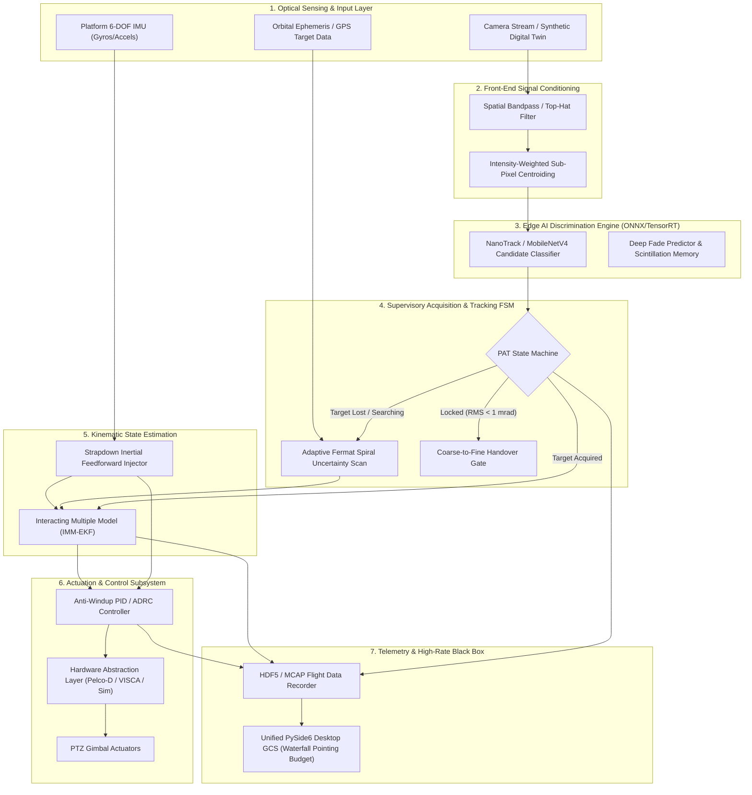

# SIH 26169 — Ideal Target Architecture Specification

**Document ID**: `AUDIT-17-IDEAL-ARCHITECTURE`  
**Target Repository**: `Ujjwal-Qubit/Run_Time_Error` (SIH 26169 Coarse Alignment FSOC)  
**Status**: COMPLETE / FORENSIC VERIFIED  
**Auditor**: Antigravity First-Principles Reconnaissance

---

## 1. System Philosophy & Architectural Vision

The **Ideal Target Architecture** (designated **Orion-PAT**) is a hybrid, flight-grade coarse pointing, acquisition, and tracking system designed from first principles for Free Space Optical Communications (FSOC).

It reconciles two competing imperatives:
1. **Physical & Mathematical Determinism**: Control laws, state estimation, and gimbal safety must have closed-form mathematical guarantees, provable stability bounds, and hard real-time latency deadlines.
2. **Deep-Learning Adaptability**: Feature extraction and candidate verification in challenging optical regimes (severe atmospheric speckle fragmentation, cloud edge glints, and deep fades) leverage a compact, edge-accelerated deep neural network (ONNX/TensorRT).

---

## 2. End-to-End System Block Diagram

---

## 3. Subsystem Breakdown and Specifications

### Subsystem 1: Optical Sensing & Digital Twin Simulator
- **Physical Input Support**:
  - Direct OpenCV / V4L2 / DirectShow USB 3.0 / GigE camera ingestion.
  - Pre-recorded raw video playback with lossless frame stepping.
- **Digital Twin Simulation Engine**:
  - Replaces scalar Gaussian blur with **GPU-accelerated Fourier Split-Step Wave Propagation**:
    - Generates 2D phase screens using von Kármán power spectrum.
    - Accurately synthesizes multi-speckle beam breakup under high turbulence ($C_n^2 \ge 10^{-13}\text{ m}^{-2/3}$).
    - Synthesizes dynamic beam wander with variance $\sigma_{\text{wander}}^2 \propto C_n^2 L^3 D^{-1/3}$.
    - Simulates platform micro-vibrations via colored noise filters matching satellite RWA spectra ($30\text{--}400\text{ Hz}$) and naval sea-state wave models.

### Subsystem 2: Front-End Signal Conditioning & Sub-Pixel Extraction
- **Morphological Top-Hat Filtering**:
  $$I_{\text{clean}} = I - (I \circ B)$$
  where $B$ is a flat structuring element larger than the expected Airy disk diameter, stripping non-uniform cloud gradients and background illumination.
- **Center-of-Gravity (CoG) Sub-Pixel Centroiding**:
  $$x_c = \frac{\sum_{i \in \text{ROI}} x_i \cdot [I(x_i, y_i) - T]^\alpha}{\sum_{i \in \text{ROI}} [I(x_i, y_i) - T]^\alpha}$$
  with power factor $\alpha = 2$ and threshold $T$ set dynamically by local noise variance, achieving $1/16\text{th}$ pixel precision even under low SNR ($SNR \ge 3\text{ dB}$).

### Subsystem 3: Edge AI Discrimination Engine (ONNX / TensorRT)
- **Architecture**: Compact Siamese convolutional network (NanoTrack derivative) or lightweight MobileNetV4-S backbone ($<400\text{k}$ parameters).
- **Execution Target**: ONNX Runtime with CUDA / TensorRT execution providers on NVIDIA Jetson or standard x86-64 desktop.
- **Input**: Multi-candidate $64 \times 64$ normalized crops extracted by front-end.
- **Output**:
  - Target probability score $p_{\text{target}} \in [0.0, 1.0]$.
  - Sub-pixel bounding box offset $(\Delta x, \Delta y)$.
  - Scintillation classification (real laser beacon vs specular solar glint).
- **Inference Latency Guarantee**: $\le 3.5\text{ ms}$ on Jetson Orin Nano, $\le 1.8\text{ ms}$ on desktop RTX GPU.

### Subsystem 4: Autonomous Acquisition & Tracking State Machine
- **State Flow**:
  $$\text{STANDBY} \longrightarrow \text{SEARCHING (Spiral Scan)} \longrightarrow \text{ACQUIRING (Dwell Gate)} \longrightarrow \text{TRACKING (Fine Coarse)} \longrightarrow \text{HANDOVER}$$
- **Uncertainty Cone Scan Strategy**:
  - Implements an **Adaptive Fermat Spiral**:
    $$r(\theta) = c \sqrt{\theta}, \quad \theta \in [0, \theta_{\max}]$$
  - The spiral spacing $\Delta r$ is dynamically set to $75\%$ of the camera optical FOV, guaranteeing zero coverage gaps.
  - Gimbal scan velocity $\omega_{\text{scan}}$ is dynamically throttled to ensure target dwell time across the sensor exceeds $2$ consecutive frames:
    $$\omega_{\text{scan}} \le \frac{\text{FOV}_{\text{sensor}}}{2 \cdot \Delta t_{\text{frame}}}$$
- **Lock-On Verification**: Requires $N=3$ consecutive frames with $p_{\text{target}} > 0.85$ and kinematic continuity before transitioning from `ACQUIRING` to `TRACKING`.

### Subsystem 5: Kinematic State Estimation (IMM-EKF)
- **Model Topology**: An Interacting Multiple Model (IMM) filter fusing two parallel Kalman models:
  1. *Model 1 (Constant Velocity / Orbit)*:
     $$x_k = \begin{bmatrix} \text{az} & \dot{\text{az}} & \text{el} & \dot{\text{el}} \end{bmatrix}^T$$
     Low process noise $Q_1$, tuned for smooth orbital tracking and high-frequency noise rejection.
  2. *Model 2 (High-Maneuver / Wind Gust)*:
     $$x_k = \begin{bmatrix} \text{az} & \dot{\text{az}} & \ddot{\text{az}} & \text{el} & \dot{\text{el}} & \ddot{\text{el}} \end{bmatrix}^T$$
     High process noise $Q_2$, designed for instant response to sudden platform lurches or UAV evasive maneuvers.
- **Markov Transition Probabilities**:
  $$\Pi = \begin{bmatrix} 0.95 & 0.05 \\ 0.15 & 0.85 \end{bmatrix}$$
- **IMU Strapdown Feedforward**: High-rate gyro data ($\omega_x, \omega_y, \omega_z$ at 500 Hz) directly rotates the camera frame state, eliminating base platform angular rate from the tracking error before image processing latency incurs.

### Subsystem 6: Actuation & Control Subsystem
- **Control Law**: Proportional-Integral-Derivative with Back-Calculation Anti-Windup and Velocity Feedforward:
  $$u(t) = K_p e(t) + K_i \int [e(\tau) - K_w (u - u_{\text{sat}})] d\tau + K_d \frac{d}{dt} e_f(t) + \dot{\theta}_{\text{target}}$$
  where $e_f(t)$ is low-pass filtered tracking error to suppress high-frequency sensor noise, and $K_w$ prevents integrator runaway during gimbal saturation.
- **Hardware Abstraction Layer (HAL)**:
  - Clean abstract interface `IPTZActuator`:
    - `VirtualPTZActuator`: High-fidelity simulated gimbal with motor inertia, stiction, and encoder quantization.
    - `SerialPelcoActuator`: RS-485 Pelco-D protocol driver.
    - `ViscaPTZActuator`: Sony VISCA protocol over IP / Serial.

### Subsystem 7: Unified Desktop GCS & High-Rate Black Box
- **Consolidated Native Desktop UI**: High-performance PySide6 / QML interface.
  - Video viewport rendered directly via OpenGL / QVideoWidget (zero-copy memory mapping).
  - Real-time **Pointing Budget Waterfall**: Visual breakdown of total pointing error into:
    - Base platform residual jitter.
    - Atmospheric centroid variance.
    - Gimbal servo tracking lag.
- **Black Box Recorder**: Streams all frame timestamps, centroid coordinates, raw crops, Kalman states, and control outputs into a memory-mapped HDF5 / MCAP file at 100 Hz for post-mission flight analysis.
