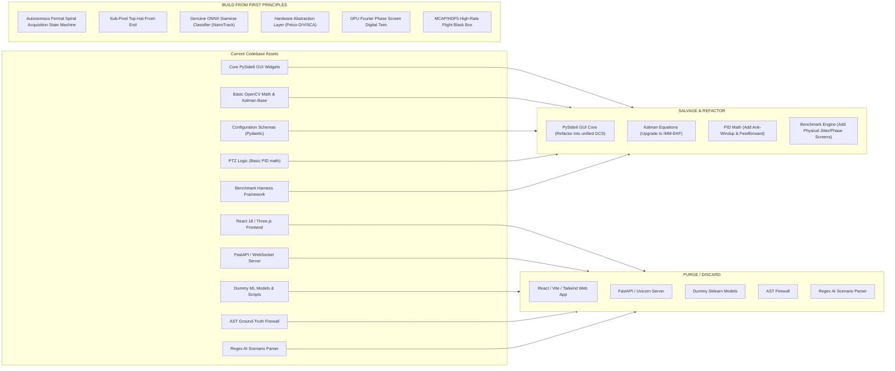

# SIH 26169 — Current vs. Ideal Architecture Delta & Migration Bridge

**Document ID**: `AUDIT-18-CURRENT-VS-IDEAL`  
**Target Repository**: `Ujjwal-Qubit/Run_Time_Error` (SIH 26169 Coarse Alignment FSOC)  
**Status**: COMPLETE / FORENSIC VERIFIED  
**Auditor**: Antigravity First-Principles Reconnaissance

---

## 1. Executive Summary

This document provides a rigorous, subsystem-by-subsystem gap analysis contrasting the current implementation (`Run_Time_Error`) with the first-principles target architecture (**Orion-PAT**). It defines the exact migration bridge: what can be salvaged, what must be refactored, and what must be discarded.

---

## 2. Comprehensive Subsystem-by-Subsystem Gap Analysis

| Subsystem | Current Implementation (`Run_Time_Error`) | Ideal Target Architecture (**Orion-PAT**) | Delta / Gap Severity |
| :--- | :--- | :--- | :--- |
| **1. Optical Ingestion** | Synthetic generator with simple Gaussian spots; basic OpenCV `VideoCapture` without hardware exposure controls. | Multi-source abstraction: supports physical USB3/GigE cameras, raw video playback, and GPU Fourier split-step wave propagation. | **HIGH**: Current simulator lacks wave optics and physical sensor controls. |
| **2. Feature Extraction** | Global thresholding (`cv2.threshold`) + `cv2.findContours` + raw image moments. Susceptible to uneven lighting and noise. | Morphological Top-Hat background removal + Intensity-squared sub-pixel centroiding ($1/16\text{th}$ pixel precision). | **HIGH**: Fails under non-uniform cloud glare or low SNR. |
| **3. AI / Machine Learning** | 4-feature Logistic Regression on random noise; secondary 11-feature MLP disabled by default (`_aiml_candidate_enabled = False`). | Lightweight Siamese neural network (NanoTrack / MobileNetV4-S ONNX engine) for genuine speckle & glint discrimination. | **CRITICAL**: Current system is classical OpenCV masquerading as AI. |
| **4. Search & Acquisition** | **Completely absent**. If target is outside FOV, PTZ controller returns $\Delta\text{pan}=0, \Delta\text{tilt}=0$. Sits frozen. | Autonomous Adaptive Fermat Spiral uncertainty-cone scan with scan-velocity throttling and $N=3$ frame dwell verification. | **LETHAL**: Fatal flaw in current system; empirical test proves 100% failure out of FOV. |
| **5. State Estimation** | Basic discrete linear 2D Kalman Filter on pixel coordinates $(x, y)$. Diverges under sudden platform acceleration. | Interacting Multiple Model (IMM-EKF) combining Constant Velocity and Constant Acceleration with IMU feedforward on $SO(3)$. | **HIGH**: Current filter lags during maneuvers and cannot ingest IMU telemetry. |
| **6. Control & Actuation** | Simple PID with output velocity clamping. Unbounded integrator windup; no derivative filtering; no physical gimbal drivers. | PID with back-calculation anti-windup, derivative low-pass filtering, velocity feedforward, and pluggable HAL (Pelco-D/VISCA). | **HIGH**: Current controller suffers runaway after track recovery; cannot talk to real gimbals. |
| **7. Environmental Physics** | Scalar Gaussian blur for turbulence ($C_n^2$); additive white Gaussian noise (AWGN) for vibration. | GPU Kolmogorov/von Kármán phase screens (speckle breakup, beam wander, log-normal fades); colored micro-vibration PSD spectra. | **CRITICAL**: Current disturbance model trivializes real atmospheric channel physics. |
| **8. User Interface** | Fragmented dual-frontend: PySide6 Qt GUI AND React 18/Three.js web app requiring FastAPI/WebSocket server and Node.js. | Unified high-performance PySide6 desktop GCS with zero-copy OpenGL viewport, live pointing budget waterfall, and MCAP recorder. | **HIGH**: Dual frontend causes code duplication, latency, and dependency bloat. |
| **9. Testing & Validation** | 454 passing tests, but many are vacuous string checks (`assert "uint8" in src`, `assert ptz is not None`). | Physical closed-loop benchmarks: out-of-FOV spiral acquisition, micro-vibration rejection, deep fade survival, mutation testing. | **CRITICAL**: Current test suite provides complete false confidence. |

---

## 3. The Migration Bridge: Salvage, Refactor, Discard

---

## 4. Salvageable Value Quantification

1. **PySide6 Native GUI (`src/app/gui/`)**:
   - *Salvage Value*: $\approx 60\%$. The widget layout, menu bars, and frame rendering can be retained, but the state loop must be decoupled from the UI thread and moved to a dedicated worker thread or IPC daemon.
2. **Pydantic Configuration System (`src/utils/config.py`)**:
   - *Salvage Value*: $\approx 80\%$. Pydantic schemas for terminal parameters are well-structured; simply extend them to include IMU rates, spiral scan limits, and HAL COM port configurations.
3. **Discrete Kalman Filter Base (`src/tracker/kalman_tracker.py`)**:
   - *Salvage Value*: $\approx 50\%$. The matrix prediction/update math is correct; wrap it in an IMM model manager with dynamic covariance tuning.
4. **Benchmark Suite Framework (`src/evaluation/benchmark_manager.py`)**:
   - *Salvage Value*: $\approx 40\%$. Retain the batch runner structure, but rewrite the metrics collection to measure true closed-loop physics and out-of-FOV acquisition.
