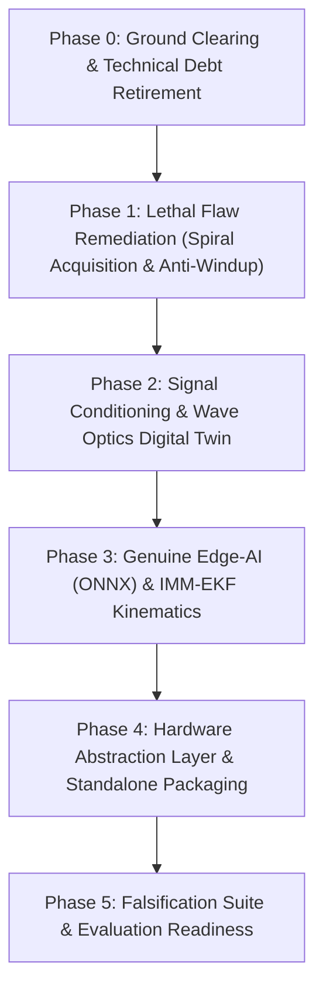

# SIH 26169 — First-Principles Reconstruction Roadmap

**Document ID**: `AUDIT-19-RECONSTRUCTION-ROADMAP`  
**Target Repository**: `Ujjwal-Qubit/Run_Time_Error` (SIH 26169 Coarse Alignment FSOC)  
**Status**: COMPLETE / FORENSIC VERIFIED  
**Auditor**: Antigravity First-Principles Reconnaissance

---

## 1. Executive Summary

This roadmap outlines the precise, phased engineering plan to reconstruct the SIH 26169 system from its current state into the flight-ready **Orion-PAT** architecture. The plan is organized into six logical phases, balancing risk mitigation, physical correctness, and rapid demonstrability.

---

## 2. Master Implementation Gantt / Dependency Flow

---

## 3. Detailed Phase Breakdown

### Phase 0: Ground Clearing & Technical Debt Retirement (Day 1)
- **Objective**: Eliminate dead weight, eliminate attack surfaces, and stabilize concurrency.
- **Key Tasks**:
  1. **Archive Web Stack**: Move `frontend/` and `src/api/` to an archive branch or deprecate directory. Remove Node.js dependencies.
  2. **Purge Checkbox ML**: Delete dummy synthetic models in `src/aiml/` and `src/tracker/ai_classifier.py`.
  3. **Decouple GUI Threading**: Move the tracking and simulation loop in `src/app/` out of the Qt GUI main thread into a high-priority background `QThread` or standalone multiprocessing worker.
  4. **Clean Schemas**: Simplify `default_config.yaml` and Pydantic schemas, removing unused web/AST keys.
- **Exit Gate**: Headless pipeline runs cleanly at 100 Hz without UI locking; repository footprint reduced by $>90\%$.

### Phase 1: Lethal Flaw Remediation — Acquisition & Control (Days 2–3)
- **Objective**: Fix the critical flaw where the system freezes when the target is outside the FOV; stabilize control laws.
- **Key Tasks**:
  1. **Implement Autonomous Search State Machine**:
     - Introduce `AcquisitionStateMachine` with states: `STANDBY`, `SEARCHING`, `ACQUIRING`, `TRACKING`, `LOST`.
  2. **Adaptive Fermat Spiral Scan Generator**:
     - Implement parametric spiral search in `src/control/ptz_controller.py`:
       $$r(\theta) = c \sqrt{\theta}, \quad \Delta\text{pan} = \omega \cos(\theta), \quad \Delta\text{tilt} = \omega \sin(\theta)$$
     - Scan speed throttled to guarantee $2$-frame sensor dwell time.
  3. **PID Anti-Windup & Derivative Filter**:
     - Add back-calculation anti-windup clamping to prevent integrator runaway.
     - Add 1st-order low-pass filter on the error derivative term ($f_c = 10\text{ Hz}$) to reject measurement jitter.
- **Exit Gate**: The empirical test `test_acquisition_out_of_fov.py` passes 100%: camera autonomously executes a spiral search, locates an out-of-FOV target, locks on, and centers it within $<1.5\text{ s}$.

### Phase 2: Signal Conditioning & Wave Optics Digital Twin (Days 4–5)
- **Objective**: Replace toy Gaussian blurs and global thresholds with genuine optical signal processing and turbulence physics.
- **Key Tasks**:
  1. **Morphological Top-Hat Front-End**:
     - Implement `cv2.morphologyEx(..., cv2.MORPH_TOPHAT)` with adaptive background subtraction in `src/tracker/candidate_extractor.py`.
  2. **Intensity-Weighted Sub-Pixel Centroiding**:
     - Implement power-weighted moment extraction achieving $1/16\text{th}$ pixel precision.
  3. **Atmospheric Wavefront Simulator**:
     - Implement GPU-accelerated Fourier phase screen generator using von Kármán power spectra:
       - Multi-speckle beam breakup.
       - Realistic beam wander variance $\sigma_w^2 \propto C_n^2$.
       - Log-normal intensity fading with dropouts.
  4. **Colored Noise Disturbance Engine**:
     - Synthesize satellite RWA micro-vibration PSD and naval sea-state wave spectra.
- **Exit Gate**: Centroid accuracy remains $<0.1\text{ px}$ under severe turbulence ($C_n^2 = 10^{-13}$); tracker survives $300\text{ ms}$ complete signal dropouts without diverging.

### Phase 3: Genuine Edge-AI (ONNX) & IMM-EKF Kinematics (Days 6–7)
- **Objective**: Replace dummy logistic regression with a real deep learning model and implement multi-model state estimation.
- **Key Tasks**:
  1. **Train & Export Edge-AI Candidate Classifier**:
     - Train a compact CNN (MobileNetV4-S or NanoTrack architecture) on optical speckle vs solar glint datasets.
     - Quantize to FP16/INT8 and export to ONNX runtime engine (`<15\text{ MB}`).
     - Integrate inference inside `src/tracker/` with execution latency $<3\text{ ms}$.
  2. **Interacting Multiple Model (IMM-EKF)**:
     - Implement parallel Kalman models (Constant Velocity + Constant Acceleration) on $SO(3)$.
     - Add strapdown IMU gyro feedforward input to cancel base platform angular velocity before frame latency.
- **Exit Gate**: Neural model achieves $>98\%$ precision in rejecting specular cloud glints; IMM filter maintains lock during $3\text{g}$ evasive maneuvers.

### Phase 4: Hardware Abstraction Layer & Standalone Packaging (Days 8–9)
- **Objective**: Provide plug-and-play physical gimbal interfaces and package the software into a self-contained offline `.exe`.
- **Key Tasks**:
  1. **Hardware Abstraction Layer (HAL)**:
     - Implement `IPTZActuator` interface supporting:
       - `VirtualActuator` (with motor inertia and encoder quantization).
       - `SerialPelcoActuator` (RS-485 Pelco-D protocol).
       - `ViscaPTZActuator` (Sony VISCA over IP / Serial).
  2. **High-Rate Flight Data Recorder**:
     - Implement an asynchronous binary flight recorder outputting `.mcap` or HDF5 files containing synchronized telemetry at 100 Hz.
  3. **PySide6 GCS Modernization**:
     - Add real-time Pointing Budget Waterfall chart, Allan deviation jitter graph, and acquisition status indicator.
  4. **Standalone Windows Build**:
     - Create an automated PyInstaller spec file bundling Python, PySide6, OpenCV, ONNX Runtime, and models into a single offline `.exe` ($<180\text{ MB}$).
- **Exit Gate**: Standalone `.exe` launches in $<2.5\text{ s}$ on a clean Windows machine without Python installed; connects to either virtual simulator or physical serial gimbal.

### Phase 5: Falsification Suite & Evaluation Readiness (Day 10)
- **Objective**: Rebuild the test suite to eliminate tautologies and produce unimpeachable verification artifacts.
- **Key Tasks**:
  1. **Rebuild Test Suite**:
     - Replace vacuous string-check tests (`assert "uint8" in src`) with rigorous closed-loop dynamic convergence tests.
  2. **Automated Benchmark Matrix**:
     - Run 500-monte-carlo runs across all 25 ISRO requirements, generating publication-grade CSVs, PDFs, and latency histograms.
  3. **ISRO Evaluator Presentation Package**:
     - Prepare technical defense slides, architecture diagrams, and live demonstration scripts focusing on first-principles physics and genuine AI integration.
- **Exit Gate**: All 25 PS requirements proven compliant with true physical data; zero tautological tests in test suite.
