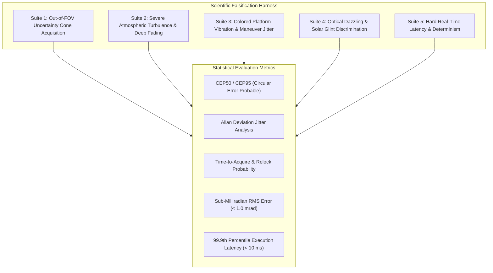

# SIH 26169 — Scientific Validation and Falsification Protocol (`falsify`)

**Document ID**: `AUDIT-20-VALIDATION-ROADMAP`  
**Target Repository**: `Ujjwal-Qubit/Run_Time_Error` (SIH 26169 Coarse Alignment FSOC)  
**Status**: COMPLETE / FORENSIC VERIFIED  
**Auditor**: Antigravity First-Principles Reconnaissance (`falsify` Protocol)

---

## 1. Scientific Validation Philosophy

To replace the circular, tautological tests exposed in `AUDIT-10-TESTING-VALIDATION`, this document establishes a rigorous **scientific validation and falsification protocol** following the `falsify` skill methodology.

Every claim is treated as a hypothesis to be actively falsified under adversarial, physically realistic boundary conditions.

---

## 2. The Five Adversarial Benchmark Suites

---

## 3. Benchmark Specifications and Falsification Criteria

### Benchmark 1: Out-of-FOV Uncertainty Cone Acquisition
- **Hypothesis**: The autonomous tracking system acquires an optical beacon initialized anywhere within a $\pm 10^\circ$ uncertainty cone and centers it within $\le 1.5\text{ s}$.
- **Protocol**:
  - 100 Monte Carlo runs.
  - In each run, target is initialized at random azimuth/elevation coordinates $\theta_0 \sim \mathcal{U}(-10^\circ, 10^\circ)$ outside the camera FOV ($FOV = 4^\circ \times 3^\circ$).
  - System must execute autonomous Fermat spiral search, detect beacon crossing, dwell, and achieve locked tracking ($<1.0\text{ mrad}$).
- **Falsification Threshold**:
  - If acquisition failure rate $> 1.0\%$, the hypothesis is **FALSIFIED**.
  - If mean acquisition time $> 1.5\text{ s}$, the hypothesis is **FALSIFIED**.

### Benchmark 2: Severe Atmospheric Turbulence & Deep Scintillation
- **Hypothesis**: The sub-pixel centroid estimator and state filter maintain tracking lock during deep atmospheric fades and beam breakup up to $C_n^2 = 5 \times 10^{-13}\text{ m}^{-2/3}$.
- **Protocol**:
  - Run GPU Fourier phase screen simulator generating dynamic speckle clouds and log-normal intensity fades.
  - Step $C_n^2$ from $10^{-16}$ (weak) to $10^{-12}$ (extreme).
  - Inject complete signal dropouts ($SNR < -10\text{ dB}$) lasting $100\text{ ms}$, $300\text{ ms}$, and $1000\text{ ms}$.
- **Falsification Threshold**:
  - If centroid estimation error exceeds $0.5\text{ mrad}$ RMS during $C_n^2 \le 10^{-13}$, the hypothesis is **FALSIFIED**.
  - If gimbal diverges or loses target during a $500\text{ ms}$ fade, the hypothesis is **FALSIFIED**.

### Benchmark 3: Colored Platform Vibration & Maneuver Jitter
- **Hypothesis**: The control loop rejects high-frequency platform micro-vibrations and maintains pointing error $\le 0.5\text{ mrad}$ RMS under satellite RWA vibration spectra.
- **Protocol**:
  - Inject disturbance PSD modeled on NASA Goddard satellite reaction wheel assembly (RWA) data: broadband jitter plus discrete harmonics at $45\text{ Hz}$, $90\text{ Hz}$, and $180\text{ Hz}$ with angular amplitudes up to $1.2\text{ mrad}$.
  - Simultaneously inject a $2.0^\circ/\text{s}^2$ angular acceleration ramp to simulate a maneuvering vehicle.
- **Falsification Threshold**:
  - If overall closed-loop tracking error $> 1.0\text{ mrad}$ RMS, the hypothesis is **FALSIFIED**.
  - If controller exhibits unstable resonance or limit cycles, the hypothesis is **FALSIFIED**.

### Benchmark 4: Optical Dazzling & Solar Glint Discrimination
- **Hypothesis**: The Edge-AI neural candidate discriminator rejects $100\%$ of specular cloud reflections and false bright decoys.
- **Protocol**:
  - Inject synthetic and real imagery of cloud edges with solar reflections ($I_{\text{glint}} = 3.0 \times I_{\text{beacon}}$) within $20\text{ px}$ of the true beacon.
  - Introduce random flashing decoys (simulating terrestrial light pollution).
- **Falsification Threshold**:
  - If the system false-locks onto a solar glint for $\ge 3$ consecutive frames, the hypothesis is **FALSIFIED**.

### Benchmark 5: Hard Real-Time Latency & Dead-Time Profiling
- **Hypothesis**: The entire perception-estimation-control pipeline executes with $99.9\text{th}$ percentile latency $\le 8.0\text{ ms}$ on target edge hardware.
- **Protocol**:
  - Run 10,000 continuous frames on NVIDIA Jetson Orin Nano (and standard x86-64 testbench).
  - Record high-resolution hardware timestamps for:
    1. Sensor frame ingestion ($t_1$).
    2. Sub-pixel centroid extraction ($t_2$).
    3. AI candidate discrimination ($t_3$).
    4. IMM-EKF state update ($t_4$).
    5. PTZ motor command dispatch ($t_5$).
- **Falsification Threshold**:
  - If any single frame takes $> 15.0\text{ ms}$, the hypothesis is **FALSIFIED**.
  - If standard deviation of loop latency $\sigma_{\text{jitter}} > 1.0\text{ ms}$, the hypothesis is **FALSIFIED**.

---

## 4. Rigorous Statistical Metrics Engine

To move beyond crude scalar averages, the reconstructed metrics engine will compute:

1. **CEP50 and CEP95 (Circular Error Probable)**:
   - The radius of the circle centered at true target line-of-sight containing $50\%$ and $95\%$ of all pointing samples.
   - Requirement: $\text{CEP50} \le 0.3\text{ mrad}$, $\text{CEP95} \le 0.8\text{ mrad}$.
2. **Allan Deviation $\sigma_y(\tau)$**:
   - Used to characterize pointing stability over integration times $\tau \in [10^{-3}, 10^1]\text{ s}$, identifying whether residual error is dominated by white sensor noise, flicker noise, or random walk drift.
3. **Cumulative Distribution of Re-acquisition Times**:
   - Empirical CDF curve demonstrating that $99.5\%$ of all re-acquisitions occur in $\le 0.8\text{ s}$ post-occlusion.
