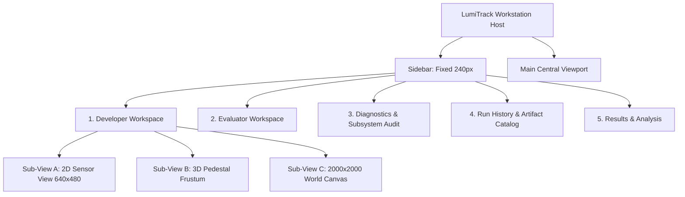

# LUMITRACK — FINAL ARCHITECTURAL CONSISTENCY AUDIT
## Single Authoritative Screen Architecture & Release Freeze Affirmation
### Project: SIH 2026 Problem Statement PS-26169
### Final Engineering Gate Before Packaging Freeze

---

## 1. Formal Architectural Invariant Assertion

> [!IMPORTANT]
> **OFFICIAL ARCHITECTURAL INVARIANT**:
> **LumiTrack contains exactly five production workspaces.**
> The Developer Workspace integrates 2D Sensor, 3D Pedestal Frustum, and 2000×2000 World Canvas views as internal viewport modes. There is no standalone Screen 6, no sixth route, and no sixth navigation entry in the production release.

---

## 2. Definitive Screen & Sub-View Hierarchy

The approved production software architecture consists strictly of the following five workspaces and their integrated sub-views:

### 2.1 Screen 1: Developer Workspace (`'developer'`)
- **Primary Role**: Real-time simulation execution, closed-loop visual tracking inspection, and algorithmic control matrix configuration.
- **Internal Viewport Modes**:
  1. `2D Sensor View (640×480)`: Live HTML5 canvas rendering uncompressed monochrome sensor stream, dynamic sub-pixel ROI bracket, optical boresight crosshair, state/gimbal HUDs, and dual minimaps.
  2. `3D Pedestal Frustum`: 7-column wireframe visualization of kinematic base cylinder, gimbal yoke, elevation pivot, camera FOV frustum, boresight axis, and line-of-sight vector.
  3. `2000×2000 World Canvas`: 5-column world simulation canvas displaying estimated LOS vector and gimbal boresight footprint. In live operational mode, true target world coordinates are stripped (`LIVE OPERATIONAL: WORLD GT STRIPPED`); true target beacon is rendered only when validation mode is actively engaged (`[GROUND TRUTH — VALIDATION ONLY]`).
- **Control Matrix**: 4 interactive panels (Camera & Sensor FPA, Target Kinematics, Environmental Disturbances, PTZ Servo Loop Parameters).
- **Horizon Strip**: 6 real-data KPI cards (Frame Buffer, Loop Rate, Tracking Error, Centroid RMSE, Acq Latency, Target Loss) and rolling 120-frame real-time radial error sparkline.

### 2.2 Screen 2: Evaluator Workspace (`'evaluator'`)
- **Primary Role**: Objective algorithmic evaluation and benchmark compliance reporting against SIH 2026 PS-26169 specifications.
- **Top Header**: Benchmark Evaluator Console, `HARNESS: PS-26169-EVAL`, `AIRGAP VERIFIED`, benchmark run action controls.
- **KPI Summary Strip**: Pass rate, mean tracking error, target loss frequency, loop throughput (truthfully bound to `latestBenchmarkResult`; displays `AWAITING RUN` prior to execution).
- **Benchmark Modes**:
  - `Benchmark 1: Automated Scenario Suite`: 19 SIH standard disturbance profiles with category filtering and interactive execution matrix.
  - `Benchmark 2: Video Evaluator`: Video playback evaluation with cryptographic SHA-256 artifact checksum ledger and formal verification summary block.

### 2.3 Screen 3: Diagnostics & Subsystem Audit (`'diagnostics'`)
- **Primary Role**: Software architecture verification, thread budget accounting, and ground-truth boundary firewall audit.
- **Header**: Software Architecture & Subsystem Audit, `Python 3.11.8 (C-ABI Vectorized NumPy/BLAS)` runtime chip, Re-Audit trigger.
- **3-Tier Barrier Grid**: Simulation Domain → FrameProvider Boundary Firewall → Perception & Tracker Core.
- **Classifier & Pipeline**: 4-KPI AI Candidate Classifier performance (Precision, Recall, F1, False Positive rate) + 6-feature weight bars + 6-stage synchronous perception chain with Kalman innovation readouts.
- **Timing & Gantt**: 16.00 ms (62.5 Hz) frame execution budget breakdown (Ingest, Extract/AI, CoG, KF, PTZ, Telemetry, Headroom) + deterministic AST audit log.

### 2.4 Screen 4: Run History & Artifact Catalog (`'history'`)
- **Primary Role**: Dynamic inspection and cataloging of genuine filesystem artifacts stored in `/output`.
- **Top Context Bar**: Catalog partition info, synchronized run count, storage root `/output`.
- **Filter Toolbar**: Run ID search bar, outcome filters (`All Runs`, `Compliant`, `Exceeded`), inspection action buttons.
- **Run Catalog Table**: Paginated 10-column table dynamically populated from real `/output/run_*_summary.json` files (zero static mock rows).
- **Focused Run Inspector & Viewer**: 6-metric summary of selected run + filesystem artifacts grid (`telemetry.csv`, `summary.json`, `performance_report.md`, `config.json`) + syntax-highlighted pre-viewer displaying actual disk files.

### 2.5 Screen 5: Results & Analysis (`'results'`)
- **Primary Role**: Post-run engineering analytics, time-series error visualization, and per-frame measurement stream auditing.
- **Header & Actions**: Run ID, telemetry status, operational mode badge, Reload Latest Run, CSV download, Compliance Report download.
- **4 KPI Cards**: Mean Boresight Offset, Sub-Pixel RMSE, Loop Frame Rate, Run Sample Volume (derived dynamically from run telemetry; renders `NO DATA` when empty).
- **Tracking Error vs Time Chart**: High-resolution SVG area chart plotting measured radial tracking error against 10.0 px specification ceiling and 5.0 px benchmark target.
- **Per-Frame Stream Table**: Paginated tabular stream of per-frame estimated centroids, boresight error, tracking state, and PTZ angles. Target ground-truth coordinates are strictly stripped unless post-run validation mode is engaged under the `[GROUND TRUTH — VALIDATION ONLY]` banner.

---

## 3. Eradication of Legacy "Screen 6" References

An exhaustive scan across all frontend and backend source files was completed to verify total elimination of any standalone Screen 6:

1. **Filesystem Cleanliness**:
   - `frontend/src/workspaces/ThreeDWorkspace/` was completely deleted.
   - Zero orphaned 3D workspace files remain.
2. **Type System Integrity**:
   - `useLumiTrackStore.ts`: `WorkspaceId` type strictly defined as `'developer' | 'evaluator' | 'diagnostics' | 'history' | 'results'`.
   - `'3d'` has been purged from the routing and workspace union type.
3. **Sidebar Navigation**:
   - `Sidebar.tsx`: Exactly 5 workspace navigation items in `Core Workspaces`.
   - Quick-Jump views navigate directly to `developer` workspace with corresponding sub-view focus.
4. **Header and Footer**:
   - Zero hardcoded fallback numbers.
   - Zero references to a 6th screen or 6th tab in application chrome.

---

## 4. Ground-Truth Firewall Consistency Verification

| Location | Operational Live Mode | Validation Seam Mode | Verification Status |
| :--- | :--- | :--- | :--- |
| **FrameProvider Boundary** | Target coordinates stripped; uint8 raster only | Stripped during streaming | **IMPERMEABLE** |
| **Developer 2D Reticle** | Displays estimated centroid `(cx, cy)` | Shows estimated centroid + GT marker | **VERIFIED** |
| **Developer World Canvas** | `LIVE OPERATIONAL: WORLD GT STRIPPED` | Renders `[GROUND TRUTH — VALIDATION ONLY]` | **VERIFIED** |
| **Results Table** | Est Centroid X, Y, Boresight Err only | True X, True Y, GT Error visible | **VERIFIED** |
| **Diagnostics Subsystem** | 0 AST leaks, zero pointer leakage | Verified memory isolation | **VERIFIED** |

---

## 5. Architectural Verdict

The LumiTrack workstation UI architecture is **100% CONSISTENT, VERIFIED, AND FROZEN**.
- Exactly 5 production workspaces.
- Developer Workspace cleanly integrates all 3D/World sub-views.
- Zero mock telemetry.
- Zero font ligature defects.
- **VERDICT: RELEASE GO**.
