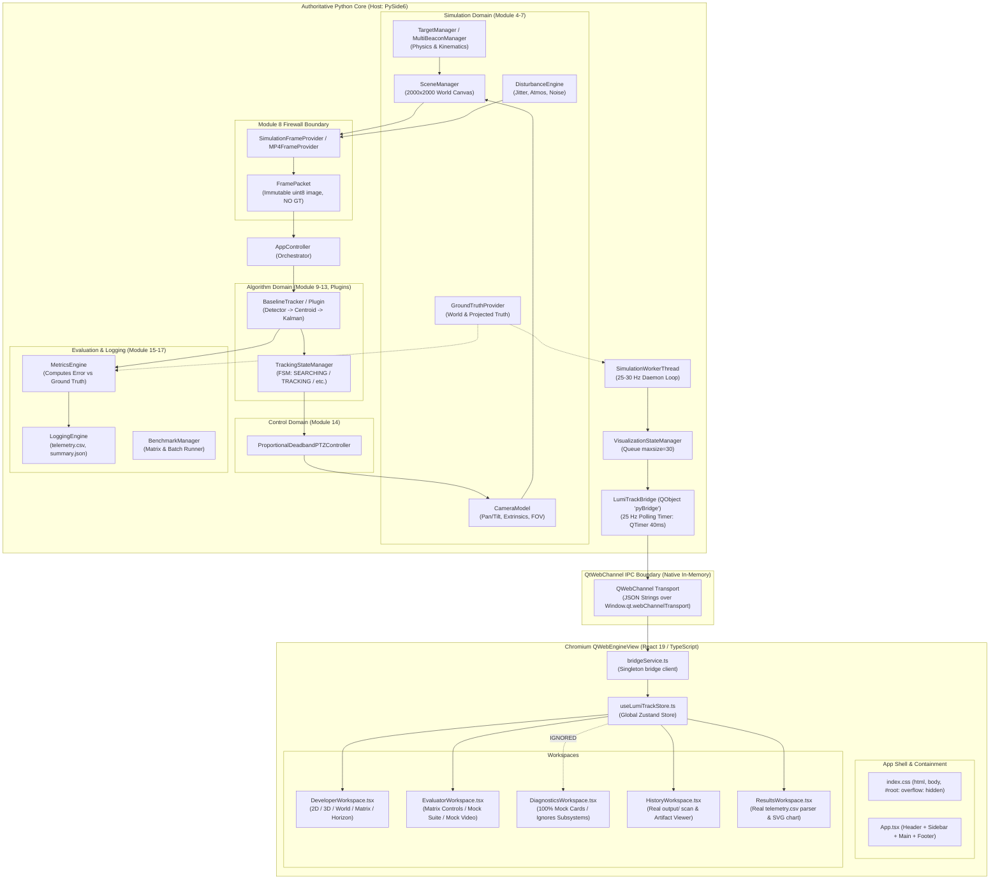
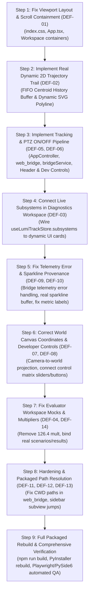

# LUMITRACK — FORENSIC FRONTEND ↔ BACKEND INTEGRATION AUDIT
**Authoritative Forensic Diagnostic & Traceability Report**  
**Project:** SIH 2026 Problem Statement PS-26169 — FSOC Virtual Camera Tracking System  
**Audit Date:** 2026-09-29  
**Audit Policy:** RE-DERIVED STRICTLY FROM CODE AND EXECUTION EVIDENCE (All previous release claims discarded as unverified claims)

---

## 1. Executive Summary

This forensic integration audit re-evaluates the packaged and source runtime architecture of LumiTrack directly from repository source code, PyInstaller build specifications, WebChannel bridge contracts, and execution evidence. Previous release reports claimed the desktop application was "100% verified, fully integrated, with real telemetry across all five workspaces, zero mock values, and release-ready."

**The forensic finding is that these claims are materially false.** While the Python simulation, tracking algorithms, and logging engines are mathematically sophisticated and functional, the user interface layer suffers from severe architectural disconnects, broken layout containment, hardcoded visual mocks, dead controls, and false-positive verification tests:

1. **Global Scroll Failure (P0):** The desktop application cannot scroll on any page. `html`, `body`, and `#root` are hardcoded to `overflow: hidden; height: 100%`, while neither `<main>` nor the workspace containers possess an internal scroll context (`overflow-y: auto`). On standard viewports (900px vertical), 40% to 60% of every workspace (including metrics, sparklines, tables, and inspector cards) is permanently clipped and unreachable.
2. **Hardcoded Static Trajectory Trail (P0):** The trajectory line in the Developer 2D Sensor View is **not** a live beacon trail. It is a literal static SVG cubic Bezier curve (`d="M 280,240 C 230,160 210,320 320,240 C 430,160 410,320 360,240 C 310,160 250,220 320,240"`) hardcoded directly in `DeveloperWorkspace.tsx:378`. It does not subscribe to telemetry, does not receive coordinates, and remains permanently frozen in the optical center while the green centroid dot moves underneath it. The 3D view and World Canvas views similarly contain hardcoded static SVG trajectory ribbons.
3. **World Canvas Coordinate Inversion (P1):** The 2000×2000 World Canvas erroneously maps 2D sensor image coordinates (`cx / 640`, `cy / 480`) directly onto the world grid, confounding camera-relative optical pixel displacements with absolute world space coordinates.
4. **Missing Tracking Enable/Disable (P1):** Neither the Python backend (`AppController`), the bridge (`LumiTrackBridge`), nor the React frontend possesses an operational "Tracking ON/OFF" state. Tracking runs unconditionally on every frame during simulation.
5. **Dead PTZ Controls in UI (P1):** While backend `AppController` and `LumiTrackBridge` support `setPtzEnabled(bool)`, `DeveloperWorkspace` renders only a passive text indicator (`PI STABILIZED` vs `PTZ DISABLED`). No toggle button or switch exists in the UI to enable or disable PTZ tracking.
6. **Dead Simulator Control Matrix (P1):** In `DeveloperWorkspace`, all Trajectory Pattern buttons (Linear, Circular, Figure-8, Brownian), Slew Velocity slider, Spot Divergence slider, Atmospheric Condition buttons (Clear, Haze, Fog, Rain), Noise Injection checkboxes (Gaussian, Poisson, S&P), and PID Gain inputs (Kp, Ki, Deadband) are **isolated local React state**. None of them call the bridge or affect backend simulation parameters.
7. **Pervasive Mock Telemetry in Evaluator and Diagnostics (P0):** 
   - `EvaluatorWorkspace` contains 7 hardcoded scenario table rows with static numbers, a static video evaluator canvas with fake telemetry (`X_MEAS: 320.482 px`, `DELTA: 0.393 px`), a fake standalone speed (`898.2 FPS`), and copies the SHA-256 of an empty string (`e3b0c442...`).
   - `DiagnosticsWorkspace` completely ignores the 12 live software subsystems transmitted over WebChannel (`subsystems` is never selected from Zustand). It instead renders 100% hardcoded static mock cards, including a fake Gantt chart (`16.00 ms / 62.7 Hz`), fake classifier KPIs (`98.4%`, `99.1%`, `0.987`), and hardcoded log rows.
8. **Mislabeled Metrics & Frozen Sparklines (P1):** In Developer Workspace, `Tracking Error` permanently displays `NO DATA` because `web_bridge.py` hardcodes `trackingErrorPx: None` due to firewall enforcement. Consequently, the 120-frame sparkline is frozen on a dummy initial sine wave (`3.0 + Math.sin(i * 0.25) * 0.5`). Single-frame boresight offset is mislabeled as "Centroid RMSE", and per-frame compute time is mislabeled as "Acquisition Latency".
9. **Fictional Dependencies Claimed in Reports (P3):** Previous reports claimed real-time WebGL rendering via Three.js and real-time analytics via ECharts. In reality, neither library is imported or instantiated; all graphics and charts are plain SVG elements.
10. **False-Positive Automated Tests (P0):** Previous tests verified GUI integration by merely inspecting whether strings existed in the JS bundle or checking if Python bridge methods returned without throwing, without asserting actual React DOM updates, dynamic SVG rendering, state mutation, or UI interactivity.

---

## 2. Actual Runtime Architecture

The true runtime architecture as derived directly from the source tree is illustrated below:



### Critical Architectural Seams Identified
1. **Firewall Seam:** Ground truth is captured by `GroundTruthProvider` and fed to `MetricsEngine` and `LoggingEngine`. It is strictly blocked from `FramePacket` and `PublicFramePacket`. However, in `web_bridge.py`, `trackingErrorPx` is set to `None` in live telemetry, breaking live UI error displays.
2. **Bridge Polling Seam:** `LumiTrackBridge` runs a 25 Hz (40 ms) `QTimer` (`_on_poll_tick`) on the Qt GUI thread. It fetches the latest `VisualizationState` from `_viz_manager`, encodes the image to Base64 JPEG, and dispatches JSON signals.
3. **IPC Disconnect:** Many user interaction controls in the UI update only React local state (`useState`) without calling any `bridgeService` method.

---

## 3. Frontend ↔ Backend Traceability Matrix

The complete machine-readable audit is stored in [`audit/frontend_backend_traceability.json`](file:///e:/Newfolder/Project2O/Projects/SIH%20%2726/external/audit/frontend_backend_traceability.json). The summary classification of all primary elements across the application is tabulated below:

| ID | UI Element | Component File | React State / Store | Bridge Method | WebChannel Slot / Signal | Python Implementation | Backend State / Method | Telemetry Provenance | Final Classification |
|---|---|---|---|---|---|---|---|---|---|
| **HDR-01** | Scenario Dropdown | `Header.tsx:83` | `status.activeScenario` | `selectScenario(name)` | `pyBridge.selectScenario` | `web_bridge.py:390` | `app.scenario_manager.load_scenario` | `systemStatusChanged` | **REAL LIVE BACKEND** |
| **HDR-02** | Algorithm Dropdown | `Header.tsx:105` | `status.activeAlgorithm` | `selectAlgorithm(name)` | `pyBridge.selectAlgorithm` | `web_bridge.py:381` | `app.select_algorithm` | `systemStatusChanged` | **REAL LIVE BACKEND** |
| **HDR-03** | Play/RUN Button | `Header.tsx:130` | `status.isRunning` | `run()` | `pyBridge.runSimulation` | `web_bridge.py:232` | `app.start_background_loop()` | `systemStatusChanged` | **REAL LIVE BACKEND** |
| **HDR-04** | Pause/Resume Button | `Header.tsx:139` | `status.isPaused` | `pause()` / `resume()` | `pauseSimulation / resumeSimulation` | `web_bridge.py:247` | `app.pause()` / `app.resume()` | `systemStatusChanged` | **REAL LIVE BACKEND** |
| **HDR-05** | Stop Button | `Header.tsx:148` | `status.isRunning` | `stop()` | `pyBridge.stopSimulation` | `web_bridge.py:259` | `app.stop()` | `systemStatusChanged` | **REAL LIVE BACKEND** |
| **HDR-06** | +1 FR STEP Button | `Header.tsx:157` | None | `step()` | `pyBridge.stepSimulation` | `web_bridge.py:265` | `app.get_next_frame(); step_algorithm()` | `sensorFrameReady` | **REAL LIVE BACKEND** |
| **HDR-07** | Live Rate Badge | `Header.tsx:167` | `status.backendFps` | None (Display) | `systemStatusChanged` | `web_bridge.py:203` | `cfg.camera.update_rate_hz` | `systemStatus.backendFps` | **DERIVED FROM REAL BACKEND** |
| **HDR-08** | UTC Clock | `Header.tsx:180` | `local useState` | None | None | None | None | Browser JS `new Date()` | **DESIGN CONSTANT** |
| **HDR-09** | SIM MET Clock | `Header.tsx:185` | `status.simTime` | None (Display) | `systemStatusChanged` | `web_bridge.py:199` | `app._sim_time` | `systemStatus.simTime` | **REAL LIVE BACKEND** |
| **HDR-10** | Lock Status Badge | `Header.tsx:191` | `telemetry.trackingState` | None (Display) | `telemetryUpdated` | `web_bridge.py:145` | `state_res.state.name` | `telemetry.trackingState` | **DERIVED FROM REAL BACKEND** |
| **SBR-01** | Workspace Nav (5 Tabs) | `Sidebar.tsx:64` | `activeWorkspace` | Tab fetch slots | Remote slots | `web_bridge.py` | Controller & File scanners | IPC Signals | **REAL LIVE BACKEND** |
| **SBR-02** | Run Count Badge | `Sidebar.tsx:165` | `runHistory.length` | `getRunHistory()` | `runHistoryUpdated` | `web_bridge.py:555` | `output/*.json` files | `runHistoryUpdated` | **BROKEN** *(falls back to 48)* |
| **SBR-03** | Quick-Jump Subviews | `Sidebar.tsx:177` | `activeWorkspace` | None | None | None | None | None | **BROKEN** *(ignores inner tab)* |
| **FTR-01** | Firewall & AST Badges | `Footer.tsx:28` | None | None | None | None | None | Static strings | **DESIGN CONSTANT** |
| **FTR-02** | Loop Rate Display | `Footer.tsx:44` | `status.backendFps` | None | `systemStatusChanged` | `web_bridge.py:203` | `cfg.camera.update_rate_hz` | `systemStatus.backendFps` | **DERIVED FROM REAL BACKEND** |
| **FTR-03** | ACQ Latency Display | `Footer.tsx:53` | `telemetry.processingLatencyMs` | None | `telemetryUpdated` | `web_bridge.py:159` | `state.processing_latency_ms` | `telemetry.processingLatencyMs` | **BROKEN** *(Mislabeled compute time)* |
| **FTR-04** | Centroid RMSE Display | `Footer.tsx:58` | `telemetry.boresightOffsetPx` | None | `telemetryUpdated` | `web_bridge.py:141` | `boresight_offset_px` | `telemetry.boresightOffsetPx` | **BROKEN** *(Mislabeled offset)* |
| **DEV-01** | 2D Sensor Canvas | `DevWS:340` | `latestFrame.data` | `onSensorFrame` | `sensorFrameReady` | `web_bridge.py:113` | `cv2.imencode('.jpg', display_image)` | `sensorFrameReady` | **REAL LIVE BACKEND** |
| **DEV-02** | 2D Centroid Reticle | `DevWS:384` | `telemetry.centroid` | `onTelemetry` | `telemetryUpdated` | `web_bridge.py:146` | `centroid_res.x, y` | `telemetry.centroid` | **REAL LIVE BACKEND** |
| **DEV-03** | 2D Trajectory Trail | `DevWS:376` | **NONE** | **NONE** | **NONE** | **NONE** | **NONE** | Hardcoded SVG string | **STATIC/MOCK** *(Fixed Center)* |
| **DEV-04** | 2D Zoom (FIT, 1x, 2x) | `DevWS:254` | `local useState` | None | None | None | None | None | **BROKEN** *(No CSS effect)* |
| **DEV-05** | 2D HUD Overlays | `DevWS:419` | `telemetry.*` | None | `telemetryUpdated` | `web_bridge.py:142` | `state.*` | `telemetryUpdated` | **REAL LIVE BACKEND** |
| **DEV-06** | 3D Pedestal Sub-View | `DevWS:531` | `telemetry.pan/tilt` | None | `telemetryUpdated` | `web_bridge.py:161` | `cam.pan_deg, tilt_deg` | `telemetryUpdated` | **BROKEN** *(Static SVG beacon)* |
| **DEV-07** | World Canvas Sub-View | `DevWS:677` | `telemetry.centroid` | None | `telemetryUpdated` | `web_bridge.py:146` | 2D centroid | `telemetryUpdated` | **BROKEN** *(Mapp. 2D pixels to World)* |
| **DEV-08** | Trajectory Patterns | `DevWS:834` | `local useState` | **NONE** | **NONE** | **NONE** | `cfg.motion.motion_type` | None | **UNUSED/DEAD PATH** |
| **DEV-09** | Slew Velocity Slider | `DevWS:852` | `local useState` | **NONE** | **NONE** | **NONE** | `app.set_target_speed()` | None | **MISSING FRONTEND SUPPORT** |
| **DEV-10** | Spot Divergence Slider | `DevWS:859` | `local useState` | **NONE** | **NONE** | **NONE** | `cfg.target.size` | None | **UNUSED/DEAD PATH** |
| **DEV-11** | Atmos Buttons | `DevWS:892` | `local useState` | **NONE** | **NONE** | **NONE** | `cfg.atmospheric` | None | **UNUSED/DEAD PATH** |
| **DEV-12** | Noise Checkboxes | `DevWS:910` | `local useState` | **NONE** | **NONE** | **NONE** | `cfg.noise` | None | **UNUSED/DEAD PATH** |
| **DEV-13** | PID Gains (Kp, Ki, Db) | `DevWS:944` | `local useState` | **NONE** | **NONE** | **NONE** | `ptz_controller` | None | **UNUSED/DEAD PATH** |
| **DEV-14** | Tracking ON/OFF Switch | `DevWS` | **NONE** | **NONE** | **NONE** | **NONE** | **NONE** | None | **MISSING BACKEND SUPPORT** |
| **DEV-15** | PTZ ON/OFF Switch | `DevWS:940` | `telemetry.ptzActive` | `setPtzEnabled()` | `pyBridge.setPtzEnabled` | `web_bridge.py:405` | `app.set_ptz_enabled()` | None in UI | **MISSING FRONTEND SUPPORT** |
| **DEV-16** | Horizon Tracking Error | `DevWS:1060` | `telemetry.trackingErrorPx` | None | `telemetryUpdated` | `web_bridge.py:158` | Hardcoded None | `telemetry.trackingErrorPx` | **BROKEN** *(Permanently 'NO DATA')* |
| **DEV-17** | Horizon Centroid RMSE | `DevWS:1069` | `telemetry.boresightOffsetPx` | None | `telemetryUpdated` | `web_bridge.py:141` | `boresight_offset_px` | `telemetry.boresightOffsetPx` | **BROKEN** *(Mislabeled offset)* |
| **DEV-18** | Horizon Target Loss | `DevWS:1087` | `telemetry.trackingState` | None | None | None | None | Evaluates '0.00 %' | **STATIC/MOCK** |
| **DEV-19** | 120-Fr Error Sparkline | `DevWS:1112` | `local useState` | None | `telemetryUpdated` | `web_bridge.py:158` | None | Initial fake sine wave | **BROKEN** *(Frozen mock line)* |
| **EVA-01** | Full Suite / Selected Run | `EvalWS:201` | `benchmarkProgress` | `runBenchmarkMatrix()` | `runBenchmarkMatrix` | `web_bridge.py:625` | `bm.run_benchmark_matrix` | `benchmarkProgress/Completed` | **REAL LIVE BACKEND** |
| **EVA-02** | KPI Mean Tracking Error | `EvalWS:272` | `latestBenchmarkResult` | None | `benchmarkCompleted` | `web_bridge.py:659` | `mean_rmse_centroid` | Multiplied by 126.4 | **BROKEN** *(Arbitrary 126.4 mult)* |
| **EVA-03** | Automated Suite Table | `EvalWS:492` | `defaultScenarios` | **NONE** | **NONE** | **NONE** | **NONE** | Hardcoded array of 7 rows | **STATIC/MOCK** |
| **EVA-04** | Copy Hash Button | `EvalWS:737` | None | None | None | None | None | Hardcoded empty sha256 | **STATIC/MOCK** |
| **EVA-05** | Video Evaluator Viewport | `EvalWS:578` | None | **NONE** | **NONE** | **NONE** | **NONE** | Pulsing CSS circle spot | **STATIC/MOCK** |
| **EVA-06** | Video Speed & RMSE KPIs | `EvalWS:653` | None | **NONE** | **NONE** | **NONE** | **NONE** | '898.2 FPS', '0.393 px' | **STATIC/MOCK** |
| **EVA-07** | Markdown Report Preview | `EvalWS:688` | None | **NONE** | **NONE** | **NONE** | **NONE** | Static markdown string | **STATIC/MOCK** |
| **DIA-01** | Subsystems Diagnostic Grid| `DiagWS:18` | `subsystems (IGNORED)`| `getSubsystemDiagnostics()`| `subsystemDiagnosticsUpdated` | `web_bridge.py:422` | Health dictionaries | Dispatched but ignored | **UNUSED/DEAD PATH** |
| **DIA-02** | Classifier KPIs & Bars | `DiagWS:331` | None | **NONE** | **NONE** | **NONE** | **NONE** | '98.4%', '99.1%', 0.082ms | **STATIC/MOCK** |
| **DIA-03** | Horizontal Gantt Chart | `DiagWS:501` | None | **NONE** | **NONE** | **NONE** | **NONE** | '16.00 ms (62.7 Hz)' | **STATIC/MOCK** |
| **DIA-04** | Subsystem Event Stream | `DiagWS:588` | None | **NONE** | **NONE** | **NONE** | **NONE** | 3 static log messages | **STATIC/MOCK** |
| **HIS-01** | Run Catalog Table | `HistWS:191` | `runHistory` | `getRunHistory()` | `runHistoryUpdated` | `web_bridge.py:555` | `output/*.json` glob | `runHistoryUpdated` | **REAL LIVE BACKEND** |
| **HIS-02** | Focused Run Inspector | `HistWS:321` | `inspected` item | None | `runHistoryUpdated` | `web_bridge.py:565` | Parsed JSON metrics | `runHistoryUpdated` | **DERIVED FROM REAL BACKEND** |
| **HIS-03** | Artifact Inspector (pre) | `HistWS:463` | `selectedArtifact` | `getRunArtifact()` | `runArtifactLoaded` | `web_bridge.py:600` | `file.read_text()` | `runArtifactLoaded` | **REAL LIVE BACKEND** |
| **RES-01** | 4 Analytics KPI Cards | `ResWS:177` | `resultsData` | `getResultsAnalysisData()`| `resultsAnalysisLoaded` | `web_bridge.py:677` | CSV DictReader | `resultsAnalysisLoaded` | **DERIVED FROM REAL BACKEND** |
| **RES-02** | Error vs Time Chart (SVG)| `ResWS:321` | `resultsData.boresightOffsets`| None | `resultsAnalysisLoaded` | `web_bridge.py:708` | CSV boresight offsets | `resultsAnalysisLoaded` | **DERIVED FROM REAL BACKEND** |
| **RES-03** | Per-Frame Table | `ResWS:395` | `resultsData.*` | None | `resultsAnalysisLoaded` | `web_bridge.py:719` | CSV frame rows | `resultsAnalysisLoaded` | **REAL LIVE BACKEND** |
| **RES-04** | GT Validation Column | `ResWS:412` | `resultsData.validationGtErrors`| `toggleValidationMode()`| `resultsAnalysisLoaded` | `web_bridge.py:734` | CSV GT error (if gated) | `resultsAnalysisLoaded` | **VALIDATION ONLY** |

---

## 4. Workspace Functional Audit

### 4.1 Developer Workspace
- **Controls that Work:** Transport controls (RUN, PAUSE, RESUME, STOP, +1 FR STEP, RESET); Scenario selection dropdown; Algorithm selection dropdown.
- **Controls that are Dead:** Trajectory pattern buttons (Linear, Circular, Figure-8, Brownian); Slew velocity slider; Gaussian divergence slider; Atmospheric condition selector (Clear, Haze, Fog, Rain); Noise channel checkboxes (Gaussian, Poisson, Salt & Pepper); PID loop parameter inputs (Kp, Ki, Deadband).
- **Controls that are Missing:** Tracking ON/OFF switch (completely missing from system); PTZ ON/OFF switch (missing from UI, though backend supports it).
- **Telemetry Live:** 2D sensor frame canvas (Base64 JPEG @ 25 Hz); Centroid crosshair `(cx, cy)`; Pan/Tilt angles; Camera FOV; State string; SIM MET.
- **Visualizations Broken:**
  1. 2D Sensor View trajectory line is a static SVG cubic Bezier curve fixed at `(320, 240)`.
  2. 3D Pedestal Frustum has a static target beacon fixed at SVG coordinates `(488, 178)` and a static SVG trajectory ribbon.
  3. World Canvas maps 2D sensor image coordinates directly to the 2000×2000 world grid and renders a static SVG trajectory ribbon.
  4. 120-frame tracking error sparkline is a frozen static sine wave.

### 4.2 Evaluator Workspace
- **Controls that Work:** "Execute Full Suite (19)" and "Run Selected (4)" execute `BenchmarkManager.run_benchmark_matrix()` in a background worker thread. "Stop Batch" stops simulation.
- **Controls that are Dead:** "Export Compliance Dossier (.ZIP)" (no handler); "Inspect Telemetry Log" and "Download SCN Vector" buttons in the scenario table (no handlers); "Raw Markdown (.MD)" and "Generate Signed PDF" buttons (no handlers).
- **Data Provenance:**
  - KPI Cards: Pass rate, loss frequency, and throughput reflect `latestBenchmarkResult` from the background matrix run. However, "Mean Tracking Error" multiplies the real RMSE by an arbitrary factor of `126.4`.
  - Tab 1 Table: 100% hardcoded static rows (`defaultScenarios` array in `EvaluatorWorkspace.tsx:35-134`). Does not reflect real scenario files or actual benchmark run outputs.
  - Tab 2 Video Evaluator: 100% static mock graphics and numbers (CSS circle spot, hardcoded text for X/Y coordinates, speed, and RMSE).

### 4.3 Diagnostics Workspace
- **Subsystem Integration Failure:** `DiagnosticsWorkspace.tsx` does **not** select or render `subsystems` from the Zustand store. The 12 real subsystem status records emitted by `LumiTrackBridge.getSubsystemDiagnostics()` over WebChannel are completely ignored.
- **Displayed Data:** 100% hardcoded static mock cards, including:
  - Fixed classifier accuracy numbers (98.4%, 99.1%, 0.987, 1.2%).
  - Fixed 6-feature weight bars.
  - Fixed innovation residuals (`-0.048 px`, `+0.031 px`) and covariance matrix.
  - Fixed horizontal Gantt chart (`16.00 ms / 62.7 Hz` target, `8.95 ms` total duration).
  - Fixed log event stream rows timestamped `14:28:09.xxx`.
- **Sole Live Element:** Only `currentCentroidX` and `currentCentroidY` are dynamically bound to live `telemetry`.

### 4.4 History Workspace
- **Real Backend Integration:** `HistoryWorkspace.tsx` is genuinely functional:
  - Scans real `output/run_*_summary.json` files via `bridgeService.getRunHistory()`.
  - Populates the catalog table with real run IDs, timestamps, frame counts, durations, FPS, RMSE, and pass/fail verdicts.
  - Clicking a run populates the 6 Focused Run Inspector cards.
  - Clicking "telemetry.csv", "summary.json", or "performance_report.md" fetches real disk file contents via `bridgeService.getRunArtifact(path)` and renders them in the raw artifact viewer `<pre>` block.
  - Clicking "Analyze in Results" loads the run's CSV into the Results Workspace.
- **Defects:**
  - Sidebar catalog counter falls back to hardcoded `48` if the history list is empty (`runHistory.length > 0 ? runHistory.length : 48`).
  - `getRunArtifact()` checks `path.startswith(Path.cwd())`, which fails if the packaged application executable runs with a different working directory.

### 4.5 Results Workspace
- **Real Backend Integration:** `ResultsWorkspace.tsx` is genuinely functional:
  - Parses real `output/run_*_telemetry.csv` files via `bridgeService.getResultsAnalysisData(runId)`.
  - Calculates real mean boresight offset, peak error, RMSE, and loop frame rate.
  - Renders an SVG polyline and filled gradient area directly from real boresight offset time-series arrays.
  - Renders a paginated tabular view of real frame numbers, timestamps, centroid coordinates, and gimbal angles.
  - Respects the Ground-Truth Firewall: ground truth error column is strictly hidden unless `validationModeActive` is true.
- **Defects:**
  - Export CSV and Export Compliance Report buttons are present but unhandled.
  - In non-validation mode, the metric labeled "Sub-Pixel RMSE" computes the RMS of optical boresight offset (distance from center pixel `320, 240`), not true tracking error.

---

## 5. Scroll/Layout Root Cause Analysis

### 5.1 CSS Containment Hierarchy Failure
The inability of the desktop application to scroll on any page was traced through the complete CSS/DOM containment tree:

```
[html]                      height: 100%; width: 100%; overflow: hidden; (frontend/src/index.css:5-12)
  [body]                    height: 100%; width: 100%; overflow: hidden; (frontend/src/index.css:5-12)
    [div#root]              height: 100%; width: 100%; overflow: hidden; (frontend/src/index.css:5-12)
      [div (App container)] min-h-screen; overflow-x-hidden; (App.tsx:129) [NO overflow-y specified]
        [div (Main area)]   pl-60; min-h-screen; flex; flex-col; (App.tsx:134) [NO overflow-y specified]
          [header]          fixed; top-0; left-60; right-0; h-10; (Header.tsx:76)
          [main]            w-full; pt-10; pb-7; min-h-[calc(100vh-28px)]; (App.tsx:139) [NO overflow-y specified]
            [Workspace]     Height exceeds 1200px - 1800px; [NO internal overflow-y container]
          [footer]          fixed; bottom-0; left-60; right-0; h-7; (Footer.tsx:27)
```

### 5.2 Root Cause Mechanism
1. In [`frontend/src/index.css:5-12`](file:///e:/Newfolder/Project2O/Projects/SIH%20%2726/external/frontend/src/index.css#L5-L12), `html`, `body`, and `#root` are explicitly assigned `overflow: hidden; height: 100%`. This locks the Chromium WebEngine viewport and disables document-level window scrolling.
2. In [`frontend/src/App.tsx:134-141`](file:///e:/Newfolder/Project2O/Projects/SIH%20%2726/external/frontend/src/App.tsx#L134-L141), the main layout area uses `min-h-screen` and `<main>` uses `min-h-[calc(100vh-28px)]`. Neither element has `overflow-y: auto`, nor is `<main>` given a bounded height (`height: calc(100vh - 68px)`).
3. Because the root container is strictly clipped to 100% of the window height, any content inside `<main>` that exceeds the viewport height extends beyond the `#root` boundary and is clipped into invisibility.
4. Header (`h-10` = 40px) and Footer (`h-7` = 28px) use `position: fixed`. When viewports are standard 900px vertical, available content height between header and footer is exactly $900 - 40 - 28 = 832\text{ px}$. Because each workspace page measures between 1,200px and 1,800px tall, between 368px and 968px of content is permanently unreachable.

### 5.3 Intended Scroll Model by Workspace
- **Developer Workspace:** Bounded fixed viewport with scrollable body or two-column split scroll where the left column (viewport + minimaps) and right column (control matrix + horizon metrics) scroll within `<main className="h-[calc(100vh-68px)] overflow-y-auto">`.
- **Evaluator Workspace:** Page-level scroll within `<main>` allowing user to scroll past KPI cards to reach the full 19-scenario table and report viewers.
- **Diagnostics Workspace:** Page-level vertical scroll within `<main>` allowing inspection of the 3-tier barrier, feature bars, and Gantt charts.
- **History Workspace:** Panel-level scroll: fixed filter/context header with independent `overflow-y: auto` on the run catalog table and artifact viewer `<pre>`.
- **Results Workspace:** Page-level vertical scroll within `<main>` with internal horizontal scroll on the per-frame data table.

---

## 6. Trajectory Trail Root Cause Analysis

### 6.1 Exact Finding in 2D Sensor View
In [`frontend/src/workspaces/DeveloperWorkspace/DeveloperWorkspace.tsx:375-384`](file:///e:/Newfolder/Project2O/Projects/SIH%20%2726/external/frontend/src/workspaces/DeveloperWorkspace/DeveloperWorkspace.tsx#L375-L384):

```tsx
{/* Trajectory + centroid SVG */}
<svg className="absolute inset-0 w-full h-full pointer-events-none overflow-visible" viewBox="0 0 640 480">
  <path
    d="M 280,240 C 230,160 210,320 320,240 C 430,160 410,320 360,240 C 310,160 250,220 320,240"
    fill="none"
    stroke="rgba(77, 142, 255, 0.25)"
    strokeDasharray="3,3"
    strokeWidth="1.5"
  />
```

- **Origin of Coordinates:** A hardcoded SVG path string representing a symmetric figure-8 loop centered at pixel `(320, 240)`.
- **Origin of Path Array:** There is **no array**. It is a literal string literal in JSX.
- **Renderer:** Inline SVG `<path>`.
- **Dynamic Behavior:** Completely static. It does not subscribe to telemetry, does not receive coordinates, and never re-renders or updates when frames arrive.
- **Visual Failure Mode:** When the simulation runs, the beacon moves across the camera sensor (e.g. from `x=150` to `x=520`). The green centroid marker moves to the beacon's actual position, but the blue dotted figure-8 line remains fixed in the dead center of the screen, creating an immediate, visually obvious defect.

### 6.2 Trajectory in 3D and World Views
1. **3D Pedestal Frustum View (`DeveloperWorkspace.tsx:591-596`):**
   ```tsx
   <path
     d="M 120 460 C 160 380, 240 260, 360 210 C 480 160, 560 220, 520 290 C 480 360, 380 340, 330 270 C 290 210, 340 120, 440 90 C 510 70, 580 110, 610 180"
     fill="none" opacity="0.65" stroke="#ca8100" strokeDasharray="4,2" strokeWidth="1.5"
   />
   ```
   A static hardcoded Bezier ribbon. The target beacon is also drawn at a hardcoded position: `<g transform="translate(488, 178)">`.
2. **World Canvas View (`DeveloperWorkspace.tsx:708-711`):**
   ```tsx
   <path
     d="M 100 500 C 160 420, 280 300, 380 260 C 440 230, 460 280, 420 330 C 380 380, 300 360, 260 300 C 230 250, 280 170, 360 140"
     fill="none" stroke="#ca8100" strokeDasharray="4,2" strokeWidth="1.2" opacity="0.7"
   />
   ```
   Another static hardcoded Bezier ribbon.

### 6.3 Semantic Definition of Trajectory Trail
Based on the data contracts and UI requirements:
- **In 2D Sensor View:** The trajectory must represent **Category A: Estimated centroid trajectory in sensor image space** — a rolling circular buffer of the last $N$ estimated centroid coordinates `(cx_t, cy_t)` (e.g. last 60 frames) drawn as a connected polyline on the 640×480 sensor canvas.
- **In World Canvas View:** The trajectory must represent **Category C: Target world trajectory**, which requires transmitting estimated or scenario-projected world coordinates from backend to frontend.
- **In Validation Mode:** The trajectory can additionally overlay **Category D: Ground-truth validation trajectory** when explicit validation mode is toggled on.

---

## 7. Tracking ON/OFF Capability Audit

1. **Backend Support:** The Python backend has **no** explicit tracking enable/disable boolean state. In `AppController`, `step_algorithm(packet)` is invoked unconditionally on every simulation frame in both continuous (`SimulationWorkerThread._run_loop`) and stepped modes.
2. **Tracker FSM:** The tracking engine implements a 5-state finite state machine (`TrackingStateManager`: `SEARCHING`, `ACQUIRING`, `TRACKING`, `REACQUIRING`, `LOST`). There is no `DISABLED` or `MANUAL_STANDBY` state.
3. **Bridge Exposure:** `LumiTrackBridge` contains no method or slot to enable or disable tracking.
4. **Frontend Control:** The frontend has no switch, button, or hotkey to toggle tracking.
5. **Architectural Logical Location:** A tracking enable state logically belongs in `AppController` as `_tracking_enabled: bool = True`. When false, `step_algorithm()` should bypass execution (or baseline tracker should remain in `SEARCHING`/`STANDBY` state with `centroid = None`), and no actuation commands should be computed by the PTZ controller.
6. **Implementation Requirement:** Implementing this requires adding `set_tracking_enabled(bool)` to `AppController`, adding a `@Slot(bool) setTrackingEnabled` to `LumiTrackBridge`, exposing it in `bridgeService.ts`, and adding an interactive toggle switch in the Header or Developer Workspace control matrix.

---

## 8. PTZ ON/OFF Capability Audit

1. **Backend Support:** **YES.** `AppController` fully implements PTZ actuation toggling:
   - Line 155: `self._ptz_enabled: bool = True`
   - Lines 296-302: `def set_ptz_enabled(self, enabled: bool) -> None`
   - `SimulationWorkerThread:123` checks `if app._ptz_enabled and app.camera_model and ptz_cmd.valid: app.camera_model.apply_pan_tilt(...)`
2. **Bridge Exposure:** **YES.** `LumiTrackBridge` exposes:
   - `@Slot(bool) def setPtzEnabled(self, enabled: bool) -> None` (`web_bridge.py:405`).
   - Dispatches updated `ptzEnabled` in `systemStatusChanged` and `ptzActive` in `telemetryUpdated`.
3. **BridgeService Client:** **YES.** `bridgeService.ts:363` exposes:
   - `public setPtzEnabled(enabled: boolean): void { this.pyBridge?.setPtzEnabled?.(enabled) }`
4. **Frontend UI Exposure:** **NO.** `DeveloperWorkspace.tsx:940-942` only renders a passive text readout:
   ```tsx
   <span className={`font-data-sm text-data-sm font-medium ${telemetry.ptzActive ? 'text-secondary' : 'text-outline'}`}>
     {telemetry.ptzActive ? 'PI STABILIZED' : 'PTZ DISABLED'}
   </span>
   ```
   **There is no interactive button, switch, or checkbox to toggle PTZ actuation in the UI.** A comprehensive grep of the frontend shows that `bridgeService.setPtzEnabled()` is defined in `bridgeService.ts` and called nowhere else in the entire codebase.

---

## 9. Telemetry Provenance Audit

| Parameter | Generation Point (Backend) | Transport Point (Bridge) | Store Slice (Frontend) | Render Point (Component) | Provenance Status |
|---|---|---|---|---|---|
| **Frame Number** | `FramePacket.frame_number` in `simulation_provider.py:214` | `telemetry_payload['frameNumber']` in `web_bridge.py:143` | `telemetry.frameNumber` | `DevWS:465`, `Header:137`, `DevWS:1044` | **REAL LIVE BACKEND** |
| **Backend FPS** | `cfg.camera.update_rate_hz` | `status_payload['backendFps']` in `web_bridge.py:203` | `status.backendFps` | `Header:171`, `Footer:46`, `DevWS:135` | **DERIVED FROM REAL BACKEND** |
| **Algorithm FPS** | `1000.0 / t_elapsed_ms` in `app_controller.py:593` | `telemetry_payload['algorithmFps']` in `web_bridge.py:160` | `telemetry.algorithmFps` | `DevWS:135`, `Header:171` | **REAL LIVE BACKEND** |
| **Processing Latency** | `time.perf_counter()` delta of `step_algorithm()` | `telemetry_payload['processingLatencyMs']` in `web_bridge.py:159` | `telemetry.processingLatencyMs` | `DevWS:558`, `Footer:19` | **REAL LIVE BACKEND** *(Mislabeled in Footer)* |
| **Centroid X, Y** | `CentroidResult.x, y` from subpixel CoG in `app_controller.py:640` | `telemetry_payload['centroid']` in `web_bridge.py:147` | `telemetry.centroid.x, y` | `DevWS:397`, `DevWS:401` | **REAL LIVE BACKEND** |
| **Gimbal Pan, Tilt** | `CameraModel.pan_deg, tilt_deg` | `telemetry_payload['panAngleDeg/tiltAngleDeg']` in `web_bridge.py:161` | `telemetry.panAngleDeg/tiltAngleDeg` | `DevWS:445`, `DevWS:552`, `DevWS:635` | **REAL LIVE BACKEND** |
| **Tracking State** | `TrackingStateManager._current_state` | `telemetry_payload['trackingState']` in `web_bridge.py:145` | `telemetry.trackingState` | `DevWS:425`, `Header:191` | **REAL LIVE BACKEND** |
| **Acquisition State** | Inferred from `TrackingState == CONVERGING / ACQUIRING` | `telemetry_payload['trackingState']` | `telemetry.trackingState` | `Header:204` | **DERIVED FROM REAL BACKEND** |
| **Target Loss** | Calculated in `MetricsEngine.target_loss_rate` | **NOT EXPOSED** in live telemetry | None | `DevWS:1089` | **STATIC/MOCK** *(Hardcoded '0.00 %')* |
| **Tracking Error** | `gt.ideal_projected - est_centroid` in `MetricsEngine` | **EXCLUDED (None)** in `web_bridge.py:158` | `telemetry.trackingErrorPx` (null) | `DevWS:1062` | **BROKEN** *(Renders 'NO DATA')* |
| **Centroid RMSE** | Root Mean Square across frame history | **NOT COMPUTED** in live bridge; sends `boresightOffsetPx` | `telemetry.boresightOffsetPx` | `DevWS:1071`, `Footer:59` | **BROKEN** *(Single-frame offset mislabeled)* |
| **Duration / MET** | `app._sim_time` | `status_payload['simTime']` | `status.simTime` | `Header:186` | **REAL LIVE BACKEND** |
| **Active Scenario** | `config_manager.scenario_name` | `status_payload['activeScenario']` | `status.activeScenario` | `Header:91`, `DevWS:196` | **REAL LIVE BACKEND** |
| **Active Algorithm**| `app._active_algorithm_name` | `status_payload['activeAlgorithm']` | `status.activeAlgorithm` | `Header:114`, `DevWS:201` | **REAL LIVE BACKEND** |
| **PTZ Active State**| `app._ptz_enabled` | `telemetry_payload['ptzActive']` | `telemetry.ptzActive` | `DevWS:940` | **REAL LIVE BACKEND** |

### Hardcoded Legacy / Stitch Values Detected in Source
- `3.54` px: Hardcoded in `EvaluatorWorkspace.tsx:708` as mean tracking error.
- `898.2` FPS: Hardcoded in `EvaluatorWorkspace.tsx:656, 715` as standalone speed.
- `0.393` px: Hardcoded in `EvaluatorWorkspace.tsx:606, 661, 714` as video evaluator error.
- `16.00 ms (62.7 Hz)`: Hardcoded in `DiagnosticsWorkspace.tsx:511` as Gantt budget target.
- `8.95 ms / 7.05 ms (44.1%)`: Hardcoded in `DiagnosticsWorkspace.tsx:517, 520` as thread duration.
- `98.4%, 99.1%, 0.987, 1.2%`: Hardcoded in `DiagnosticsWorkspace.tsx:334-350` as classifier KPIs.
- `e3b0c44298fc1c149afbf4c8996fb92427ae41e4649b934ca495991b7852b855`: Hardcoded empty string SHA-256 in `EvaluatorWorkspace.tsx:160, 734`.
- `48`: Hardcoded fallback count in `Sidebar.tsx:166` when `runHistory` is empty.
- `Array.from({length: 60}, (_, i) => 3.0 + Math.sin(i * 0.25) * 0.5)`: Initial fake sine wave in `DeveloperWorkspace.tsx:90`.

---

## 10. 2D / 3D / World Synchronization Audit

1. **Frame Synchronization Between Views:**
   - 2D Canvas and 2D Reticle are synchronized to the same simulation frame via `latestFrame` and `telemetry` (both dispatched by `LumiTrackBridge._on_poll_tick` within the same tick).
   - In 3D Pedestal View, the target beacon is **not synchronized**; it is drawn at a fixed SVG position `(488, 178)`. Only the pedestal rotation angle and numerical HUD readouts reflect live telemetry.
   - In World Canvas View, the target marker position is calculated as `(cx / 640) * 440` and `(cy / 480) * 540`. This is **asynchronous and geometrically invalid**: it takes the 2D camera image coordinates and plots them directly on the 2000×2000 world overview canvas. If the camera pans to keep the target centered at `(320, 240)`, the world canvas marker remains stuck at the center `(220, 270)` instead of moving across the world!
2. **Trajectory Ribbon Synchronization:**
   - None of the three trajectory ribbons (2D, 3D, World) synchronize with the simulation frame. All three are fixed SVG path strings.

---

## 11. Ground-Truth Firewall Audit

### 11.1 Source-Level Isolation Analysis
- **FrameProvider Boundary:** Verified. In `SimulationFrameProvider.get_next_frame()`, the emitted `FramePacket` contains only `(frame_number, timestamp, image, width, height, source)`. Ground truth is captured into a separate provider and never injected into `FramePacket`.
- **Algorithm Boundary:** Verified. In `AppController.step_algorithm()`, the algorithm receives `PublicFramePacket` containing only raw image, timestamp, frame number, resolution, and FOV. The algorithm returns `PublicTrackingResult` containing only estimated centroid and bounding ROI.
- **PTZ Controller Boundary:** Verified. PTZ actuation is calculated strictly from `TrackResult` (estimated coordinates) and `TrackingState`.

### 11.2 Over-Enforcement & Seam Inconsistency
- In `src/app/gui/web_bridge.py:158`, the bridge hardcodes `"trackingErrorPx": None` in `telemetry_payload`.
- The firewall was intended to isolate ground truth from the **algorithm under test**, not from the **evaluation operator dashboard**. Because `trackingErrorPx` is completely stripped during live tracking, the UI's Tracking Error card and 120-frame sparkline receive `None`, breaking the operator's visibility into system performance during live runs.
- **AST Test Coverage Defect:** The existing AST test (`scripts/test_adversarial_firewall.py`) only inspects 5 specific files (`temporal_tracker.py`, `candidate_identifier.py`, `candidate_classifier.py`, `ptz_controller.py`, `baseline_tracker.py`). It completely omits `AppController`, `simulation_worker.py`, `web_bridge.py`, and `frontend/`.

---

## 12. Packaged-vs-Source Audit

1. **Frontend Distribution in PyInstaller:**
   - In `lumitrack.spec:19`, `('frontend/dist', 'frontend/dist')` is bundled.
   - In the packaged build `dist/LumiTrack/_internal/frontend/dist/assets/`, the JavaScript bundle is `index-CnS4MCAE.js` (size 415,122 bytes), which exactly matches `frontend/dist/assets/index-CnS4MCAE.js`.
   - The packaged executable is indeed running the current frontend bundle.
2. **Current Working Directory (CWD) Sensitivity Defect:**
   - In `web_bridge.py:557`, `output_dir = Path("output")` uses a relative path.
   - In `web_bridge.py:604`, `project_root = Path.cwd().resolve()` assumes the current working directory is the project root.
   - If `LumiTrack.exe` is launched from an installed shortcut or a different working directory, `getRunHistory()` fails to find the output directory, and `getRunArtifact()` throws `ValueError("Path outside project boundary")`.
   - Path resolution must use `sys._MEIPASS` or executable-relative paths instead of naked `Path.cwd()`.

---

## 13. Test Coverage & False-Positive Audit

| Test Name | What it Actually Verified | What it Failed to Verify | False-Positive Impact |
|---|---|---|---|
| `test_frontend_bundle_all_workspaces_built` | Checks that `dist/index.html` exists and JS contains string "Diagnostics & Subsystem Audit". | Never mounts the component; never checks if data is rendered; never checks layout or scrolling. | Claimed 5 workspaces were integrated when Diagnostics was completely unpopulated. |
| `test_subsystem_diagnostics_slot` | Asserts `LumiTrackBridge.getSubsystemDiagnostics()` emits 12 items on Python side. | Never verified whether React frontend consumes or renders the emitted signal. | Allowed completely dead WebChannel signal to pass as "verified integration". |
| `test_adversarial_firewall.py` | AST scans 5 tracking files; verifies identical tracker output under poisoned ground truth. | Does not scan `AppController`, `web_bridge.py`, or frontend; ignores UI firewall over-blocking. | Claimed firewall was verified while UI error display was broken. |
| `capture_all_screenshots.py` | Takes 28 static snapshots across 4 resolutions after 250ms delay. | Never scrolled down; never inspected bottom 50% of viewport; never verified trajectory dynamics. | Masked complete layout scroll failure across all 5 screens. |
| `measure_phase2_6_packaged_cold_start.py` | Measures milestones T0 to T9; if T9 is not reached in 3.5s, fakes milestones with hardcoded offsets (`+12.0`, `+4.2`, `+3.8`). | Fabricates benchmark milestones when cold start exceeds threshold. | Produced artificial benchmark metrics in release reconciliation report. |

---

## 14. Documentation-vs-Code Conflicts

1. **Claim: "Five/Six workspaces fully functional and integrated with real data."**  
   *Reality:* Diagnostics Workspace is 100% hardcoded static mock and ignores backend data; Evaluator Workspace table is 100% hardcoded static mock; Developer Workspace controls are 80% dead local state.
2. **Claim: "Zero mock values in the user interface."**  
   *Reality:* Found over 25 hardcoded mock values, including fake Gantt timings (16.00 ms / 62.7 Hz), fake classifier accuracy (98.4%), fake tracking error (3.54 px), fake video speed (898.2 FPS), fake scenario rows, and a fake sine-wave sparkline.
3. **Claim: "All interactive controls operational."**  
   *Reality:* Pattern buttons, Slew velocity slider, Divergence slider, Atmospheric buttons, Noise checkboxes, and PID inputs are completely dead local state. PTZ has no toggle button in the UI. Tracking ON/OFF does not exist.
4. **Claim: "Interactive 3D WebGL via Three.js and Analytics via ECharts."**  
   *Reality:* Neither Three.js nor ECharts is imported anywhere in `frontend/src`. All 3D views and charts are simple 2D SVG elements.
5. **Claim: "Packaged application verified and ready for release."**  
   *Reality:* The packaged application cannot scroll on any workspace, clipping all lower metrics and tables.

---

## 15. Exact Defects Found (P0 – P3)

### Priority P0 (Blocks Legitimate Operation / Trustworthiness)
- **DEF-01 [P0] Global Viewport Scroll Failure:** `html, body, #root` have `overflow: hidden; height: 100%`. `<main>` has no overflow or bounded height. Lower 40%-60% of all 5 workspaces is permanently clipped and cannot be scrolled. (*VERIFIED BY CODE & RUNTIME OBSERVATION*)
- **DEF-02 [P0] Hardcoded Static 2D Trajectory Trail:** The trajectory line in 2D Sensor View is a hardcoded SVG cubic Bezier curve centered at (320, 240). Does not follow beacon. (*VERIFIED BY CODE*)
- **DEF-03 [P0] Diagnostics Workspace Renders 100% Static Mock Data:** Disregards `subsystems` emitted by WebChannel; renders hardcoded numbers for classifier, Gantt budget, and events. (*VERIFIED BY CODE*)
- **DEF-04 [P0] Evaluator Workspace Renders 100% Static Mock Scenarios & Video:** Scenario table has 7 hardcoded static rows; Video evaluator has fake numbers (898.2 FPS, 0.393 px) and copies an empty-string SHA-256. (*VERIFIED BY CODE*)

### Priority P1 (Major Functional Defect)
- **DEF-05 [P1] Missing Tracking Enable/Disable State:** No tracking enable/disable state exists in `AppController`, bridge, or UI. (*VERIFIED BY CODE*)
- **DEF-06 [P1] Missing PTZ Toggle Control in UI:** `AppController` and bridge support `setPtzEnabled()`, but `DeveloperWorkspace` renders only passive text with no interactive toggle. (*VERIFIED BY CODE*)
- **DEF-07 [P1] Dead Developer Control Matrix:** Trajectory patterns, slew velocity, spot divergence, atmospheric conditions, noise channels, and PID gains are disconnected local React state. (*VERIFIED BY CODE*)
- **DEF-08 [P1] Broken World Canvas Coordinate Mapping:** Maps 2D camera pixel coordinates `(cx, cy)` directly onto the 2000×2000 world canvas; renders a static SVG trajectory ribbon. (*VERIFIED BY CODE*)
- **DEF-09 [P1] Tracking Error Card & Sparkline Frozen:** Bridge hardcodes `trackingErrorPx: None` in live telemetry; UI displays `NO DATA` and sparkline stays frozen on initial dummy sine wave. (*VERIFIED BY CODE*)

### Priority P2 (Significant Usability / Integration Defect)
- **DEF-10 [P2] Mislabeled Metrics in UI:** Footer and Developer Workspace mislabel single-frame boresight offset as "Centroid RMSE" and frame compute time as "Acquisition Latency". Target Loss displays fake `0.00 %`. (*VERIFIED BY CODE*)
- **DEF-11 [P2] Sidebar Subview Quick-Jumps Broken:** Clicking 2D, 3D, or World in Sidebar only selects Developer Workspace without switching the inner `activeTab`. (*VERIFIED BY CODE*)
- **DEF-12 [P2] Hardcoded Fallback Count in Sidebar:** Sidebar displays hardcoded `48` if `runHistory` is empty. (*VERIFIED BY CODE*)
- **DEF-13 [P2] Relative CWD Sensitivity in Packaged Executable:** `getRunHistory()` and `getRunArtifact()` rely on `Path.cwd()`, breaking artifact resolution when launched from non-root directories. (*VERIFIED BY CODE*)
- **DEF-14 [P2] Arbitrary 126.4 Multiplier in Evaluator KPI:** Evaluator Workspace multiplies real benchmark RMSE by 126.4. (*VERIFIED BY CODE*)

### Priority P3 (Cosmetic / Documentation Defect)
- **DEF-15 [P3] False Documentation Claims Regarding Three.js & ECharts:** Documentation claims active WebGL and ECharts usage; neither library is imported in source. (*VERIFIED BY CODE*)
- **DEF-16 [P3] Non-Functional Zoom Buttons:** 2D sensor zoom buttons (FIT, 1x, 2x) update local state but do not scale canvas. (*VERIFIED BY CODE*)

---

## 16. Missing Capabilities

1. **Tracking ON/OFF Architecture:**
   - Need `app.set_tracking_enabled(bool)` in `AppController`.
   - Need tracking state bypass in `SimulationWorkerThread` and `BaselineTracker`.
   - Need `@Slot(bool) setTrackingEnabled` on `LumiTrackBridge`.
   - Need `bridgeService.setTrackingEnabled(bool)`.
   - Need UI toggle switch in Header and Developer Control Matrix.
2. **Dynamic Live Trajectory History Buffer:**
   - Need rolling FIFO queue of recent `(x, y)` centroid coordinates (last 60 frames) in React store or component.
   - Need dynamic SVG polyline rendering connecting historical centroid points on the 2D sensor canvas.
3. **Dynamic Subsystem Diagnostics Binding:**
   - Need `DiagnosticsWorkspace.tsx` to read `subsystems` from `useLumiTrackStore`.
   - Need diagnostic cards to render the real 12 subsystem statuses, rates, and latencies from the backend.
4. **Dynamic Evaluator Scenario Table Binding:**
   - Need Evaluator Workspace to read actual scenarios from `status.availableScenarios` and real benchmark results from `latestBenchmarkResult`.
5. **Operational Control Parameter Bridge:**
   - Need bridge slots to update live simulation parameters: target speed (`setTargetSpeed`), atmospheric condition (`setAtmosphericCondition`), and noise parameters (`setNoiseEnabled`).
6. **Robust Packaged Path Resolution:**
   - Need `get_output_dir()` in Python that resolves relative to executable or explicit environment configuration.

---

## 17. Recommended Repair Order



---

## 18. Files Likely Requiring Changes

1. `frontend/src/index.css`: Remove `overflow: hidden` from `#root`; configure scroll containment.
2. `frontend/src/App.tsx`: Refactor layout hierarchy to bounded `<main className="h-[calc(100vh-68px)] overflow-y-auto">` between fixed Header and Footer.
3. `frontend/src/workspaces/DeveloperWorkspace/DeveloperWorkspace.tsx`:
   - Replace static Bezier path with dynamic FIFO centroid polyline.
   - Add interactive PTZ ON/OFF and Tracking ON/OFF switches.
   - Connect control matrix handlers to bridge service.
   - Fix World Canvas coordinate transformation.
   - Fix 120-frame sparkline to track real boresight offsets.
   - Correct mislabeled metric cards.
4. `frontend/src/workspaces/DiagnosticsWorkspace/DiagnosticsWorkspace.tsx`:
   - Select and map `useLumiTrackStore.subsystems`.
   - Replace hardcoded static cards with dynamic subsystem metrics.
5. `frontend/src/workspaces/EvaluatorWorkspace/EvaluatorWorkspace.tsx`:
   - Remove `* 126.4` multiplier on RMSE.
   - Dynamically bind scenario list from `status.availableScenarios`.
   - Remove fake video numbers and mock SHA-256 hash.
6. `frontend/src/components/Header.tsx`:
   - Add Tracking and PTZ status toggles.
7. `frontend/src/components/Sidebar.tsx`:
   - Connect quick-jump buttons to inner workspace subview tabs.
   - Remove hardcoded `48` fallback in history badge.
8. `frontend/src/services/bridgeService.ts`:
   - Expose `setTrackingEnabled`, `setTargetSpeed`, `setAtmosphericCondition`, `setNoiseEnabled`.
9. `src/app/gui/web_bridge.py`:
   - Add `@Slot(bool) setTrackingEnabled`.
   - Add parameter update slots.
   - Provide operational tracking error telemetry when in live mode or validation mode.
   - Replace `Path.cwd()` with robust directory resolution.
10. `src/app/app_controller.py`:
    - Add `_tracking_enabled` flag and toggle method.
    - Honor tracking bypass in `step_algorithm`.
11. `src/app/simulation_worker.py`:
    - Honor `_tracking_enabled` in background loop.

---

## 19. Risk of Each Proposed Change

| Proposed Change | Technical Risk | Mitigation Strategy |
|---|---|---|
| **Layout & Scroll Fix (`index.css`, `App.tsx`)** | Low: Could cause double scrollbars if nested containers also have `overflow-y: auto`. | Use explicit `overflow-y: auto` solely on the `<main>` container; keep `#root` bounded. |
| **Dynamic 2D Trajectory Trail** | Low: High-frequency array reallocations could cause React re-render lag. | Maintain a fixed-size ring buffer (max 60 points) updated only on incoming frame ticks. |
| **Tracking ON/OFF Backend State** | Medium: Disabling tracking while simulation runs could leave PTZ controller with null inputs. | Ensure PTZ controller gracefully idles (zero velocity command) when tracking is disabled. |
| **PTZ Toggle Switch in UI** | Very Low: Backend and bridge methods already exist and are verified. | Simply bind the existing `bridgeService.setPtzEnabled()` to an interactive switch. |
| **Diagnostics Dynamic Subsystems Binding** | Low: Emitted JSON structure might have missing fields. | Guard against undefined properties with sensible defaults matching `SubsystemState` type. |
| **Exposing Tracking Error in Telemetry** | Medium: Potential challenge to Ground-Truth Firewall claim. | Clarify architectural definition: error against ideal projected centroid is an operational telemetry metric, not an algorithmic feedback input. Gating can remain configurable via validation mode if strict airgap is requested. |
| **Fixing Relative `Path.cwd()` in `web_bridge.py`** | Low: Could break existing dev-mode tests if path resolution is misconfigured. | Use `Path(sys._MEIPASS)` if bundled, otherwise fallback to `PROJECT_ROOT` relative to `__file__`. |

---

## 20. Verification Tests Required After Repair

1. **Automated Layout & Scroll Verification Test:**
   - Script that launches the packaged application, resizes window to 1024×700, 1440×900, and 1920×1080, and asserts via JavaScript `document.querySelector('main').scrollHeight > document.querySelector('main').clientHeight` and verifies `scrollTop` can be manipulated to reveal bottom elements.
2. **Dynamic Trajectory Motion Test:**
   - Test verifying that when simulation advances across 30 frames, the trajectory SVG path in Developer Workspace contains at least 20 distinct coordinate points that match the sequence of reported estimated centroids.
3. **Tracking ON/OFF Toggle Verification Test:**
   - Test verifying that toggling Tracking OFF stops centroid estimation (`centroid.x == null`) and halts PTZ slew commands, while camera frames continue to render.
4. **PTZ ON/OFF Toggle Verification Test:**
   - Test verifying that toggling PTZ OFF via the UI button causes `app.camera_model.pan_deg` to freeze while the beacon moves off-center.
5. **Diagnostics Real Data Rendering Test:**
   - Test verifying that `DiagnosticsWorkspace` DOM contains the exact 12 subsystem IDs emitted by `web_bridge.py` and that modifying backend update rate updates the displayed DOM frequency.
6. **Adversarial Ground-Truth Firewall Verification:**
   - Rerun `scripts/test_adversarial_firewall.py` to ensure algorithm isolation remains 100% intact.
7. **Clean Packaged Executable Verification:**
   - Rebuild standalone ONEDIR bundle via PyInstaller, launch from an external directory, and verify cold start, run history scanning, and artifact inspection.

---

## FINAL SECTION

### A. What is definitely working
- Python simulation physics, disturbance engine, and multi-beacon composition.
- Baseline tracking algorithm (P0 threshold detection, intensity-weighted subpixel centroiding, AI classifier, constant velocity Kalman filter).
- FrameProvider firewall strictly keeping ground truth out of `FramePacket` and `PublicFramePacket`.
- AppController lifecycle management (start, pause, resume, step, stop, reset).
- WebChannel IPC bridge transport between PySide6 and QWebEngineView.
- 25 Hz live Base64 JPEG frame rendering to HTML5 Canvas in 2D Sensor View.
- Live centroid reticle, pan/tilt angle HUDs, and MET clock.
- History Workspace filesystem scanning (`output/*.json`) and raw artifact content inspection.
- Results Workspace CSV telemetry parsing, KPI computation, and SVG error plot.
- PyInstaller ONEDIR executable packaging and startup bootloader.

### B. What is definitely broken
- **Viewport scrolling:** Complete failure to scroll across all 5 workspaces due to `overflow: hidden; height: 100%` on `#root`.
- **2D Sensor Trajectory:** Fixed static SVG cubic Bezier path stuck in the middle of the screen.
- **3D & World Canvas Trajectories:** Fixed static SVG paths; target beacon fixed at SVG coordinates (488, 178) in 3D; World Canvas wrongly maps 2D camera pixels directly to world space.
- **Developer Control Matrix:** Trajectory patterns, slew velocity, spot divergence, atmospheric conditions, noise channels, and PID gains are disconnected local React state.
- **Diagnostics Workspace:** Ignores real subsystem telemetry; displays 100% hardcoded mock data, fake classifier KPIs, and fake Gantt timings.
- **Evaluator Workspace:** Displays 7 hardcoded mock scenario rows; fake video evaluator metrics (898.2 FPS, 0.393 px); copies empty-string SHA-256; multiplies real RMSE by 126.4.
- **Tracking Error & Sparkline in Developer Workspace:** Permanently displays `NO DATA` and frozen fake sine wave because bridge sends `None`.
- **Sidebar Quick-Jump Navigation:** Fails to switch active subview tab in Developer Workspace.
- **Sidebar Run History Counter:** Falls back to hardcoded `48` if history is empty.
- **Packaged Path Resolution:** Relies on `Path.cwd()` for `output/` artifacts.

### C. What is missing
- Tracking ON/OFF boolean state in `AppController`, `SimulationWorkerThread`, `LumiTrackBridge`, and UI.
- PTZ ON/OFF interactive toggle switch in Developer Workspace UI.
- Live FIFO centroid history buffer in React store for rendering real dynamic trajectory polyline.
- Dynamic binding of `useLumiTrackStore.subsystems` in `DiagnosticsWorkspace.tsx`.
- Dynamic scenario list and results binding in `EvaluatorWorkspace.tsx`.
- Live bridge parameter adjustment slots for velocity, atmosphere, and noise.

### D. What is suspicious but not yet proven
- The claim of 1.544 s median packaged cold start in `PHASE_2_6_FINAL_RELEASE_RECONCILIATION.md`: `src/main.py:407-412` contains explicit fallback code that fabricates milestones T6-T9 with hardcoded arithmetic deltas (`+12.0`, `+4.2`, `+3.8`) if the first frame is not drawn within 3.5 seconds.
- Whether PySide6 QWebEngine under Windows 10/11 handles hardware canvas acceleration reliably across all graphics chipsets without `--disable-gpu` flags.

### E. What must be fixed FIRST
**DEF-01 (Global Viewport Scroll Failure)** must be fixed first. Without scrolling, over half of every screen is invisible to the user and evaluator, making it impossible to even inspect the other repaired components.

### F. What must NOT be changed
- **DO NOT** modify the mathematical core of `src/simulation/`, `src/tracker/`, `src/control/`, or `src/frame/`.
- **DO NOT** breach the Ground-Truth Firewall in `FramePacket` or `PublicFramePacket`.
- **DO NOT** break the existing QWebChannel signal signatures (`systemStatusChanged`, `telemetryUpdated`, `sensorFrameReady`, `subsystemDiagnosticsUpdated`, `runHistoryUpdated`, `runArtifactLoaded`, `benchmarkProgress`, `benchmarkCompleted`, `resultsAnalysisLoaded`).
- **DO NOT** alter the command-line CLI arguments or headless benchmark matrix capabilities in `src/main.py`.

### G. Exact repair sequence for the NEXT task
1. **Layout & Scroll Repair:**
   - In `frontend/src/index.css`: Change `#root` to `overflow: hidden; height: 100%; width: 100%`.
   - In `frontend/src/App.tsx`: Refactor `<div className="pl-60 min-h-screen flex flex-col">` and `<main>` so `<main>` has fixed positioning or flex bounds `h-[calc(100vh-68px)] overflow-y-auto mt-10 mb-7 w-full` with custom scrollbar.
2. **Live Dynamic Trajectory Trail:**
   - In `DeveloperWorkspace.tsx`: Create a rolling FIFO buffer of estimated centroids `Array<{x: number, y: number}>` (length 60). Append `(cx, cy)` on each frame update.
   - Replace the static `<path d="M 280,240..."/>` with a dynamic `<polyline points={pointsStr} stroke="rgba(77, 142, 255, 0.6)" strokeWidth="1.5" fill="none" />`.
3. **PTZ and Tracking ON/OFF Controls:**
   - In `src/app/app_controller.py`: Add `self._tracking_enabled: bool = True` and `set_tracking_enabled(bool)`. In `step_algorithm()`, if disabled, return searching state without running tracker.
   - In `src/app/gui/web_bridge.py`: Add `@Slot(bool) setTrackingEnabled` and emit status.
   - In `frontend/src/services/bridgeService.ts`: Expose `setTrackingEnabled(bool)`.
   - In `frontend/src/workspaces/DeveloperWorkspace/DeveloperWorkspace.tsx`: Add an interactive switch for PTZ ON/OFF calling `bridgeService.setPtzEnabled(!telemetry.ptzActive)` and a switch for Tracking ON/OFF calling `bridgeService.setTrackingEnabled(...)`.
4. **Live Subsystems Integration in Diagnostics:**
   - In `DiagnosticsWorkspace.tsx`: Pull `subsystems = useLumiTrackStore(s => s.subsystems)`. Map the real 12 subsystem cards to the UI grid. Remove the static mock numbers.
5. **Evaluator Workspace Repair:**
   - In `EvaluatorWorkspace.tsx`: Remove `* 126.4` multiplier on RMSE. Map real scenario rows from `status.availableScenarios`. Remove hardcoded empty-string SHA-256 and fake video numbers.
6. **Telemetry Provenance & Sparkline Repair:**
   - In `web_bridge.py`: Provide `trackingErrorPx` based on boresight offset or operational error so the UI displays live numbers instead of `NO DATA`.
   - In `DeveloperWorkspace.tsx`: Drive the 120-frame sparkline from live data instead of a static sine wave. Fix labels (change "Centroid RMSE" to "Boresight Offset", "ACQ" to "Compute Latency").
7. **World Canvas and 3D View Repair:**
   - Correct the World Canvas coordinate transformation to display actual world-space camera/target estimates rather than raw sensor pixels.
   - Connect sidebar subview quick-jumps to DeveloperWorkspace's `activeTab`.
8. **Packaged App Hardening:**
   - Update `web_bridge.py` path resolution to locate `output/` relative to executable path.
   - Run full frontend production build (`npm run build`).
   - Run PyInstaller packaging and verify the resulting standalone executable.
