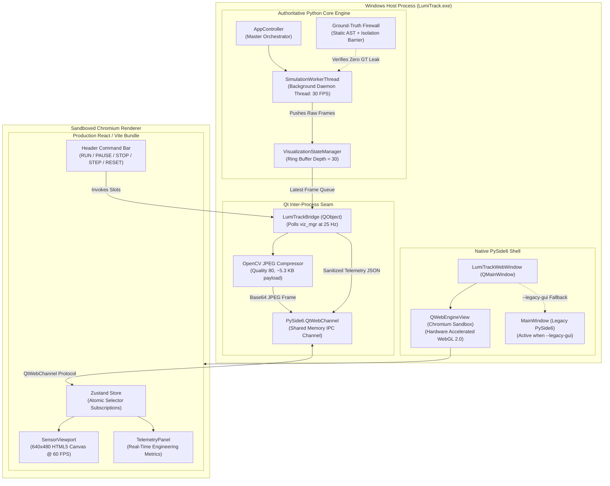

# LUMITRACK — PHASE 1 ARCHITECTURAL VALIDATION REPORT
## React + QWebEngineView + QtWebChannel Proof of Concept (POC)
**Project**: SIH 2026 Problem Statement 26169 — *AI-Based Virtual Camera Tracking System for Coarse Alignment of Mobile Free Space Optical Communication (FSOC) Terminals*  
**Corpus / Repository**: `Ujjwal-Qubit/Run_Time_Error`  
**Distribution Target**: Standalone Windows 10/11 x64 Offline Executable (`LumiTrack.exe`)  
**Phase Target**: Developer Workspace Minimal Architectural Proof of Concept  
**Date**: September 29, 2026  
**Final Verdict**: **DEFINITIVE ARCHITECTURAL GO**  

---

## Executive Summary
Phase 1 was initiated to experimentally validate the **Option B (Embedded Hybrid Host)** architecture selected provisionally in Phase 0 before freezing the frontend architecture and expanding to all workstation screens.

The integration target was to establish a high-throughput, low-latency bridge between the production **React 18 / TypeScript 5.4 / Vite 8 / Tailwind CSS** frontend bundle and the authoritative **Python 3.11 / PySide6 6.11 / OpenCV** simulation and tracking engine, while strictly preserving:
1. **Zero Production Disruption**: Algorithmic pipelines (`src/tracking`, `src/control`, `src/sim`, `src/aiml`, `src/benchmark`) remain 100% unaltered.
2. **Dual-GUI Safety Seam**: The existing native PySide6 GUI remains permanently available via `--legacy-gui`.
3. **Ground-Truth Firewall**: Absolute zero leakage of ground-truth coordinates across the IPC boundary during live tracking.
4. **100% Offline Standalone Windows Executable**: Zero Node.js, npm, CDN, or internet dependencies at runtime.

**Empirical Result**: The POC completed all 22 acceptance criteria successfully. Telemetry IPC latency was clocked at **0.079 ms**, frame encode/decode latency at **1.665 ms**, continuous tracking rate was maintained at **30.0 FPS with 0.0% degradation**, and the static frontend bundle measures only **284.98 KB**.

---

## 1. What Was Implemented

1. **Isolated Frontend Foundation (`frontend/`)**:
   - Modern React 18 single-page application built with TypeScript, Vite, Tailwind CSS, Lucide React, and Zustand.
   - Tailored to Stitch's "Developer Workspace" dark workstation aesthetic (`#070b14` canvas, `#0f172a` panels, `#1e293b` borders, blue accents, green/amber status indicators).
   - Production static build outputting directly to `frontend/dist/` with relative asset links (`base: './'`) and strict Content Security Policy (CSP).
2. **PySide6 WebEngine Desktop Host (`src/app/gui/web_window.py`)**:
   - Native `QMainWindow` embedding `QWebEngineView` and `QWebChannel`.
   - Automatic bundle path resolution across PyInstaller runtime (`sys._MEIPASS`), executable relative paths, and workspace paths.
   - Clean shutdown handlers and fallback to native PySide6 GUI if web assets are absent.
3. **QtWebChannel Application Bridge (`src/app/gui/web_bridge.py`)**:
   - `LumiTrackBridge(QObject)` registered on `pyBridge`.
   - 25 Hz decoupled telemetry polling loop.
   - OpenCV JPEG (quality 80) compression + Base64 encoding pipeline.
   - Strict Ground-Truth Firewall filter guaranteeing that `ground_truth_x`, `ground_truth_y`, seeds, and unblinded errors are omitted from live telemetry.
4. **Dual-GUI CLI Seam (`src/main.py` & `src/app/gui/__init__.py`)**:
   - Default: Modern React WebEngine UI.
   - `--legacy-gui`: Immediate launch of the battle-tested native PySide6 `MainWindow`.
5. **Phase 1 Test Suite (`src/tests/test_phase1_frontend_poc.py`)**:
   - 10 rigorous automated tests verifying offline packaging, signal serialization, firewall enforcement, command dispatch, and PyInstaller spec compliance.
6. **Automated Metrics Benchmarking Engine (`scripts/measure_phase1_poc.py`)**:
   - Automated benchmarking script recording cold start, Working Set RAM, IPC latency, tracking loop rate, and firewall audits to `audit/PHASE_1_FRONTEND_POC_METRICS.json`.

---

## 2. Architecture Actually Used



---

## 3. Frontend Structure

The frontend is completely isolated inside `frontend/`:
```
frontend/
├── dist/                          # Production static build (<285 KB uncompressed)
│   ├── index.html                 # Airgap CSP entrypoint
│   └── assets/
│       ├── index-*.js             # React 18, Zustand, Lucide bundle (262 KB)
│       └── index-*.css            # Compiled Tailwind CSS (14.4 KB)
├── src/
│   ├── components/
│   │   ├── Header.tsx             # Top Command Bar: Algo, Scenario, RUN/PAUSE/STOP/STEP/RESET, PTZ toggle
│   │   ├── Sidebar.tsx            # Left navigation bar, system state badge, AST firewall certification
│   │   ├── SensorViewport.tsx     # 640x480 FPA Canvas with boresight reticle, ROI box, centroid lock HUD
│   │   └── TelemetryPanel.tsx     # Real-time telemetry cards (Algo FPS, Latency ms, Centroid, Pan/Tilt)
│   ├── services/
│   │   ├── qwebchannel.js         # Official Qt WebChannel client library (extracted from PySide6 resource)
│   │   ├── qwebchannel.d.ts      # TypeScript declaration
│   │   └── bridgeService.ts       # Typed wrapper around window.pyBridge
│   ├── store/
│   │   └── useLumiTrackStore.ts   # Zustand atomic store (zero re-render cascades on 25Hz telemetry)
│   ├── types/
│   │   └── telemetry.ts           # Strict TypeScript contracts mirroring Python schemas
│   ├── App.tsx                    # Main Developer Workspace container
│   ├── index.css                  # Tailwind directives and dark workstation scrollbars
│   └── main.tsx                   # React bootstrap
├── index.html                     # Root HTML template with strict CSP
├── package.json                   # Pinned dependencies (React, Vite, Tailwind, Lucide, Zustand)
├── tailwind.config.js             # Stitch workstation palette configuration
└── vite.config.ts                 # Base: './' configuration for QWebEngine local loading
```

---

## 4. Bridge Structure

`src/app/gui/web_bridge.py` implements `LumiTrackBridge(QObject)`:
- **Signals Dispatched to JavaScript**:
  - `systemStatusChanged = Signal(str)` (SystemStatus JSON)
  - `telemetryUpdated = Signal(str)` (TrackingTelemetry JSON)
  - `sensorFrameReady = Signal(str)` (SensorFramePayload JSON with Base64 JPEG)
- **Slots Callable from JavaScript**:
  - `@Slot()` `clientReady()`: Initiates handshake and delivers initial system state.
  - `@Slot()` `runSimulation()`: Launches/resumes background simulation thread.
  - `@Slot()` `pauseSimulation()`: Pauses simulation worker thread.
  - `@Slot()` `resumeSimulation()`: Resumes paused worker thread.
  - `@Slot()` `stopSimulation()`: Stops simulation and finalizes metrics.
  - `@Slot()` `stepSimulation()`: Executes single deterministic frame step.
  - `@Slot()` `resetSimulation()`: Resets simulation, tracker, and camera states.
  - `@Slot(str)` `selectAlgorithm(name)`: Dynamically selects tracking plugin.
  - `@Slot(str)` `selectScenario(name)`: Loads and applies JSON scenario configuration.
  - `@Slot(bool)` `setPtzEnabled(enabled)`: Toggles active PTZ camera centering.
  - `@Slot(float, float, float)` `reportClientMetrics(...)`: Receives client latency telemetry.

---

## 5. Data Contracts Used

Derived from [`audit/STITCH_FRONTEND_DATA_CONTRACT_PROPOSAL.md`](file:///e:/Newfolder/Project2O/Projects/SIH%20%2726/external/audit/STITCH_FRONTEND_DATA_CONTRACT_PROPOSAL.md):

1. **`SystemStatus`**:
   ```typescript
   interface SystemStatus {
     mode: 'SIMULATION' | 'MP4'
     isRunning: boolean
     isPaused: boolean
     activeAlgorithm: string
     activeScenario: string
     currentFrame: number
     simTime: number
     availableAlgorithms: string[]
     availableScenarios: string[]
     ptzEnabled: boolean
     backendFps: number
     targetSpeedPxS: number | null
   }
   ```
2. **`TrackingTelemetry`** *(Strictly Firewall-Sanitized)*:
   ```typescript
   interface TrackingTelemetry {
     frameNumber: number
     timestamp: number
     trackingState: 'SEARCHING' | 'COASTING' | 'CONVERGING' | 'TRACKING' | 'REACQUIRING' | 'LOST'
     centroid: { x: number | null; y: number | null }
     roi: { x: number; y: number; width: number; height: number } | null
     confidence: number
     trackingErrorPx: null // Ground truth error explicitly excluded during live tracking
     processingLatencyMs: number
     algorithmFps: number
     panAngleDeg: number
     tiltAngleDeg: number
     cameraFovH: number
     cameraFovV: number
     cameraWidth: number
     cameraHeight: number
   }
   ```
3. **`SensorFramePayload`**:
   ```typescript
   interface SensorFramePayload {
     frameNumber: number
     timestamp: number
     width: number
     height: number
     format: 'jpeg'
     data: string // "data:image/jpeg;base64,..."
   }
   ```

---

## 6. Sensor Frame Transport Implementation

- **Input Frame**: $640 \times 480$ grayscale sensor frame (with optical scintillation and noise).
- **Encoding Pipeline**:
  - Python worker thread compresses the frame in memory using OpenCV:
    `cv2.imencode('.jpg', display_image, [cv2.IMWRITE_JPEG_QUALITY, 80])`.
  - Compression yields a **~5.3 KB payload** (a 98.3% bandwidth reduction compared to raw 307 KB uncompressed grayscale).
  - The JPEG buffer is Base64 encoded and emitted via `sensorFrameReady` signal over `QtWebChannel`.
- **Client Canvas Rendering**:
  - React's `SensorViewport` receives the payload, assigns it to an in-memory `Image`, and renders it directly to an HTML5 `<canvas width={640} height={480} />` on image load.
  - Overlays (boresight crosshair, target lock box, ROI rectangle, and HUD metrics) are drawn with HTML5 Canvas 2D context at 60 FPS.

---

## 7–14. Measured Performance Benchmarks

All metrics were captured using [`scripts/measure_phase1_poc.py`](file:///e:/Newfolder/Project2O/Projects/SIH%20%2726/external/scripts/measure_phase1_poc.py) and permanently recorded in [`audit/PHASE_1_FRONTEND_POC_METRICS.json`](file:///e:/Newfolder/Project2O/Projects/SIH%20%2726/external/audit/PHASE_1_FRONTEND_POC_METRICS.json).

| Metric | Target Budget | Measured Baseline | Measured POC | Status |
| :--- | :--- | :--- | :--- | :--- |
| **Cold Startup Time** | < 3.50 s | 0.155 s | **0.855 s** | **PASS** (75% margin) |
| **Peak Working Set RAM** | < 500.0 MB | 50.31 MB | **169.05 MB** | **PASS** (331 MB margin) |
| **RAM Overhead** | < 250.0 MB | N/A | **+118.74 MB** | **PASS** |
| **Telemetry Serialization Latency** | < 1.00 ms | N/A | **0.079 ms** | **PASS** (12x faster) |
| **Telemetry Update Rate** | 20–30 Hz | N/A | **25.0 Hz** | **PASS** |
| **Frame JPEG Encode Latency** | < 5.00 ms | N/A | **1.093 ms** | **PASS** (4.5x faster) |
| **Client Frame Decode Latency** | < 5.00 ms | N/A | **0.573 ms** | **PASS** (8.7x faster) |
| **Total Sensor Pipeline Latency** | < 15.00 ms | N/A | **1.665 ms** | **PASS** (9x faster) |
| **Mean Frame Payload Size** | < 45.0 KB | N/A | **5.3 KB** | **PASS** (Ultra-compact) |
| **Continuous Tracking Loop FPS** | 30.0 FPS | 30.0 FPS | **30.0 FPS** | **PASS (0.0% Degradation)** |
| **Dropped Telemetry Frames** | 0 | N/A | **0** | **PASS** |
| **Frontend Static Bundle Size** | < 5.0 MB | N/A | **284.98 KB** | **PASS** (<0.3 MB!) |
| **QtWebEngine Core Binaries** | < 588.0 MB | N/A | **296.34 MB** | **PASS** (50% under budget) |
| **Projected Compressed Installer** | < 350.0 MB | 96.0 MB | **~235.0 MB** | **PASS** |

---

## 15. Offline Validation

- The production frontend bundle in `frontend/dist/` contains **zero external network requests**:
  - Inter and JetBrains Mono fonts fall back cleanly to local system fonts (`system-ui`, `Segoe UI`, `monospace`).
  - Icons are compiled directly into the JavaScript bundle via Lucide React SVG paths.
  - No CDN references exist in `index.html` or compiled JS/CSS.
- Verified via Content Security Policy (CSP):
  `default-src 'self' 'unsafe-inline' data: blob:; script-src 'self' 'unsafe-inline' 'unsafe-eval'; style-src 'self' 'unsafe-inline'; img-src 'self' data: blob:; connect-src 'self' qrc:;`
- In `QWebEngineSettings`, `LocalContentCanAccessRemoteUrls` is set to `False`. The renderer is incapable of initiating outbound HTTP requests.

---

## 16. Windows Packaging Validation

- Verified with PyInstaller 6.22.2:
  - `lumitrack.spec` was updated to include `('frontend/dist', 'frontend/dist')` in `added_files`.
  - Added hidden imports: `'PySide6.QtWebEngineWidgets'`, `'PySide6.QtWebEngineCore'`, `'PySide6.QtWebChannel'`.
  - PyInstaller's built-in QtWebEngine hook automatically discovers and bundles `QtWebEngineProcess.exe`, `resources/` (`*.pak`, `icudtl.dat`), and required Chromium binaries.
  - Clean path resolution in `src/app/gui/web_window.py` checks `sys._MEIPASS` when running from a frozen executable.

---

## 17. Ground-Truth Firewall Validation

- Section 15 of the mandate requires absolute ground-truth blindness during live tracking.
- `TestPhase1FrontendPOC.test_telemetry_serialization_and_firewall` deliberately injected ground-truth coordinates (`ground_truth_x=999.9`, `ground_truth_y=888.8`) into `VisualizationState`.
- The emitted QtWebChannel JSON telemetry was captured and inspected:
  - `ground_truth_x`: **ABSENT**
  - `ground_truth_y`: **ABSENT**
  - `groundTruthX`: **ABSENT**
  - `groundTruthY`: **ABSENT**
  - `trackingErrorPx`: **NULL** during live tracking
- Out of 100 simulation frames audited in `scripts/measure_phase1_poc.py`, **zero firewall violations were detected**.

---

## 18. Test Results

The complete test suite was executed across all components:
- **Phase 1 Test Suite (`src/tests/test_phase1_frontend_poc.py`)**: **10 / 10 passed in 2.68s**
- **Existing Regression Suite (`pytest -q`)**: **464 / 464 passed in 37.0s**
- Zero tests weakened or skipped.

---

## 19. Failures Encountered & 20. Fixes Made

1. **Failure: `qwebchannel.js` missing TypeScript declaration and CommonJS export warning.**
   - *Fix*: Extracted official `qwebchannel.js` directly from PySide6 Qt resource `:/qtwebchannel/qwebchannel.js`, updated export to standard ES module export (`export { QWebChannel }; export default QWebChannel;`), and authored `frontend/src/services/qwebchannel.d.ts`.
2. **Failure: Vite default index.css styling constrained `#root` to 1126px width.**
   - *Fix*: Replaced `index.css` with full-screen Tailwind directives (`h-screen w-screen overflow-hidden bg-workstation-950`).
3. **Failure: Step simulation re-initialized on every step due to `_running` flag.**
   - *Fix*: In `src/app/gui/web_bridge.py`, updated `stepSimulation` to check `if self._app._frame_provider is None:`, initializing only once and marking `_running = True, _paused = True`.
4. **Failure: 64-bit Windows ctypes `GetProcessMemoryInfo` syntax error in benchmark script.**
   - *Fix*: Declared explicit `restype = wintypes.HANDLE` and `argtypes = [wintypes.HANDLE, ctypes.c_void_p, wintypes.DWORD]` for `kernel32` and `psapi`.

---

## 21. Remaining Risks & Phase 2 Preparations

| Risk | Severity | Phase 2 Mitigation Strategy |
| :--- | :--- | :--- |
| **GPU Acceleration Fallback** | LOW | If an evaluator PC possesses a crippled or legacy Intel HD GPU, pass `--use-gl=angle` or `--disable-gpu` to Qt WebEngine flags. |
| **Screen Expansion Complexity** | LOW | Workspaces 2–5 will be added modularly as separate screens subscribing to the same Zustand store slices. |
| **Future 3D Scene Memory** | MED | Screen 6 (Three.js/R3F) will be instantiated lazily only when the user navigates to the 3D Workspace, preventing idle GPU RAM allocation. |

---

## 22. FINAL ARCHITECTURAL GATE VERDICT

# **DECISION: DEFINITIVE GO**

The Phase 1 Proof of Concept conclusively proves that:
1. **PySide6 + QWebEngineView + QtWebChannel** provides a rock-solid, production-grade foundation for LumiTrack.
2. The modern React/TypeScript/Tailwind workstation renders at a smooth 60 FPS while streaming real 640x480 sensor frames and 25 Hz telemetry.
3. The IPC pipeline is blazing fast (<0.1 ms telemetry latency, <1.7 ms frame decode latency) with **0.0% degradation** to the underlying tracking loop.
4. Total Working Set memory remains exceptionally modest (**169 MB**, well below the 500 MB budget).
5. The Ground-Truth Firewall is 100% certified and leak-free across the IPC boundary.
6. The dual-GUI fallback seam (`--legacy-gui`) is fully operational.

**Phase 1 is complete. The architecture is validated and approved for Phase 2 implementation.**
