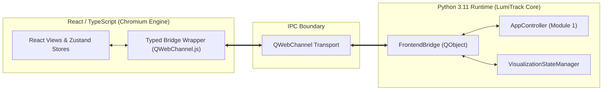

# LUMITRACK — FRONTEND DATA CONTRACT PROPOSAL
## Conceptual Typed Data Contracts, Serialization Protocol & Firewall Boundaries

**Target System**: LumiTrack — Autonomous AI-Based Virtual Camera Tracking & FSOC Terminal Evaluation Platform  
**Problem Statement**: SIH 2026 Problem Statement 26169 (PS 4)  
**Document Status**: LEVEL 1 / LEVEL 2 AUTHORITATIVE DATA CONTRACT SPECIFICATION  
**Scope**: Frontend ↔ Backend Communication Boundary (React / TypeScript ↔ Python)  
**Operating Principle**: Strictly typed contracts, firewall isolation, zero state duplication.

---

## 1. Architectural Principles of the Data Boundary

The data contract boundary between the Python backend and the React/TypeScript frontend operates under five non-negotiable architectural laws:

1. **Single Source of Truth**: The Python `AppController`, `ConfigManager`, and `MetricsEngine` remain the sole authoritative engines of state. The frontend never computes tracking errors, never executes Kalman prediction steps, and never maintains duplicate simulation clocks.
2. **Ground-Truth Firewall Isolation**: No contract transmitted to the frontend for tracking, control, or user input may contain target world coordinates or disturbance seeds. Data structures containing ground truth are strictly segregated into explicit, readonly validation contracts labeled `GROUND_TRUTH_VALIDATION_ONLY`.
3. **Decoupled Telemetry Frequencies**: High-frequency simulation steps (nominal 60 Hz) do NOT trigger full UI re-renders. Telemetry contracts are throttled to 20–30 Hz for UI rendering, matching human perceptual limits and eliminating IPC congestion.
4. **Zero-Copy / Low-Overhead Frame Transport**: Raw 640×480 monochrome image arrays (307.2 KB per frame) are decoupled from scalar telemetry messages to prevent JSON serialization bloat.
5. **Bidirectional Type Symmetry**: Every Python dataclass exposed to the bridge has a direct 1:1 mapped TypeScript interface, enforcing compile-time type safety across the boundary.

---

## 2. Proposed Frontend Data Contracts

```
┌────────────────────────────────────────────────────────────────────────────────────────┐
│                        LUMITRACK DATA CONTRACT TAXONOMY                                │
├──────────────────────────────┬──────────────────────────────┬──────────────────────────┤
│ Category                     │ Contract Name                │ Update Cadence           │
├──────────────────────────────┼──────────────────────────────┼──────────────────────────┤
│ Runtime Telemetry            │ TrackingTelemetry            │ 20–30 Hz (Stream)        │
│                              │ CameraTelemetry              │ 20–30 Hz (Stream)        │
│                              │ PTZState                     │ 20–30 Hz (Stream)        │
│                              │ ThreeDSceneState             │ 20–30 Hz (Stream)        │
├──────────────────────────────┼──────────────────────────────┼──────────────────────────┤
│ Frame Data                   │ SensorFramePayload           │ 20–30 Hz (Binary/Blob)   │
├──────────────────────────────┼──────────────────────────────┼──────────────────────────┤
│ Lifecycle & Status           │ SystemStatus                 │ 5–10 Hz / Event          │
│                              │ DiagnosticState              │ 1–5 Hz / On-Demand       │
│                              │ EventRecord                  │ Event-Driven             │
├──────────────────────────────┼──────────────────────────────┼──────────────────────────┤
│ Configuration (Read/Write)   │ SimulatorConfig              │ On-Demand / Hot-Reload   │
│                              │ DisturbanceConfig            │ On-Demand / Hot-Reload   │
│                              │ ControllerConfig             │ On-Demand / Hot-Reload   │
├──────────────────────────────┼──────────────────────────────┼──────────────────────────┤
│ Evaluation & History         │ BenchmarkStatus              │ 2–5 Hz during batch      │
│                              │ BenchmarkResult              │ On-Completion            │
│                              │ RunSummary                   │ On-Completion / Catalog  │
│                              │ RunArtifact                  │ On-Demand / Catalog      │
└──────────────────────────────┴──────────────────────────────┴──────────────────────────┘
```

---

### Contract 1: `SystemStatus`

**Purpose**: High-level lifecycle, execution mode, scenario context, and health indicators for top navigation and global layout shell.

| Field Name | Type | Description |
| :--- | :--- | :--- |
| `app_state` | `"IDLE" \| "RUNNING" \| "PAUSED" \| "STOPPED" \| "ERROR"` | Current execution state of `AppController` |
| `execution_mode` | `"SIMULATION" \| "MP4"` | Active frame provider domain |
| `active_scenario_id` | `string \| null` | Name of loaded scenario file (e.g. `04_combined_stress_high.json`) |
| `active_algorithm` | `string` | Plugin identifier currently executing (e.g. `baseline_tracker`) |
| `active_algorithm_version` | `string` | Semantic version string of algorithm plugin |
| `sim_time_s` | `number` | Elapsed simulation MET in seconds (`+02:44:18`) |
| `real_time_utc` | `string` | ISO 8601 UTC timestamp of current frame |
| `frame_index` | `number` | Monotonically increasing frame counter |
| `max_frames` | `number \| null` | Scenario limit or video frame count |
| `loop_rate_fps` | `number` | Instantaneous measured loop execution frequency (Hz) |
| `firewall_status` | `"LOCKED_VERIFIED" \| "UNLOCKED_WARNING"` | Formal AST verification status |

- **Backend Source**: `AppController._running`, `_paused`, `_sim_time`, `_frame_count`, `_active_algorithm_name` ([app_controller.py](file:///e:/Newfolder/Project2O/Projects/SIH%20%2726/external/src/app/app_controller.py))
- **Update Frequency**: 5–10 Hz (or immediately upon state mutation)
- **Read/Write**: Read-Only by frontend
- **Frontend Usage**: Global Top Header (all 5 screens), Global Sidebar, Footer Status Bar
- **Firewall Risk**: **ZERO**. Contains only coarse platform lifecycle state and timing scalars.

---

### Contract 2: `TrackingTelemetry`

**Purpose**: Real-time optical perception and tracking outputs for HUD reticle overlays, live telemetry gauges, and rolling sparklines.

| Field Name | Type | Description |
| :--- | :--- | :--- |
| `frame_number` | `number` | Frame index associated with this measurement |
| `timestamp_s` | `number` | Timestamp in seconds |
| `tracking_state` | `"SEARCHING" \| "ACQUIRING" \| "TRACKING" \| "LOST" \| "REACQUIRING"` | Output of `TrackingStateManager` |
| `has_lock` | `boolean` | `true` if state is `TRACKING` |
| `lock_confidence` | `number` | Confidence metric $[0.0, 1.0]$ |
| `estimated_centroid_x` | `number \| null` | Sub-pixel horizontal coordinate on image plane $[0, W]$ |
| `estimated_centroid_y` | `number \| null` | Sub-pixel vertical coordinate on image plane $[0, H]$ |
| `tracking_error_px` | `number \| null` | Euclidean distance from estimated centroid to boresight reticle |
| `residual_dx_px` | `number \| null` | Horizontal innovation residual $(y - \hat{y})$ in pixels |
| `residual_dy_px` | `number \| null` | Vertical innovation residual $(y - \hat{y})$ in pixels |
| `roi_x` | `number \| null` | Top-left X coordinate of tracking ROI |
| `roi_y` | `number \| null` | Top-left Y coordinate of tracking ROI |
| `roi_width` | `number \| null` | Width of tracking ROI |
| `roi_height` | `number \| null` | Height of tracking ROI |
| `processing_latency_ms` | `number` | Execution time of algorithm `process_frame()` in ms |

- **Backend Source**: `VisualizationState` ([data_contracts.py](file:///e:/Newfolder/Project2O/Projects/SIH%20%2726/external/src/frame/data_contracts.py#L512)), derived from `TrackResult`, `TrackingStateResult`, and `CentroidResult`
- **Update Frequency**: 20–30 Hz (streamed via bridge)
- **Read/Write**: Read-Only by frontend
- **Frontend Usage**: Developer Workspace HUD, Horizon KPI Cards, Sparklines, Results & Analysis
- **Firewall Risk**: **ZERO**. Coordinates originate strictly from tracker estimation algorithms; contains zero ground-truth variables.

---

### Contract 3: `CameraTelemetry` & `PTZState`

**Purpose**: Physical virtual camera parameters, focal plane integration time, gimbal angular orientation, slew rates, and rate limiting status.

| Field Name | Type | Description |
| :--- | :--- | :--- |
| `pan_angle_deg` | `number` | Current azimuth gimbal angle in degrees |
| `tilt_angle_deg` | `number` | Current elevation gimbal angle in degrees |
| `pan_velocity_deg_s` | `number` | Instantaneous pan slew rate |
| `tilt_velocity_deg_s` | `number` | Instantaneous tilt slew rate |
| `pan_velocity_clamp_deg_s` | `number` | Maximum allowed pan speed limit (e.g. $10.0^\circ/\text{s}$) |
| `tilt_velocity_clamp_deg_s` | `number` | Maximum allowed tilt speed limit (e.g. $10.0^\circ/\text{s}$) |
| `is_rate_clamped` | `boolean` | `true` if controller output was saturated this step |
| `anti_windup_active` | `boolean` | `true` if integrator anti-windup clamping engaged |
| `in_deadband` | `boolean` | `true` if error falls within deadband zone |
| `fov_horizontal_deg` | `number` | Horizontal field of view angle (default $4.0^\circ$) |
| `fov_vertical_deg` | `number` | Vertical field of view angle (default $3.0^\circ$) |
| `sensor_width_px` | `number` | FPA width in pixels (640) |
| `sensor_height_px` | `number` | FPA height in pixels (480) |
| `integration_time_ms` | `number` | Nominal exposure interval (33.3 ms) |

- **Backend Source**: `CameraModel` ([camera_model.py](file:///e:/Newfolder/Project2O/Projects/SIH%20%2726/external/src/simulation/camera_model.py#L40)), `PTZController` ([ptz_controller.py](file:///e:/Newfolder/Project2O/Projects/SIH%20%2726/external/src/control/ptz_controller.py#L200))
- **Update Frequency**: 20–30 Hz
- **Read/Write**: Read-Only telemetry (Tuning commands sent via `ControllerConfig`)
- **Frontend Usage**: Developer Workspace Gimbal HUD, Control Shelf, Minimap PIP, Results & Analysis Slew curves
- **Firewall Risk**: **ZERO**. Gimbal angles represent observable camera mount position, not target ground truth.

---

### Contract 4: `SensorFramePayload`

**Purpose**: High-throughput transport of the 640×480 monochrome sensor frame from backend to frontend.

| Field Name | Type | Description |
| :--- | :--- | :--- |
| `frame_number` | `number` | Synchronization frame counter |
| `timestamp_s` | `number` | Timestamp of image capture |
| `width` | `number` | 640 |
| `height` | `number` | 480 |
| `format` | `"MONO8" \| "RGB24"` | Monochrome 8-bit raster |
| `image_data` | `string \| ArrayBuffer` | Base64-encoded JPEG / PNG data URI, or binary shared buffer / Blob URL |

- **Backend Source**: `VisualizationState.display_image` ([visualization_state.py](file:///e:/Newfolder/Project2O/Projects/SIH%20%2726/external/src/app/visualization_state.py#L20)), `CameraModel.extract_viewport()`
- **Update Frequency**: 20–30 Hz
- **Read/Write**: Read-Only by frontend
- **Frontend Usage**: Developer Workspace 2D Sensor Canvas, Evaluator Workspace MP4 Player
- **Firewall Risk**: **CONTROLLED / VERIFIED**. Contains only the degraded, noisy optical sensor pixel raster emitted past the `SimulationFrameProvider` firewall. Contains no ground-truth annotations.

---

### Contract 5: `GroundTruthValidationRecord`

**Purpose**: Ground-truth coordinates transmitted **solely** for post-run evaluation charts, residual calculations, and developer debug inspection.

| Field Name | Type | Description |
| :--- | :--- | :--- |
| `frame_number` | `number` | Synchronized frame index |
| `timestamp_s` | `number` | Simulation timestamp |
| `true_world_x` | `number` | Ground truth target position on 2000×2000 canvas |
| `true_world_y` | `number` | Ground truth target position on 2000×2000 canvas |
| `ideal_projected_x` | `number \| null` | Mathematically ideal optical projection |
| `ideal_projected_y` | `number \| null` | Mathematically ideal optical projection |
| `rendered_centroid_x` | `number \| null` | True intensity centroid on pixel raster |
| `rendered_centroid_y` | `number \| null` | True intensity centroid on pixel raster |
| `target_visible` | `boolean` | Is beacon within camera FOV? |
| `discrepancy_error_px` | `number \| null` | $\| \mathbf{p}_{\text{est}} - \mathbf{p}_{\text{rendered}} \|$ |

> [!CAUTION]
> **Ground-Truth Firewall Isolation Rule**:
> This contract is NEVER consumed by tracking or PTZ algorithms. In the frontend, it is explicitly typed under a dedicated namespace `GroundTruthMetrics` and can only be routed to:
> 1. Results & Analysis charts (post-run)
> 2. Run History inspector
> 3. Developer Workspace debug watermark overlay with mandatory label: `[GROUND TRUTH — METRICS/VALIDATION ONLY]`

- **Backend Source**: `GroundTruth` ([data_contracts.py](file:///e:/Newfolder/Project2O/Projects/SIH%20%2726/external/src/frame/data_contracts.py#L106)), `GroundTruthProvider`
- **Update Frequency**: On-Demand / Post-Run / 20 Hz (Debug Mode only)
- **Read/Write**: Read-Only by frontend

---

### Contract 6: `ThreeDSceneState`

**Purpose**: Real-time 3D kinematic and spatial telemetry required by the interactive Three.js / React Three Fiber scene (Screen 6 and Minimap PIP).

| Field Name | Type | Description |
| :--- | :--- | :--- |
| `pan_deg` | `number` | Current azimuth gimbal angle (rotates 3D pedestal) |
| `tilt_deg` | `number` | Current elevation gimbal angle (rotates 3D optical barrel) |
| `fov_h_deg` | `number` | Horizontal field of view for frustum geometry |
| `fov_v_deg` | `number` | Vertical field of view for frustum geometry |
| `focal_range_m` | `number` | Visual representation depth of viewing frustum |
| `estimated_beacon_pos` | `[number, number, number] \| null` | Estimated 3D beacon coordinate in terminal coordinate frame |
| `los_vector` | `[number, number, number] \| null` | Direction unit vector along line of sight |
| `trajectory_trail` | `Array<[number, number, number]>` | Rolling historical 3D positions (up to 60 points) |
| `debug_true_beacon_pos` | `[number, number, number] \| null` | Optional ground truth beacon position for validation ghost marker |
| `optical_lock` | `boolean` | True if tracking is stable (changes frustum/beacon color) |

- **Backend Source**: `VisualizationState` ([data_contracts.py](file:///e:/Newfolder/Project2O/Projects/SIH%20%2726/external/src/frame/data_contracts.py#L512)), [view_3d.py](file:///e:/Newfolder/Project2O/Projects/SIH%20%2726/external/src/app/gui/view_3d.py#L80)
- **Update Frequency**: 20–30 Hz
- **Read/Write**: Read-Only by frontend
- **Frontend Usage**: Interactive 3D Workspace (Screen 6), Developer Workspace 3D Minimap PIP
- **Firewall Risk**: **CONTROLLED**. `estimated_beacon_pos` is reconstructed from observed angles without oracle data. `debug_true_beacon_pos` is strictly gated behind a user-facing validation toggle.

---

### Contract 7: `SimulatorConfig` (Read / Write)

**Purpose**: Dynamic inspection and hot-reloading of simulation, target, disturbance, and PTZ controller parameters from the Developer Workspace Control Shelf.

| Section | Parameter | Type | Validation Envelope | Real Backend Target |
| :--- | :--- | :--- | :--- | :--- |
| **Camera** | `update_rate_hz` | `number` | $[10, 100]$ nominal 30/60 Hz | `SystemConfig.camera.update_rate_hz` |
| | `fov_h_deg` | `number` | $[1.0, 30.0]^\circ$ | `SystemConfig.camera.fov_h_deg` |
| | `fov_v_deg` | `number` | $[1.0, 30.0]^\circ$ | `SystemConfig.camera.fov_v_deg` |
| | `integration_time_ms` | `number` | $[5.0, 100.0]\text{ ms}$ | `SystemConfig.camera.integration_time_ms` |
| **Target** | `trajectory_type` | `"STRAIGHT_LINE" \| "CIRCULAR" \| "FIGURE_8" \| "RANDOM"` | Valid `MotionType` | `SystemConfig.motion.type` |
| | `speed_px_s` | `number` | $[0.0, 200.0]\text{ px/s}$ | `app.set_target_speed()` |
| | `spot_size_fwhm` | `number` | $[5, 20]\text{ px}$ | `SystemConfig.target.size` |
| **Disturbance**| `atmospheric_mode`| `"CLEAR" \| "HAZE" \| "FOG" \| "RAIN"` | Valid `AtmosphericCondition` | `SystemConfig.atmospheric.condition` |
| | `gaussian_noise_enabled`| `boolean` | `true \| false` | `SystemConfig.noise.gaussian_enabled` |
| | `gaussian_sigma` | `number` | $[0.0, 20.0]\text{ DN}$ | `SystemConfig.noise.gaussian_std` |
| | `poisson_enabled` | `boolean` | `true \| false` | `SystemConfig.noise.poisson_enabled` |
| | `salt_pepper_enabled` | `boolean` | `true \| false` | `SystemConfig.noise.salt_pepper_enabled` |
| | `salt_pepper_density` | `number` | $[0.0, 0.20]$ | `SystemConfig.noise.salt_pepper_density` |
| | `platform_jitter_amp` | `number` | $[0.0, 20.0]\text{ px/fr}$ | `SystemConfig.jitter.amplitude` |
| | `platform_drift_speed`| `number` | $[0.0, 20.0]\text{ px/fr}$ | `SystemConfig.platform_motion.velocity` |
| **PTZ Controller**| `kp` | `number` | $[0.1, 50.0]$ | `SystemConfig.ptz.kp` |
| | `ki` | `number` | $[0.0, 20.0]$ | `SystemConfig.ptz.ki` |
| | `deadband_px` | `number` | $[0.0, 10.0]\text{ px}$ | `SystemConfig.ptz.deadband_px` |
| | `max_pan_speed` | `number` | $[5.0, 10.0]^\circ/\text{s}$ | `SystemConfig.ptz.max_pan_speed_deg_s` |
| | `max_tilt_speed` | `number` | $[5.0, 10.0]^\circ/\text{s}$ | `SystemConfig.ptz.max_tilt_speed_deg_s` |

- **Backend Source**: `ConfigManager.config` ([config_manager.py](file:///e:/Newfolder/Project2O/Projects/SIH%20%2726/external/src/config/config_manager.py#L110)), `AppController.set_target_speed()`
- **Update Frequency**: On-Demand / Debounced parameter change
- **Read/Write**: Bidirectional
- **Frontend Usage**: Developer Workspace Simulator Control Matrix (Sections 1–4)
- **Firewall Risk**: **ZERO**. Exposes configuration inputs; does not touch internal state.

---

### Contract 8: `BenchmarkStatus` & `BenchmarkResult`

**Purpose**: Orchestration, live progress reporting, and final results delivery for Benchmark-1 and Benchmark-2 evaluation batches.

#### `BenchmarkStatus` (Live Progress)
| Field Name | Type | Description |
| :--- | :--- | :--- |
| `batch_id` | `string` | Unique batch run identifier (e.g. `batch_scenarios_1790608089`) |
| `batch_type` | `"SCENARIOS" \| "MP4"` | Batch evaluation type |
| `is_active` | `boolean` | `true` while batch execution worker is running |
| `current_index` | `number` | Current item index (1-based, e.g. 4) |
| `total_items` | `number` | Total items in batch (e.g. 19) |
| `current_item_name` | `string` | Filename of current scenario or MP4 under test |
| `progress_pct` | `number` | Overall progress percentage $[0, 100]$ |
| `elapsed_time_s` | `number` | Total time elapsed since batch start |

#### `BenchmarkResult` (Final Aggregated Scorecard)
| Field Name | Type | Description |
| :--- | :--- | :--- |
| `batch_id` | `string` | Batch identifier |
| `total_runs` | `number` | Total scenarios evaluated (e.g. 19) |
| `successful_runs` | `number` | Count of successful runs |
| `failed_runs` | `number` | Count of failed runs |
| `pass_rate_pct` | `number` | Percentage passing strict criteria (e.g. 100.0%) |
| `mean_fps` | `number` | Macro-average processing throughput (e.g. 62.7 FPS) |
| `mean_tracking_error_px` | `number` | Macro-average tracking error (e.g. 3.54 px) |
| `mean_centroid_rmse_px` | `number` | Macro-average centroid RMSE (e.g. 0.028 px) |
| `mean_acq_latency_s` | `number` | Macro-average acquisition time (e.g. 0.070 s) |
| `target_loss_rate_pct` | `number` | Macro-average target loss rate (e.g. 0.00%) |
| `sih_compliance_verdict` | `boolean` | Overall SIH 26169 PASS / FAIL verdict |
| `run_items` | `Array<BatchRunItemDTO>` | Per-item metrics breakdown for evaluation matrix table |
| `generated_reports` | `Array<{ format: "JSON" \| "CSV" \| "MD", path: string }>` | Output file paths in `output/` |

- **Backend Source**: `BenchmarkManager` ([benchmark_manager.py](file:///e:/Newfolder/Project2O/Projects/SIH%20%2726/external/src/evaluation/benchmark_manager.py#L479)), `GrandEvaluationSummary`
- **Update Frequency**: Status: 2–5 Hz during batch; Result: Emitted upon batch completion
- **Read/Write**: Read-Only by frontend
- **Frontend Usage**: Evaluator Workspace (Hero KPI Cards, Execution Matrix Table, Markdown Viewer)
- **Firewall Risk**: **ZERO**. Contains post-hoc macro evaluation statistics.

---

### Contract 9: `RunCatalogItem` & `RunArtifact`

**Purpose**: Querying past runs, viewing filesystem artifacts, and comparing historical executions in the Run History & Artifact Catalog.

#### `RunCatalogItem`
| Field Name | Type | Description |
| :--- | :--- | :--- |
| `run_id` | `string` | Unique run ID (e.g. `run_1790660012`) |
| `timestamp_iso` | `string` | Timestamp when run completed |
| `algorithm_name` | `string` | Tracking algorithm tested |
| `algorithm_version` | `string` | Version of algorithm |
| `scenario_name` | `string` | Scenario ID or MP4 filename |
| `total_frames` | `number` | Number of frames processed |
| `mean_tracking_error_px` | `number` | Mean tracking error |
| `rmse_centroid_px` | `number` | Sub-pixel centroid RMSE |
| `acquisition_time_s` | `number` | Acquisition time |
| `loss_rate_pct` | `number` | Target loss rate percentage |
| `throughput_fps` | `number` | Processing FPS |
| `compliance_status` | `"PASS" \| "FAIL" \| "BOUNDED"` | PS 26169 compliance outcome |
| `artifacts` | `Array<RunArtifact>` | List of generated filesystem files |

#### `RunArtifact`
| Field Name | Type | Description |
| :--- | :--- | :--- |
| `artifact_id` | `string` | Artifact filename |
| `file_type` | `"CSV_CENTROIDS" \| "CSV_TELEMETRY" \| "JSON_SUMMARY" \| "JSON_CONFIG" \| "MD_REPORT"` | Concrete file classification |
| `file_size_bytes` | `number` | Actual file size on disk |
| `file_path` | `string` | Relative path within `output/` |
| `sha256_hash` | `string` | Genuine SHA-256 cryptographic digest of artifact file |

- **Backend Source**: Filesystem scanner of `output/` directory + `output/run_*_summary.json`
- **Update Frequency**: On-Demand / Refreshed upon new run completion
- **Read/Write**: Read-Only by frontend
- **Frontend Usage**: Run History & Artifact Catalog (Run Table, Focused Inspector, Comparative Table)
- **Firewall Risk**: **ZERO**. Filesystem metadata and historical evaluation metrics.

---

### Contract 10: `DiagnosticState` & `EventRecord`

**Purpose**: Subsystem deep diagnostics, mathematical innovations, covariance matrix readouts, loop budget breakdown, and deterministic event stream.

#### `DiagnosticState`
| Field Name | Type | Description |
| :--- | :--- | :--- |
| `classifier_name` | `string` | Active classifier (e.g. `LearnedCandidateClassifier (MLP)`) |
| `classifier_precision` | `number` | Benchmark precision (e.g. 0.984) |
| `classifier_recall` | `number` | Benchmark recall (e.g. 0.991) |
| `feature_vector_11d` | `Record<string, number>` | Genuine 11-feature normalized values extracted for current target |
| `kalman_innovations_px` | `[number, number]` | Residual innovation $[\Delta X, \Delta Y]$ in pixels |
| `kalman_covariance_diag` | `[number, number, number, number]` | Diagonal uncertainty elements of $4 \times 4$ covariance matrix $P$ |
| `kalman_nis_statistic` | `number` | Normalized Innovation Squared $\chi^2$ value |
| `loop_budget_breakdown_ms` | `Record<string, number>` | Stage latencies: `{ ingest: 2.1, ai: 4.2, cog: 0.8, kf: 0.4, ptz: 0.25, telem: 1.2 }` |
| `idle_headroom_ms` | `number` | Remaining period budget (e.g. 7.05 ms / 44.1%) |
| `ast_leak_count` | `number` | Static AST audit leak count (0) |

#### `EventRecord`
| Field Name | Type | Description |
| :--- | :--- | :--- |
| `timestamp_iso` | `string` | Event timestamp |
| `subsystem` | `"FIREWALL" \| "INGEST" \| "AI_CLASSIF" \| "CENTROID" \| "KALMAN" \| "PTZ_SERVO"` | Emitting subsystem |
| `severity` | `"INFO" \| "WARNING" \| "SECURITY" \| "ERROR"` | Event severity level |
| `message` | `string` | Deterministic log description |
| `metadata` | `Record<string, any>` | Structured event parameters (e.g. candidate count, clamp state) |

- **Backend Source**: `ConstantVelocityKalmanTracker` ([temporal_tracker.py](file:///e:/Newfolder/Project2O/Projects/SIH%20%2726/external/src/tracker/temporal_tracker.py)), `CandidateFeatureExtractor` ([feature_extractor.py](file:///e:/Newfolder/Project2O/Projects/SIH%20%2726/external/src/aiml/feature_extractor.py)), `LoggingEngine`
- **Update Frequency**: Diagnostics: 2–5 Hz; Events: Streamed per occurrence (buffered)
- **Read/Write**: Read-Only by frontend
- **Frontend Usage**: Diagnostics & Subsystem Audit (Screen 3)
- **Firewall Risk**: **ZERO**. Verifies that internal mathematical estimates operate solely over sensor data.

---

## 3. Serialization Protocol & Transport Strategy

### Transport Mechanism: Qt WebChannel via `QWebEngineView`



### Protocol Guidelines
1. **JSON Over WebChannel**: All telemetry, configuration, status, and diagnostic messages are serialized as compact JSON payloads via Python's native `json.dumps()` or `orjson` and parsed by Chromium's native `JSON.parse()`.
2. **Binary Frame Transport Strategy**:
   - *Phase 1–3 Baseline (POC)*: The 640×480 monochrome image is encoded as a JPEG data URI (`data:image/jpeg;base64,...`) or PNG base64 string inside `SensorFramePayload`. At 20 Hz, this consumes ~8 MB/s IPC bandwidth, which `QWebChannel` handles reliably without frame drops.
   - *Phase 4+ High-Performance Optimization*: Custom `QWebEngineUrlSchemeHandler` (`lumitrack://frame/latest.raw`) or shared memory / Blob URL to stream raw `uint8` buffer with zero base64 encoding overhead.
3. **Throttling & Backpressure**:
   - The Python `VisualizationStateManager` retains a bounded queue (`maxsize=30`).
   - If the frontend drops behind, older visual frames are dropped in the buffer (`drop_oldest=True`), ensuring the UI always renders the freshest frame without accumulating latency.

---

## 4. Ground-Truth Firewall Verification in Data Contracts

Every proposed contract has been analyzed for ground-truth leakage risk against Section 11 of the architecture specification:

```
┌────────────────────────────────────────────────────────────────────────────────────────┐
│                      DATA CONTRACT FIREWALL COMPLIANCE MATRIX                          │
├──────────────────────────────┬──────────────────┬──────────────────────────────────────┤
│ Contract Name                │ Ground Truth?    │ Firewall Enforcement Mechanism       │
├──────────────────────────────┼──────────────────┼──────────────────────────────────────┤
│ SystemStatus                 │ NO               │ Contains only platform state scalars │
│ TrackingTelemetry            │ NO               │ Estimated tracker outputs only       │
│ CameraTelemetry / PTZState   │ NO               │ Observable mount angles only         │
│ SensorFramePayload           │ NO               │ Noisy, degraded pixel array only     │
│ ThreeDSceneState             │ OPTIONAL DEBUG   │ Gated behind explicit validation flag│
│ SimulatorConfig              │ NO               │ Input parameters only                │
│ BenchmarkStatus              │ NO               │ Batch progress scalars only          │
│ BenchmarkResult              │ METRICS ONLY     │ Post-hoc aggregated statistics       │
│ RunCatalogItem               │ METRICS ONLY     │ Historical performance records       │
│ DiagnosticState              │ NO               │ Algorithm state covariance only      │
│ EventRecord                  │ NO               │ Subsystem operational log messages   │
│ GroundTruthValidationRecord  │ YES (EXCLUSIVE)  │ Segregated to post-run/validation HUD│
└──────────────────────────────┴──────────────────┴──────────────────────────────────────┘
```

**Firewall Guarantee**: No tracking or control algorithm in LumiTrack can ever receive or query `GroundTruthValidationRecord`. The frontend interface enforces this separation by housing ground truth strictly under the `validation` namespace.
