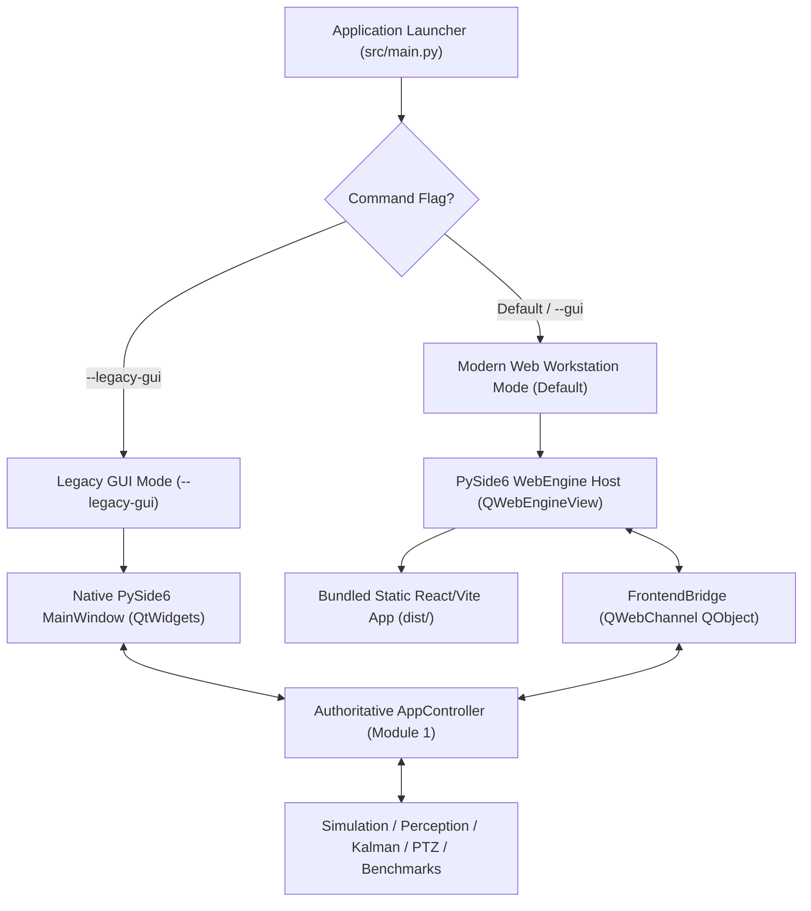

# LUMITRACK — FRONTEND INTEGRATION ROADMAP
## Staged Migration Strategy, Quality Gates, Safety Seams & Rollback Procedures

**Target System**: LumiTrack — Autonomous AI-Based Virtual Camera Tracking & FSOC Terminal Evaluation Platform  
**Problem Statement**: SIH 2026 Problem Statement 26169 (PS 4)  
**Document Status**: LEVEL 1 / LEVEL 2 AUTHORITATIVE INTEGRATION PLAN  
**Migration Strategy**: Zero-Regression Staged Migration with Dual-GUI Parity  
**Operating Principle**: Preserves 100% of validated algorithms, benchmarks, firewall rules, and packaging.

---

## 1. Migration Strategy & Safety Architecture

The migration of LumiTrack from its current native PySide6 QtWidgets interface to a modern production React/TypeScript frontend operates under a strict **Dual-GUI Isolation Architecture**:



### Safety Guarantees
1. **Zero Backend Rewrite**: The 19 core Python modules in `src/` (simulation, perception, candidate classifier, Kalman filter, PTZ controller, disturbance engine, benchmark manager) remain untouched. The frontend is strictly a presentation and interaction layer.
2. **Dual-GUI Fallback**: The native PySide6 GUI (`src/app/gui/main_window.py`) remains fully operational throughout all migration phases. Running `python -m src.main --legacy-gui` or `LumiTrack.exe --legacy-gui` launches the original interface at any time.
3. **Instant Rollback**: If any WebEngine or packaging issue occurs, switching one flag or reverting the launcher instantly restores the validated Phase 4 native executable.
4. **Air-Gapped Local Operation**: The React production build is compiled ahead-of-time into self-contained static assets (`dist/`). At runtime, no Node.js, npm, or network connection is required.

---

## 2. Phase-by-Phase Integration Plan

```
┌────────────────────────────────────────────────────────────────────────────────────────┐
│                        LUMITRACK FRONTEND MIGRATION ROADMAP                            │
├─────────┬──────────────────────────────────────┬───────────────────────────────────────┤
│ Phase   │ Scope                                │ Primary Deliverable                   │
├─────────┼──────────────────────────────────────┼───────────────────────────────────────┤
│ PHASE 0 │ Architecture Audit & Decision        │ Authoritative Architectural Decision  │
│ PHASE 1 │ Frontend Foundation & Toolchain      │ Vite + React + TypeScript Scaffolding │
│ PHASE 2 │ Application Bridge & Data Boundary   │ Python QObject + QWebChannel Adapter  │
│ PHASE 3 │ Developer Workspace POC              │ First Working Screen (Sensor HUD)     │
│ PHASE 4 │ Developer Workspace Completion       │ Full Control Matrix + 120f Sparkline  │
│ PHASE 5 │ Evaluator Workspace                  │ BM1 Suite Table + BM2 Video Evaluator │
│ PHASE 6 │ Diagnostics & Subsystem Audit        │ 11-Feature Weights + Kalman Innovation│
│ PHASE 7 │ Results & Analysis                   │ Error Time-Series + Polar Dispersion  │
│ PHASE 8 │ Run History & Artifact Catalog       │ Output Store Scanner + Run Inspector  │
│ PHASE 9 │ Interactive 3D Workspace             │ Three.js / React Three Fiber Scene    │
│ PHASE 10│ Full Integration & Regression Audit  │ 455 Automated Pytest Verification     │
│ PHASE 11│ Offline Production Build             │ Zero-CDN Self-Contained Local Bundle  │
│ PHASE 12│ PyInstaller & Inno Setup Packaging   │ Standalone Windows Executable Bundle  │
└─────────┴──────────────────────────────────────┴───────────────────────────────────────┘
```

---

### PHASE 0: Architecture Decision (THIS TASK)
- **Objective**: Complete comprehensive architectural audit, establish screen-to-backend traceability, audit fiction, define typed data contracts, and formulate final architectural decision without modifying any production application code.
- **Expected Files**:
  - `audit/STITCH_INTEGRATION_ARCHITECTURE_AUDIT.md`
  - `audit/STITCH_FRONTEND_DATA_CONTRACT_PROPOSAL.md`
  - `audit/STITCH_INTEGRATION_ROADMAP.md`
  - `audit/STITCH_SCREEN_TO_BACKEND_TRACEABILITY.md`
- **Dependencies**: Graphify graph, Stitch MCP project inspection, AAS skills, repository source code.
- **Risks**: None (Read-only architectural analysis).
- **Validation**: Strict peer review against SIH 26169 requirements and actual codebase constraints.
- **Exit Criteria**: All four audit documents created; final architecture decision ratified.
- **Rollback Strategy**: N/A (No code modifications).

---

### PHASE 1: Frontend Foundation & Toolchain
- **Objective**: Establish the isolated frontend project directory (`frontend/` or `web/`) with Vite, React, TypeScript, Tailwind CSS, Lucide icons, and offline font assets.
- **Expected Files**:
  - `frontend/package.json`
  - `frontend/vite.config.ts`
  - `frontend/tsconfig.json`
  - `frontend/tailwind.config.js`
  - `frontend/src/index.css`
  - `frontend/src/main.tsx`
  - `frontend/src/types/contracts.ts` (TypeScript interfaces mapped to Python contracts)
- **Dependencies**: Node.js and npm in developer environment (used exclusively during build).
- **Risks**: Accidental external CDN dependencies in Tailwind or fonts.
- **Validation**: `npm run build` succeeds offline; output bundle contains 0 external URL references.
- **Exit Criteria**: Clean static bundle output in `frontend/dist/` with zero CDN links.
- **Rollback Strategy**: Delete `frontend/` directory.

---

### PHASE 2: Application Bridge & Data Boundary
- **Objective**: Implement the thin Python `FrontendBridge(QObject)` using `PySide6.QtWebChannel` to bridge Python signals/slots with JavaScript window contexts.
- **Expected Files**:
  - `src/app/bridge/frontend_bridge.py` (`QObject` slots and signals)
  - `src/app/bridge/telemetry_serializer.py` (JSON serializer for `VisualizationState`)
  - `src/app/bridge/__init__.py`
  - `src/tests/test_frontend_bridge.py` (Unit tests for bridge serialization)
- **Dependencies**: `PySide6.QtWebChannel`, `AppController`.
- **Risks**: Serialization latency overhead blocking Python simulation thread.
- **Mitigation**: Bridge runs asynchronously; serializes only fresh throttled frames (20–30 Hz).
- **Validation**: Automated unit tests verifying serialization speed (<0.5 ms per telemetry packet).
- **Exit Criteria**: Python bridge emits telemetry signals and responds to mocked control calls.
- **Rollback Strategy**: Remove `src/app/bridge/`.

---

### PHASE 3: Developer Workspace POC (First-Screen Proof of Concept)
- **Objective**: Prove the complete desktop web integration loop by rendering the Developer Workspace inside a `QWebEngineView`, receiving live 2D sensor frames, displaying telemetry, and executing simulation controls (RUN / PAUSE / STOP / STEP).
- **Expected Files**:
  - `src/app/gui/web_window.py` (`QMainWindow` hosting `QWebEngineView`)
  - `frontend/src/views/DeveloperWorkspace.tsx`
  - `frontend/src/components/sensor/SensorViewport2D.tsx`
  - `frontend/src/components/layout/TopHeader.tsx`
  - `frontend/src/components/layout/Sidebar.tsx`
  - `frontend/src/stores/useSimulationStore.ts` (Zustand)
- **Dependencies**: Phase 1 static bundle, Phase 2 bridge.
- **Risks**: Frame image rendering latency in Chromium.
- **Validation**:
  - React application loads inside desktop window.
  - Video widget renders live 640×480 monochrome stream at 20–30 Hz.
  - Clicking "PAUSE" stops simulation; clicking "RUN" resumes.
  - Ground-truth firewall seal verified intact.
- **Exit Criteria**: All 11 First-POC acceptance criteria met.
- **Rollback Strategy**: Launch fallback native PySide6 window.

---

### PHASE 4: Developer Workspace Completion
- **Objective**: Complete all panels in the Developer Workspace, including the Simulator Control Matrix (Sections 1–4), hot-reload parameter tuning, minimap PIPs, and 120-frame rolling sparkline.
- **Expected Files**:
  - `frontend/src/components/controls/SimulatorControlMatrix.tsx`
  - `frontend/src/components/controls/CameraControls.tsx`
  - `frontend/src/components/controls/TargetControls.tsx`
  - `frontend/src/components/controls/DisturbanceControls.tsx`
  - `frontend/src/components/controls/PTZControls.tsx`
  - `frontend/src/components/charts/ErrorSparkline.tsx`
  - `frontend/src/components/sensor/MinimapFrustumPIP.tsx`
  - `frontend/src/components/sensor/MinimapWorldCanvasPIP.tsx`
- **Dependencies**: Phase 3 POC.
- **Risks**: Excessive React re-rendering on high-frequency parameter changes.
- **Mitigation**: Local state for inputs; debounced commit to backend bridge.
- **Validation**: Changing target speed or noise parameters hot-reloads live simulation immediately.
- **Exit Criteria**: 100% parameter matrix functionality operational with zero lag.
- **Rollback Strategy**: Revert to Phase 3 component state.

---

### PHASE 5: Evaluator Workspace
- **Objective**: Implement Screen 2 with automated Scenario Benchmark Suite (Benchmark-1) execution table, MP4 Video Evaluator (Benchmark-2), compliance report viewer, and ZIP dossier export.
- **Expected Files**:
  - `frontend/src/views/EvaluatorWorkspace.tsx`
  - `frontend/src/components/evaluator/Benchmark1SuiteTable.tsx`
  - `frontend/src/components/evaluator/Benchmark2VideoPlayer.tsx`
  - `frontend/src/components/evaluator/ComplianceReportViewer.tsx`
  - `frontend/src/components/evaluator/KPIOverviewCards.tsx`
  - `frontend/src/stores/useEvaluatorStore.ts`
- **Dependencies**: `BenchmarkManager` batch APIs.
- **Risks**: UI freezing during 19-scenario batch execution.
- **Mitigation**: Batch execution runs in background Python thread; emits progress events to UI.
- **Validation**: Running full 19-scenario suite updates table rows progressively without UI freeze.
- **Exit Criteria**: Full batch execution completed; genuine report and ZIP generated.
- **Rollback Strategy**: Retain native `EvaluationPanel` fallback.

---

### PHASE 6: Diagnostics & Subsystem Audit
- **Objective**: Implement Screen 3 with 3-tier firewall barrier diagram, genuine 11-feature AI classifier weights, 6-stage pipeline flow, Kalman innovation & covariance metrics, and thread loop Gantt chart.
- **Expected Files**:
  - `frontend/src/views/DiagnosticsWorkspace.tsx`
  - `frontend/src/components/diagnostics/FirewallBarrierDiagram.tsx`
  - `frontend/src/components/diagnostics/FeatureVectorBars.tsx` (11 features)
  - `frontend/src/components/diagnostics/PipelineStageFlow.tsx`
  - `frontend/src/components/diagnostics/KalmanCovarianceView.tsx`
  - `frontend/src/components/diagnostics/TimingGanttChart.tsx`
  - `frontend/src/components/diagnostics/EventStreamLog.tsx`
- **Dependencies**: Phase 2 bridge diagnostics endpoints.
- **Risks**: Displaying misleading or fabricated metrics.
- **Mitigation**: Enforce strict mapping to genuine 11 features and real AST test outcomes.
- **Validation**: Re-audit button executes real AST test suite; outputs genuine 0-leak badge.
- **Exit Criteria**: All diagnostic displays reflect verifiable mathematical engine telemetry.
- **Rollback Strategy**: Keep previous view state.

---

### PHASE 7: Results & Analysis
- **Objective**: Implement Screen 5 deep analytical dashboard with 60s tracking error time-series chart (disturbance phase bands), PTZ slew rate curves, and polar residuals dispersion scatter.
- **Expected Files**:
  - `frontend/src/views/ResultsAnalysisWorkspace.tsx`
  - `frontend/src/components/charts/TrackingErrorTimeSeriesChart.tsx` (ECharts / Chart.js)
  - `frontend/src/components/charts/PTZSlewRatesChart.tsx`
  - `frontend/src/components/charts/PolarResidualsScatter.tsx`
  - `frontend/src/components/tables/PerFrameSampleTable.tsx`
- **Dependencies**: Charting library (Apache ECharts or Chart.js), `output/*.csv` parser.
- **Risks**: Large CSV datasets (3,600+ rows) causing chart sluggishness.
- **Mitigation**: Use Canvas-based charting (ECharts / Chart.js); paginated virtual table.
- **Validation**: Smooth zooming and scrubbing across 3,600 data points.
- **Exit Criteria**: Interactive charts render without frame stutter; polar scatter displays covariance ellipse.
- **Rollback Strategy**: Retain native `ResultsPanel` fallback.

---

### PHASE 8: Run History & Artifact Catalog
- **Objective**: Implement Screen 4 catalog of past executions scanning `./output/`, focused run inspector, multi-run comparison table, and artifact download triggers.
- **Expected Files**:
  - `frontend/src/views/RunHistoryWorkspace.tsx`
  - `frontend/src/components/history/RunHistoryTable.tsx`
  - `frontend/src/components/history/FocusedRunInspector.tsx`
  - `frontend/src/components/history/MultiRunComparison.tsx`
  - `frontend/src/components/history/ArtifactCatalogList.tsx`
- **Dependencies**: Backend filesystem scanner of `output/`.
- **Risks**: Filesystem access permission errors on restricted Windows machines.
- **Mitigation**: Handle missing or locked files gracefully; validate paths relative to working directory.
- **Validation**: Selecting past runs instantly displays metrics and allows downloading CSV/JSON/MD.
- **Exit Criteria**: Historical runs indexed; multi-run comparison computes deltas correctly.
- **Rollback Strategy**: Retain file-browser fallback.

---

### PHASE 9: Interactive 3D Workspace (Screen 6)
- **Objective**: Build the dedicated interactive 3D spatial visualization workspace using Three.js and React Three Fiber, visualizing the optical terminal mount, gimbal pan/tilt rotation, 3D viewing frustum, LOS vector, and mobile target beacon.
- **Expected Files**:
  - `frontend/src/views/ThreeDWorkspace.tsx`
  - `frontend/src/components/three/TerminalScene.tsx` (R3F Canvas)
  - `frontend/src/components/three/GimbalMountModel.tsx`
  - `frontend/src/components/three/FrustumWireframe.tsx`
  - `frontend/src/components/three/TargetBeacon3D.tsx`
  - `frontend/src/components/three/TrajectoryTrail3D.tsx`
  - `frontend/src/components/three/SceneLightingAndGrid.tsx`
- **Dependencies**: `three`, `@react-three/fiber`, `@react-three/drei`.
- **Risks**: WebGL context creation failure on software-rendered or headless displays.
- **Mitigation**: Graceful fallback detection (`WebGLRenderer.isWebGLAvailable()`); ANGLE Direct3D 11 backend support in Chromium.
- **Validation**: 3D scene rotates and pitches in direct synchronization with PTZ gimbal angles at 60 FPS.
- **Exit Criteria**: Full 3D interactive orbit controls, boresight, frustum, and target tracking rendered.
- **Rollback Strategy**: Toggle between 2D view and 3D view; fallback to 2D view.

---

### PHASE 10: Integration & Regression Verification
- **Objective**: Execute the complete test suite (455 pytest unit and integration tests), AST firewall verification, and end-to-end benchmark scenarios to ensure zero technical regression.
- **Expected Files**:
  - `audit/FRONTEND_INTEGRATION_TEST_REPORT.md`
- **Dependencies**: All previous phases.
- **Risks**: Latency regression in benchmark runs.
- **Validation**:
  - Run `pytest` across all 455 tests: 100% PASS.
  - Run AST firewall audit tests: 0 LEAKS DETECTED.
  - Run Benchmark-1 Matrix: Pass rate 100%, tracking error $\le 10\text{ px}$.
  - Run Benchmark-2 Video Evaluator: Speed $\ge 20\text{ FPS}$, coverage $100\%$.
- **Exit Criteria**: Zero regressions across all level 1 specifications.
- **Rollback Strategy**: Isolate failing subsystem.

---

### PHASE 11: Offline Production Build
- **Objective**: Compile the React frontend into an air-gapped production bundle. Audit all bundled assets (HTML, JS, CSS, fonts, SVG icons) to verify zero network requests.
- **Expected Files**:
  - `dist/web_app/` (Production static bundle)
  - `audit/OFFLINE_DEPENDENCY_AUDIT.md`
- **Dependencies**: Vite build pipeline.
- **Risks**: Leaked Google Fonts or CDN script imports from Stitch prototypes.
- **Mitigation**: Bundle local `.woff2` fonts (Inter, JetBrains Mono); inline SVG icons via Lucide React.
- **Validation**: Launch Chromium in airplane mode with DevTools Network tab set to offline: zero failed requests.
- **Exit Criteria**: 100% self-contained local web bundle.
- **Rollback Strategy**: Re-run asset bundler.

---

### PHASE 12: PyInstaller & Windows Executable Distribution
- **Objective**: Bundle the PySide6 WebEngine wrapper, embedded static React bundle, and Python core into the standalone `LumiTrack.exe` onedir distribution and build the Inno Setup installer.
- **Expected Files**:
  - `lumitrack.spec` (Updated with `datas=[('frontend/dist', 'web_app'), ...]` and QtWebEngine hooks)
  - `installer/lumitrack_installer.iss` (Updated for new file census)
  - `dist/LumiTrack/LumiTrack.exe`
  - `dist/LumiTrack-Setup-v1.0.exe`
- **Dependencies**: PyInstaller 6+, Inno Setup 6.
- **Risks**: Missing QtWebEngine binary dependencies (`QtWebEngineProcess.exe`, `resources/`).
- **Mitigation**: PyInstaller built-in hook handles QtWebEngine automatically; verify with PE dependency scanner.
- **Validation**: Execute `dist/LumiTrack/LumiTrack.exe` on a fresh, clean Windows 10/11 VM without Python or Node.js.
- **Exit Criteria**: Application launches directly to modern React UI offline; all benchmarks execute.
- **Rollback Strategy**: Build original `lumitrack.spec` with native QtWidgets.

---

## 3. Migration Safety & Rollback Matrix

```
┌────────────────────────────────────────────────────────────────────────────────────────┐
│                        MIGRATION SAFETY & ROLLBACK MATRIX                              │
├─────────────────────┬───────────────────────────┬──────────────────────────────────────┤
│ Phase Scope         │ Failure Scenario          │ Instant Rollback Procedure           │
├─────────────────────┼───────────────────────────┼──────────────────────────────────────┤
│ Frontend Toolchain  │ Build failure or node bug │ Delete `frontend/` directory;        │
│ (Phase 1)           │                           │ backend completely unaffected.       │
├─────────────────────┼───────────────────────────┼──────────────────────────────────────┤
│ Bridge Layer        │ Serialization error       │ Remove `src/app/bridge/`;            │
│ (Phase 2)           │                           │ PySide6 UI runs unchanged.           │
├─────────────────────┼───────────────────────────┼──────────────────────────────────────┤
│ Workspaces (3–9)    │ UI bug or crash           │ Launch with `--legacy-gui`;          │
│                     │                           │ original PySide6 GUI displays.       │
├─────────────────────┼───────────────────────────┼──────────────────────────────────────┤
│ PyInstaller Build   │ WebEngine DLL missing     │ Revert `lumitrack.spec` to original  │
│ (Phase 12)          │ or file size prohibitive  │ native PySide6 QtWidgets build.      │
└─────────────────────┴───────────────────────────┴──────────────────────────────────────┘
```
