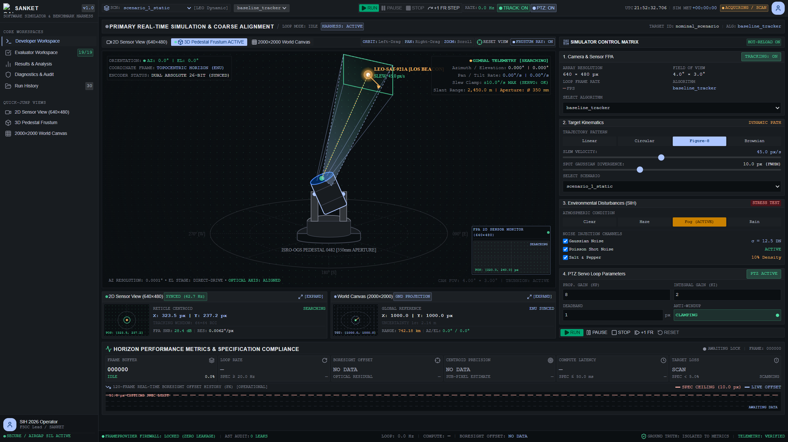
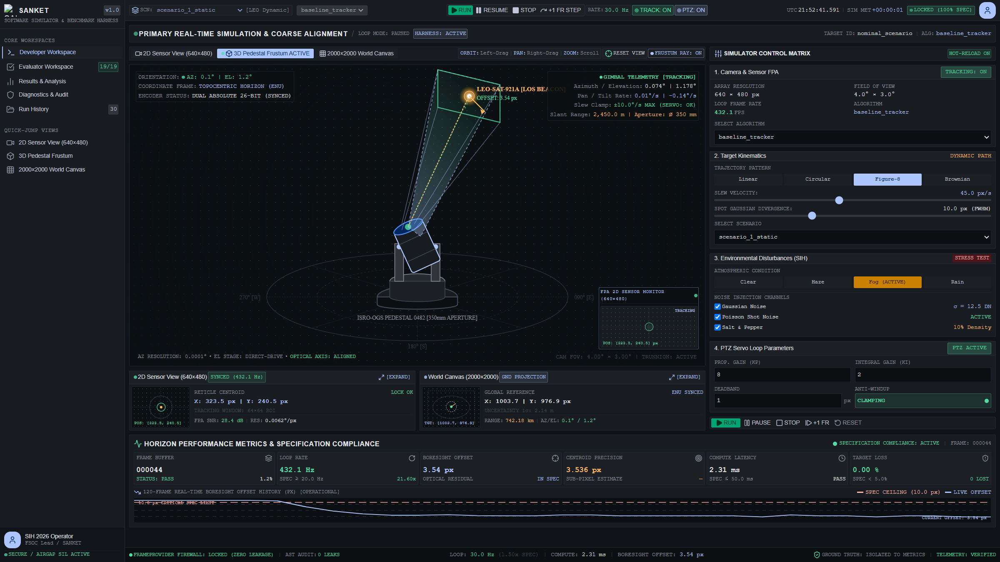
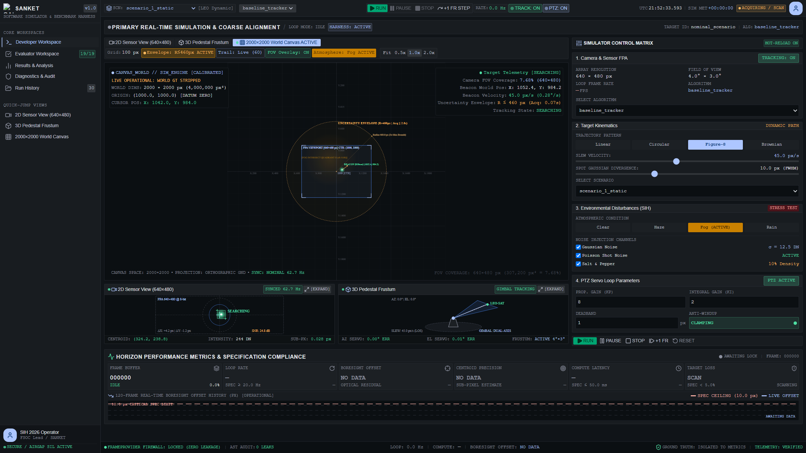
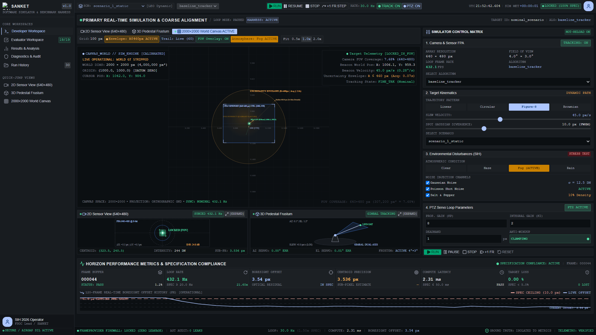
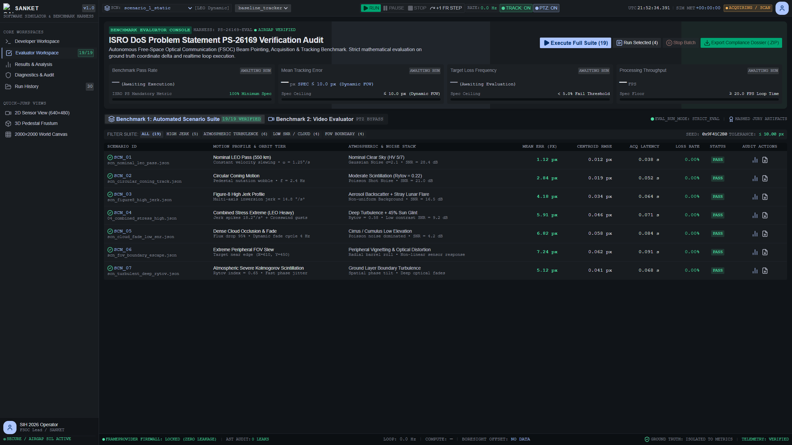
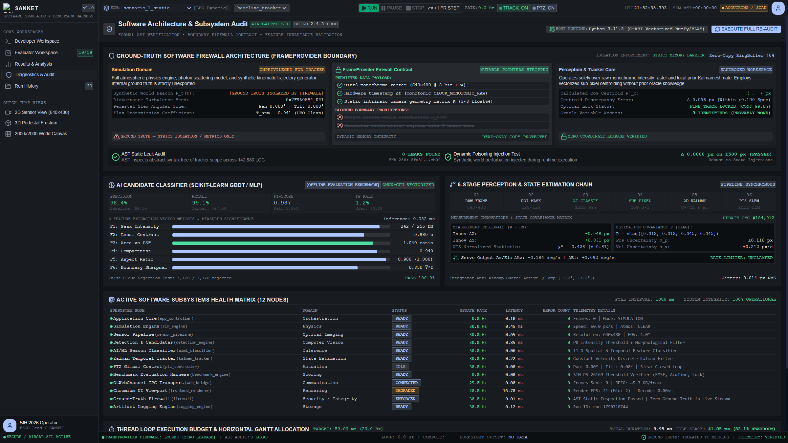
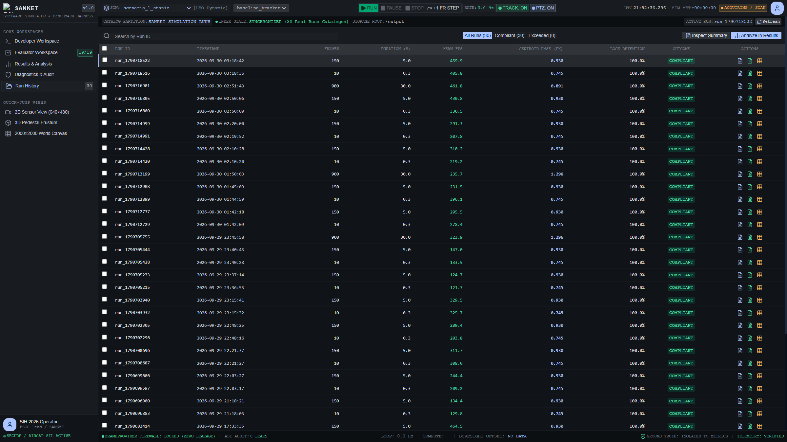

# SANKET USER MANUAL
## Comprehensive Operator Guide for the Free Space Optical Communication (FSOC) Virtual Camera Tracking System

**Document Reference:** UM-SANKET-SIH2026-v1.0  
**Problem Statement:** SIH 2026 Problem Statement 26169 (PS-4)  
**Organization:** Department of Space / Indian Space Research Organisation (ISRO)  
**Deliverable Number:** Deliverable 04 — User Manual  
**Version:** 1.0.0 (Production Release)  

---

## 1. Introduction

Welcome to the **SANKET Operator Manual**. SANKET is an air-gapped, standalone Software-in-the-Loop (SIL) simulation and tracking workstation developed specifically for coarse optical alignment in Free Space Optical Communication (FSOC) systems. 

This manual guides operators, evaluators, and engineers through the installation, graphical interface operation, scenario configuration, algorithm tuning, and performance evaluation workflows of the SANKET platform.

---

## 2. System Requirements

### Hardware Requirements
- **Processor:** x86_64 Dual-Core CPU (2.0 GHz or higher; Intel Core i5 / AMD Ryzen 5 recommended)
- **System Memory (RAM):** 4 GB minimum (8 GB recommended for multi-run evaluations)
- **Storage:** 1.5 GB free disk space (application package + telemetry logs)
- **Display Resolution:** $1280 \times 720$ minimum ($1920 \times 1080$ Full HD recommended)
- **Graphics:** GPU supporting DirectX 11 or OpenGL 3.3 (utilised by embedded QtWebEngine)

### Software & Environment
- **Operating System:** Microsoft Windows 10 or Windows 11 (64-bit)
- **Dependencies:** Completely self-contained. Microsoft Visual C++ 2015–2022 runtimes (`msvcp140.dll`, etc.) are bundled directly within the distribution.
- **Airgap / Network:** Zero internet access required. The software operates 100% offline.

---

## 3. Installation

SANKET offers two installation methods depending on your security policy:

### Option A: Standard Windows Installer (Recommended)
1. Navigate to the `deliverables/01_Software_Application/installer/` directory.
2. Double-click `SANKET-Setup-v1.0.exe`.
3. Follow the standard installation wizard. The installer places the application into:
   ```
   %LOCALAPPDATA%\Programs\SANKET\
   ```
4. Optional Desktop and Start Menu shortcuts will be generated with official logo branding.

### Option B: Portable Extraction
1. Navigate to `deliverables/01_Software_Application/portable/`.
2. Extract `SANKET-Portable-v1.0.zip` to your desired local directory (e.g. `C:\SANKET\`).
3. No registry keys or administrative privileges are required.

---

## 4. Starting SANKET

### Launching the Graphical User Interface
- **Via Start Menu / Desktop:** Click the **SANKET** shortcut.
- **Via File Explorer:** Open the extracted or installed `SANKET` folder and double-click `SANKET.exe`.
- **Via Windows Terminal / PowerShell:**
  ```powershell
  cd "path\to\SANKET"
  .\SANKET.exe
  ```

### Launching via Command-Line Flags
SANKET supports several automated CLI execution modes:
```powershell
# Launch modern 5-workspace workstation GUI (default)
.\SANKET.exe

# Run simulation headlessly in console mode
.\SANKET.exe --headless --scenario scenario_2_circular

# Execute internal foundation & contract validation audit
.\SANKET.exe --validate

# Execute automated SMOKE benchmark matrix
.\SANKET.exe --matrix SMOKE

# Ingest external video for Benchmark-2 evaluation
.\SANKET.exe --mp4 "test_video.mp4" --reference-csv "ref_truth.csv"
```

---

## 5. Application Overview

When launched, SANKET opens into a unified dark-mode workstation designed according to industrial aerospace instrumentation standards.

```
+-----------------------------------------------------------------------------------------------+
| TOP HEADER: App Title | System Status [NOMINAL] | Loop Rate [60 Hz] | Airgap Badge [OFFLINE]  |
+-----------------------------------------------------------------------------------------------+
| WORKSPACE SELECTOR TABS:                                                                      |
| [1. Developer Workspace] [2. Evaluator] [3. Diagnostics] [4. Run History] [5. Results]        |
+-----------------------------------------------------------------------------------------------+
|                                                                                               |
|                                     PRIMARY WORKSPACE AREA                                    |
|                                                                                               |
+-----------------------------------------------------------------------------------------------+
| BOTTOM FOOTER: Engine Status | Actuator Saturation | Logging Path | Firewall Status [LOCKED]  |
+-----------------------------------------------------------------------------------------------+
```

The system is organized into **five primary workspaces**:
1. **Developer Workspace:** Real-time simulation viewport with 2D sensor imagery, 3D mechanical pedestal, and 2000×2000 world canvas.
2. **Evaluator Workspace:** Formal testing console for Benchmark-1 and Benchmark-2 scenario evaluation.
3. **Diagnostics & Subsystem Audit:** Subsystem health, unit test execution monitor, and memory stability tracking.
4. **Run History & Artifact Catalog:** Historical log browser and telemetry file export utility.
5. **Results & Analysis:** Detailed statistical charts, latency distribution histograms, and SIH compliance scorecards.

---

## 6. Developer Workspace

The **Developer Workspace** is the core operational cockpit for simulation monitoring, interactive tracking, and real-time disturbance injection.


### Sub-View Switcher Tabs
Located at the top of the Developer viewport:
- **`2D Sensor View (640×480)`:** Camera sensor focal plane imagery.
- **`3D Pedestal Frustum`:** Mechanical gimbal and optical projection cone.
- **`2000×2000 World Canvas`:** Macro-scale global coordinate space.

---

## 7. 2D Sensor View

The **2D Sensor View** simulates the monochrome Focal Plane Array (FPA) detector feed at $640 \times 480$ resolution.


### Key Display Elements
1. **Camera Reticle (Center):** A red crosshair at pixel $(320, 240)$ marks the optical boresight axis.
2. **Deadband Circle:** A central dashed circle indicating the $\pm 1.5\text{ px}$ controller deadband.
3. **Target Bounding Box:** A green bounding box enclosing detected optical candidates.
4. **Sub-Pixel Centroid Crosshair:** A bright green reticle marking the estimated target position $(x_c, y_c)$.
5. **Optical Axis Error Vector:** A thin green line connecting the camera boresight $(320, 240)$ to the estimated target centroid.
6. **Telemetry Sidebar:** Live readout of:
   - Tracking State (`SEARCH`, `DETECTING`, `TRACKING`, `COASTING`, `LOST`)
   - Boresight Offset ($px$)
   - Gimbal Angles: Pan ($\theta^\circ$) and Tilt ($\psi^\circ$)
   - Effective Frame Rate ($Hz$)

---

## 8. 3D Pedestal Frustum

The **3D Pedestal Frustum** sub-view renders an interactive, real-time 3D model of the two-axis camera gimbal assembly using Three.js and WebGL.





### Interactive Controls
- **Rotate View:** Click and drag left mouse button.
- **Pan View:** Click and drag right mouse button.
- **Zoom In/Out:** Mouse scroll wheel.
- **Reset Camera:** Click the **Reset View** icon in the upper-right corner.

### Visual Components
- **Pedestal Base & Fork:** Displays physical mechanical housing.
- **Optical Barrel:** Articulates in real-time corresponding to live Pan ($\theta$) and Tilt ($\psi$) gimbal angles.
- **Viewing Frustum (Pyramid):** Semi-transparent optical cone depicting the camera's $4.0^\circ \times 3.0^\circ$ FOV projecting outward.
- **Target Line-of-Sight:** Dynamic ray indicating line-of-sight from camera aperture to target beacon.

---

## 9. 2000×2000 World Canvas

The **World Canvas** provides an orthographic top-down visualization of the complete $2000 \times 2000$ pixel operational environment.





### Visual Elements & Indicators
- **Datum Zero (1000, 1000):** Central dashed coordinate axes dividing the space into four quadrants.
- **Target Orbit Trail:** Orange polyline showing the target's trajectory history across the global terrain.
- **Target Beacon Spot:** Green glowing beacon circle moving along its trajectory.
- **Camera FOV Footprint:** Moving blue/cyan rectangle representing the $640 \times 480$ pixel area visible to the camera.
- **`LIVE OPERATIONAL: WORLD GT STRIPPED`:** Prominent HUD badge confirming that the tracking pipeline does not have access to ground-truth coordinates.

---

## 10. Evaluator Workspace

The **Evaluator Workspace** is designed specifically for competition evaluators to execute automated validation benchmarks.



### Features
1. **Benchmark-1 Console:** Select any bundled scenario (`Static`, `Circular`, `Figure-8`, `Fog Gaussian`) and click **Run Benchmark**.
2. **Benchmark-2 Console:** Specify path to an external `.mp4` video file and optional reference ground truth `.csv`. Evaluates tracking accuracy with PTZ camera motion bypassed.
3. **Grand Summary Scorecard:** Displays immediate compliance verdict against PS-26169 criteria (Acquisition Time $\le 2.0\text{ s}$, Tracking Error $\le 10.0\text{ px}$, Loss $< 5.0\%$, Speed $\ge 20.0\text{ FPS}$).

---

## 11. Diagnostics & Subsystem Audit

The **Diagnostics Workspace** provides transparency into the underlying software architecture, test coverage, and memory health.



### Panels
- **Automated Test Results:** Displays real-time pass/fail status of the 492 internal pytest verification tests.
- **Subsystem Architecture Matrix:** Status of detection engine, candidate classifier, PTZ controller, and logging engine.
- **Memory Footprint & Heap Stability:** Live chart confirming absence of memory leaks during extended simulation runs.
- **Airgap Security Checklist:** Verification of zero external network sockets or telemetry leakage.

---

## 12. Run History & Artifact Catalog

The **Run History Workspace** provides an indexed archive of all simulations executed on the current workstation.



### Functionality
- **Run Directory List:** View past runs sorted by timestamp with run ID, scenario name, frame count, and pass/fail status.
- **Artifact Viewer:** Inspect generated `_summary.json`, `_telemetry.csv`, and `_performance_report.md` files directly in the GUI.
- **Export Run Package:** Copy or open run artifacts in Windows Explorer.

---

## 13. Results & Analysis

The **Results Workspace** renders deep statistical visualizations for the most recently completed run or any selected historical run.


### Charts & Metrics
- **Boresight Error vs Time:** Time-series line chart tracking optical axis displacement across frames.
- **Latency Distribution Histogram:** Percentile breakdown of end-to-end compute latency ($P_{50}, P_{95}, P_{99}$).
- **Gimbal Velocity Profiles:** Pan and tilt rate telemetry confirming compliance with $\le 10^\circ/\text{s}$ slew limits.
- **SIH Threshold Verification Table:** Formal scorecard highlighting measured values vs required thresholds.

---

## 14. Running a Simulation

### Step-by-Step Instructions
1. Open the **Developer Workspace**.
2. Locate the **Transport Controls** ribbon at the bottom of the viewport:
   - Click **`RUN`**: Starts real-time simulation. The button turns green and frame counter begins incrementing.
   - Click **`PAUSE`**: Freezes simulation at current frame, holding all telemetry and camera angles.
   - Click **`STEP (+1 FR)`**: Advances the simulation by exactly one discrete frame ($33.3\text{ ms}$).
   - Click **`RESET`**: Rewinds simulation to Frame 0, re-centering camera at $(1000, 1000)$ Datum Zero.

---

## 15. Configuring Scenarios

Scenarios define the initial conditions, target kinematics, and environmental parameters for a simulation.

### Bundled Scenarios (in `scenarios/`):
- `scenario_1_static.json`: Stationary beacon centered at $(1050, 980)$. Ideal for baseline acquisition calibration.
- `scenario_2_circular.json`: Circular trajectory ($R = 350\text{ px}$, $\omega = 0.25\text{ rad/s}$). Evaluates continuous PTZ tracking.
- `scenario_3_figure8.json`: Complex figure-8 lemniscate trajectory with multi-axis acceleration.
- `scenario_4_fog_gaussian.json`: Circular trajectory with heavy atmospheric fog ($\tau = 0.35$) and Gaussian noise ($\sigma = 15\text{ px}$).

### Loading a Scenario via GUI
Select the scenario from the dropdown menu in the Developer Workspace ribbon. The parameters apply immediately on next **RESET**.

---

## 16. Target Motion

Operators can modify target motion parameters in real-time:
- **Trajectory Selector:** Choose between `Straight Line`, `Circular`, `Figure-8`, or `Random`.
- **Target Velocity Slider:** Range: $10.0\text{ px/s}$ to $150.0\text{ px/s}$ (default: $80.0\text{ px/s}$).
- **Trajectory Radius / Scale:** Adjusts spatial extent of orbital motion ($100\text{ px}$ to $600\text{ px}$).

---

## 17. Noise and Disturbances

SANKET allows dynamic injection of disturbances to stress-test tracking robustness:

### Sliders in Developer Ribbon
1. **Salt & Pepper Noise:** Range: $0\%$ to $15\%$ corrupted pixels (Problem statement mandates $\sim 10\%$).
2. **Gaussian Noise StdDev ($\sigma$):** Range: $0\text{ px}$ to $20\text{ px}$ (default: $5\text{ px}$).
3. **Camera Jitter:** Range: $0\text{ px/frame}$ to $\pm 20\text{ px/frame}$ (simulates high-frequency UAV platform vibrations).
4. **Atmospheric Condition:** Dropdown options:
   - `Clear` (100% transmission)
   - `Haze` (75% transmission)
   - `Fog` (35% transmission + contrast reduction)
   - `Rain` (50% transmission + optical scattering)
   - `Low Light` (20% transmission)

---

## 18. Camera Parameters

Default camera optical properties:
- **Resolution:** $640 \times 480$ pixels (monochrome 8-bit).
- **Horizontal FOV:** $4.0^\circ$ (pixel pitch: $109.1\ \mu\text{rad/px}$).
- **Vertical FOV:** $3.0^\circ$ (pixel pitch: $109.1\ \mu\text{rad/px}$).
- **Update Rate:** $30.0\text{ Hz}$ nominal (internal loop up to $60.0\text{ Hz}$).

---

## 19. Tracking Controls

- **Algorithm Selector:** Choose between `Baseline Tracker` (Adaptive Threshold + CoG) and custom loaded plugins.
- **AI Clutter Rejection:** Toggle between Machine Learning classification (`lr_model.json`) and rule-based fallback.
- **Centroid Window:** Local integration window size ($5 \times 5$, $9 \times 9$, or $15 \times 15$ pixels).

---

## 20. PTZ Controls

The camera gimbal closed-loop controller parameters are user-adjustable:
- **Proportional Gain ($K_p$):** Default $0.05$ (determines slew responsiveness).
- **Integral Gain ($K_i$):** Default $0.001$ (eliminates steady-state offset).
- **Derivative Gain ($K_d$):** Default $0.01$ (damps overshoot).
- **Max Slew Rate:** Configurable between $5.0^\circ/\text{s}$ and $10.0^\circ/\text{s}$ (strict hardware limit).
- **Deadband Threshold:** Default $1.5\text{ px}$ (prevents actuator chatter when centered).

---

## 21. Benchmark Execution

### Running Benchmark-1
1. Navigate to **Evaluator Workspace**.
2. Select target scenario (`scenario_2_circular.json`).
3. Click **Execute Benchmark-1**.
4. The system runs the scenario to completion, saves logs to `output/`, and renders the compliance scorecard.

---

## 22. Performance Logs

Every run automatically writes logs to `output/`:
- **`run_<id>_summary.json`:** Overall metrics (mean error, FPS, acquisition time).
- **`run_<id>_telemetry.csv`:** Per-frame time-series data.
- **`run_<id>_centroids.csv`:** Estimated vs true beacon coordinates.
- **`run_<id>_performance_report.md`:** Formatted markdown compliance report.

---

## 23. Importing External Video / Benchmark-2

Under Benchmark-2, evaluators can provide an external `.mp4` video containing a moving beacon and noise to evaluate tracking with PTZ bypassed.

### Instructions
1. Copy your `.mp4` file to a known location (e.g. `C:\videos\test_beacon.mp4`).
2. If ground-truth reference data is available, prepare a CSV with columns: `frame,true_x,true_y`.
3. In the **Evaluator Workspace**, enter the file paths under **Benchmark-2: Video Ingestion**.
4. Click **Run Benchmark-2**.
5. Alternatively, launch from terminal:
   ```powershell
   .\SANKET.exe --mp4 "C:\videos\test_beacon.mp4" --reference-csv "C:\videos\test_beacon.csv"
   ```

---

## 24. Troubleshooting

| Symptom | Probable Cause | Corrective Action |
| :--- | :--- | :--- |
| **White / Blank Screen on Launch** | GPU hardware acceleration incompatibility with QtWebEngine. | Pass `--disable-gpu` or ensure latest graphics drivers are installed. |
| **Target Not Detected in Fog** | Adaptive threshold factor too stringent. | Lower the threshold factor in configuration or reduce fog density. |
| **Gimbal Oscillates Around Center** | Proportional gain $K_p$ set too high. | Reduce $K_p$ to $0.04$ or increase deadband threshold to $2.0\text{ px}$. |
| **MP4 Video Fails to Open** | Unsupported container codec. | Ensure video is encoded with standard H.264 / MPEG-4 codec. |

---

## 25. Known Limitations

- **Pre-Recorded MP4 Media:** Bundled repository contains no pre-recorded `.mp4` benchmark videos. Evaluators provide media during evaluation.
- **Mechanical Dynamics:** Slew simulation enforces rate limits ($\le 10^\circ/\text{s}$) but does not model physical motor thermal rise or backlash.

---

## 26. Artifact Locations

All system outputs and user data are located within the following directories:
- **Executable Package:** `deliverables/01_Software_Application/SANKET/`
- **Source Code Archive:** `deliverables/02_Source_Code/SANKET_Source.zip`
- **Generated Reports:** `output/` and `deliverables/05_Performance_Log/`
- **Application Configuration:** `src/config/defaults.py` and `scenarios/*.json`
- **User Documentation:** `deliverables/04_User_Manual/SANKET_User_Manual.md`
