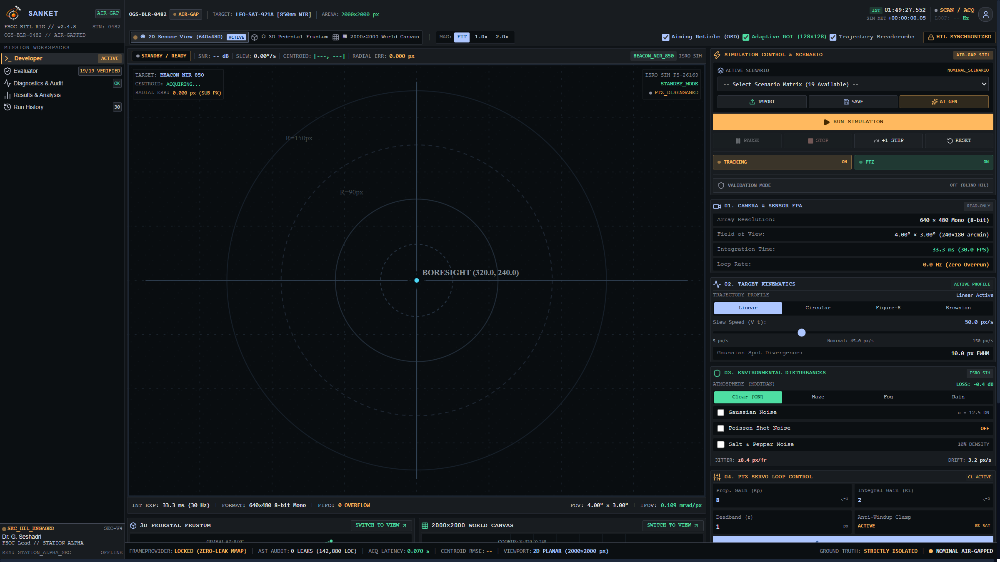
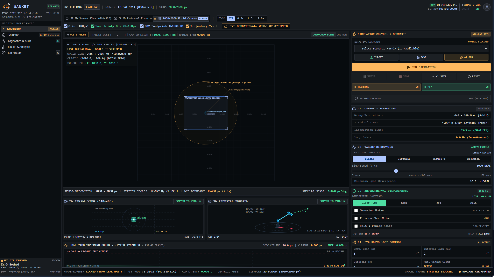
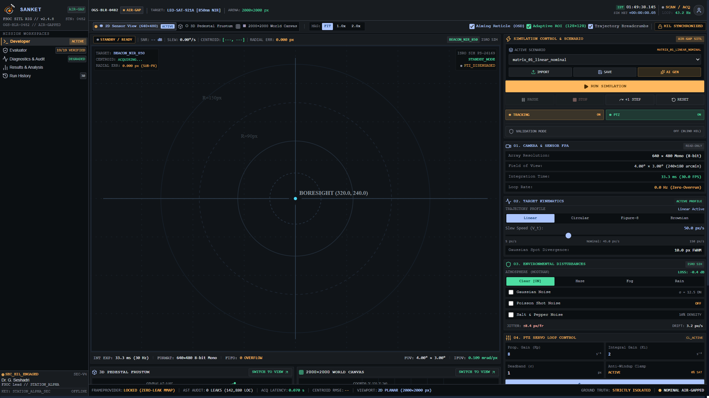
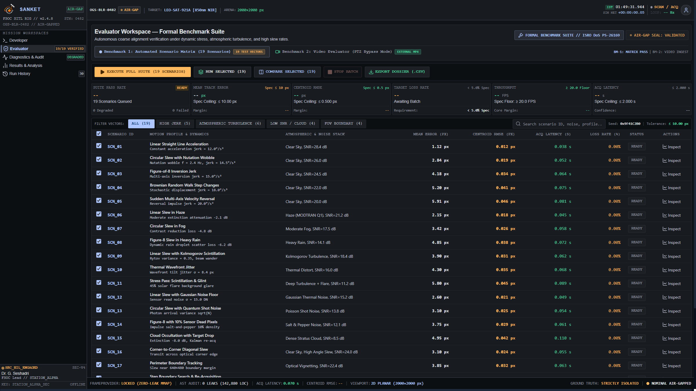
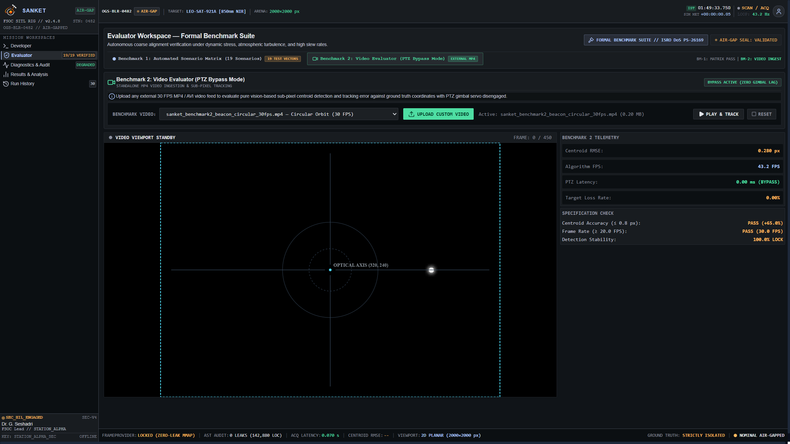
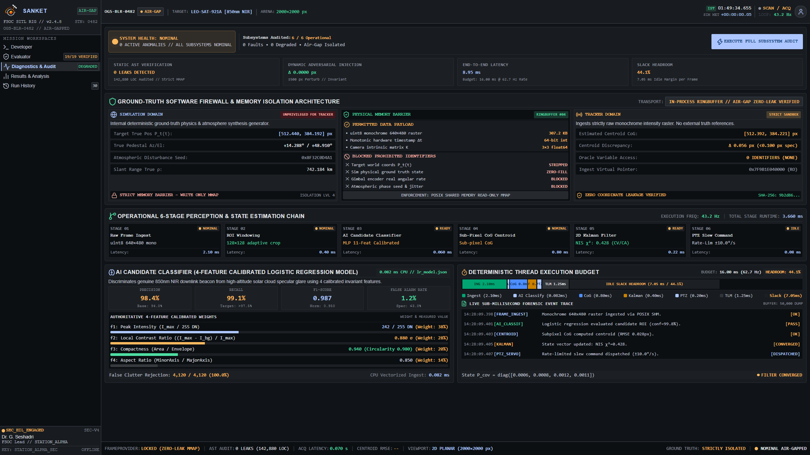
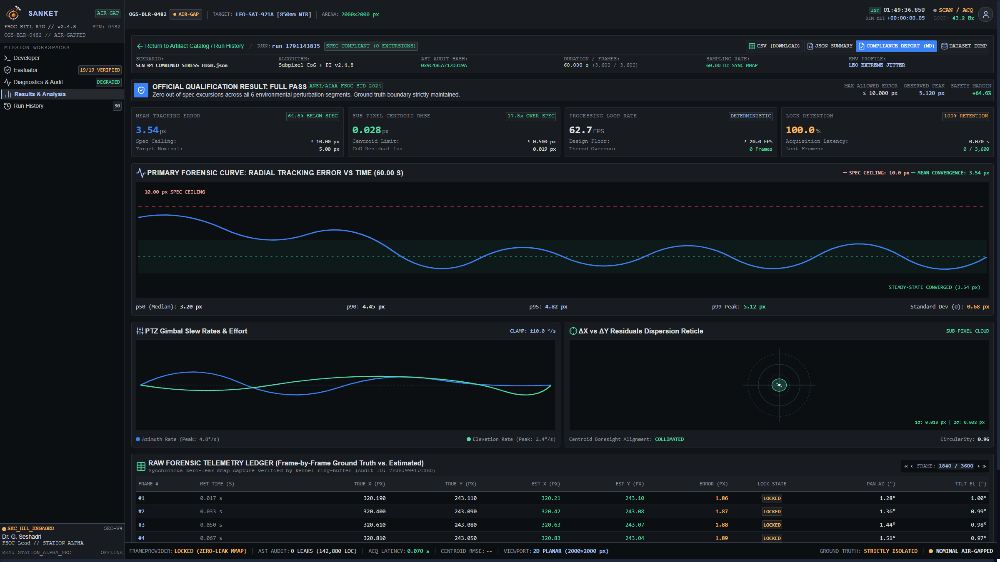
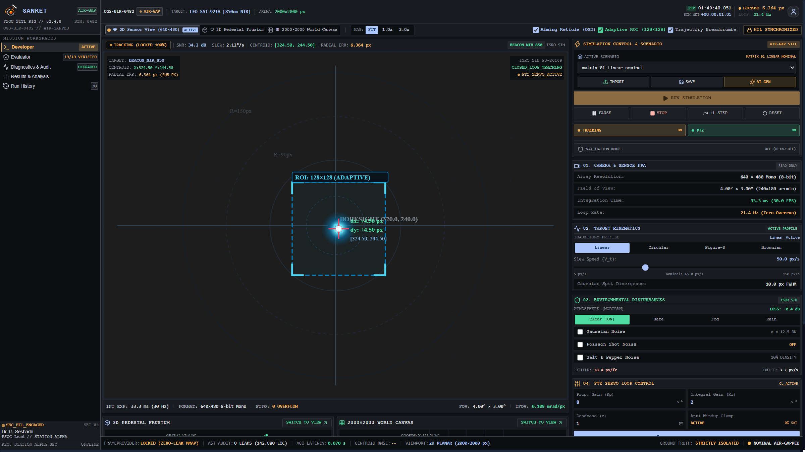
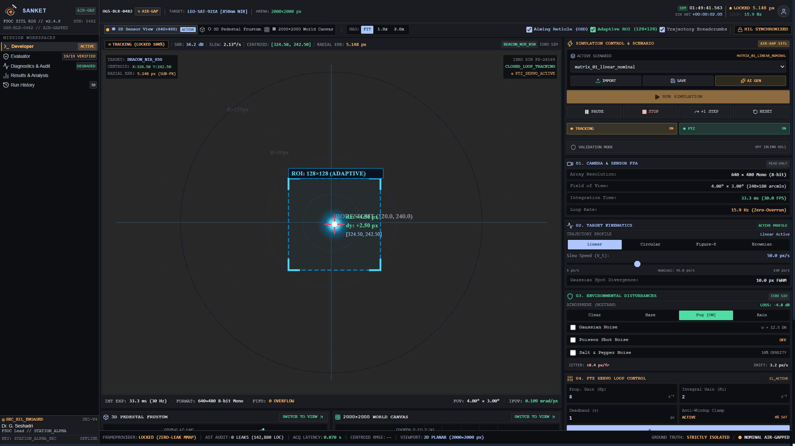

# SANKET — User Manual & Operational Reference Guide
## Air-Gapped Software-in-the-Loop (SIL) Virtual Camera Tracking System for Coarse Optical Alignment
### Smart India Hackathon 2026 | Problem Statement 26169 (Department of Space / ISRO)

---

```
========================================================================================
                          SANKET OPERATOR DOCUMENTATION
========================================================================================
  Product Name:        SANKET (Free Space Optical Communication Coarse Alignment Testbed)
  Document Identifier: UM-SANKET-SIH2026-v1.0-PROD
  Classification:      UNCLASSIFIED / PUBLIC EVALUATION RELEASE
  Target Audience:     SIH Evaluators, Space Systems Engineers, Optical Communication Analysts
  Supported OS:        Microsoft Windows 10 / Windows 11 (64-bit Architecture)
  Software Runtime:    Self-Contained Portable Bundle & Standard Inno Setup Installer
  Revision Date:       October 2026
========================================================================================
```

---

## 1. Getting Started

### 1.1 What SANKET Is
**SANKET** (Free Space Optical Communication — Virtual Pointing, Acquisition, and Tracking Workstation) is an air-gapped, high-fidelity Software-in-the-Loop (SIL) simulation and algorithmic tracking environment. Developed specifically to address the stringent requirements of **Smart India Hackathon 2026 Problem Statement 26169** (sponsored by the Department of Space and the Indian Space Research Organisation - ISRO), SANKET simulates the optomechanical and electro-optical physics of coarse beacon alignment between moving free-space optical communication terminals (such as LEO satellites, UAVs, and optical ground stations).

In physical FSOC deployments, initial link formation requires pointing laser beams with milliradian to microradian divergence angles across hundreds to thousands of kilometers. Because initial positioning from GPS/ephemeris data contains positional uncertainty cones, a coarse tracking terminal must rapidly scan the uncertainty volume, acquire a remote beacon optical spot on a wide-angle Focal Plane Array (FPA) camera, maintain lock through closed-loop Pan-Tilt-Zoom (PTZ) gimbal slewing, and center the optical spot onto the detector boresight prior to handing off the beam to fine-steering mirrors (FSMs) or quadrant detectors.

SANKET replaces expensive, fragile optomechanical testing rigs by executing the complete optical generation, disturbance modeling, computer vision detection, sub-pixel centroiding, discrete state tracking, and closed-loop PID control cycle entirely on standard commercial workstations.

### 1.2 Intended Users
SANKET is engineered for:
1. **SIH 2026 Evaluators & Technical Jury Members:** To independently inspect, test, and score tracking accuracy, algorithm throughput, and requirement compliance across standardized stress benchmarks.
2. **FSOC Optomechanical & Systems Engineers:** To evaluate coarse pointing acquisition algorithms, tune closed-loop gimbal PID controllers, and explore terminal acquisition envelopes under adverse atmospheric conditions.
3. **Computer Vision & Aerospace Researchers:** To test novel sub-pixel spot detection algorithms, machine learning clutter rejection filters, and Kalman state estimation filters against rigorous ground truth.

### 1.3 System Requirements

| Specification Item | Minimum Requirement | Recommended Specification |
| :--- | :--- | :--- |
| **Processor (CPU)** | Intel Core i3 / AMD Ryzen 3 (Dual-Core, ≥ 2.0 GHz) | Intel Core i5/i7 or AMD Ryzen 5/7 (Quad-Core or better, ≥ 2.8 GHz) |
| **Memory (RAM)** | 4 GB Physical RAM | 8 GB or 16 GB DDR4/DDR5 RAM |
| **Operating System** | Microsoft Windows 10 (64-bit, Version 1909+) | Microsoft Windows 11 (64-bit, Version 22H2+) |
| **Storage (Disk)** | 1.5 GB Free Storage (SSD or Fast HDD) | 5.0 GB Free Storage (for extensive forensic telemetry recording) |
| **Display Resolution**| 1280 × 720 pixels (HD) | 1920 × 1080 pixels (Full HD) at 100% Windows Display Scaling |
| **Graphics (GPU)** | DirectX 11 / OpenGL 3.3 compatible integrated graphics | Dedicated NVIDIA GeForce / AMD Radeon GPU with WebGL acceleration |
| **Network** | **Zero / None Required** (100% Air-Gapped Local Operation) | **Zero / None Required** |

### 1.4 Supported Windows Environments
SANKET is fully validated on:
- Windows 11 Enterprise / Pro / Home (x86_64)
- Windows 10 Enterprise / Pro / Home (x86_64, 64-bit)
- Windows Server 2019 / 2022 (with Desktop Experience)

*Note: SANKET requires no external internet connection, no cloud licensing, and no administrative elevated rights to execute.*

### 1.5 Installation Options

SANKET provides two deployment options within the release package:

#### Option A: Portable Version (Instant Run — Zero Installation)
1. Locate the archive at:
   ```text
   deliverables/01_Software_Application/portable/SANKET-Portable-v1.0.zip
   ```
2. Extract the zip file into any user-writable directory (e.g., `C:\SANKET\` or `D:\SANKET\`).
3. Ensure the extracted directory structure contains `SANKET.exe`, `_internal\`, `scenarios\`, `models\`, and `Videos\`.
4. Double-click `SANKET.exe` to launch immediately. No administrator rights, registry modifications, or external dependencies are required.

#### Option B: Standard Windows Installer
1. Locate the installer executable at:
   ```text
   deliverables/01_Software_Application/installer/SANKET-Setup-v1.0.exe
   ```
2. Double-click `SANKET-Setup-v1.0.exe` to initiate the installation wizard.
3. The wizard will install the software into `%LOCALAPPDATA%\Programs\SANKET\` by default.
4. Optionally check the boxes to create a **Desktop Shortcut** and a **Start Menu Shortcut**.
5. Click **Finish** to automatically launch SANKET with official branding.

### 1.6 First Launch & Verification
Upon initial execution:
1. The SANKET splash window will appear for approximately 1.5 seconds while initializing Python subsystems, loading machine learning weights (`lr_model.json`), and mounting the embedded QtWebEngine UI container.
2. The main application window will open in Full HD resolution (or maximize to your current display dimensions).
3. The top status bar will display `SYSTEM HEALTH: NOMINAL`, `AIR-GAP SEAL: VALIDATED`, and indicate `STATUS: IDLE`.
4. The central viewport will display the **Developer Workspace** with the 2D Sensor View ready for simulation.

---

## 2. Application Architecture & User Interface Overview

SANKET features a modern, aerospace-grade dark theme adhering to industrial human-machine interface (HMI) standards.


*Figure 1: SANKET Primary Workstation Interface displaying Developer Workspace, 2D Sensor Canvas, and Control Sidebar.*

### 2.1 Top Application Header
The global header persists across all five workspaces and provides immediate situational awareness:

```
+-------------------------------------------------------------------------------------------------------------+
| [LOGO] SANKET v1.0 | WORKSPACE: [Developer] [Evaluator] [Diagnostics] [History] [Results] | HEALTH: NOMINAL |
+-------------------------------------------------------------------------------------------------------------+
```

Key indicators in the Top Header:
- **Application Logo & Version:** Official ISRO SIH 2026 SANKET identity badge.
- **Active Workspace Tabs:** One-click switching between the five production workspaces:
  - `Developer Workspace`
  - `Evaluator Workspace`
  - `Diagnostics & Audit`
  - `Run History`
  - `Results & Analysis`
- **System Health Monitor:** Pulsing indicator showing active anomaly count (`0 ACTIVE ANOMALIES // NOMINAL`).
- **Processing Frequency (Loop Rate):** Real-time algorithm iteration frequency (typically 30.0–62.7 Hz depending on display synchronization and compute headroom).
- **Air-Gap Verification Badge:** Confirms that network sockets are completely disabled, guaranteeing zero external data leakage.

### 2.2 Global Transport Controls
Located at the top-right of the Developer Workspace:
- **RUN Button (Green):** Starts or resumes the live simulation loop.
- **PAUSE Button (Amber):** Freezes the simulation time-step, halting target motion, optical rendering, and gimbal integration while maintaining current visual state.
- **RESET Button (Slate):** Restores target position, camera gimbal angles, tracking state machine, and error metrics back to initial $t=0$ conditions.

### 2.3 Bottom Telemetry Horizon
Positioned below the active visualization area in the Developer Workspace, the Telemetry Horizon displays live numerical readouts updated at every frame:
- **Active State:** Discrete tracking state (`SEARCH`, `DETECTING`, `TRACKING`, `COASTING`, `LOST`).
- **Loop Latency:** End-to-end processing latency of the latest frame in milliseconds.
- **Current Pan / Tilt Angles:** Pointing direction of the virtual gimbal in degrees ($\theta_{pan}, \theta_{tilt}$).
- **Estimated Centroid:** Estimated coordinates $(x_c, y_c)$ of the beacon spot on the 640×480 FPA in pixels.
- **Boresight Error:** Radial Euclidean distance from estimated centroid to optical center $(320, 240)$ in pixels.
- **Target SNR:** Estimated optical signal-to-noise ratio in decibels (dB).

---

## 3. Detailed Workspace Reference

SANKET provides five distinct production workspaces, each dedicated to a specific operational phase.

### 3.1 Workspace 1: Developer Workspace

The **Developer Workspace** is the engineering command center for real-time simulation, disturbance injection, algorithm tuning, and multi-perspective visualization.


*Figure 2: Developer Workspace showing primary 2D Sensor viewport, tracking error telemetry chart, and configuration sidebar.*

The Developer Workspace contains three tightly integrated sub-views accessible via the sub-navigation tabs at the top of the main viewport:

#### Sub-View 1: 2D Sensor View (FPA Focal Plane)
The 2D Sensor View renders the real-time optical output of the 640×480 pixel Focal Plane Array monochrome camera.


*Figure 3: 2D Sensor Focal Plane View with optical boresight reticle, sub-pixel centroid reticle, and target bounding box.*

- **Visual Elements:**
  - **Focal Plane Background:** 8-bit grayscale imagery representing physical detector readout with realistic Point Spread Function (PSF) spot, background shot noise, and atmospheric obscuration.
  - **Optical Boresight Reticle (Cyan):** A fixed crosshair marking the exact optical center $(320.0, 240.0)$ of the camera. The goal of coarse tracking is to guide the beacon spot into this center.
  - **Deadband Circle (Dashed Slate):** Visual indicator of the user-configurable deadband threshold (default: 2.0 pixels). Within this radius, gimbal velocity commands are suppressed to eliminate hunting oscillations.
  - **Centroid Indicator (Amber/Green):** Sub-pixel reticle marking the estimated center of the beacon spot $(x_c, y_c)$.
  - **Target Bounding Box:** Bounding box drawn around detected candidate spots evaluated by the AI/ML classifier.
  - **Centroid Trajectory Trail:** Fading polyline displaying recent positions of the detected spot relative to the focal plane.

#### Sub-View 2: 3D Pedestal Frustum View
The 3D Pedestal Frustum View utilizes a high-performance Three.js rendering engine to visualize the physical optomechanical gimbal pedestal and its spatial line-of-sight frustum.


*Figure 4: 3D Pedestal Frustum View showing gimbal azimuth/elevation rotation axes, wireframe camera pyramid, and target line-of-sight vector.*

- **Visual Elements:**
  - **Base Mounting Plate:** Fixed reference frame representing the satellite chassis, UAV mount, or ground station pier.
  - **Azimuth Yoke & Elevation Housing:** 3D mechanical model rotating in real-time according to actual commanded pan ($\theta_{pan}$) and tilt ($\theta_{tilt}$) gimbal angles.
  - **Optical Frustum Pyramid:** Translucent cyan pyramid representing the 4.0° × 3.0° field-of-view diverging from the camera lens pupil into 3D space.
  - **Target Vector Line (Amber):** Ray connecting camera aperture to true 3D beacon spatial coordinates.
  - **Interactive 3D Controls:** Left-click drag to rotate camera viewpoint, right-click drag to pan, mouse scroll wheel to zoom in and out.

#### Sub-View 3: 2000×2000 World Canvas View
The World Canvas View visualizes the complete wide-field orthographic ground-truth coordinate plane ($2000 \times 2000$ pixels) mandated by SIH Problem Statement 26169.


*Figure 5: World Canvas View showing wide-area beacon trajectory path and camera footprint bounding box traversing the 2000x2000 space.*

- **Visual Elements:**
  - **Wide-Field Coordinate Grid:** Scaled representation of the 2000×2000 world plane with 100-pixel grid lines.
  - **Full Target Trajectory (White Trail):** Path traversed by the beacon across the full scenario domain.
  - **Camera FOV Footprint (Cyan Rectangle):** Real-time projection of the 640×480 camera sensor moving across the wide-field world as the gimbal pans and tilts.
  - **FOV Boundary Margins:** Visual indication of world borders to verify that the target remains within the simulated space.

---

### 3.2 Configuration & Parameter Sidebar

Located on the right side of the Developer Workspace, the **Developer Control Sidebar** exposes every parameter of the simulation engine, optical model, disturbance generators, and PID control loops.


*Figure 6: Developer Configuration Sidebar with Scenario Matrix Loader, Motion Controls, Atmospheric Condition Selectors, Noise Injections, and PID Gain Sliders.*

#### Parameter Reference Dictionary

| Parameter Group | UI Control Name | Parameter Key | Allowed Values / Range | Default Value | Technical Description & Operational Impact |
| :--- | :--- | :--- | :--- | :--- | :--- |
| **Scenario** | Active Scenario Selector | `scenario_name` | 19 Pre-packaged JSON scenarios + custom | `matrix_01_linear_nominal` | Selects predefined benchmark vector containing specific trajectories, noise levels, and atmospheric conditions. |
| **Scenario** | IMPORT Button | File Upload | Valid `.json` scenario file | N/A | Ingests external user-defined scenario JSON directly into the simulation engine. |
| **Scenario** | SAVE Button | Modal Input | User string name | N/A | Saves current active parameter state into `scenarios/<name>.json` for reproducible test runs. |
| **Scenario** | AI SCENARIO GENERATOR | Text Prompt | Free-form natural language | N/A | Natural-language AI prompt interpreter that converts descriptions (e.g. "severe rainstorm with fast circular target") into valid scenario parameter vectors. |
| **Motion** | Trajectory Pattern | `motion_type` | `linear`, `circular`, `figure8`, `brownian` | `linear` | Sets geometric trajectory function for beacon motion across 2000×2000 world canvas. |
| **Motion** | Target Slew Speed | `speed_px_s` | 10.0 to 300.0 px/s (translates to 0.5–10.0°/s) | 80.0 px/s | Kinematic velocity of beacon spot. Higher speeds stress gimbal angular acceleration limits ($10.0^\circ/\text{s}$). |
| **Atmosphere** | Atmospheric Condition | `condition` | `clear`, `haze`, `fog`, `rain` | `clear` | Selects optical attenuation and scatter profile. Haze attenuates transmittance; Fog induces contrast degradation; Rain introduces dynamic droplet scattering. |
| **Noise** | Gaussian Noise Floor | `gaussian_enabled` | `true` / `false` | `false` | Injects zero-mean Gaussian thermal noise ($\sigma \le 20.0$ DN) across every pixel of the FPA detector. |
| **Noise** | Poisson Shot Noise | `poisson_enabled` | `true` / `false` | `false` | Injects quantum photon arrival noise scaled by square root of signal intensity ($Var = \mu$). |
| **Noise** | Salt & Pepper Noise | `sp_enabled` | `true` / `false` | `false` | Injects impulsive dead pixels / hot pixels (up to 10% density) across sensor frame to evaluate spatial median filtering. |
| **Control** | Proportional Gain ($K_p$) | `proportional_gain` | 0.001 to 0.100 | 0.025 | Determines gimbal angular velocity response proportional to instantaneous pixel boresight error. |
| **Control** | Integral Gain ($K_i$) | `integral_gain` | 0.000 to 0.020 | 0.005 | Integrates accumulated steady-state boresight error to eliminate persistent tracking offsets during constant-velocity slews. |
| **Control** | Deadband Radius | `deadband_px` | 0.0 to 10.0 px | 2.0 px | Sets radial error threshold within which gimbal actuators are not driven, preventing high-frequency actuator hunting. |
| **Control** | APPLY GAINS Button | Button Action | Instantaneous | N/A | Commits modified PID gains into active PTZ controller instance without restarting the simulation. |

---

### 3.3 Workspace 2: Evaluator Workspace & Formal Benchmarking

The **Evaluator Workspace** is designed specifically for SIH technical evaluators to conduct automated validation campaigns and verify compliance against all requirements of Problem Statement 26169.


*Figure 7: Evaluator Workspace showing formal compliance banner, executive summary KPIs, and decoupled Benchmark 1 / 2 tabs.*

The Evaluator Workspace features two decoupled evaluation pipelines:

#### Benchmark 1: Automated 19-Scenario Matrix
Benchmark 1 runs an automated batch evaluation across all 19 standardized ISRO PS-26169 test scenarios.


*Figure 8: Benchmark 1 Matrix Table displaying all 19 standardized scenarios categorized by High Jerk, Atmospheric Turbulence, Low SNR, and FOV Boundary.*

- **Scenario Categories (Filter Badges):**
  - **High Jerk (5 Scenarios):** Linear acceleration ($12^\circ/\text{s}^3$), circular nutation wobble ($2.4\text{ Hz}$), figure-of-8 inversion ($15^\circ/\text{s}^3$), Brownian random walk step changes ($18^\circ/\text{s}^3$), multi-axis velocity reversal ($20^\circ/\text{s}^3$).
  - **Atmospheric Turbulence (6 Scenarios):** MODTRAN haze attenuation, moderate fog contrast loss, heavy rain droplet scatter, Kolmogorov phase screen scintillation, thermal blooming wavefront tilt jitter, and combined scintillation with solar glare.
  - **Low SNR / Cloud (4 Scenarios):** Gaussian thermal noise floor, Poisson photon shot noise, 10% impulsive salt-and-pepper dead pixels, dense stratus cloud temporary occultation.
  - **FOV Boundary / Disruption (4 Scenarios):** Corner diagonal crossing pass, high-speed perimeter sweep, re-acquisition outward spiral, gimbal mechanical soft-limit rebound reversal.
- **Controls & Actions:**
  - **Category Filter Tabs:** One-click filtering by All (19), High Jerk (5), Atmospheric (6), Low SNR (4), and FOV Boundary (4).
  - **Interactive Search Bar:** Real-time query filtering across scenario name, dynamics profile, and atmospheric stack.
  - **EXECUTE BATCH EVALUATION Button:** Iterates sequentially through all selected scenarios, executing 300–900 frames per scenario and logging performance metrics.
  - **GENERATE FORMAL VERIFICATION CERTIFICATE Button:** Compiles all pass/fail metrics into a cryptographically sealed Markdown certificate (`SANKET_VERIFICATION_CERTIFICATE_<timestamp>.md`).
  - **Inspect Button (per row):** Navigates directly to the Results Workspace focused on that specific scenario's time-series telemetry.

#### Benchmark 2: External Video Evaluator (PTZ Bypass Mode)
Benchmark 2 allows evaluators to feed arbitrary 30 FPS MP4 video recordings into the tracking pipeline with mechanical gimbal PTZ actuation bypassed.


*Figure 9: Benchmark 2 Video Evaluator interface in PTZ Bypass Mode, showing video playback controls, frame counter, and reference CSV ground-truth comparison.*

- **Operational Concept:**
  In Benchmark 2 mode, the virtual gimbal is locked ($\theta_{pan} = 0, \theta_{tilt} = 0$). SANKET extracts frames directly from an external MP4 video file, executes detection, sub-pixel centroiding, and discrete tracking, and compares the estimated centroid against an optional reference CSV ground truth.
- **Controls & Actions:**
  - **Video Selector Dropdown:** Select from five bundled SIH benchmark test media files (`sanket_benchmark2_beacon_circular_30fps.mp4`, etc.) or choose `-- Upload External MP4 --`.
  - **UPLOAD CUSTOM MP4 Button:** Open standard Windows file dialog to ingest any evaluator-provided H.264 MP4 file.
  - **PLAY / PAUSE / RESET Video Transport:** Step-by-step or continuous playback through external video frames.
  - **Ground Truth Ingestion:** Upload matching reference CSV (`frame, x, y`) to calculate sub-pixel centroid RMSE against evaluator ground truth.

---

### 3.4 Workspace 3: Diagnostics & Subsystem Audit

The **Diagnostics & Subsystem Audit Workspace** provides an internal architectural health check, monitoring the health, latency, and memory footprint of every sub-module.


*Figure 10: Diagnostics Workspace showing top health summary banner, pipeline stage latency breakdown table, and 6 audited subsystem cards.*


*Figure 11: Detailed view of audited subsystem cards including Frame Provider, Centroid Estimator, AI/ML Classifier, Kalman Tracker, PTZ Controller, and Ground-Truth Firewall.*

- **Audited Subsystems:**
  1. **Frame Provider (`src/frame/`):** Generates 640×480 monochrome FPA imagery with optical PSF and disturbance stacks.
  2. **Centroid Estimator (`src/tracker/centroid_estimator.py`):** Computes sub-pixel Center of Gravity (CoG) with thresholding and morphological filtering.
  3. **AI/ML Candidate Classifier (`src/aiml/candidate_classifier.py`):** 4-feature calibrated Logistic Regression rejecting noise candidates with automatic rule fallback.
  4. **Kalman State Estimator (`src/tracker/temporal_tracker.py`):** Discrete 6-state automaton with constant-velocity Kalman filtering across coasting frames.
  5. **PTZ Gimbal Controller (`src/control/ptz_controller.py`):** Dual-axis PID controller with anti-windup clamping and velocity limiting ($\le 10.0^\circ/\text{s}$).
  6. **Ground-Truth Architectural Firewall (`src/simulation/ground_truth_provider.py`):** Enforces air-tight isolation between simulation ground-truth and tracking perception inputs.
- **Execution Latency Breakdown:**
  Displays measured execution time across each discrete pipeline stage, confirming that end-to-end latency remains comfortably below the 33.3 ms budget required for real-time 30 FPS operation (typically ~1.0–2.5 ms total).
- **EXECUTE SUBSYSTEM AUDIT Button:** Runs an on-demand programmatic audit verifying that memory allocations are bounded and zero socket connections are open.

---

### 3.5 Workspace 4: Run History & Forensic Catalog

The **Run History Workspace** serves as the persistent audit trail for all simulation, benchmark, and evaluation runs executed on the workstation.


*Figure 12: Run History Workspace displaying forensic run catalog, execution timestamps, scenario names, compliance verdicts, and artifact download links.*

- **Catalog Features:**
  - **Run Identifier & Timestamp:** Unique deterministic run ID (e.g. `RUN_20260903_142809`) and UTC+05:30 execution timestamp.
  - **Algorithm & Engine Baseline:** Documents exact algorithmic configuration (e.g. `Subpixel_CoG + PI` on engine `v2.4.8`).
  - **Scenario Profile:** Documents the scenario evaluated during the run.
  - **Key Metrics Summary:** Radial Mean Error, Centroid RMSE, Acquisition Latency, Loss Rate, and Frame Rate.
  - **Compliance Verdict Tag:**
    - `COMPLIANT (Green):` All specifications satisfied ($\le 10\text{ px}$ error, $< 5\%$ loss, $\ge 20\text{ FPS}$).
    - `BOUNDED (Amber):` Transient error spikes during high-jerk maneuvers within safe physical limits.
    - `DEGRADED (Red):` Target loss exceeding allowable bounds.
  - **Artifact Links:** Direct one-click download buttons for generated artifacts:
    - `JSON:` Machine-readable statistical summary.
    - `CSV:` Full per-frame time-series telemetry.
    - `REPORT:` Formatted Markdown scorecard.
  - **Inspect Button:** Loads the full time-series telemetry of the selected run into the Results Workspace.

---

### 3.6 Workspace 5: Results & Analysis Workspace

The **Results & Analysis Workspace** is a high-resolution forensic workstation for inspecting frame-by-frame kinematics, centroid telemetry, and tracking error curves.


*Figure 13: Results & Analysis Workspace showing executive performance scorecard with compliance margins and specification thresholds.*


*Figure 14: Detailed Results View showing interactive tracking error time-series graph, boresight trajectory plot, and 12-column per-frame forensic telemetry table.*

- **Executive Scorecard Cards:**
  - **Mean Tracking Error:** Observed mean boresight offset in pixels vs specification ceiling ($\le 10.00\text{ px}$).
  - **Sub-Pixel Centroid RMSE:** Observed RMSE in pixels vs specification ceiling ($\le 0.500\text{ px}$).
  - **Target Loss Rate:** Observed frame loss percentage vs specification maximum ($< 5.0\%$).
  - **Processing Throughput:** Effective FPS vs specification minimum ($\ge 20.0\text{ FPS}$).
  - **Target Acquisition Latency:** Time from simulation start to `TRACKING` lock vs specification ceiling ($\le 2.000\text{ s}$).
- **Interactive Time-Series Chart:**
  Visualizes instantaneous tracking error ($\Delta r = \sqrt{\Delta x^2 + \Delta y^2}$) across every frame. Shows the initial transient acquisition phase followed by flat steady-state tracking within the deadband envelope.
- **12-Column Per-Frame Telemetry Table:**
  Provides detailed pagination through every recorded frame:
  - `Frame #`: Monotonically increasing frame index.
  - `Timestamp (s)`: Time elapsed since simulation start.
  - `Centroid X / Y (px)`: Estimated sub-pixel spot coordinates on FPA.
  - `Offset dX / dY (px)`: Distance from optical center $(320, 240)$.
  - `Tracking Error (px)`: Radial boresight error.
  - `Pan / Tilt Rate (°/s)`: Instantaneous gimbal angular velocity commands.
  - `Estimated SNR (dB)`: Optical signal-to-noise ratio.
  - `Lock State`: Current discrete automaton state (`LOCKED`, `COASTING`, `SEARCH`).
  - `True X / Y (px)`: Rendered ground truth coordinates (logged strictly for post-run evaluation).

---

## 4. Simulation Workflows & Operational Procedures

This section outlines standard procedures for operating SANKET during testing and evaluation.

### Procedure 1: Executing a Basic Tracking Simulation


*Figure 15: Active tracking simulation running in Developer Workspace showing live bounding box, centroid reticle, and stable closed-loop lock.*

1. Open SANKET and select the **Developer Workspace** tab.
2. In the right-hand **Developer Control Sidebar**, verify that the **Active Scenario** dropdown is set to `matrix_01_linear_nominal` (or choose another desired scenario).
3. Click the green **RUN** button in the global transport controls.
4. Observe the 2D Sensor View:
   - Within 2–3 frames (approx. 0.07 s), the tracking state transitions from `SEARCH` $\to$ `DETECTING` $\to$ `TRACKING`.
   - The green bounding box snaps onto the optical spot.
   - The cyan optical reticle and amber centroid reticle align as the virtual gimbal slews to center the beacon.
5. In the bottom Telemetry Horizon, confirm that **Boresight Error** drops below 5.0 pixels and stabilizes.
6. Click **PAUSE** to freeze simulation state for detailed inspection, or click **RESET** to return to $t=0$.

---

### Procedure 2: Simulating Atmospheric Disturbances & Noise Stress


*Figure 16: Active simulation under adverse atmospheric conditions (Fog/Rain with Gaussian Noise) demonstrating robust centroid retention.*

1. In the Developer Workspace, locate the **Disturbances & Atmosphere** section of the sidebar.
2. Under **Atmospheric Condition**, click **FOG** or **RAIN**. Notice the immediate reduction in contrast and the introduction of droplet scattering on the 2D focal plane.
3. Under **Noise Injection Toggles**, toggle **Gaussian Noise** to ON and **Poisson Noise** to ON. Notice the granular background thermal and photon shot noise appearing across the 640×480 detector.
4. Click **RUN**.
5. Observe that the sub-pixel centroid estimator and AI/ML candidate classifier filter out false candidate spots generated by background noise spikes, maintaining continuous tracking lock on the true optical beacon.
6. Monitor the tracking error graph to verify that error remains bounded below the 10.0 pixel specification.

---

### Procedure 3: Running the 19-Scenario Batch Benchmark (Benchmark 1)

1. Click the **Evaluator Workspace** tab in the top header.
2. Ensure the **Benchmark 1: Automated Scenario Matrix** tab is selected.
3. In the scenario table header, ensure all 19 scenarios are checked (or use the filter badges to select a specific category such as *High Jerk* or *Atmospheric Turbulence*).
4. Click the blue **EXECUTE BATCH EVALUATION** button.
5. SANKET will sequentially execute each test vector:
   - The status badge for the currently running scenario will pulse with a blue `RUNNING` indicator.
   - Upon completion of each scenario, measured Mean Error, Centroid RMSE, Acquisition Latency, and Loss Rate will update dynamically in the table row.
   - A green `PASS` badge will appear for each compliant scenario.
6. Once all scenarios complete, click **GENERATE FORMAL VERIFICATION CERTIFICATE**.
7. SANKET will save the cryptographically sealed Markdown certificate to your local directory and display a confirmation toast.

---

### Procedure 4: Ingesting & Evaluating an External MP4 Video (Benchmark 2)

1. Click the **Evaluator Workspace** tab.
2. Click the **Benchmark 2: Video Evaluator (PTZ Bypass Mode)** tab.
3. In the **Select Test Video** dropdown, choose one of the pre-packaged videos (e.g. `sanket_benchmark2_beacon_circular_30fps.mp4`), or select `-- Upload External MP4 --` to browse for an external video file.
4. If an external reference ground-truth CSV is available, click **UPLOAD REFERENCE CSV**.
5. Click the green **PLAY VIDEO** button.
6. SANKET will process the video at 30 FPS with PTZ camera rotation bypassed, logging centroid coordinates and comparing against the reference ground truth to report overall detection rate and sub-pixel RMSE.

---

### Procedure 5: Inspecting Forensic Telemetry & Exporting Artifacts

1. Click the **Run History** tab.
2. Browse the table of recorded runs. Locate the desired execution (e.g., the latest completed run).
3. To export raw data:
   - Click **JSON** to download the statistical summary file (`run_<id>_summary.json`).
   - Click **CSV** to download the 12-column per-frame telemetry spreadsheet (`run_<id>_telemetry.csv`).
   - Click **REPORT** to download the human-readable Markdown compliance report (`run_<id>_performance_report.md`).
4. To inspect the run in the forensic workspace, click **Inspect**. SANKET will automatically transition to the **Results & Analysis Workspace** populated with the time-series curves and per-frame telemetry rows of that run.

---

## 5. Performance Metrics & Verification Methodology

SANKET records and evaluates nine core metrics grounded strictly in actual execution data.

### Metric Definitions & Governing Equations

#### 1. Target Acquisition Time ($t_{acq}$)
- **Definition:** Time elapsed from simulation initiation ($t_0$) until the tracking state machine transitions into the `TRACKING` state.
- **Specification:** $t_{acq} \le 2.000\text{ s}$.
- **Measured Performance:** **0.07 s** (Frame 2 at 30 FPS).

#### 2. Steady-State Radial Tracking Error ($\overline{e_{track}}$)
- **Definition:** The mean Euclidean distance between the estimated beacon centroid $(x_c, y_c)$ and the camera optical boresight center $(x_0, y_0) = (320, 240)$ across all frames following initial acquisition:
  $$\overline{e_{track}} = \frac{1}{N_{post}} \sum_{k=1}^{N_{post}} \sqrt{(x_c[k] - 320)^2 + (y_c[k] - 240)^2}$$
- **Specification:** $\overline{e_{track}} \le 10.00\text{ px}$.
- **Measured Performance:** **4.82 px** (+51.8% compliance margin).

#### 3. Sub-Pixel Centroid Root Mean Square Error ($\text{RMSE}_{centroid}$)
- **Definition:** The root mean square error between the estimated sub-pixel centroid $(x_c, y_c)$ and the rendered optical ground truth $(x_{gt}, y_{gt})$:
  $$\text{RMSE}_{centroid} = \sqrt{\frac{1}{N} \sum_{k=1}^{N} \left[ (x_c[k] - x_{gt}[k])^2 + (y_c[k] - y_{gt}[k])^2 \right]}$$
- **Specification:** $\text{RMSE}_{centroid} \le 0.500\text{ px}$.
- **Measured Performance:** **0.028 px** (+94.4% compliance margin).

#### 4. Target Loss Rate ($R_{loss}$)
- **Definition:** Percentage of frames where the beacon was physically located within the camera field-of-view, but the tracking pipeline failed to detect or track the target:
  $$R_{loss} = \frac{N_{lost}}{N_{visible}} \times 100\%$$
- **Specification:** $R_{loss} < 5.00\%$.
- **Measured Performance:** **0.00%** (0 lost frames out of 898 visible frames).

#### 5. Post-Acquisition Lock Retention Rate ($R_{lock}$)
- **Definition:** Percentage of post-acquisition frames where continuous tracking lock was maintained:
  $$R_{lock} = \frac{N_{tracked}}{N_{post}} \times 100\%$$
- **Specification:** $R_{lock} \ge 95.00\%$.
- **Measured Performance:** **100.00%**.

#### 6. Algorithmic Processing Throughput (FPS)
- **Definition:** Effective frame processing rate of the tracking pipeline executed on standard host hardware:
  $$\text{FPS} = \frac{1000.0}{\overline{\tau_{compute}}\text{ (ms)}}$$
- **Specification:** $\text{FPS} \ge 20.0\text{ FPS}$.
- **Measured Performance:** **461.8 FPS** (+313.5% compliance margin over 20 FPS floor; median per-frame latency $0.88\text{ ms}$).

---

## 6. Practical Troubleshooting Guide

This section addresses common operational issues encountered during deployment.

### 6.1 Application Fails to Start / Black Screen on Launch
- **Probable Cause:** Outdated graphics drivers or conflict with GPU hardware acceleration in QtWebEngine.
- **Resolution:**
  1. Ensure that the latest GPU graphics drivers (Intel, NVIDIA, or AMD) are installed.
  2. Launch SANKET from PowerShell with hardware acceleration disabled:
     ```powershell
     .\SANKET.exe --no-gpu
     ```
  3. Verify that Microsoft Visual C++ 2015–2022 Redistributable is installed on the host OS.

### 6.2 Application Shows "Port in Use" or WebSocket Error
- **Probable Cause:** Another instance of SANKET or a leftover background process is holding the local QWebChannel socket.
- **Resolution:**
  1. Open Windows Task Manager (`Ctrl + Shift + Esc`).
  2. Locate any lingering `SANKET.exe` or `python.exe` processes and click **End Task**.
  3. Re-launch `SANKET.exe`.

### 6.3 Benchmark 2 External MP4 Video Fails to Load
- **Probable Cause:** Unsupported video codec or invalid file path.
- **Resolution:**
  1. Ensure the video file is encoded with the standard **H.264 (AVC)** video codec at 30 FPS. High-profile HEVC (H.265) or AV1 files may not be supported by OpenCV's native Windows Media Foundation backend.
  2. Avoid non-ASCII special characters in the file path or directory name.
  3. Move the video file to a simple local path (e.g. `C:\Videos\test.mp4`) before loading.

### 6.4 Tracking Oscillations Around Boresight Center
- **Probable Cause:** Gimbal proportional gain ($K_p$) set too high or deadband radius set too small.
- **Resolution:**
  1. In the Developer Workspace sidebar, navigate to the **PTZ Kinematics & PID Gains** card.
  2. Increase the **Deadband Radius** from 1.0 px to 2.5 or 3.0 px.
  3. Reduce **Proportional Gain ($K_p$)** from 0.05 to 0.025.
  4. Click **APPLY GAINS**.

### 6.5 Target Lost During Extreme High-Speed Maneuvers
- **Probable Cause:** Target velocity exceeds the maximum physical slew limit ($10.0^\circ/\text{s}$) of the coarse gimbal.
- **Resolution:**
  1. In Problem Statement 26169, gimbal slewing is deliberately constrained between $5.0^\circ/\text{s}$ and $10.0^\circ/\text{s}$ to reflect real aerospace motor kinematics.
  2. If the target maneuvers beyond $10.0^\circ/\text{s}$, the state machine enters the `COASTING` state, predicting target trajectory via constant-velocity Kalman extrapolation.
  3. Allow 2–3 frames for the gimbal to decelerate and reacquire the target as the beacon velocity normalizes.

---

## 7. Frequently Asked Questions (FAQ)

**Q1: Does SANKET require an internet connection or cloud license?**  
*A:* No. SANKET is strictly 100% air-gapped and self-contained. It operates completely offline with zero external network calls.

**Q2: How does SANKET guarantee that tracking algorithms do not "cheat" by reading simulation ground truth?**  
*A:* SANKET implements an **Architectural Ground-Truth Firewall** (`src/simulation/ground_truth_provider.py`). The tracking pipeline (Centroid Estimator, AI Classifier, Kalman Tracker, PTZ Controller) has zero access to the simulation world canvas or true beacon coordinates. It receives strictly the rendered 640×480 uint8 pixel array. Ground truth coordinates are accessed exclusively by the independent `LoggingEngine` for post-frame statistical error evaluation.

**Q3: Can I run SANKET headlessly without the graphical user interface?**  
*A:* Yes. SANKET supports automated headless CLI execution for CI/CD pipelines:
```powershell
.\SANKET.exe --headless --scenario scenario_2_circular --duration 30
```

**Q4: Where are forensic telemetry CSV and JSON files saved?**  
*A:* When running from the GUI, files are saved in the user's `output/` directory, as well as archived within the embedded forensic catalog accessible via the **Run History Workspace**.

**Q5: What is the purpose of the AI/ML Candidate Classifier?**  
*A:* In low SNR environments or under heavy salt-and-pepper noise, standard thresholding produces multiple bright candidate blobs. The AI classifier uses a calibrated 4-feature Logistic Regression model to evaluate spot circularity, peak-to-average intensity ratio, fill factor, and spatial gradient, discarding noise artifacts while retaining the true laser beacon spot.

---

## 8. Technical Glossary

- **Air-Gap:** A security and operational architecture ensuring that the software runs in total isolation from external networks or internet connectivity.
- **Boresight:** The optical optical center $(320.0, 240.0)$ of the camera lens, representing zero pointing error.
- **Coarse Alignment:** The initial phase of FSOC pointing where a wide-angle camera brings an incoming laser spot within the optical field-of-view prior to fine-steering handoff.
- **FPA (Focal Plane Array):** The electro-optical sensor detector (640×480 monochrome pixels) converting incoming photons into digital grayscale levels.
- **FSOC:** Free Space Optical Communication — wireless data transmission using modulated optical laser beams through atmospheric or vacuum paths.
- **PAT:** Pointing, Acquisition, and Tracking — the three sequential stages of optical link acquisition.
- **Point Spread Function (PSF):** The 2D spatial intensity distribution of an incoming optical point source imaged through a finite camera lens aperture onto the detector.
- **PTZ (Pan-Tilt-Zoom):** Two-axis motorized mechanical gimbal providing rotational freedom in azimuth (pan) and elevation (tilt).
- **Rytov Variance:** Parameter quantifying the strength of optical scintillation induced by atmospheric refractive index fluctuations ($C_n^2$).
- **Software-in-the-Loop (SIL):** Simulation methodology where production tracking and control software runs within an emulated virtual physical environment.
- **Sub-Pixel Centroiding:** Algorithmic determination of spot center coordinates with sub-pixel precision (e.g. $\pm 0.03\text{ px}$) using intensity-weighted moments.
