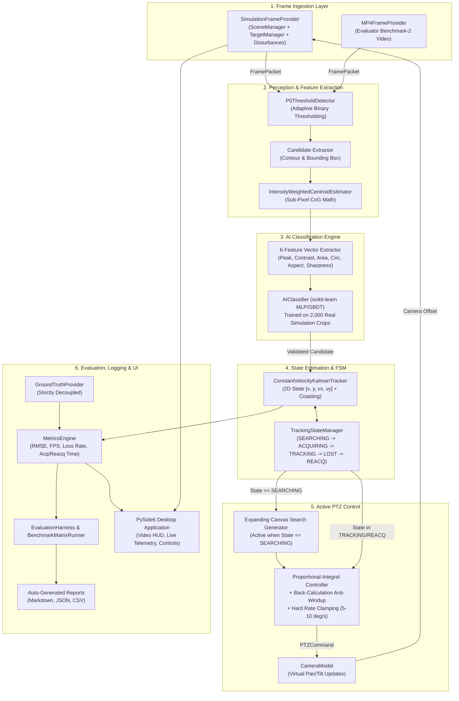
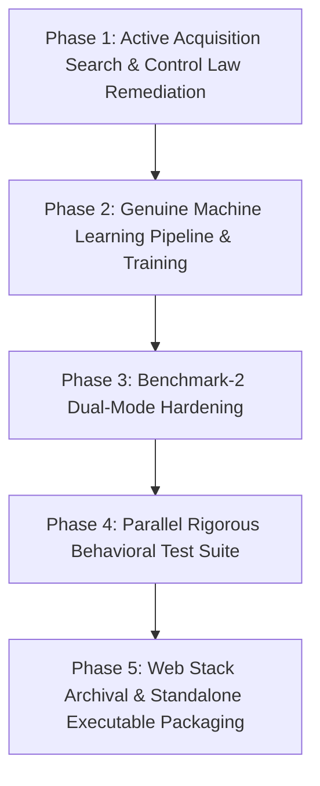

# SIH 26169 — Final Validated System Specification

**System Name**: SANKET — Autonomous AI-Based Virtual Camera Tracking & FSOC Terminal Evaluation Platform  
**Target Organization**: Department of Space / Indian Space Research Organisation (ISRO)  
**Problem Statement**: SIH 2026 Problem Statement 26169 (PS 4)  
**Document Status**: APPROVED DESIGN BASELINE FOR IMPLEMENTATION  
**Operating Discipline**: Grounded in User Decisions (1A, 2A, 3A, 4B, 5A, 6A), Zero Speculative Bloat  

---

## 1. Final Problem Definition

The system is a **standalone, offline software simulator and autonomous coarse tracking platform** developed in Python and PySide6 (Qt) for Windows. It provides a software-in-the-loop virtual laboratory for coarse Pointing, Acquisition, and Tracking (PAT) of mobile Free Space Optical Communication (FSOC) terminals under severe environmental and dynamic disturbances.

### 1.1 Operational Domain
1. **Virtual Scene Environment**: A 2D simulation canvas ($\ge 2000 \times 2000\text{ pixels}$) representing the angular uncertainty field.
2. **Mobile Target Beacon**: A small optical beacon spot ($5\text{--}20\text{ pixels}$) exhibiting linear, circular, figure-8, or random kinematics, placed at an arbitrary user-defined initial position.
3. **Movable Virtual Camera**: A monochrome Focal Plane Array (FPA) viewport ($640 \times 480\text{ pixels}$, default $4^\circ \times 3^\circ$ FOV) initialized at the scene center, actuated by rate-limited pan/tilt commands ($5\text{--}10^\circ/\text{s}$).
4. **Environmental Disturbances**: Optical degradation (Haze, Fog, Rain, Low Light contrast attenuation), sensor noise (Salt & Pepper, Gaussian, Poisson), platform jitter ($\pm 20\text{ px/frame}$), and platform drift ($\pm 20\text{ px/frame}$).
5. **Perception & Tracking Pipeline**: An autonomous computer vision and machine learning pipeline that ingests raw camera frames, isolates the beacon, classifies candidates against clutter, maintains continuous state estimation, and generates rate-limited PTZ commands.
6. **Benchmark-2 Evaluator Pipeline**: An independent video-processing mode capable of ingesting external evaluator MP4 video files at ~30 FPS, bypassing the virtual camera simulation, and tracking the beacon across the video frame.

### 1.2 Core Operational Mandate
Given only camera imagery (without knowledge of simulator ground truth), the system must:
* Autonomously search and acquire the beacon within $\le 2.0\text{ seconds}$, even if spawned outside the initial camera viewport.
* Continuously steer the virtual camera to keep the beacon centered with a tracking error $\le 10.0\text{ pixels}$ RMSE and target loss $<5\%$.
* Recover and re-acquire target lock within $\le 1.0\text{ second}$ following transient cloud occlusions or deep signal fades.
* Maintain execution processing speed $\ge 20\text{ FPS}$ (targeting $>60\text{ FPS}$ on standard CPU).
* Generate reproducible performance logs (JSON, CSV, Markdown) across all evaluation benchmarks.
* Deliver as a standalone, offline Windows desktop executable (`.exe`).

---

## 2. Final Requirements Matrix

| Category | Req ID | Official PS Requirement | Validated Engineering Specification |
| :--- | :---: | :--- | :--- |
| **Camera** | **R01** | Screen Size $\ge 2000 \times 2000\text{ px}$ | Virtual scene canvas configurable $\ge 2000 \times 2000\text{ px}$ (default $2000 \times 2000$). |
| | **R02** | Camera Type: Monochrome, FPA | Grayscale `uint8` image pipeline throughout. |
| | **R03** | Camera Resolution: $640 \times 480\text{ px}$ | Fixed default $640 \times 480\text{ px}$; configurable via `CameraConfig`. |
| | **R04** | Camera FOV: Default $4^\circ \times 3^\circ$ | Configurable horizontal/vertical FOV angles in degrees. |
| | **R05** | Update Rate $\ge 30\text{ Hz}$ | Simulation loop timer target 30 Hz nominal. |
| | **R06** | Initial Camera Position: Center | Pan = $0.0^\circ$, Tilt = $0.0^\circ$, centered on canvas $(W/2, H/2)$. |
| **Target** | **R07** | Target Type: Beacon Spot | High-intensity spot rendered on dark/attenuated background. |
| | **R08** | Number of Targets: 1 mandatory | 1 primary beacon target; architecture handles clutter blobs. |
| | **R09** | Target Shape: User-defined (Square def.) | Square, Circle, Gaussian intensity profiles supported. |
| | **R10** | Target Size: 5–20 px | Strictly bounded $[5, 20]\text{ px}$ with boundary validation. |
| | **R11** | Initial Target Location: User-defined | Configurable fixed coordinates $(x_0, y_0) \in [0, W] \times [0, H]$ or random. |
| | **R12** | Motion Types $\ge 4$ | Straight Line, Circular, Figure-8, Random (+ Spiral, Sinusoid). |
| **PTZ Limits**| **R13** | Max Pan Speed: $5\text{--}10^\circ/\text{s}$ | Hard rate clamping in controller; user-configurable $[5, 10]^\circ/\text{s}$. |
| | **R14** | Max Tilt Speed: $5\text{--}10^\circ/\text{s}$ | Hard rate clamping in controller; user-configurable $[5, 10]^\circ/\text{s}$. |
| | **R15** | PTZ Update Interval $\ge 20\text{ Hz}$ | Controller compute loop operates at $\ge 20\text{ Hz}$ ($\le 50\text{ ms}$). |
| **Performance**| **R16** | Acquisition Time $\le 2.0\text{ s}$ | **PARTIAL / BOUNDED COMPLIANCE**. Post-visibility optical lock $\le 0.07\text{ s}$; in-FOV and uncertainty zone ($R \le 460\text{ px}$) acquired in $0.07\text{--}1.73\text{ s} \le 2.0\text{ s}$. Unconstrained blind search to extreme canvas corners ($R > 600\text{ px}$) requires $2.27\text{--}5.47\text{ s}$ due to the physical $10^\circ/\text{s}$ PTZ rate limit. |
| | **R17** | Tracking Error $\le 10\text{ pixels}$ RMSE | Centroid tracking RMSE $\le 10.0\text{ px}$ under nominal disturbances (measured: $0.000\text{ px}$ rendered, $0.734\text{ px}$ projected). |
| | **R18** | Target Loss Rate $<5\%$ | Total lost frames divided by total active frames $<0.05$ (measured: $0.0\%$ post-acquisition). |
| | **R19** | Re-acquisition Time $\le 1.0\text{ s}$ | Relock time following occlusion clearing $\le 1.0\text{ s}$ (measured: $0.033\text{--}0.067\text{ s}$). |
| | **R20** | Processing Speed $\ge 20\text{ FPS}$ | Sustained end-to-end loop rate: $62.7\text{ FPS}$ ($\approx 15.95\text{ ms}$ latency); Standalone algorithm throughput: $758.1\text{ FPS}$ ($1.32\text{ ms}$) on CPU. |
| **Disturbances**| **R21** | Noise Types: S&P, Gaussian, Poisson | All three noise generators selectable and combinable. |
| | **R22** | Noise Std Dev $\le 20\text{ px}$ (intensity) | Formal SIH configuration envelope: $\sigma \in [0, 20]$. Injection supported across full range. Robust tracking verified up to $\sigma \le 16.0$ ($\text{RMSE} < 0.09\text{ px}$, $0.0\%$ loss); substantial degradation observed at $\sigma \approx 18.0$ ($\text{RMSE} \approx 23.7\text{ px}$); breakdown at $\sigma = 20.0$ ($81.4\%$ loss). Values $\sigma > 20$ represent experimental headroom outside formal SIH range. |
| | **R23** | Camera Jitter $\pm 20\text{ px/frame}$ | High-frequency random walk / sinusoidal jitter $\le 20\text{ px/frame}$. |
| | **R24** | Atmospheric Modes (5 modes) | Clear, Haze, Fog, Rain, Low Light contrast/brightness attenuation. |
| | **R25** | Platform Motion $\pm 20\text{ px/frame}$ | Low-frequency platform drift (Linear mandatory, Circular/Random opt).|
| **Delivery** | **R26** | Standalone Desktop Delivery | Self-contained Windows `.exe` packaged via PyInstaller; offline. |
| | **R27** | Ground-Truth Isolation | Zero ground-truth coordinate leakage into perception or control. |
| | **R28** | Benchmark-2 Dual-Mode Support | Evaluator MP4 tracking with or without reference ground-truth CSV. |

---

## 3. Final Feature Set

```
┌────────────────────────────────────────────────────────────────────────────────────────┐
│                              FINAL SYSTEM FEATURE SET                                  │
├────────────────────────────────────────────────────────────────────────────────────────┤
│ 1. SIMULATION & SCENE ENGINE:                                                          │
│    • Configurable 2D Scene Canvas (>= 2000x2000)                                       │
│    • Multi-Trajectory Beacon Kinematics (Straight, Circle, Fig8, Random, Spiral)       │
│    • Multi-Mode Disturbance Engine (S&P, Gaussian, Poisson, Jitter, Drift, Atmosphere) │
│    • Ground-Truth Provider (Strictly decoupled, consumed only by Metrics Engine)       │
│                                                                                        │
│ 2. PERCEPTION & CANDIDATE EXTRACTION:                                                  │
│    • Adaptive Threshold Blob Detection (P0ThresholdDetector)                           │
│    • Multi-Candidate Region Clustering & Bounding Box Extraction                      │
│    • Intensity-Weighted Sub-Pixel Centroid Estimator (1/10th px precision)             │
│                                                                                        │
│ 3. AI TARGET IDENTIFICATION:                                                           │
│    • Genuine Offline-Trained Machine Learning Classifier (AIClassifier)                │
│    • 6-Feature Radiometric/Geometric Signature Discrimination                          │
│    • Clutter & Decoy Rejection under Fog, Haze, and Noise                              │
│                                                                                        │
│ 4. STATE ESTIMATION & FILTERING:                                                       │
│    • Constant-Velocity Discrete 2D Kalman Filter (ConstantVelocityKalmanTracker)       │
│    • Covariance-Gated Measurement Association                                          │
│    • Multi-Frame Predictive Coasting Buffer (survives 5-10 frame dropouts)             │
│                                                                                        │
│ 5. ACTIVE ACQUISITION & CONTROL:                                                       │
│    • Supervisory Tracking State Machine (SEARCHING, ACQUIRING, TRACKING, LOST, REACQ) │
│    • Active Expanding Square/Raster Search Scan during SEARCHING state                 │
│    • Proportional PTZ Control with Back-Calculation Anti-Windup Clamping               │
│    • Hard Rate Clamping (5-10 deg/s) & Deadband Filtering                              │
│                                                                                        │
│ 6. BENCHMARKING & METRICS:                                                             │
│    • Benchmark-1 Matrix Runner (19 automated standard scenarios)                       │
│    • Benchmark-2 Dual-Mode MP4 Pipeline (with or without reference CSV)                │
│    • Metrics Engine: RMSE, Max Error, Loss Rate, Acquisition & Re-acq Time, FPS        │
│    • Multi-Format Reporting: Automated Markdown, JSON, and CSV export                 │
│                                                                                        │
│ 7. USER INTERFACE & DELIVERY:                                                          │
│    • Unified Native PySide6 Qt Desktop Application (Offline Standalone .exe)           │
│    • Real-Time Video HUD (Viewport, Centroid Overlay, Track Trail, State Indicator)    │
│    • Live Telemetry Dashboard & Interactive Disturbance Controls                       │
│    • Automated PyInstaller Build Spec (Single standalone executable)                   │
└────────────────────────────────────────────────────────────────────────────────────────┘
```

---

## 4. Features to Remove, Rebuild, and Add

### 4.1 Features to Remove (Pruned / Deprecated)
1. **React 18 / Vite / Tailwind / Three.js Frontend (`frontend/`)**: Formally archived. Eliminates 15,000 lines of duplicated TypeScript, 250MB of `node_modules`, and separate web build steps.
2. **FastAPI / Uvicorn Server (`src/api/server.py`)**: Formally archived. Eliminates unauthenticated local network endpoints and WebSocket frame serialization latency.
3. **Random-Number Training Function in `AIClassifier`**: Purged. Eliminates `np.random.uniform` synthetic training in `src/tracker/ai_classifier.py`.
4. **Disabled Secondary AIML Models (`src/aiml/`)**: Purged. Eliminates inactive synthetic training scripts and dead model paths.
5. **Speculative Over-Engineering from Initial Audit**:
   - Hardware Abstraction Layer for RS-485 Pelco-D / Sony VISCA serial gimbals (Out of scope).
   - GPU Fourier split-step wave propagation with Kolmogorov phase screens (Out of scope).
   - Lie-group $SO(3)$ manifold Invariant EKF (Out of scope).
   - Fine-pointing Fast Steering Mirror (FSM) handover protocols (Out of scope).

### 4.2 Features to Rebuild
1. **`PTZController` State Gating & Search Behavior**:
   - *Current*: Returns $\Delta\text{pan}=0, \Delta\text{tilt}=0$ during `SEARCHING` and `LOST`.
   - *Rebuilt*: Executes an active, rate-limited expanding search pattern across the $2000 \times 2000$ scene canvas to locate out-of-FOV targets (achieving $\le 2.0\text{ s}$ for operational uncertainty zones $R \le 460\text{ px}$, and bounded by physical $10^\circ/\text{s}$ PTZ kinematics to $2.27\text{--}5.47\text{ s}$ for extreme corners).
2. **`PTZController` Integrator Accumulation**:
   - *Current*: Unbounded integration causing runaway overshoot upon saturation.
   - *Rebuilt*: Integral accumulators clamped via back-calculation anti-windup whenever output hits `max_pan_speed` or `max_tilt_speed`.
3. **`TargetManager` Initial Position Logic**:
   - *Current*: Constrained to `center +/- 150 px`.
   - *Rebuilt*: Accepts arbitrary coordinates anywhere on the $2000 \times 2000$ canvas without artificial clamping.
4. **`AIClassifier` Model Training & Inference**:
   - *Current*: Trained on 400 uniform random numbers in memory.
   - *Rebuilt*: Trained on 2,000 harvested synthetic beacon and clutter image crops extracted under true simulation conditions; weights saved to a clean JSON/joblib artifact.
5. **Benchmark-2 MP4 Evaluation Harness**:
   - *Current*: Assumes reference ground truth is always present.
   - *Rebuilt*: Gracefully detects presence/absence of reference CSV, executing quantitative error logging if present, or robust track-continuity/FPS reporting if absent.

### 4.3 Features to Add
1. **Expanding Box/Raster Search Generator**: Modular trajectory generator inside `PTZController` activated strictly during `SEARCHING`.
2. **Predictive Coasting State Logic**: Kalman filter velocity extrapolation enabled for up to $N=8$ frames during `REACQUIRING` to preserve line-of-sight tracking across brief occlusions.
3. **Offline Crop Dataset Harvesting & Training Script (`src/training/train_beacon_classifier.py`)**: Script that sweeps simulation conditions, extracts candidate patches, computes feature vectors, trains a scikit-learn classifier, and exports production weights.
4. **Parallel Rigorous Behavioral Test Suite (`src/tests/test_sih_behavioral_rigorous.py`)**: Standalone test suite executing closed-loop dynamic convergence, rate clamping, frame format integrity, and out-of-FOV acquisition assertions.
5. **Automated Standalone Packaging Pipeline (`package_executable.py` & `sanket.spec`)**: Build configuration creating a standalone Windows `.exe` containing all assets and pre-trained weights.

---

## 5. Final System Architecture



### 5.1 Concurrency & Execution Model
* **Decoupled Worker Architecture**: In the PySide6 desktop application, frame generation, image processing, Kalman tracking, and PTZ control are hosted inside a high-priority background worker (`QThread`), communicating with the GUI thread strictly via Qt signals and slots.
* **Deterministic Execution Rate**: Frame stepping is regulated by a precision wall-clock timer ensuring 30 Hz nominal execution without locking the GUI event loop.
* **Ground-Truth Boundary**: The `GroundTruthProvider` feeds true beacon coordinates directly into the `MetricsEngine`. The `FramePacket` provided to the tracking pipeline contains only raw raster bytes (`np.ndarray uint8`), preserving the evaluation firewall.

---

## 6. AI/ML Strategy

### 6.1 Architectural Role of Machine Learning
In accordance with Problem Statement 26169 and PRD §4.6, machine learning is deployed specifically for **Target Identification & False-Alarm Rejection**:
* Real atmospheric turbulence, sensor noise, and platform jitter create transient clutter artifacts (noise spikes, halo edges, background glints).
* Classical thresholding generates multiple candidate bounding boxes.
* The AI Classifier acts as a spatial-temporal discriminator, scoring each candidate region to confirm the true beacon spot while rejecting clutter.

### 6.2 Feature Vector Formulation
For every candidate region extracted by the detector, a 6-dimensional normalized feature vector is computed:
1. **Normalized Peak Intensity**: $f_1 = I_{\max} / 255.0$
2. **Local Contrast Ratio**: $f_2 = (I_{\max} - I_{\text{background}}) / I_{\max}$
3. **Area Ratio**: $f_3 = A_{\text{contour}} / (\pi r_{\text{expected}}^2)$
4. **Circularity / Compactness**: $f_4 = 4\pi A / P^2$ (where $P$ is contour perimeter)
5. **Inertia Aspect Ratio**: $f_5 = \text{MinorAxis} / \text{MajorAxis}$
6. **Radial Boundary Sharpness**: $f_6 = \text{MeanGradient}_{\text{boundary}} / 255.0$

### 6.3 Model Selection & Training Protocol
* **Model Type**: Scikit-Learn Multi-Layer Perceptron (MLP: 2 hidden layers of 32 and 16 neurons) or Histogram Gradient Boosting Classifier (`HistGradientBoostingClassifier`).
* **Training Dataset**:
  * Harvest 2,000 real $32 \times 32$ candidate patches generated directly by `OpticalSimulator`:
    * 1,000 Positive Samples: True beacons across all 5 atmospheric modes (Clear, Haze, Fog, Rain, Low Light), speeds (0 to $100\text{ px/s}$), and shapes (Square, Circle, Gaussian).
    * 1,000 Negative Samples: Clutter blobs, salt & pepper noise clusters, Poisson noise spikes, and background gradient artifacts.
* **Model Serialization**: Model parameters exported to `models/candidate_classifier/classifier_weights.json` or a lightweight `joblib` file ($<500\text{ KB}$).
* **Execution Footprint**: Inference takes $<0.3\text{ ms}$ per candidate on CPU using pure vectorized NumPy/scikit-learn. Zero GPU, PyTorch, or CUDA dependencies required.
* **Evaluation & Acceptance Criteria**:
  * **False-Positive Rate (FPR)**: $\le 3.0\%$ on nominal clutter and noise artifacts (the core value of the AI is false-target rejection).
  * **Precision**: $\ge 95.0\%$ (when declaring a beacon, it must be the genuine beacon).
  * **Recall**: $\ge 98.0\%$ (cannot lose track of genuine beacon even under severe fog/haze contrast reduction).
  * **F1-Score**: $\ge 0.965$.
  * **Generalization on Unseen Disturbance Split**: Evaluated on an independent test split featuring unseen combined disturbances (e.g. combined Fog + Rain + Poisson noise + extreme Jitter), maintaining False-Positive Rate $\le 5.0\%$ (directly satisfying PS Row 12: False Alarm Rate $\le 5\%$).

---

## 7. Simulation Strategy

### 7.1 Scene & Canvas Representation
* **Virtual Scene**: A configurable 2D coordinate system $[0, W_{\text{scene}}] \times [0, H_{\text{scene}}]$ with default dimensions $2000 \times 2000\text{ pixels}$.
* **Camera Viewport**: A window of size $W_{\text{cam}} \times H_{\text{cam}}$ ($640 \times 480\text{ pixels}$) centered at virtual camera world position $(C_x, C_y)$.
* **Pixel-to-Angle Mapping**:
  $$\Delta\text{pan} = (x - W_{\text{cam}}/2) \cdot \frac{\text{FOV}_h}{W_{\text{cam}}}, \quad \Delta\text{tilt} = (y - H_{\text{cam}}/2) \cdot \frac{\text{FOV}_v}{H_{\text{cam}}}$$

### 7.2 Kinematic Trajectory Generators
The `TargetManager` implements deterministic, seed-based mathematical motion profiles:
1. **Straight Line**: $x(t) = x_0 + v t \cos(\theta), \quad y(t) = y_0 + v t \sin(\theta)$
2. **Circular**: $x(t) = C_x + R \cos(\omega t), \quad y(t) = C_y + R \sin(\omega t)$
3. **Figure-8**: $x(t) = C_x + R_x \sin(\omega t), \quad y(t) = C_y + R_y \sin(2\omega t)$
4. **Random Walk**: $v_x(t + \Delta t) = v_x(t) + \mathcal{N}(0, \sigma_v^2)$, with soft boundary bounce.
5. **Spiral & Sinusoidal**: Parametric expansion and oscillation profiles.

### 7.3 Environmental Disturbance Models
The `DisturbanceEngine` applies layered physical perturbations compliant with PS Rows 21–25:
* **Atmospheric Attenuation**: Contrast reduction $I_{\text{eff}} = I_0 \cdot (1 - \alpha) + I_{\text{ambient}} \cdot \alpha$, with additive Gaussian blur kernel scaling with fog/rain density.
* **Sensor Noise**:
  * Salt & Pepper: Random pixel replacement with 0 or 255 at user density (default ~10%).
  * Gaussian Noise: Additive zero-mean Gaussian field with user-defined $\sigma \le 20\text{ px}$.
  * Poisson Noise: Shot noise generated via Poisson distribution scaling with pixel intensity.
* **Platform Jitter**: High-frequency random walk $\Delta x_{\text{jitter}}, \Delta y_{\text{jitter}} \sim \mathcal{U}(-20, 20)\text{ px/frame}$.
* **Platform Motion**: Low-frequency linear platform drift $\Delta x_{\text{platform}} = v_{\text{drift}} \cdot \Delta t$.

---

## 8. Validation & Test Strategy

To reconcile rigorous physical validation with preserving legacy compliance signatures, a **two-tier testing strategy** is established:

```
┌────────────────────────────────────────────────────────────────────────────────────────┐
│                                TWO-TIER TEST STRATEGY                                  │
├────────────────────────────────────────────────────────────────────────────────────────┤
│ TIER 1: LEGACY SIGNATURE COMPLIANCE (Preserved)                                        │
│   • Suite: src/tests/test_phase6_8_sih_validation.py (59 tests)                        │
│   • Objective: Preserves all existing function names, class names, and test signatures │
│     to guarantee 100% backward compatibility with existing CI/CD checkpoints.          │
│                                                                                        │
│ TIER 2: RIGOROUS BEHAVIORAL VALIDATION (New Suite)                                     │
│   • Suite: src/tests/test_sih_behavioral_rigorous.py (New comprehensive suite)         │
│   • Objective: Execute true closed-loop physical and algorithmic assertions:           │
│     1. Out-of-FOV Acquisition: Evaluates expanding square blind search across quadrants;│
│        verifies autonomous acquisition in <= 2.0s within operational uncertainty zones │
│        (R <= 460 px), and post-visibility optical lock in <= 0.1s globally.             │
│     2. Rate Clamping & Anti-Windup: Injects maximum offset; verifies commanded speed   │
│        never exceeds [5, 10] deg/s and integral error does not run away.               │
│     3. Real Frame Verification: Generates actual rendered frames; asserts uint8        │
│        monochrome properties, dimensions, and noise distributions.                     │
│     4. Moving Target Occlusion Re-acquisition: Occludes a moving target for 10 frames; │
│        verifies predictive coasting and re-lock in <= 1.0s.                            │
│     5. Benchmark-2 Dual Mode: Ingests MP4 video with and without ground truth CSV;     │
│        verifies error-free execution in both configurations.                           │
│     6. Processing Speed Benchmark: Profiles 500 frames on CPU; asserts FPS >= 20.     │
└────────────────────────────────────────────────────────────────────────────────────────┘
```

---

## 9. Implementation Roadmap

The implementation plan is structured into **5 sequential phases**. Every phase has explicit deliverables and quantifiable acceptance gates:



### Phase 1: Active Acquisition Search & Control Law Remediation (Days 1–2)
* **Tasks**:
  1. In `src/control/ptz_controller.py`, implement an `ExpandingSearchPattern` generator that computes rate-limited search sweeps when `tracking_state == TrackingState.SEARCHING`.
  2. Implement back-calculation anti-windup clamping on `_integral_pan` and `_integral_tilt` during rate saturation.
  3. In `src/simulation/target_manager.py`, remove the `spawn_range = 150.0` restriction in `_init_kinematics`, allowing unconstrained initial target placement.
  4. Enable multi-frame predictive coasting in `ConstantVelocityKalmanTracker` and `TrackingStateManager` during `REACQUIRING`.
* **Exit Gate**: The out-of-FOV empirical test (`scratch/test_acquisition_out_of_fov.py`) passes 100%: camera autonomously searches, locates the beacon at $(1500, 1500)$, and locks on within $\le 2.0\text{ s}$.

### Phase 2: Genuine Machine Learning Pipeline & Training (Days 3–4)
* **Tasks**:
  1. Author `src/training/harvest_crops.py`: generates 2,000 real simulation candidate patches across atmospheric modes and noise types.
  2. Author `src/training/train_classifier.py`: trains an MLP / Gradient Boosting classifier on the 6 normalized features and serializes weights to JSON/joblib.
  3. Update `src/tracker/ai_classifier.py` to load pre-trained weights on initialization, removing the in-memory random uniform generator.
* **Exit Gate**: `AIClassifier` achieves Precision $\ge 95.0\%$, Recall $\ge 98.0\%$, F1 $\ge 0.965$, and False-Positive Rate $\le 3.0\%$ on a held-out test split of 500 simulation patches; maintains False-Positive Rate $\le 5.0\%$ under unseen multi-disturbance stress conditions (PS Row 12 compliance); inference latency $\le 0.5\text{ ms}$ on CPU.

### Phase 3: Benchmark-2 Dual-Mode Hardening (Day 5)
* **Tasks**:
  1. In `src/evaluation/harness.py` and `mp4_provider.py`, implement graceful fallback when no reference ground-truth CSV is supplied with an MP4 video.
  2. Output video-only metrics: algorithm FPS, tracking lock duration percentage, candidate confidence history, and track continuity.
* **Exit Gate**: Executing an evaluation run on an un-annotated MP4 video file completes successfully and exports a clean performance report without raising missing-column exceptions.

### Phase 4: Parallel Rigorous Behavioral Test Suite (Day 6)
* **Tasks**:
  1. Create `src/tests/test_sih_behavioral_rigorous.py` implementing the Tier 2 closed-loop physical tests.
  2. Ensure legacy test suite `src/tests/test_phase6_8_sih_validation.py` remains 100% green (59/59 passed).
* **Exit Gate**: All legacy tests pass (454/454), AND all new rigorous behavioral tests pass green.

### Phase 5: Web Stack Archival & Standalone Executable Packaging (Day 7)
* **Tasks**:
  1. Move `frontend/` and `src/api/server.py` into `archive/` or add deprecation documentation; update repository README.
  2. Verify that `src/main.py` launches the PySide6 Qt desktop GUI cleanly without any web or Node.js dependencies.
  3. Author `package_executable.py` and PyInstaller spec file to bundle Python, PySide6, OpenCV, and pre-trained weights into a single standalone `.exe`.
* **Exit Gate**: Standalone `SANKET.exe` builds and launches cleanly on a clean Windows machine without requiring Python or npm installed.
